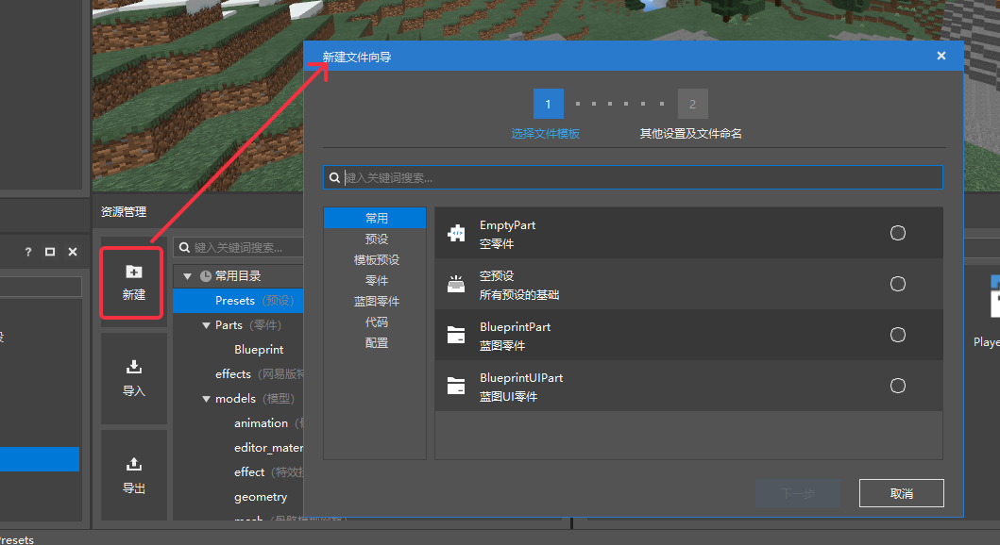
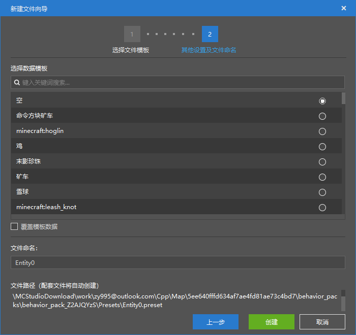
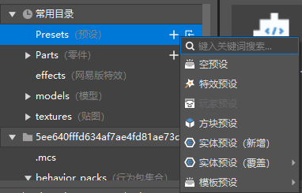

--- 
front: https://mc.res.netease.com/pc/zt/20201109161633/mc-dev/assets/img/content002.a08fa47a.png 
hard: Getting Started 
time: 5 minutes 
--- 
# Create a new file 
## New File Wizard 

Click New in the Resource Manager to pop up the New File Wizard. 

You can create presets, parts, codes, and configurations in the New File Wizard. 

 

In addition to creating new files, the New File Wizard also provides: 

- File type description 
- Entity presets, partial configurations, and other selection data templates (as shown below) 
- File naming 
- Creation of supporting files for presets and parts 
- Creation of ModMain script files and supporting files 
- Automatic generation of necessary code in script code files 

Therefore, for file types supported by the New File Wizard, we recommend that you use this method to create new files. 

 

## Folder creation 

In addition to the New File Wizard, we also provide a method for creating new files through folders. 

Click the "+" of the corresponding folder to quickly create a new file through the pop-up menu. The file types that can be created in this way include: 

- Presets 
- Parts 
- Special effects (sequence frames) 
- Special effects (particles) 

 
