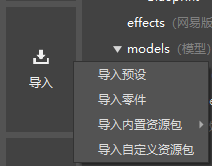
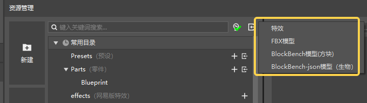
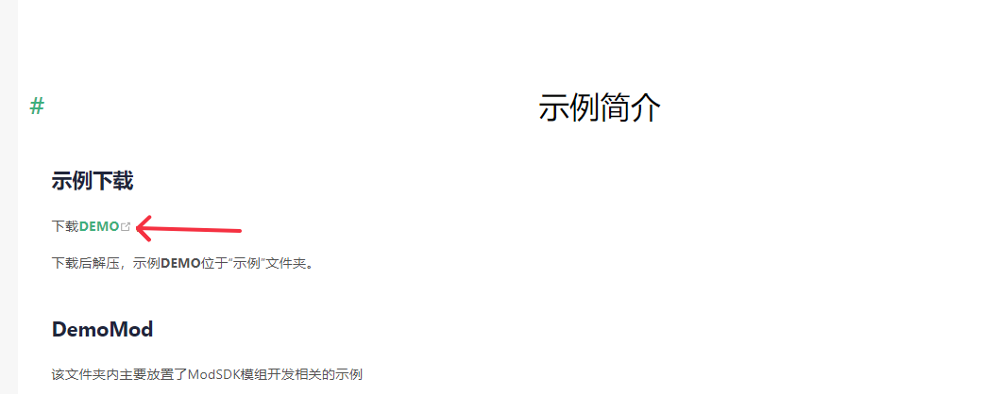
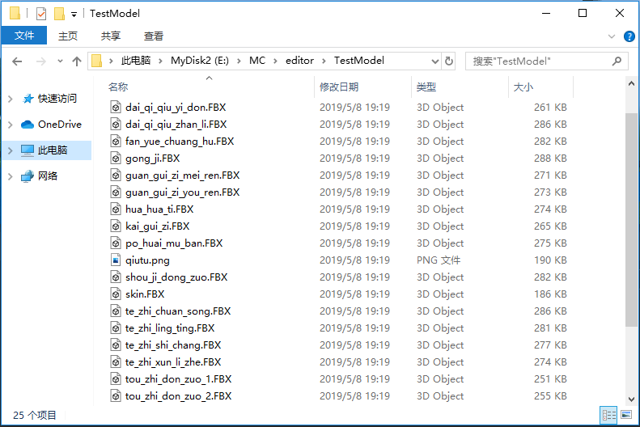
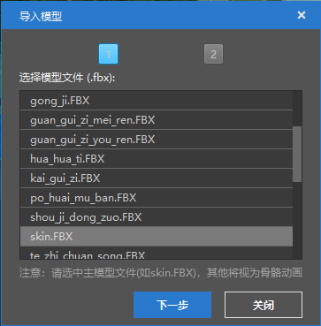
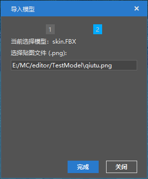
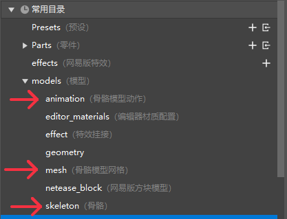

--- 
front: https://mc.res.netease.com/pc/zt/20201109161633/mc-dev/assets/img/content002.a08fa47a.png 
hard: Getting Started 
time: 10 minutes 
--- 
# File import 

## Import presets and parts 

Click the Import button on the left side of the Resource Manager (as shown below), where you can import: 

- Presets 
- Parts 
- Built-in resource packs 
- Custom resource packs 

 

> The file structure of the parts is more complex, it is recommended to use this import 

## Importing other resources 

Generally, we use other professional production software to make game resources. Some resources can be used directly for works, such as image resources and sound effect resources. Some resources need to be converted due to the special format requirements of the Minecraft engine, such as model resources. Currently, the following formats of resource conversion are supported: 

- Free Model made by BlockBench software is converted to block model in Bedrock Edition; the function entrance is shown in the figure below. 

 

- FBX models exported by professional modeling software such as 3D Max are converted to bone models in Bedrock Edition; the function entrance is the "FBX Model" button in the figure above. 

The following is a detailed introduction to how to import FBX model files. 

Go to [DEMO Example Download](../20-Gameplay Development/13-Module SDK Programming/60-Demo Example.md), click the "Download DEMO" button in the figure below to download the offline document, and use the resource "6-4 Resource Production->Tools and Examples->fbxRes->datiangou" to learn. 

 

Click the Import FBX Model button and select the folder where the model is located (such as the datiangou folder mentioned above). A typical FBX model folder is as follows (this is a model with multiple actions). 

 

Take the above model as an example, select the "TestModel" folder when importing, select the main model file in the pop-up interface, and then click "Next". The main model is usually named skin.FBX. If there is no skin.FBX file in the file, you need to manually select the correct main model file, otherwise the import may go wrong. 

 

Next, select the texture file corresponding to the model. Generally speaking, the editor will automatically select the corresponding texture. Click "Finish" and the model is imported. 

 

The converted model files are stored in the mesh, skeleton, and animation folders under the models folder.

