--- 
front: 
hard: Getting Started 
time: minutes 
--- 

# MC Nine-grid Usage and Mapping Specifications 

## Nine-grid Usage 

#### Foreword - Our Nine-grid and Microsoft's Nine-grid 

Before Microsoft supported Nine-grid stretching, we implemented a set of Nine-grid stretching tools ourselves, but the tool could not adapt to Microsoft's native automatic UI scale. Microsoft will scale the entire UI according to the current screen size. Our Nine-grid is to process the image after the UI is scaled, while Microsoft's native Nine-grid is to process the image before scaling the UI. This will result in that if there is only 1 pixel detail on the four sides of the texture resource, the four sides will be very thin after stretching with our nine-square grid, while Microsoft's is relatively normal, as shown in the following figure, the left side is our nine-square grid, and the right side is Microsoft's original nine-square grid: 

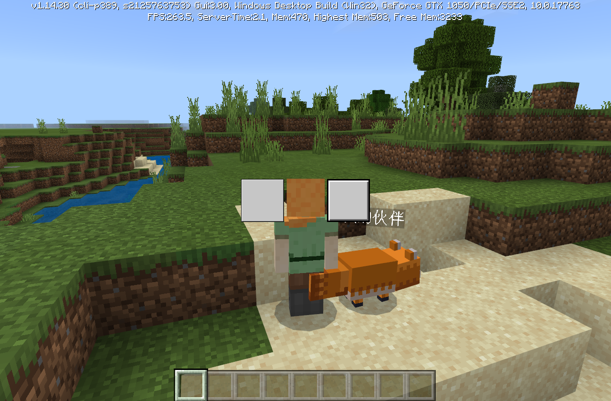 

At the same time, due to the calculation accuracy problem, the nine-square grid we implemented ourselves will have calculation accuracy problems, resulting in abnormal display of the four corners, as shown in the following figure: 

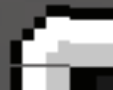 

Therefore, I recommend using the original Microsoft nine-square grid to stretch the image, and the subsequent texture specifications are based on the use of the original Microsoft nine-square grid. 

#### Principle of Nine-grid stretching 

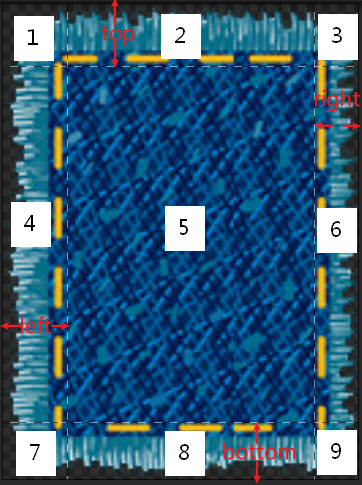 

As shown in the figure above, the nine-grid divides a picture into 9 parts, and the spacing of the four sides corresponds to the parameters of the original Microsoft nine-grid [left, top, right, bottom], and the specific configuration in json is shown in the figure below: 

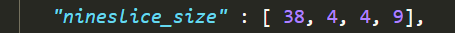 

During the stretching process, parts 1, 3, 7, and 9 will not be stretched, parts 2 and 8 will be stretched horizontally, parts 4 and 6 will be stretched vertically, and the middle 5 parts will be stretched both horizontally and vertically. Therefore, when drawing, art students should avoid placing some elements that cannot be stretched in the 2468 area, such as the sharp corners of the dialog box, as shown in the following figure: 

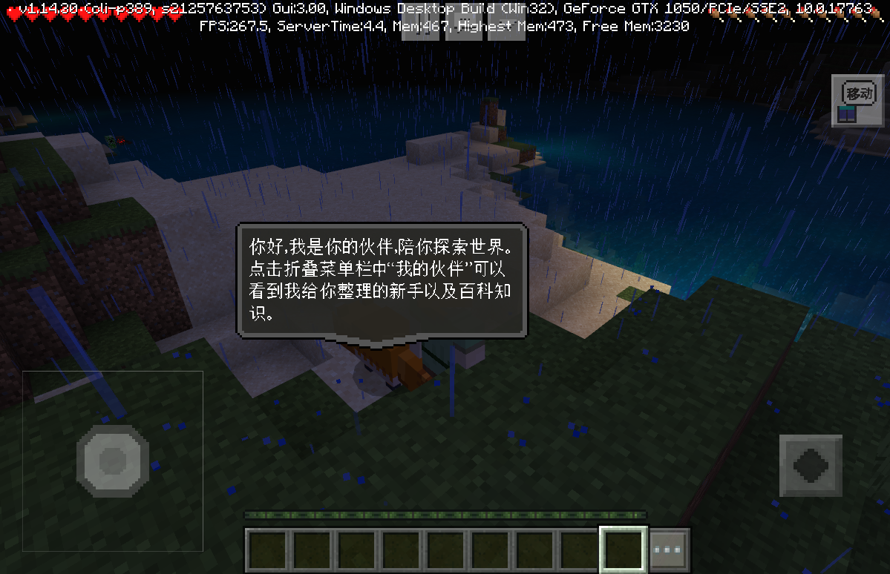 

When designing, art students should try to offset this sharp corner and avoid placing it in the middle, so that the program can place it in the four non-stretched areas of 1379 through code settings, and the effect is as follows: 

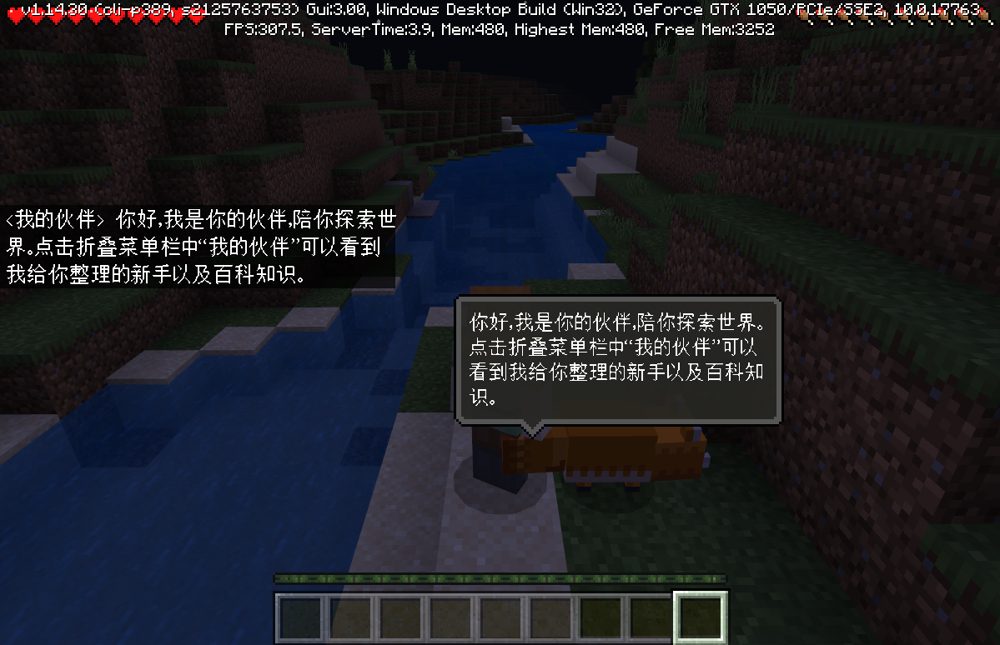 

#### Some examples of how to use the Nine-grid layout 

Original image: 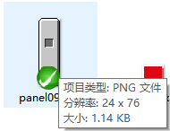 

Effect after stretching: 

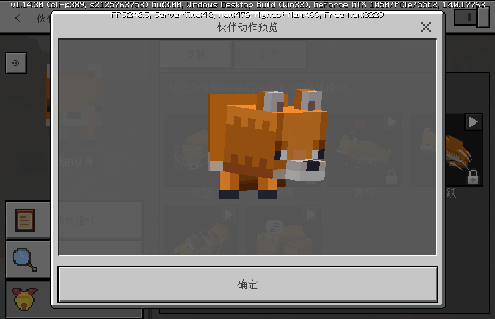 

Original image: 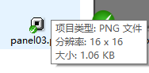 

Stretched effect: 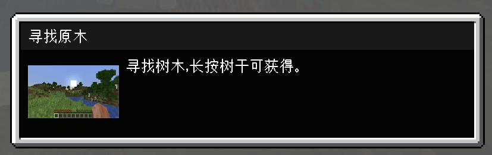 

Note: The background of "Looking for Logs" here is dark gray, which is actually obtained by directly setting the color of a blank picture. In other words, this can be achieved through splicing without the need for pure color resources. 

Original image: 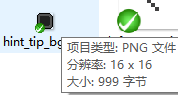 

Stretched effect: 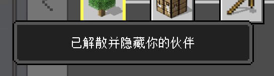 

## Texture specifications and suggestions 

- Pure color resources do not need to be output. The program can configure json in the corresponding position to implement pure color resources, where the color number and alpha transparency can be set directly. If necessary, the corresponding size and offset can also be set: 

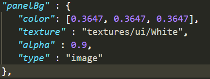 

- The length and width of the texture are recommended to be powers of 2, such as 2, 4, 8, 16, 32, 64, 128, 256, 512. Example: If the size of a picture is 30x130 after completion, it is recommended to re-cut it into 32x128, otherwise in practice the texture will occupy 32x256 memory space, causing additional waste. 
- **It is recommended that the maximum size of the model special effect texture should not exceed 128x128, and the number of textures exceeding this size should be strictly limited. A 256x256 picture occupies the same memory as 4 128x128 pictures, and a 1024x1024 picture is equivalent to 64 128x128 pictures**. 
- If the four sides are regular and can be stretched through the nine-square grid, it is recommended to cut the picture to 16x16; if the details of the four sides are irregular, such as the first example above, then on the basis of ensuring the proportion of the four sides, only 1 pixel can be left in the middle stretching area 5. ——In theory, the four sides can be regular and only 1 pixel in the middle can be left for stretching, but because the difference between 8x8 and 16x16 is not large, no stricter requirements are made. 
- In addition, the pictures below can be used as reference: the action icons such as looking around, circling, and happy are 128x128, the icons in the growth guide tree are 64x64, and the eye button below the return button is 32x32. They can all show very good effects on mobile phones, and no larger icons are needed. The original item texture size is 16x16, which looks pixel-style. Art students can refer to these sizes to make icons. 

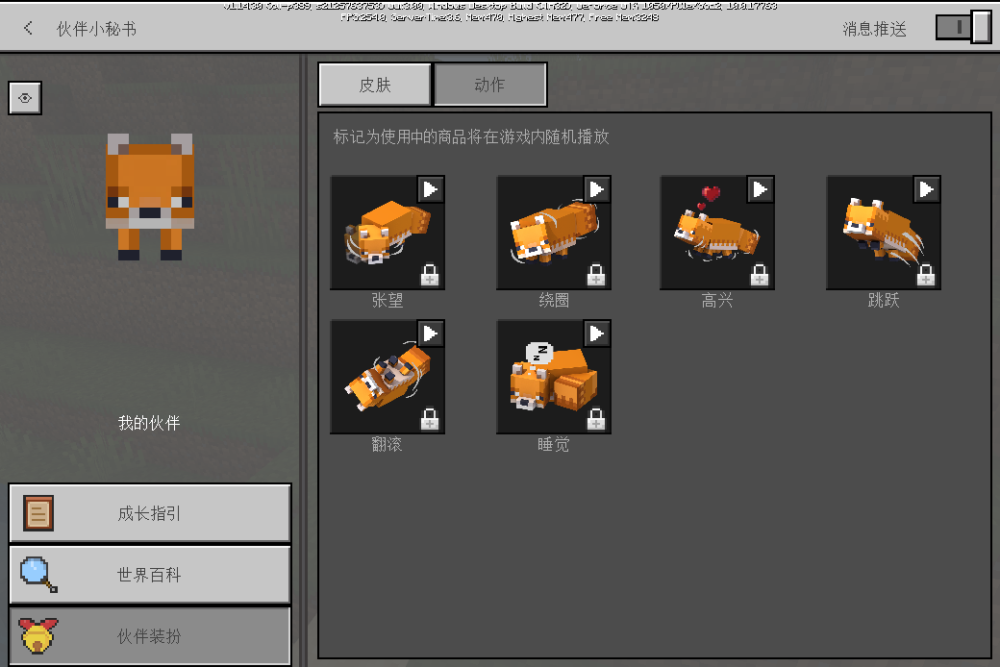 

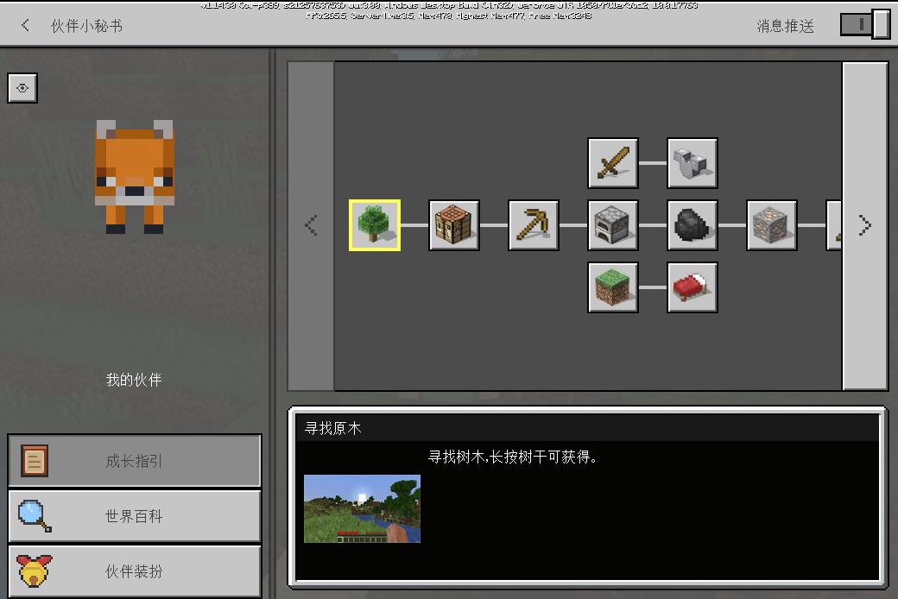 
