--- 
front: 
hard: Getting Started 
time: minutes 
--- 

# Original Model Making Guide 

## 1. Blockbench 

Blockbench is a free software developed by JannisX11 for Minecraft 3D modeling. 

Software used: Blockbench 3.4.2 

Official website: https://blockbench.net/ 

Because the official website source address is too slow to download, according to the software's MIT agreement, here is a domestic download backup [address] (https://mcrealms.gdl.netease.com/Blockbench_3.4.2.exe). 

Blockbench has the following advantages: 

* The software is easy to operate and there is almost no threshold to get started; 
* Free open source software, anyone can use it freely; 
* Supports plug-in functions, which can easily add powerful plug-ins; 
* The model you make can be exported as an OBJ file, and you can use any modern 3D modeling software to render it and make beautiful pictures; 
* Supports block item modeling of Minecraft Java version, entity modeling of Minecraft Java version, entity modeling of Minecraft Bedrock version, entity modeling of OptiFine module and many other functions. It is an indispensable tool for you to make Minecraft models. 

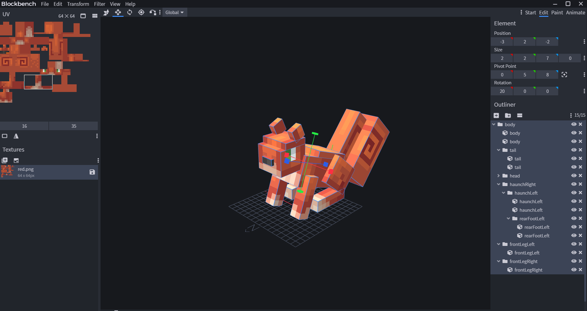 

In this document, we will introduce how to use Blockbench to make biological models and actions. 

**Note**: Blockbench 3.x version enables the 1.12.0 Bedrock version model by default. 

Next, we take the creation of a "squirrel" model and action as an example to explain in detail how to create models and actions. The final input resource path is: Example\6-4 Resource Creation\Tools and Examples\bbmodel 

## 2. Model creation process 

### 2.1 Create a project 

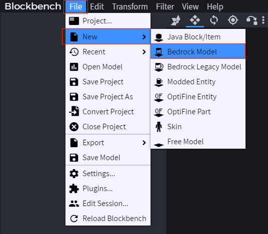 

### 2.2 Parameter settings 

Here, create a squirrel model with the file name squirrel, the model identifier is netease:squirrel, and the texture size is 64. After setting, click "Confirm" to proceed to the next step. 


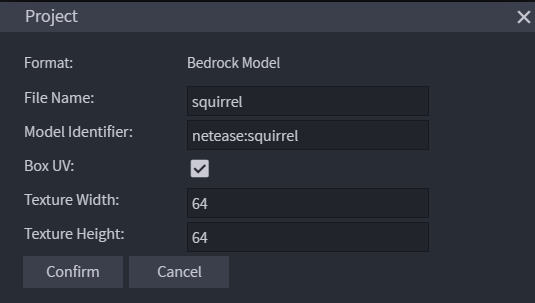 

### 2.3 Import Textures 

Find the texture interface in the lower left corner of the software interface, import the texture to be used by the model, the size of the texture should be consistent with the parameters set in the previous step, as shown below: 

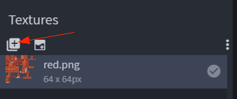 

### 2.4 Create Model Geometry 

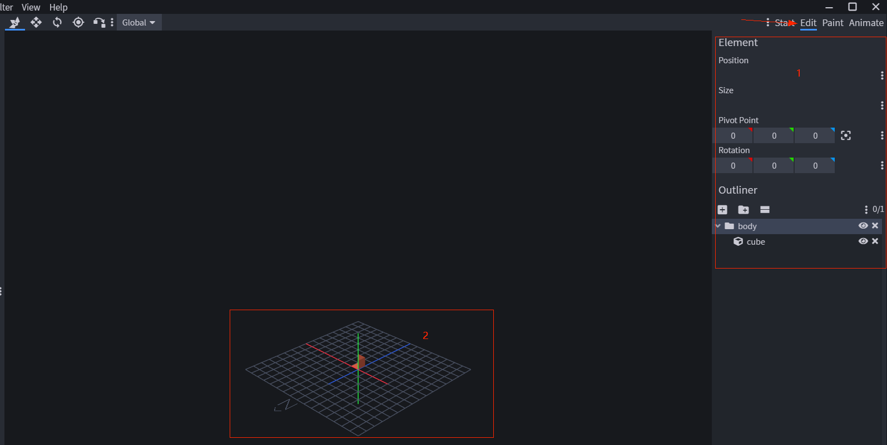 

As shown in the figure above, under the "**Edit**" label, we can edit the geometric model, area 1 can edit the model, and area 2 displays the model in real time. 

* Create Groups and Cubes 

In the Outliner, you can manage cubes by creating groups. 

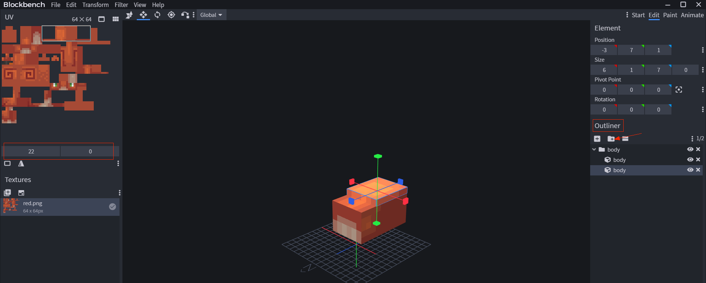 

As shown in the figure above, create a group body, which contains two cubes (named body) 

* Edit cube 

After creating the group and cube, select the specified cube (such as the second body in the figure above), and you can edit its position (Position), size (Size), pivot point (Pivot Point), rotation angle (Rotation) and other information. 

* Edit cube map UV 

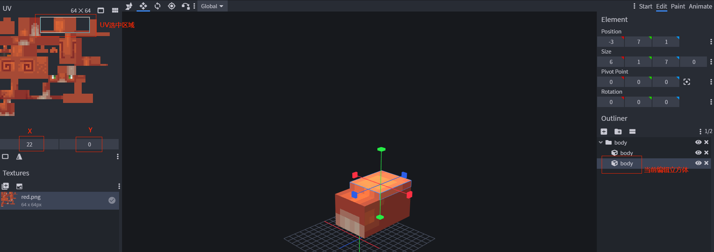 

As shown in the figure, you can adjust the map used by "**Currently edited cube**" by adjusting the **X** and **Y** values in the upper left corner. 

### 2.5 Export model 

After completing the model editing, we can use it in the game by exporting the model json. 

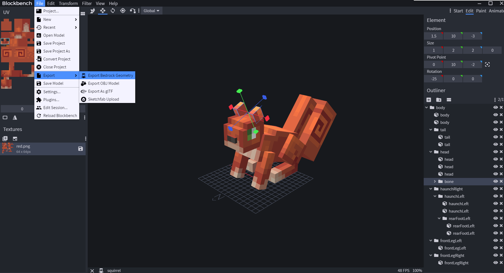 

In this example, the export name is squirrel.geo.json, and the content is as follows: 

```json 
{ 
"format_version": "1.12.0", 
"minecraft:geometry": [ 
{ 
"description": { 
"identifier": "geometry.netease:squirrel", # Corresponding to the model Identifier in the parameter setting 
"texture_width": 64, # Corresponding to the texture size in the parameter setting 
"texture_height": 64, 
"visible_bounds_width": 4,

				"visible_bounds_height": 1,
				"visible_bounds_offset": [0, 0.5, 0]
			},
			"bones": [
				{
					"name": "body",
					"pivot": [0, 5, 8],
					"rotation": [-20, 0, 0],
					"mirror": true,
					"cubes": [
						{"origin": [-3, 2, -2], "size": [6, 5, 10], "uv": [0, 0], "mirror": false},
						{"origin": [-3, 7, 1], "size": [6, 1, 7], "uv": [22, 0], "mirror": false}
					]
				},
				...
			]
		} ] 
} 
``` 

## 3. Action creation process 

First of all, there is one thing we need to be clear about: the action is to adjust the position and rotation angle of the model's nodes based on the model. 

### 3.1 Interface description 

Let's first take a preliminary look at the action creation interface. 

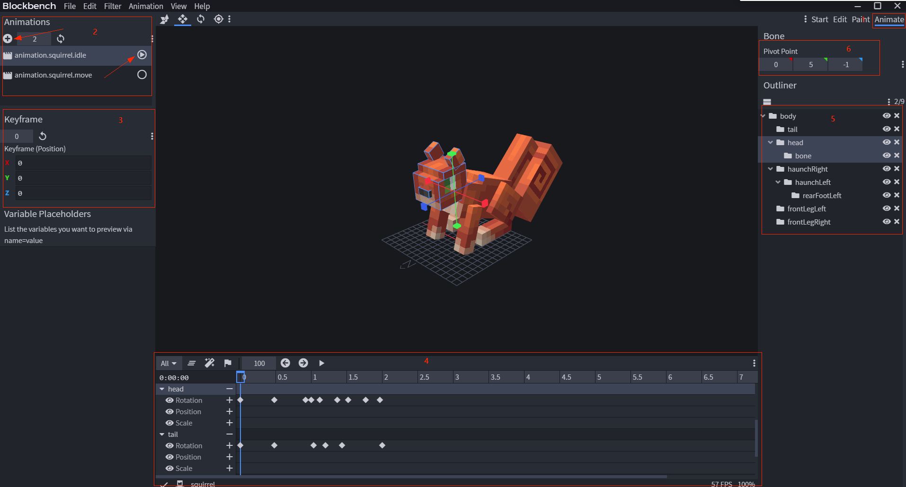 

* Area 1: To edit an action, you need to switch to the "**Animate**" tab 

* Area 2: Add action, delete action, set action length, preview action, set action properties (such as whether to loop, etc.) 

* Area 3: Edit action keyframes 

* Area 4: Action editing management 

* Area 5: Model group outline bar 

* Area 6: Skeleton aiming points corresponding to model groups 

### 3.2 Create a new action 

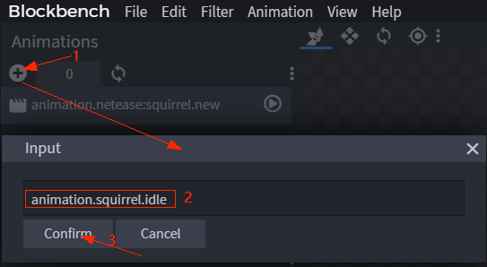 

Steps are as follows: 

* Click the Create Action button to pop up an input box; 

* Enter the action name, such as animation.squirrel.idle;

* Click OK 

### 3.3 Edit Action 

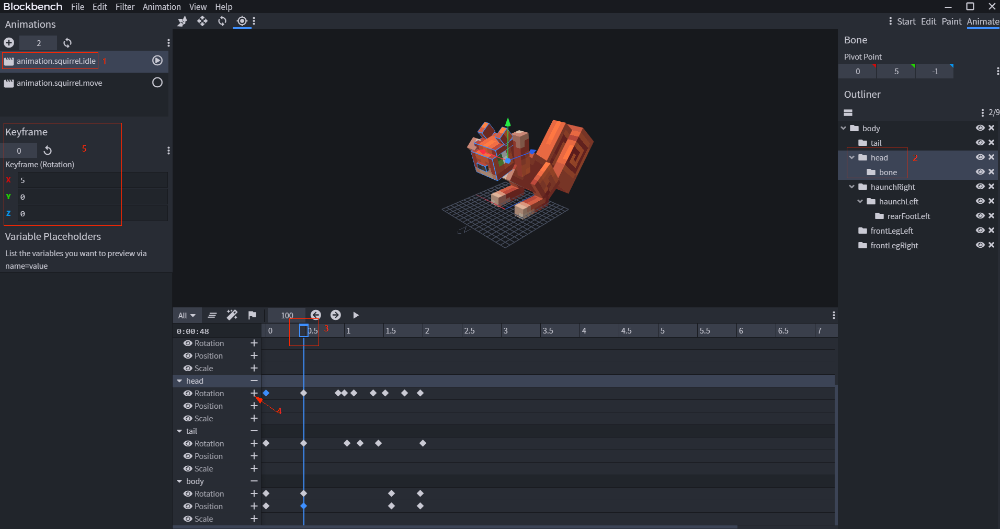 

* Select the action to be edited 

As shown, select the action animation.squirrel.idle 

* Select the model cube 

As shown, select the node head 

* Select the action time node 

As shown, select 0.5ms on the timeline 

* Insert keyframe information 

As shown, click the "+" button to the right of Rotation under head to add a keyframe 

* Edit keyframe information 

As shown, edit the keyframe information Rotation (5, 0, 0) 

### 3.4 Export Action 

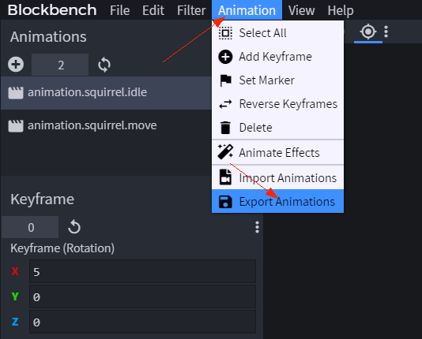 

Enter the name squirrel.animation.json and save it to get the action we need. 

```json
{
	"format_version": "1.8.0",
	"animations": {
		"animation.squirrel.idle": {
			"loop": true,
			"animation_length": 2,
			"bones": {
				"rearFootLeft": {
					"rotation": {
						"0.0": [0, 0, 0],
						"0.4833": [15, 0, 0],
						"1.6": [10, 0, 0],
						"1.8833": [-10, 0, 0],
						"2.0": [0, 0, 0]
					}

}, 
... 
} 
}, 
"animation.squirrel.move": { 
"loop": true, 
"animation_length": 0.48, 
"bones": { 
"rearFootLeft": { 
"rotation": { 
"0.0": [5, 0, 0], 
"0.1667": [125, 0, 0], 
"0.4333": [5, 0, 0] 
} 
}, 
... 
} 
} 
} 
} 
``` 

At this point, we can use the exported model and animation to make a custom creature.