--- 
front: 
hard: Getting Started 
time: minutes 
--- 

# Skeleton Model Production Guide (3DMAX) 

## 1. Model Production Technical Specifications 

This document describes how to use the software MAX 2014 to make models that meet the specifications of "Minecraft". 

### 1.1 Model Units 

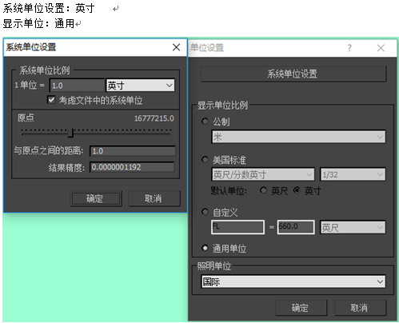 

### 1.2 Orientation 

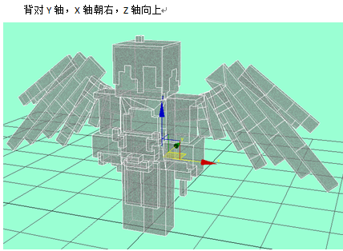 

### 1.3 Textures 

- Only one texture is supported, and the texture name must be in English 

- ** Avoid using mirrors or symmetry when making models! ** 

### 1.4 Vertices 

- **Each cuboid usually has 8 vertices, the entire model should be controlled within 300 vertices, and special models can be within 1000** 

- **Each vertex is only bound to one bone** 

- **Note: Normal check** 

After the model is made, the following 4 steps must be completed before submission: 

1. Set the model to backface culling in the properties to check whether the model has a reverse side, if so ** (flip). (Try more during the inspection process)** 

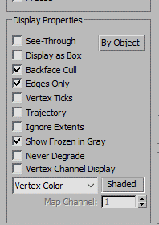 

2. Reset Xform **(Click several times, then collapse)** 

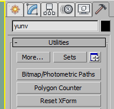 

3. Mesh Select **(Together with 4, after clicking, no operation is required, collapse directly)** 

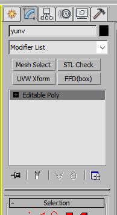 

4. STL Check 

And finally converted to Poly model for submission, this step can avoid the model display error in the engine. 

If the model has a normal problem, select the position where the normal is wrong and invert ** (flip) **. 

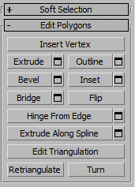 

### 1.5 Notes on action output 

#### 1.5.1 About skinning 

- Use pure bone for skeleton setting 

- The number of bones should be controlled within 20, and no more than 50 (this is for special bosses) 

- Need to add three bones: root, up, and down 

- Root is the parent of the center of mass, and the displacement and rotation should be attributed to the coordinate origin (0.0) 

- Up controls the upper body, the child of the center of mass, and the parent of the body 

- Down controls the lower body, the child of the center of mass, and the parent of both feet 

- All bones must have links (weapons, pendants, mounts, etc. must be linked to the corresponding hands, center of mass, etc., and link can be used) 

- In the advanced parameters of the skinning options, there is a **bone influence limit, which needs to be adjusted to 1** 

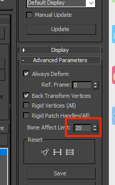 

#### 1.5.2 Action output 

- The file version is MAX 2014 

- The output file name uses pinyin, such as (skill_kuangqi) output (spell_kuangqi) 

- The file needs to be exported to FBX, and the output folder name is English 

- The output file needs to collapse the bone animation 

- The root, up, and down bones cannot have animation 

- The scaling animation must be proportional scaling, and there cannot be single-axis scaling 

- After the skinning and standby pose are confirmed, the rest of the action production can be carried out 

**Note: There cannot be any Chinese characters in the model** 

#### 1.5.3 FBX export settings 

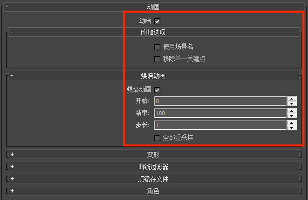 

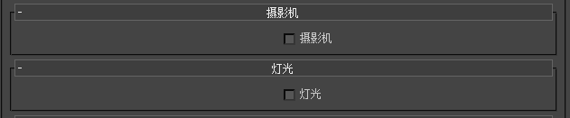 

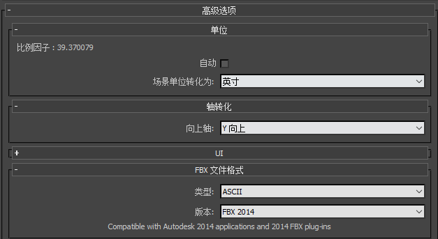

After exporting to FBX format, refer to [Teaching Center-Editor Basics-Level Editor Instructions-Resource Management-Resource Import](../../15-Resource Management/5-File Import.md) to convert it into a model format that can be used in Minecraft. 

## 2. Production and export process 

Take the production process of Daitengu as an example 

### 2.1 Original painting concept design 

1. Open the basic model of the human form god (each grid unit of the basic model is 1, that is, the pixel unit, do not change this size) 

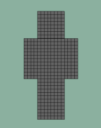 

2. Use the material ball to color the screenshot or PS coloring, the positive effect can determine the color distribution relatively quickly. 

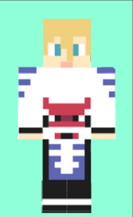 

3. Increase the recognition of the outer contour, summarize the protruding parts as much as possible, and reduce the details. Use PS to draw the concept map in this step. 

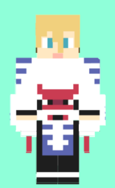 

4. Further increase the recognition of the outline, pay attention to the most distinctive parts of the character. Only one or two features on a character need to be emphasized in this way, such as the wings of the Great Tengu. This step also uses PS to draw a schematic diagram, and the back also needs to be designed. 

Due to style restrictions, the side effect is not mandatory, but the effect of the one-quarter side needs to be considered. 

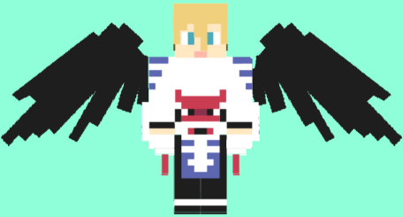 

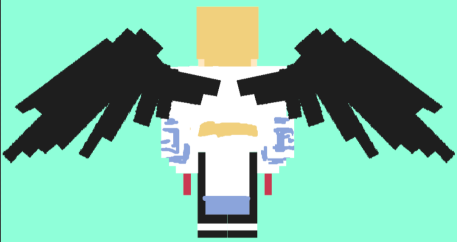 

Reference: Onmyoji Daitengu design drawing. When converting to the Minecraft model style, it is necessary to reduce trivial details that are not representative. 

* The shape of the shoes needs to be directly summarized to the legs 

* The 3 layers of feathers on the wings are reduced to 2 layers, and the edge details are summarized 

**Note: When summarizing the design, pay attention to estimating the number of vertices. Small monsters should be less than 300, complex models should be less than 700, and BOSS should be less than 1000. Try to be lower than the maximum value to avoid exceeding the value after the production is completed and difficult to modify. ** 

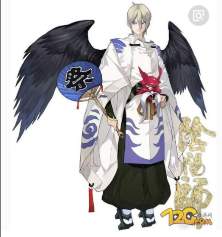 

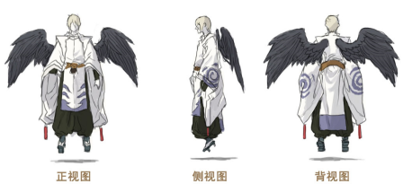 

### 2.2 Modeling with materials 

#### 2.2.1 Model making 

Make the model according to the sketch. The modeling part can be directly extruded on the original grid. **Note that the extrusion height unit is also 1**. 

The modeling method is as follows: 

1. According to the game specifications, enlarge the head and delete the unnecessary parts to model (such as Daitengu). 

**Note that method 1 and method 2 cannot be used on the same part**. 

2. If the hair shape is too complicated or there is a possibility of movement, it is necessary to model separately (such as Shuten-doji). 

**Be careful to check that there are no waste faces hidden in the model after extrusion. ** 

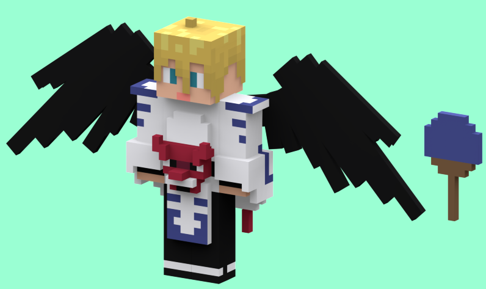 

#### 2.2.2 Start coloring 

Because we use a pixel grid of one pixel unit, we use the method of assigning a material ball to a single face to color. 

**Name and number the material balls of the same hue type for easy management. (For example, yellow starts with Y, and Y-1 and Y-2 are similar)** 

After distinguishing the inherent color, start to subdivide the color level. The same inherent color is subdivided into 2~4 color levels. Don't subdivide too much. Too fine subdivision will weaken the beauty of the pixel element itself.

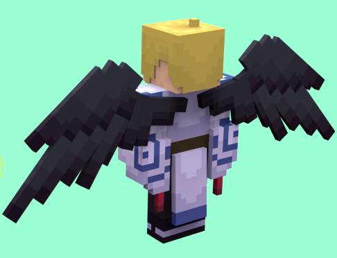 

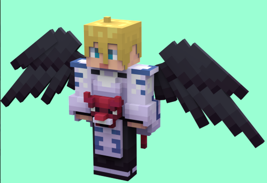 

### 2.3 Material ball (texture) processing 

This step is for the convenience of organizing materials, and you can also skip it 

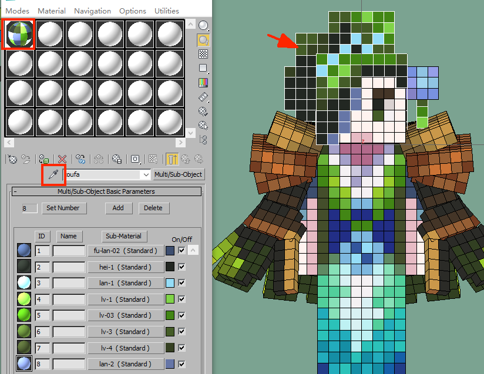 

After the model and material assignment steps in the previous step are completed, refer to the steps in the above picture to clear the material ball selection box, and absorb the hair, head, body and other materials from left to right. (You will get the multi-dimensional sub-material ball as above) 

During the production, it is necessary to pay attention to the order of the ID of a single color. Refer to the above picture to arrange it from light to dark, which is convenient for production and modification. 

1. Follow the three steps in the figure below to create a new material library 

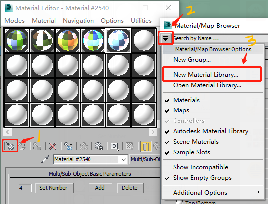 

2. Save the name of the material library (name it after the character name), and then the material library will appear in the material directory (example in the figure below: yunv) 

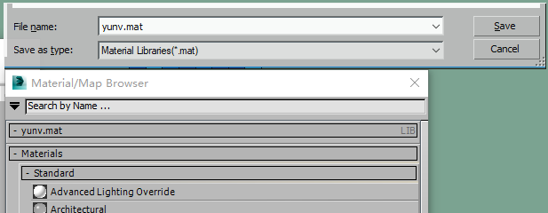 

3. Select a single material ball and add it to the material library according to the mark in the figure below (make all material balls in turn) 

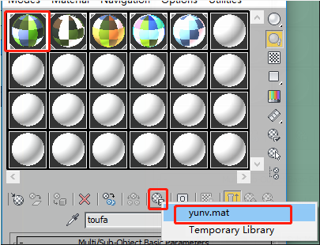 

Note that the material ball needs to be named after the component name 

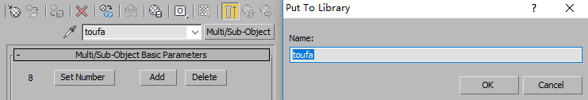 

4. Open the material library again, and you can see that all material balls have been imported into the material library. Right-click in the material library and save it to the mat file created in the first step. **The reason for doing this is to facilitate the organization of material balls and to adjust colors. ** 

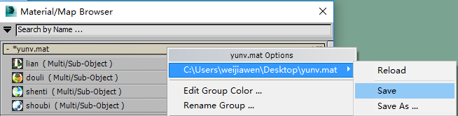 

### 2.4 Post-processing 

#### 2.4.1 UV division 

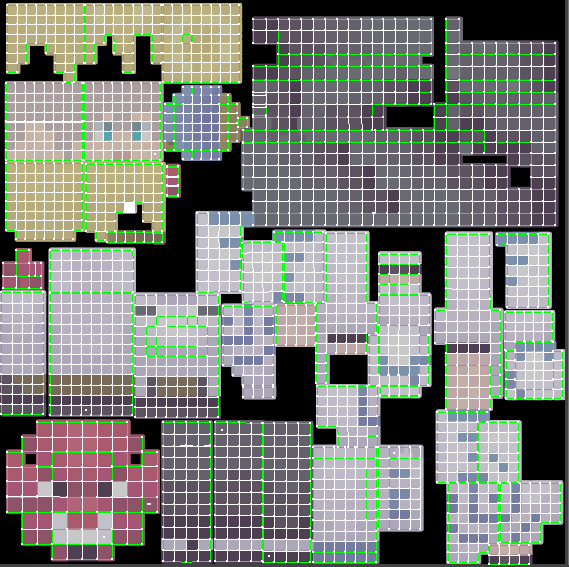 

- All UV lines must be horizontal and vertical, without tilt, otherwise jagged lines will appear. 

- UV borders need pixel filling, and baking can expand the edge by 4 pixels 

- UV placement principle, the body structure is placed from top to bottom according to the parts, and the direction cannot be reversed 

- UV grid size needs to be basically consistent, and there cannot be too much difference 

#### 2.4.2 Baking 

**Note that you should upload a version of NXN as a backup before baking** 

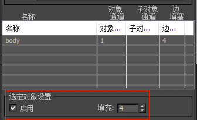 

Enable filling, and the baked map has an expanding effect 

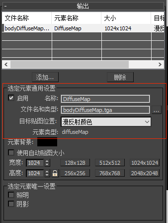 

The map size can be baked larger to improve the accuracy, and then reduced to **512X512** in PS. Note that when reducing, use the adjacent (hard edge) because they are all pixel grids, so there will be no loss of accuracy when reducing. 

#### 2.4.3 Face reduction 

Leave only the necessary points and faces, and remove all the extra points and faces. Pay attention to paste the baked map to reduce the faces. **When reducing, be careful not to stretch and deform the map. ** 

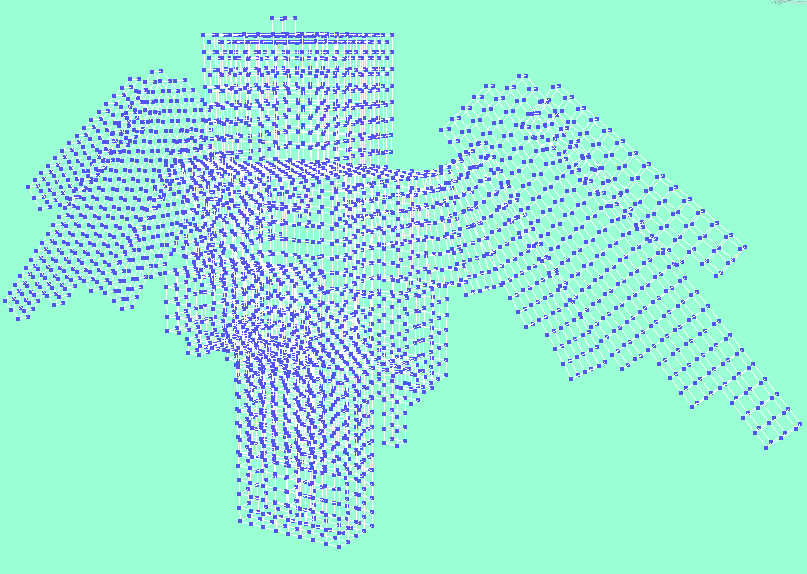 

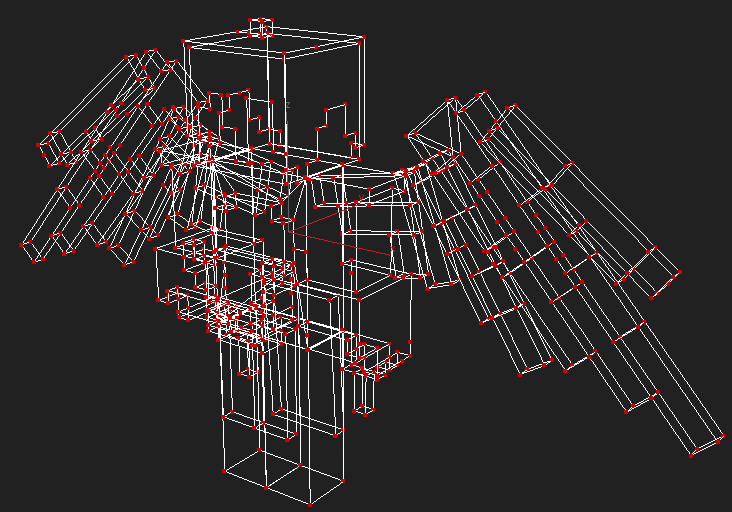 

### 2.5 Completion 

The screenshot of the effect of pasting the baked map on the MAX file after making it 

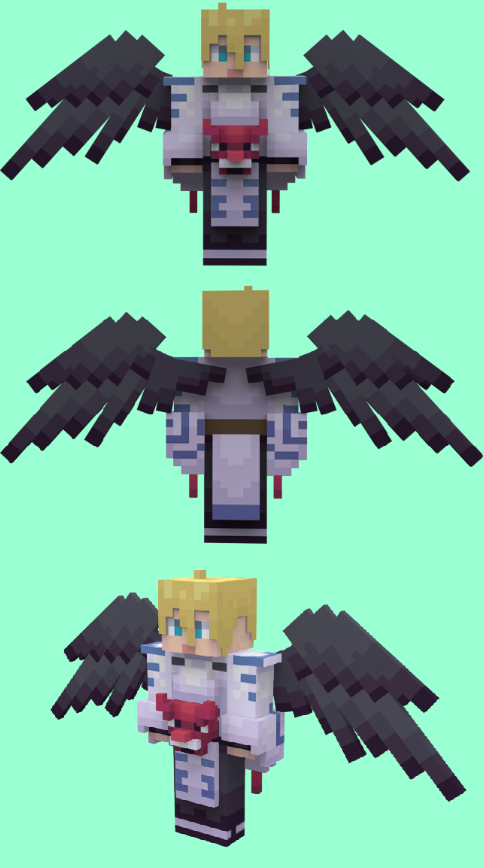