--- 
front: 
hard: Getting Started 
time: minutes 
--- 

# Skeleton Modeling Guide (Blender) 

## 1. Technical Specifications for Modeling 

Software used: Blender 2.82 

### 1.1 Model Unit Settings 

Model units are set to: inches 

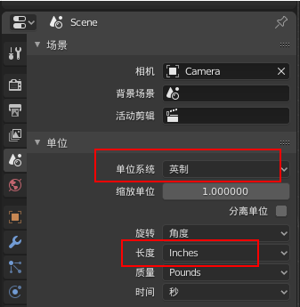 

### 1.2 Orientation 

Facing away from the y-axis, the x-axis faces right, and the z-axis faces up 

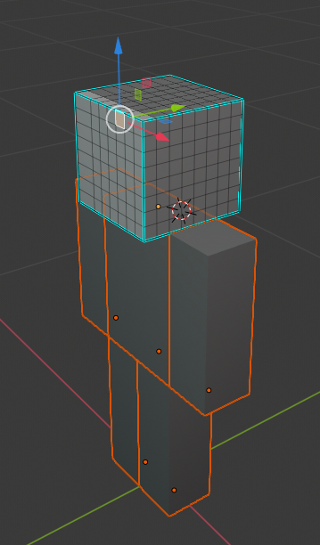 

### 1.3 Textures 

Only one texture is supported, and the texture name must be in English 

**Avoid using mirrors or symmetry during modeling! ** 

### 1.4 Vertices 

Each cuboid usually has 8 vertices, and the entire model is controlled within 300 vertices. Special models can be within 1000 

Each vertex is only bound to one bone 

Note: Normal check 

After the model is completed, 2 steps must be completed before submission: 

- Check the normal direction 

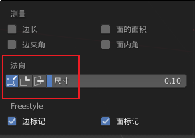 

- The cursor is at the center of the model, and the model is at the center of the scene 

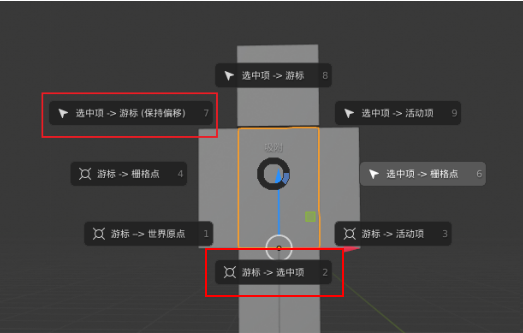 

### 1.5 About skinning 

For skinning, pay attention to the following points: 

1) The skeleton needs to have a master root skeleton, and each part can only use one skeleton. The skeleton diagram and hierarchical relationship are as follows: 

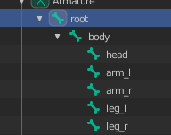 

2) The skeleton naming also needs to be standardized according to the limbs 

- Master = root 
- Body = body 
- Head = head 
- Left arm = arm_l 
- Right arm = arm_r 
- Left leg = leg_l 
- Right leg = leg_r 

3) The number of bones should be controlled within 20, and no more than 50 (some special bosses may use less than 50 bones, and generally they should be controlled within 20) 

4) Note that each module can only be affected by one bone, as shown in the figure below, and the head can only be affected by the "head" bone. 

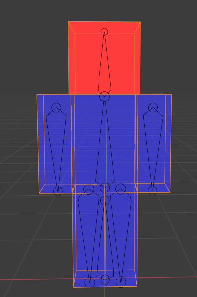 

5) FBX export settings 

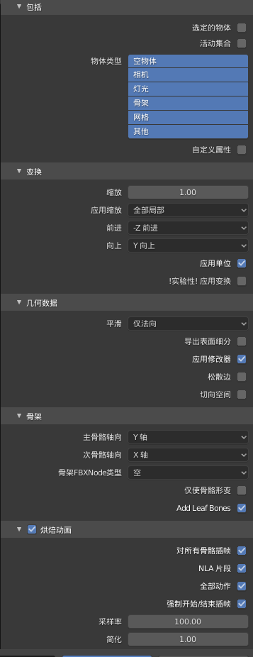 

## 2. Production process 

The following takes the production process of Daitengu as an example to explain the production process of the skeleton model. 

### 2.1 Original painting concept design 

1) Open the basic model of the human form god (each grid unit of the basic model is 1, that is, the pixel unit, do not change this size) 

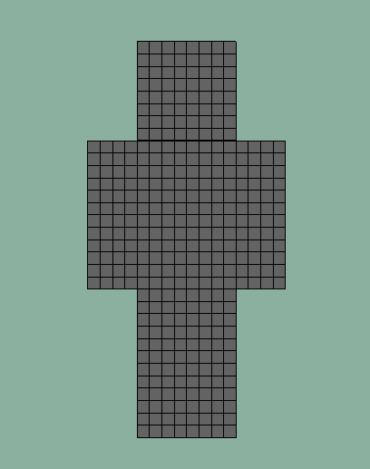 

2) Use the material ball to color the screenshot or PS coloring, the front effect can determine the color distribution relatively quickly 

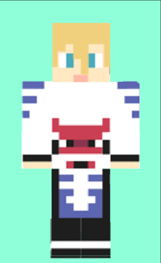 

3) Increase the recognition of the outer contour, summarize the protruding parts as much as possible, and reduce the details. Use PS to draw the concept map in this step 

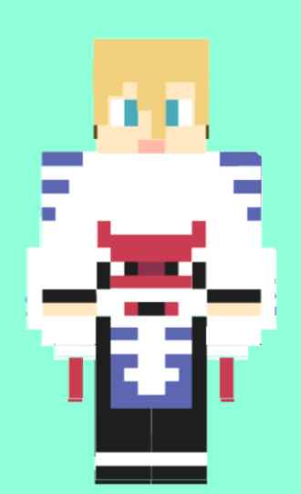 

4) Further increase the recognition of the outline, pay attention to the most characteristic parts of the character. Only one or two features on a character need to be emphasized in this way, such as the wings of the Great Tengu. This step also uses PS to draw a schematic diagram. The back also needs to have a design. Due to style restrictions, the side effect is not mandatory, but the effect of the quarter side needs to be considered 

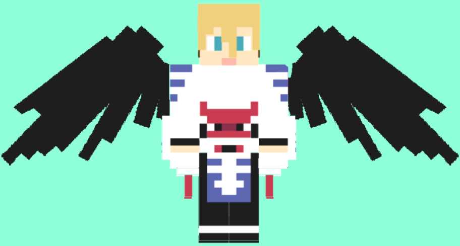 

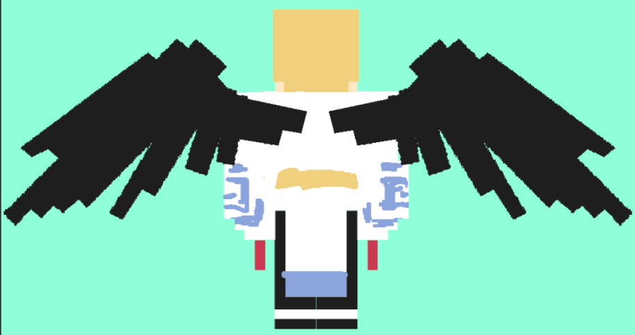 

Reference: The design of the Great Tengu in "Onmyoji". When converting to the model style of Minecraft, it is necessary to reduce the trivial details that are not representative.

The shape of the shoes needs to be directly summarized into the legs 

The three layers of feathers on the wings are reduced to two layers, and the edge details are summarized 

**Note: When designing and summarizing, pay attention to estimating the number of vertices. The number of vertices should be less than 300 for small monsters, less than 700 for complex models, and less than 1000 for BOSS. Try to keep it below the maximum value to avoid it being difficult to modify after the production is completed. ** 

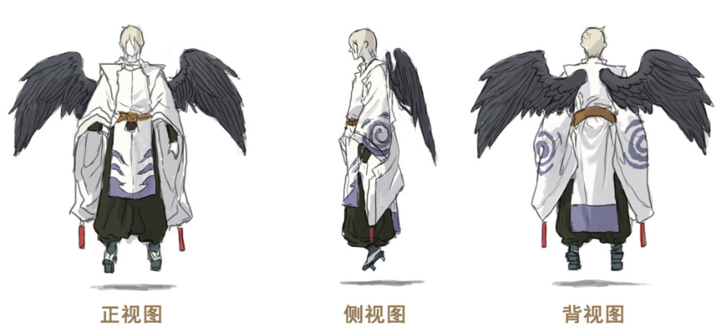 

### 2.2 Modeling and coloring 

#### 2.2.1 Modeling 

Based on the original painting, make a model. The modeling part can be directly extruded on the grid of the provided standard model. Note that the extrusion height unit is also 1. 

1: According to the specifications in the game, enlarge the head and delete the unnecessary parts to model. (For example, Da Tengu) 

2: If the hair shape is too complicated or has movements, it needs to be modeled separately. (For example, Shuten-doji) 

**Note: The model blocks at the joints must be made separately (the arms, legs, and body blocks must all be made separately. If the tail of an animal model has a turning point, the turning point of the tail must also be made separately)** 

#### 2.2.2 Start coloring 

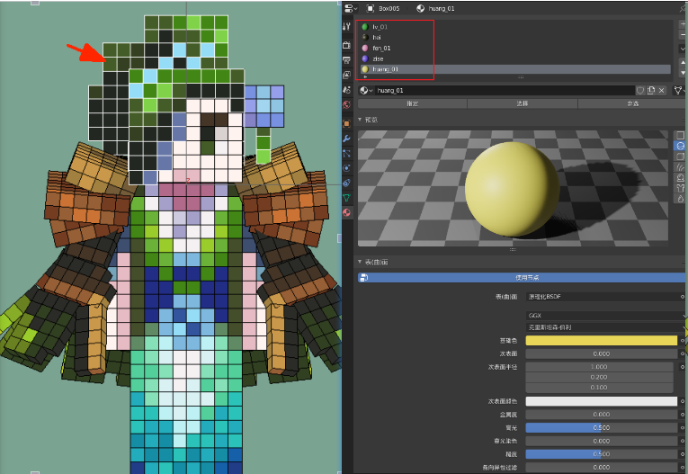 

​ In the material property panel, select the face to be colored and assign different color material balls. Because there will be many colors, the material ball names can be similar to: green_01, green_02, which is convenient for finding the corresponding color. 

### 2.3 Post-processing 

#### 2.3.1 UV splitting 

All UVs must be horizontal and vertical, without tilt, otherwise jagged edges will appear 

There must be at least two pixels between the boundaries of each UV, and the texture must be expanded 

When placing UVs, you can import a chessboard corresponding to the pixel size of the texture, and each UV edge line must be aligned with the grid of the chessboard 

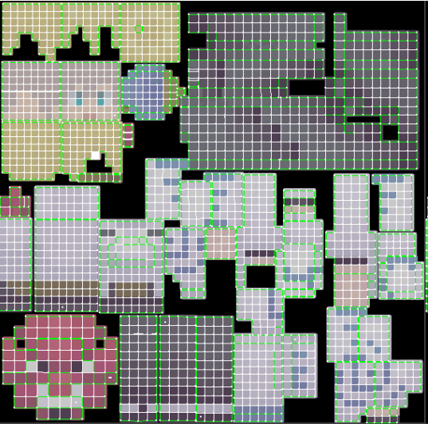 

#### 2.3.2 Reduce the surface 

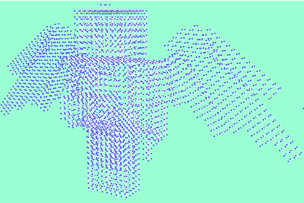 

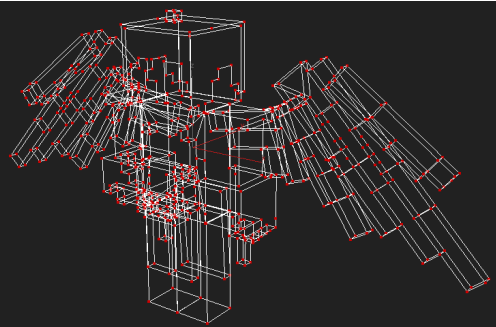 

Copy a model and reduce the surface (or topology. If you use topology, you can split the UV after topology. The rules of UV placement must be taken seriously). Only the outline is left, and all the extra lines are deleted. 

Make a backup of the high-poly model filled with color, and use it for baking the color later. 

#### 2.3.3 Baking Colors 

Select Diffuse as the baking type. You can improve the accuracy of the texture when baking colors. Then use PS to reduce it to 128 pixels. 

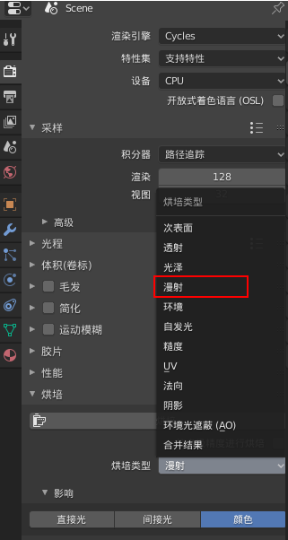 

Note that when reducing the image size, use the neighbor (hard edge) because it is all pixel grids and will not lose accuracy. 

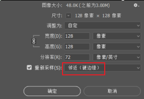 

### 2.4 Finished 

The screenshot of the baked texture is as follows: 

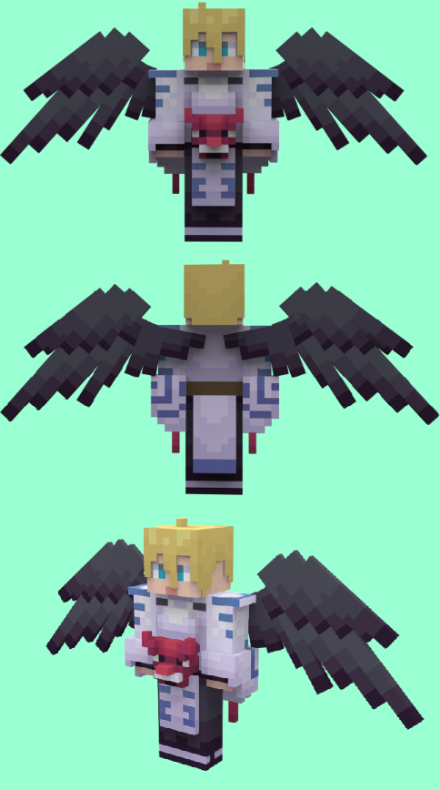 

