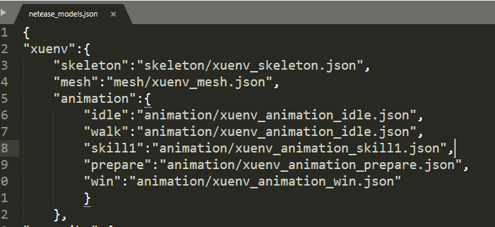
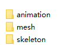
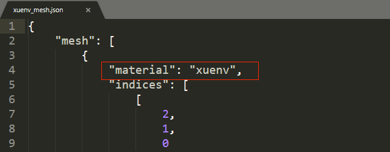
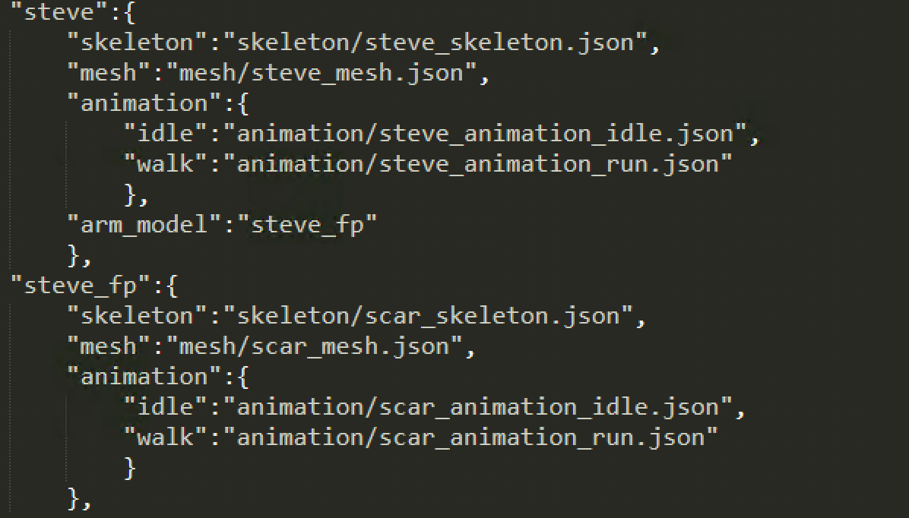
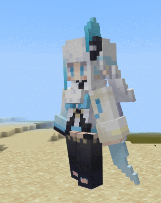
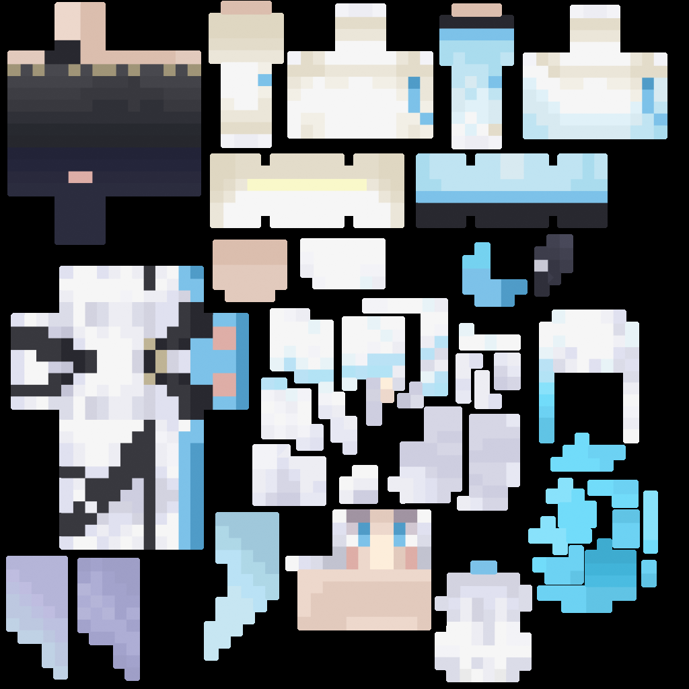
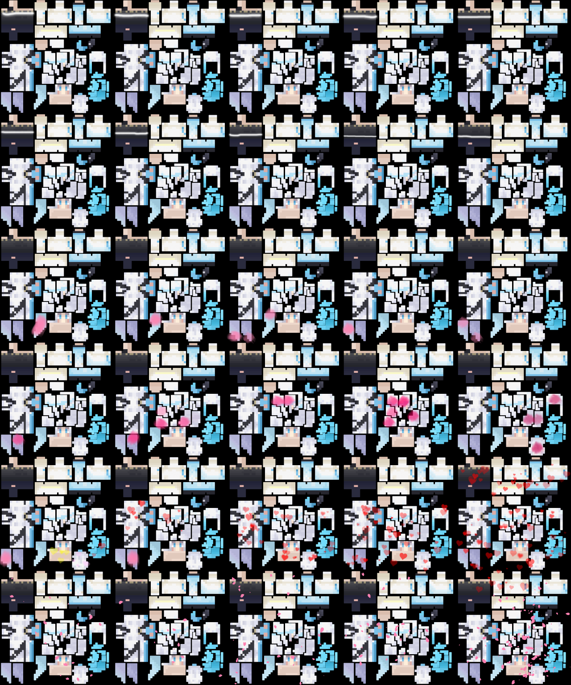
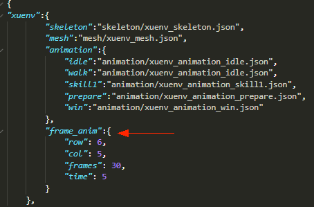

--- 
front: 
hard: Getting Started 
time: minutes 
--- 

# Use of Skeleton Models 

For the production of skeleton models and skeleton animations, please refer to [Skeleton Model Production Guide (3DMAX)](02-Skeleton Model Production Guide (3DMAX).html) and other related documents. 

After completing the model with professional model making software, export it to FBX format, and then convert it to the model format (JSON format) in "Minecraft". For the corresponding methods, please refer to [Teaching Center-Editor Basics-Special Effects Editor-Getting Started Tutorial 01-Model Import and Use](../9-Special Effects/1-Model Import and Use.md#Import fbx Model). 

After converting the skeleton model to JSON format, we can prepare to use the skeleton model in the game. Take the **Example/6-4 Resource Production/Tools and Examples/fbxRes/xuenv** resource in the offline document as an example, first import this model in the editor, and then follow the steps below. In fact, the following steps 1 to 3 have been automatically completed by the editor at present, and you can refer to them when you need to manually operate the file.

## 1. Fill in the model path information 

Fill in the file path of the model's skeleton, mesh and action in `mod_resource/models/netease_models.json` (the editor has already done this step automatically), as shown below: 

 

**The naming of the skeleton model animation is best composed of English words/pinyin/numbers/underscores. ** 

## 2. Put the resources into the corresponding directory 

Put the skeleton, mesh, and animation resources into the corresponding folders under `mod_resource/models`: 

 

## 3. Specify the texture 

The mesh file will have a specified material, as shown in the following figure: 

The name corresponds to `mod_resource/textures/models/xuenv.png`, so the texture resource needs to be placed in this location. 

 

## 4. Code call 

Use the component structure to create models and control animation playback 

Create a model to replace the original model 

```python 
modelComp = self.CreateComponent(playerId, 'Minecraft', 'model') 
# 'xuenv' is the name of the skeleton model configured in netease_models.json 
modelComp.SetModel('xuenv') 
``` 

Play animation 


```python 
modelComp = self.GetComponent(playerId, 'Minecraft', 'model') 
# Play animation 'prepare'. The second parameter is set to True to play the animation in a loop. For detailed interface information, please refer to the modAPI interface document 
modelComp.PlayAnim('prepare', True) 
``` 

## 5. First-person model 

The above part completes the display of the skeleton model and animation playback of the third-person perspective. When we want to switch to the first-person perspective in the game and also have a skeleton model and actions, we need to make another set of skeleton models and actions (such as steve_fp in the figure below), and make the action name consistent with the action of the third-person model. Then configure it as the "arm_model" of the third-person model, for example: 

 

In the above picture, we can see that Steve has a skeleton model animation, which belongs to the skeleton model animation of the third-person perspective. The "arm_model" attribute in Steve can be associated with the skeleton model of the first-person perspective. After configuring the first-person perspective skeleton model, when the player switches to the first-person perspective, if there is no item in the hand or the item in the hand is not displayed, the first-person skeleton model (that is, "steve_fp" here) will be displayed. 

When playing actions, the actions of the first-person perspective model will follow the third-person model. For example, after replacing the Steve model for the local player, play the walk action, then when switching to the first-person perspective, the displayed steve_fp model will also play the walk action. 

If the replaced third-person skeleton model does not have the "arm_model" field configured (such as the "xuenv" model mentioned above), no model will be displayed when there is no item in the hand or the item in the hand is not displayed in the first-person perspective. 

## 6. Model texture sequence frame animation 

In addition to supporting the above method of placing the corresponding json file in the animation folder, the skeleton model animation also supports another sequence frame animation that is just a simple texture change: 

 

It takes two steps to make this kind of texture sequence frame animation. Let's take the above snow girl as an example: 

1) Use image processing tools to modify the texture under the path `mod_resource/textures/models/xuenv.png`: 
Repeat horizontally and vertically according to the number of frames required for the animation. In this example, we use 6 rows and 5 columns for a total of 30 frames to process the part of the texture that needs to change in each frame. The order of sequence frame playback is from the upper left corner of the texture to the lower right corner of the texture first horizontally and then vertically. 

Original image: 
 

After processing: 
 

2) Modify the json configuration of the Snow Girl in `mod_resource/models/netease_models.json`, and add the frame_anim field: 

 

The meanings of the parameters in the field are as follows: 
row: How many rows are there in the texture animation. In this example, 6 rows and 5 columns means 6 rows, so fill in 6 here 
col: How many columns are there in the texture animation? In this example, 6 rows and 5 columns means 5 columns, so fill in 5 here. 
frames: The number of frames. In this example, it is 30 frames (this number is not necessarily the value of row multiplied by col. The texture is allowed to have blank space. If there is a blank area of one frame in the lower right corner of the texture, fill in 29 here) 
time: The total duration of the animation. In this example, it is 5 seconds, which means that 30 frames are played within 5 seconds and then the loop starts. 

Note: 
In order to save memory at runtime, it is recommended to try to adhere to the principle of minimizing the multiplication of the nearest quadratic power of width and height when making resources. 
The so-called nearest quadratic power means that the number looks up for the quadratic power closest to itself. The quadratic power is 1, 2, 4, 8, 16, 32, 64, 128, 256, 512, 1024, 2048, etc. 
For example, if a texture has a resolution of 200 * 200, and the nearest power of square of 200 is 256, then it will occupy a size of 256 * 256 after being loaded into the memory. For the convenience of explanation, some calculation details are simplified here. Readers can simply understand that the memory usage is proportional to the width and height. 
In this example, the size of our single-frame image of the Snow Girl is 256 * 256, and after 6 rows and 5 columns are arranged, it is 1280 * 1536. The nearest power of square of the width and height are 2048 and 2048 respectively, so the memory occupied is 2048 * 2048.

But if we adjust it and arrange it in a way of 4 horizontal and 8 vertical, the width and height will be 1024 * 2048. This method can support up to 4 * 8 = 32 frames. The nearest power of two of width and height are also 1024 and 2048 respectively. The memory occupied is 1024 * 2048, and the memory usage can be reduced to half of the original! 

Finally, there is no need to add additional code when calling the code to take effect: 
```python 
modelComp = self.CreateComponent(playerId, 'Minecraft', 'model') 
# 'xuenv' is the name of the skeleton model configured in netease_models.json 
modelComp.SetModel('xuenv') 
```