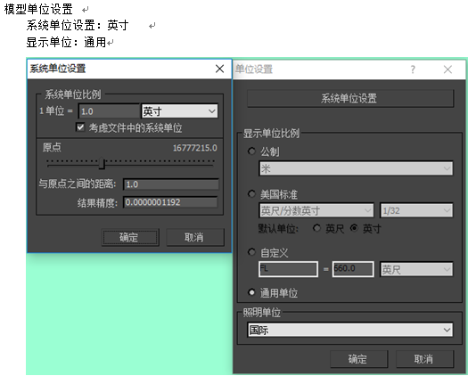
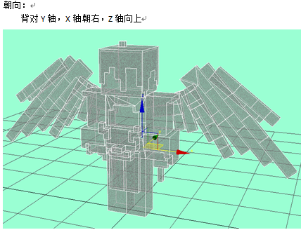
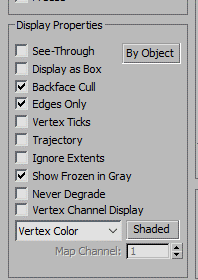
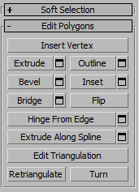
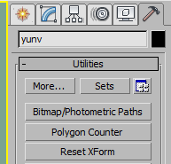
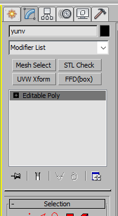
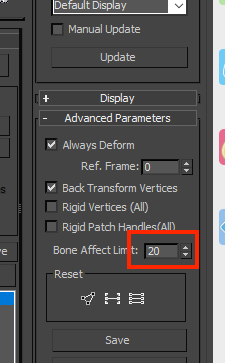
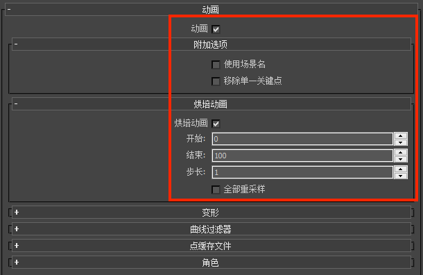
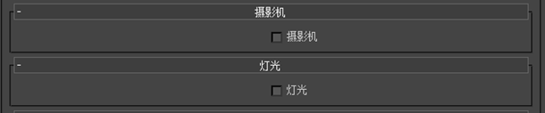
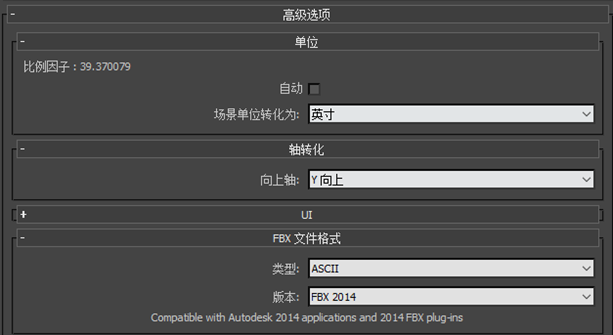

--- 
front: https://mc.res.netease.com/pc/zt/20201109161633/mc-dev/assets/img/model_face_config.25817915.png 
hard: Getting Started 
time: 15 minutes 
--- 
# Minecraft model export specifications 

Recommended software: 3dMax 2014 

## System unit settings 

 

## Model orientation 

 

## Textures 

Only one texture is supported, and the texture name must be in English 

## Vertices 

Each cuboid usually has 8 vertices, and the entire model is controlled within 300 vertices. Special complex models can be within 1000 

## Output check 

1. Set the model to backface culling in the properties, check whether the model has a reverse side, if so, it needs to be flipped. 

 
 

2. Reset Xform (click several times, then collapse) 

 

3. Mesh Select (together with 4, after clicking, no operation, collapse directly) 

4. STL Check, finally converted to Poly model output, this step can avoid model display errors in the game 
 

## Skinning 

1. Use pure bone for skeleton setting 
2. The number of bones should be within 20, and no more than 50 at most 
3. You need to add three bones: root, up, and down 
- root is the parent of the center of mass, and the displacement and rotation should be attributed to the coordinate origin (0.0) 
- up controls the upper body, the child of the center of mass, and the parent of the body 
- down controls the lower body, the child of the center of mass, and the parent of the feet 
4. All bones must be linked (weapons, pendants, mounts, etc. must be linked to the corresponding hands, center of mass, etc., and link can be used) 
5. In the advanced parameters of the skinning options, there is a bone influence limit, which needs to be adjusted to 1, as shown in the figure 

 

## Action output 

1. The output file version is MAX2014 
2. The output file is named in English, and the file needs to be exported to FBX. 
3. The output file needs to collapse the bone animation 
4. The root, up, and down bones cannot have animation 
5. The scaling animation must be proportional, and there cannot be single-axis scaling 

## FBX output settings 

The output settings are shown in the figure below: 

 

 

 

## Notes 

1. Avoid using mirrors or symmetry when making models! 
2. If the model has a normal problem, select the position where the normal is wrong and flip it. 
3. There cannot be any Chinese characters in the model! 
