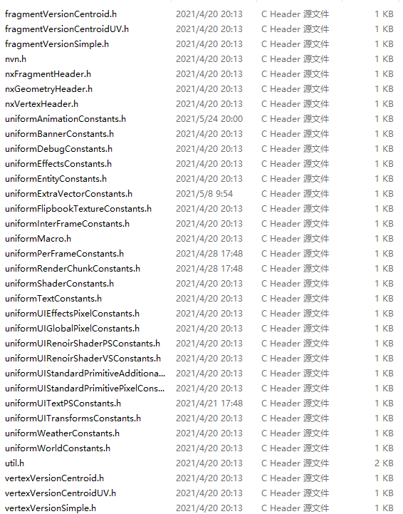

--- 
front: https://nie.res.netease.com/r/pic/20220408/3541655a-7205-4609-b118-be8d6dbb84bd.png 
hard: Getting Started 
time: 15 minutes 
selection: true 
--- 
# Introduction to Shader 
## Preface 

This article will introduce the basic writing and usage of Shader used in MC games 

## Definition 

What Shader is used by the objects in the game is defined in the material file, such as the following material definition: 
```json 
{ 
"materials": { 
"version": "1.0.0", 

"terrain_base": { 
"vertexShader": "shaders/renderchunk.vertex", 
"vrGeometryShader": "shaders/renderchunk.geometry", 
"fragmentShader": "shaders/renderchunk.fragment", 

...(unrelated code omitted) 
} 
} 
``` 

On the mobile side, we only need to focus on vertexShader and fragmentShader: 
```json 
vertexShader: vertex shader, no suffix required, usually named vertex 
fragmentShader: pixel shader, no suffix required, usually named fragment 
``` 

## Syntax 

The shader in MC is written in Opengl language. Because Opengl has different versions, the more advanced the version, the more features can be used, but the fewer compatible devices. In order to make the shader effective in different versions, it is recommended to add the following judgment when using some high-version Opengl features, and provide an implementation for low versions: 
```opengl 
#if __VERSION__ >= 300 
_centroid varying vec4 uv; //The keyword _centroid means using centroid sampling, which is a syntax supported by 3.0. The above 300 means OpenGL 3.0, and if it is 310, it means OpenGL 3.1 version. 
#else 
varying vec4 uv; 
#endif 
``` 
This tutorial does not involve the basic tutorial of opengl, and developers can learn it by themselves. 

## Macros in materials


The values defined in the material defines field can be used in the shader 
```json 
"terrain_blend_far:terrain_blend": { 
"+defines": [ "FOG" ] 
} 
``` 
The FOG field is defined here, and ifdef or ifndef can be used in the shader to judge and perform some logical processing: 
```opengl 
#ifndef FOG 
color.rgb += FOG_COLOR.rgb * 0.000001; 
#endif 
``` 
The use of macros is not like the if else statement in the traditional shader. Macros are compiler-defined and will not generate branch statements at runtime, so there will be no additional impact on performance. 

## Header file 

For code reusability, we usually extract the code that may be used by multiple shaders. At this time, just declare them as header files ending with .h and put them in the shaders/glsl directory, such as uniformWorldConstants.h. Then, to use the code in this file in other shaders, just call include 
```opengl 
#include "uniformWorldConstants.h" 
``` 

 

## Uniform 

In addition to using vertex attributes in shaders, the engine also passes a lot of useful data to the shader through uniform variables. Most shaders rely on some uniform variables for calculation. The uniform variables in the engine are defined in each .h header file. The following will explain the commonly used header files and the uniform variables in them. 

### uniformWorldConstants.h 

Effective time: can be used in the shader of the rendering scene object, which contains the transformation matrix corresponding to the current scene camera 
```opengl 
MAT4 WORLDVIEWPROJ: mvp matrix product, used to convert model space coordinates to clip space coordinates 
MAT4 WORLD: world matrix, used to convert model space coordinates to world coordinates 
MAT4 WORLDVIEW: mv matrix product, used to convert model space coordinates to viewport space coordinates 
MAT4 PROJ: projection matrix, used to convert viewport space coordinates to clip space coordinates 
``` 

### uniformPerFrameConstants.h 

Effective time: updated every frame, can be used in all shaders 
```opengl 
vec3 VIEW_POS: camera position 
float TIME: The time that has passed since the game was started can be used for some animations. In order to avoid large floating point errors caused by infinite growth, it will be modulo 210. Be careful when handling numerical boundaries. 
vec4 FOG_COLOR: Fog color 
vec2 FOG_CONTROL: The distance at which the fog takes effect. FOG_CONTROL.x is the shortest distance, and FOG_CONTROL.y is the farthest distance 
float RENDER_DISTANCE: The farthest distance that can be rendered 
``` 

### uniformRenderChunkConstants.h


Effective time: Rendering terrain 
```opengl 
POS4 CHUNK_ORIGIN_AND_SCALE: The local position of the chunk based on the player's perspective 
POS4 CHUNK_WORLD_POS_MOD_VALUE: The world position of the chunk based on the world coordinates, but because the MC map is very large, the value here will be modulo 128 
float RENDER_CHUNK_FOG_ALPHA: The transparency of the chunk fog effect 
``` 

### uniformShaderConstants.h 

Effective time: Can be used in all shaders 
```opengl 
vec4 CURRENT_COLOR: Affected by factors such as biomes, the objects rendered in the scene will correspond to two bright colors, this is the bright color. Other systems may also reuse this value for some color transfer 
vec4 DARKEN: Affected by factors such as biomes, the objects rendered in the scene will correspond to two bright colors, this is the dark color. Other systems may also reuse this value for some color transfers 
vec3 TEXTURE_DIMENSIONS : The size of the first texture used for the current rendering, usually an atlas texture, x, y, z are the width, height, and the current mipmap level. Commonly used for anti-aliasing 
float HUD_OPACITY: The transparency of some UI renderings will change, use this value to control it 
``` 

### uniformWeatherConstants.h 

Effective time: effective when rendering weather elements 
```opengl 
vec4 POSITION_OFFSET: Coordinate offset of the patch used for current weather rendering 
vec4 VELOCITY: Wind speed 
vec4 ALPHA: Stores the current illumination scaling value 
vec4 VIEW_POSITION: Position relative to the camera 
vec4 SIZE_SCALE: Scaling value of particle size, particles will be scaled according to projection and speed 
vec4 FORWARD: Forward position of the current view, generally used to push particles forward a little to ensure that they are in front of the camera 
vec4 UV_INFO: UV of the texture when rendering 
vec4 PARTICLE_BOX: Size of the area where particles are played 
``` 

### util.h 

Encapsulates the sampling function texture2D_AA for antialiasing 

## Compatibility 

### Floating point precision 

The precision of floating point numbers on different platforms is slightly different. If there is a decimal point, it can only be accurate to three decimal places at most. For example, 0.001 and 0.002 can be distinguished, but 0.0011 and 0.0012 may be judged equal on some platforms. 

In addition, try not to use == or != symbols for floating point equality judgments. For example, some developers may judge that the alpha value is not 1 and do some operations, and write like this: 
```opengl 
if(color.a != 1.0){ 
// do something 
} 
``` 
The correct way to write it is: 
```opengl

if(color.a < 0.999){ 
// do something 
} 
``` 
Similarly, if the value is not 0, it should not be written like this: 
```opengl 
if(color.a != 0.0){ 
// do something 
} 
``` 
The correct way to write it is: 
```opengl 
if(color.a > 0.001){ 
// do something 
} 
``` 

### Texture sampling 

Using texture2D in the shader to sample textures should only be written in the fragment shader, because the iOS platform does not support texture sampling in the vertex shader.