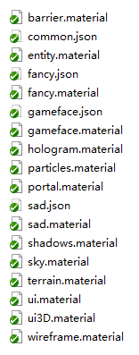
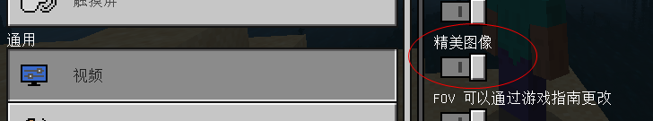
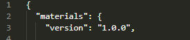
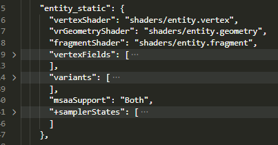

--- 
front: 
hard: Getting Started 
time: minutes 
--- 

# Material Configuration Instructions 

## Preface 

This article will introduce the structure and configuration of material files in detail. 

## List of loaded material files 

The material files are stored in the materials folder of the resource pack. When we open the resource_packs\vanilla\materials directory, we can see that it contains the following files, which are native Microsoft-defined material files: 

 

The material files in the resource_packs\vanilla_netease\materials directory are NetEase's modification and expansion of Microsoft material files. 

Let's start with the native Microsoft material files. First of all, the files in the directory are basically files with the suffix ".material". In addition, there are 3 important json files, namely common.json, fancy.json, and sad.json. 

Let's first look at sad.json and fancy.json. They are used to control the image quality. Each defines a list of material files. Fancy.json usually defines more material files than sad.json and may add some additional macros to some material files. The shader can make special treatments by judging these macros: 

sad.json: 
```json 
[ 
{"path":"materials/sad.material"}, 
{"path":"materials/entity.material"}, 
{"path":"materials/terrain.material"}, 
{"path":"materials/portal.material"}, 
{"path":"materials/barrier.material"}, 
{"path":"materials/wireframe.material"} 
] 
``` 

fancy.json: 
```json 
[ 
{"path":"materials/fancy.material", "+defines":["FANCY"]}, 
{"path":"materials/entity.material", "+defines":["FANCY"]}, 
{"path":"materials/terrain.material", "+defines":["FANCY"]}, 
{"path":"materials/hologram.material"}, 
{"path":"materials/portal.material", "+defines":["FANCY"]}, 
{"path":"materials/barrier.material"}, 
{"path":"materials/wireframe.material"} 
] 
``` 
It can be seen that fancy.json defines more fancy.material and hologram.material material files than sad.json, and also defines FANCY macros for multiple material files. 
In-game Settings/Video/Fancy Textures This switch controls the switching between sad and fancy. When the fancy textures switch is turned on, the material files in fancy.json will take effect, and when it is turned off, the material files in sad.json will take effect:


 

In order to achieve better performance, the material files in fancy.json usually have more complex calculations, while the materials in sad.json usually sacrifice a little rendering performance in exchange for better performance. 
If developers need to write a more complex shader, it is recommended to write a low-cost version at the same time, and then define them in fancy and sad respectively. Let players control whether to turn on the corresponding effect in the game through the exquisite map option. 

Next, let's look at common.json: 
```json 
[ 
{"path":"materials/particles.material"}, 
{"path":"materials/shadows.material"}, 
{"path":"materials/sky.material"}, 
{"path":"materials/ui.material"}, 
{"path":"materials/ui3D.material"}, 
{"path":"materials/portal.material"}, 
{"path":"materials/barrier.material"}, 
{"path":"materials/wireframe.material"} 
] 
``` 

Compared to sad and fancy, they can be switched between each other. Material files defined in common.json will be loaded after entering the game. Except for the material files declared in common.json, sad.json, and fancy.json, the rest of the material files will not be loaded. 

## Material syntax 

We use one of the material files, entity.material, to explain. When we open the file, we can see that the file starts with materials and defines the version number as 1.0.0. These are fixed formats, which indicate the parsing method of this material file. We can ignore them for now: 

 

Next, we will explain the format of the fields in the material. Let's use the first material defined in entity.material: 

 

You can see that the definition of each field in the material is in the form of a key-value pair, for example: 
```json 
[ 
"vertexShader": "shaders/entity.vertex", 
] 
``` 
The left side of the colon represents the key vertexShader, and the right side represents the value shaders/entity.vertex; 

There is also a list definition: 
```json 
[ 
"vertexFields": [ 
{ "field": "Position" },
        { "field": "Normal" },
        { "field": "UV0" }
    ],
]
```

Use the symbol [ ] to declare a list, and then the json definition of each child element is inside. 

## Overview of all material attribute fields 

We divide all fields into the following categories according to their functions: 

### Rendering state 

#### states 

Configure the rendering environment, which can have the following values: 
```json 
EnableAlphaToCoverage: A rendering method that does not depend on the order of semi-transparent objects. This switch is only useful in environments that support MSAA. When turned on, the edges of objects will be more accurately softened and transitioned according to the transparency. It can also be used in some complex scenes with a large number of grids interlaced and overlapped. 
Wireframe: Drawing wireframe mode 
Blending: Turn on the color blending mode, which is often used to render semi-transparent objects. After declaring this, you usually also need to declare the blending factors blendSrc and blendDst 

DisableColorWrite: Do not write color values to the color buffer, and do not write RGBA channels 
DisableAlphaWrite: Do not write transparency alpha values to the color buffer, and allow writing RGB values 
DisableRGBWrite: Do not write transparency RGB values to the color buffer, and allow writing Alpha values 

DisableDepthTest: Disable depth test 
DisableDepthWrite: Disable depth writing 

DisableCulling: Render the front and back sides at the same time 
InvertCulling: Use front clipping. By default, back clipping is used. After declaring this, the back side is rendered and the front side is clipped 

StencilWrite: Enable mask writing 
EnableStencilTest: Enable mask testing 
``` 

### Shader path 

#### vertexShader 

The path of the vertex shader, usually shaders/XXX.vertex. 

#### vrGeometryShader or geometryShader 

The path of the geometry shader is usually shaders/XXX.geometry. It is not used on mobile devices and does not need to be modified. 

#### fragmentShader 

The path of the fragment shader is usually shaders/XXX.fragment. 

### Shader macro definition 

#### defines 

Define macros for the shader used. In order to reuse the code, many different materials will use the same shader. At this time, if you want to execute different logic somewhere in the shader according to the current material, you can use the macro declared in the material defines to make a judgment. 
We can use the entity_for_skeleton material below as an example. Here we can see that the three macros USE_SKINNING, USE_OVERLAY, and NETEASE_SKINNING are defined.

```json
"entity_for_skeleton": {
	"vertexShader": "shaders/entity.vertex",
	"vrGeometryShader": "shaders/entity.geometry",
	"fragmentShader": "shaders/entity.fragment",
	"+defines": [ "USE_SKINNING", "USE_OVERLAY", "NETEASE_SKINNING" ],
	"vertexFields": [
		{ "field": "Position" },
		{ "field": "Normal" },
		{ "field": "BoneId0" },
		{ "field": "UV0" }
	],
	"msaaSupport": "Both",
	"+samplerStates": [
		{
			"samplerIndex": 0,
			"textureFilter": "Point"
		} ] 
}, 
``` 

Looking at the vertex shader entity.vertex, there are #ifdef, #else, and #endif to judge the macro and execute different logical branches. These judgment statements of the macro are processed at compile time, unlike if else in traditional shaders, which will not generate logical branches in actual operation during compile time processing, and the performance will not be reduced due to branches. In addition, it can be seen below that macros can also make multi-layer judgments. First, the NETEASE_SKINNING macro is judged, and the LARGE_VERTEX_SHADER_UNIFORMS macro is judged in the internal execution logic: 
```json 
#ifdef NETEASE_SKINNING 
MAT4 boneMat = transpose(mat3x4ToMat4(BONES_70[int(BONEID_0)])); 
entitySpacePosition = boneMat * POSITION; 
entitySpaceNormal = boneMat * NORMAL; 
#else 
#if defined(LARGE_VERTEX_SHADER_UNIFORMS) 
entitySpacePosition = BONES[int(BONEID_0)] * POSITION; 
entitySpaceNormal = BONES[int(BONEID_0)] * NORMAL; 
#else 
entitySpacePosition = BONE * POSITION; 
entitySpaceNormal = BONE * NORMAL; 
#endif 
#endif 
``` 

### Runtime state 

#### depth Depth test 

##### depthFunc 

Depth detection pass function, the following values can be used: 
```json 
Always: always pass 
Equal: pass when the depth value is equal to the buffer value 
NotEqual: pass when the depth value is not equal to the buffer value

Less: Passed when the depth value is less than the buffer value 
Greater: Passed when the depth value is greater than the buffer value 
GreaterEqual: Passed when the depth value is greater than or equal to the buffer value 
LessEqual: Passed when the depth value is less than or equal to the buffer value 
``` 

Related states rendering environment configuration: 
```json 
DisableDepthTest: Disable depth test 
DisableDepthWrite: Disable depth write 
``` 

#### Stencil Mask Test 

##### stencilRef 
Value to compare with the mask buffer or to be written 

##### stencilRefOverride 
Whether to use the current value of the buffer as stencilRef, supports 0 or 1: 
```json 
1: Use the configured stencilRef, if stencilRef is configured, stencilRefOverride automatically takes 1 
0: Use the current value of the buffer as stencilRef. In this case, stencilRef is not configured. 
``` 

##### stencilReadMask 
The mask buffer value and the stencilRef value will be bitwise ANDed with stencilReadMask before comparison 

##### stencilWriteMask 
The stencilRef value will be bitwise ANDed with stencilWriteMask before writing to the mask buffer 

##### frontFace, backFace 
Configure which mask test function to use for the front or back of the grid. In addition, the order of judgment is mask detection first, then depth detection. The following operations need to be configured: 
```json 
stencilFunc : The method used when comparing stencilRef with the mask buffer. The following values are supported: 
Always : Always pass 
Equal : Pass when stencilRef is equal to the buffer value 
NotEqual : Pass when stencilRef is not equal to the buffer value 
Less : Passed when stencilRef is less than the buffer value 
Greater : Passed when stencilRef is greater than the buffer value 
GreaterEqual : Passed when stencilRef is greater than or equal to the buffer value 
LessEqual : Passed when stencilRef is less than or equal to the buffer value 

stencilFailOp : Processing executed when the stencilFunc comparison function returns a failure. The following values are supported: 
Keep : Keep the original value of the buffer 
Replace : Write the stencilRef bit and the value of stencilWriteMask to the buffer 

stencilDepthFailOp : Processing executed when the stencilFunc comparison function returns successfully but the depth test fails. The following values are supported: 
Keep : Keep the original value of the buffer 
Replace : Write the stencilRef bit and the value of stencilWriteMask to the buffer 


stencilPassOp: The processing executed when the stencilFunc comparison function returns success and the depth test succeeds. The following values are supported: 
Keep: Keep the original value of the buffer 
Replace: Write the value of the stencilRef bit and stencilWriteMask to the buffer 
``` 

Related states rendering environment configuration: 
```json 
StencilWrite: Enable mask writing 
EnableStencilTest: Enable mask test 
``` 

Finally, let's look at an example: 
```json 
"shadow_back": { 
"+states": [ 
"StencilWrite", 
"DisableColorWrite", 
"DisableDepthWrite", 
"InvertCulling", 
"EnableStencilTest" 
], 

"vertexShader": "shaders/position.vertex", 
"vrGeometryShader": "shaders/position.geometry",
      "fragmentShader": "shaders/flat_white.fragment",

      "frontFace": {
        "stencilFunc": "Always",
        "stencilFailOp": "Keep",
        "stencilDepthFailOp": "Keep",
        "stencilPassOp": "Replace"
      },

      "backFace": {
        "stencilFunc": "Always",
        "stencilFailOp": "Keep",
        "stencilDepthFailOp": "Keep",
        "stencilPassOp": "Replace"
      },

      "stencilRef": 1,
      "stencilReadMask": 255,
      "stencilWriteMask": 1,

      "vertexFields": [
        { "field": "Position" }
      ],
      "msaaSupport": "Both"
    }
```

In the example, StencilWrite means that the mask buffer is supported for writing, EnableStencilTest means that the mask test is enabled, and the configuration of frontFace means that the mask test always passes when rendering the front face. If the depth test fails, the buffer value remains unchanged. If the depth test also passes, the stencil bit and the value of stencilWriteMask will be written to the buffer, that is, 1 & 1 = 1. The configuration of backFace is similar. 

#### Blend Translucent Object Color Blending 

The rendering of translucent objects requires the configuration of blending factors. The final output RGB color value = current color value * source blending factor + color value in buffer * target blending factor 

##### blendSrc 
Source blending factor 

##### blendDst 
Destination blending factor 

##### alphaSrc 
The source blending factor when calculating alpha, usually not configured to take the default value 

##### alphaDst 
The destination blending factor when calculating alpha, usually not configured to take the default value 

--- 

The blending factor can take the following values in total: 
```json 
DestColor: Buffer color value 
SourceColor: Current color value 
Zero: (0,0,0) 
One: (1,1,1) 
OneMinusDestColor: (1,1,1) - Buffer color value 
OneMinusSrcColor: (1,1,1) - Current color value 
SourceAlpha: Alpha value in current color 
DestAlpha: Alpha value in buffer color 
OneMinusSrcAlpha: 1 - Alpha value in current color value 
``` 

In the engine, the default value is: 
```json 
blendSrc: SourceAlpha 
blendDst: OneMinusSrcAlpha 
alphaSrc: One 
alphaDst: OneMinusSrcAlpha 
``` 

Related states rendering environment configuration: 
```json 
Blending: Enable color blending mode, commonly used to render semi-transparent objects. After declaring this, you usually also need to declare the blending factors blendSrc and blendDst 
DisableColorWrite: Do not write color values to the color buffer, and do not write RGBA channels 
DisableAlphaWrite: Do not write transparency alpha values to the color buffer, and allow writing RGB values 
DisableRGBWrite: Do not write transparency RGB values to the color buffer, and allow writing Alpha values 
``` 

#### sample texture sampling


##### samplerStates 
Configure the sampling state. The value is a list. Configure each texture according to the number of textures to be sampled. Usually, if UV0 and UV1 are declared in the vertex attributes, it means that two textures need to be sampled. Here, two elements need to be configured. Let's look at the definition of the sub-elements: 
```json 
{ 
"samplerIndex": 0, 
"textureFilter": "Point", 
"textureWrap": "Repeat" 
} 
``` 

The definition of each attribute is as follows: 
###### samplerIndex 
Number, representing the texture attribute currently being set, starting from 0 

###### textureFilter 
Texture filter mode (default is Point). When the actual displayed texture map is enlarged or reduced compared to the original image, the mapping relationship between the new resolution map and the pixel points on the original resolution map can have the following values: 
```json 
Point: Point sampling 
Bilinear: Bilinear sampling 
Trilinear: Trilinear sampling 
MipMapBilinear: MipMap bilinear sampling 
TexelAA: Texel anti-aliasing (not supported by all devices, not recommended) 
PCF : Sampling by comparison function (not supported by all devices, not recommended) 
``` 

###### textureWrap 
Texture wrap mode, controls what texture should be sampled when uv is outside [0,1]. It can have the following values: 
```json 
Repeat: Repeat, that is, sample the value modulo [0,1] 
Clamp: Edge sampling, sample the value of the closest edge, that is, 1.1 is closer to 1, then take 1; -0.1 is closer to 0, then take 0. 
``` 

#### vertex Vertex attributes 

##### vertexFields 
Vertex attributes are used to declare what attributes are stored in each vertex of the mesh rendered using this material. It is determined by the artist when making the resource. The following values may be used: 
```json 
Position: Model space coordinates 
Color: Color 
Normal: Normal 
UV0: Texture sampling coordinates 
UV1: Texture sampling coordinates 
UV2: Texture sampling coordinates 
BoneId0: Bone ID, used in bone models 
``` 

#### rasterizer Rasterization environment configuration 


##### msaaSupport 
Configure support for MSAA (Multi-sampling Anti-aliasing) (the default value in the engine is NonMSAA) 
```json 
NonMSAA: The material is allowed to be used when MSAA is not enabled 
MSAA: The material is allowed to be used when MSAA is enabled 
Both: The material is allowed to be used regardless of whether MSAA is enabled. Usually this value is enough. 
``` 

##### Depth offset 

Depth offset is mainly used to solve the z-fighting problem, that is, when two objects are close in depth, some frames may show this object and some frames may show another object. This kind of flickering phenomenon may occur during rendering. The principle of depth offset is to offset one of the objects in the direction of greater or lesser depth so that their depths are no longer the same. 
The following four variables can be configured: 
```json 
depthBias 
slopeScaledDepthBias 
depthBiasOGL 
slopeScaledDepthBiasOGL 
``` 

The specific offset depth is: 
```json 
offset = (slopeScaledDepthBias * m) + (depthBias * r) 
``` 
On the OGL platform, it is: 
```json 
offset = (slopeScaledDepthBiasOGL * m) + (depthBiasOGL * r) 
``` 

m is the maximum value of the slope of the polygon's depth (calculated during the rasterization stage). The closer a polygon is to the near clipping plane, the closer m is to 0. 
r is the minimum value that can produce a discernible difference in the depth value in the window coordinate system. r is a constant specified by the specific platform that implements OpenGL. 

--- 
Related states rendering environment configuration: 
```json 
Wireframe: Draw wireframe mode 
DisableCulling: Render both front and back sides 
InvertCulling: Use front side clipping. By default, the back side is clipped. After declaring this, the back side is rendered and the front side is clipped. 
``` 

#### primitive primitive 

##### primitiveMode 
Primitive rendering mode (the default value in the engine is TriangleList): 
```json 
None: Do not render. This value will not be used under normal circumstances. 
QuadList: Quadrilateral mode 
TriangleList: A mode that draws a triangle for every three vertices. For example, the first triangle uses vertices v0, v1, v2, and the second uses v3, v4, v5 
TriangleStrip: Each vertex will form a triangle with the first two vertices. The structure is a bit more complicated, but it will save data. 
LineList: Draw a line segment for every two vertices. 
Line: Each vertex will form a line segment with the previous vertex.

``` 

### Material Variants 

#### variants 
Used to quickly implement multiple sub-materials based on mostly the same definition. Look at the actual example of entity_static below:
```json
    "entity_static": {
      "vertexShader": "shaders/entity.vertex",
      "vrGeometryShader": "shaders/entity.geometry",
      "fragmentShader": "shaders/entity.fragment",
      "vertexFields": [
        { "field": "Position" },
        { "field": "Normal" },
        { "field": "UV0" }
      ],
      "variants": [
        {
          "skinning": {
            "+defines": [ "USE_SKINNING" ],
            "vertexFields": [
              { "field": "Position" },
              { "field": "BoneId0" },
              { "field": "Normal" },
              { "field": "UV0" }
            ]
          }
        },
        {
          "skinning_color": {
            "+defines": [ "USE_SKINNING", "USE_OVERLAY" ],
            "+states": [ "Blending" ],
            "vertexFields": [
              { "field": "Position" },
              { "field": "BoneId0" },
              { "field": "Color" },
              { "field": "Normal" },
              { "field": "UV0" }
            ]
          }
        }
      ],
      "msaaSupport": "Both",
      "+samplerStates": [
        {
          "samplerIndex": 0,
          "textureFilter": "Point"
        }
      ]
    },

``` 
variants is the declaration of material variants. The above declarations include two sub-variants, skinning and skinning_color, in which some external fields are rewritten. In actual use, it is equivalent to quickly defining two materials. The entity and the variant are connected with a dot ".". The two materials are entity_static.skinning and entity_static.skinning_color. 

In addition, if other materials inherit from entity_static in the future, such as entity_dynamic, this material will also inherit these two variants at the same time, namely entity_dynamic.skinning and entity_dynamic.skinning_color. 

## Material merging rules 

When the same material is declared in different directory files, it will be merged according to the following rules after loading: 
1. Usually, the fields of the material in the file loaded later will overwrite the previously loaded 
2. The following fields are special. In addition to replacement, they also support the operation of adding "+" and deleting properties using "-": 
```json 
defines 
states 
samplerStates 
``` 

For example, such a material is declared in the package file (irrelevant code omitted), and three macros are defined: 
```json 
"testMat": { 
"defines": [ "MACRO_1", "MACRO_2", "MACRO_3" ], 
} 
``` 

At this time, a Mod also declares this material and defines three other macros: 
```json 
"testMat": { 
"defines": [ "MACRO_4", "MACRO_5", "MACRO_6" ], 
} 
``` 
In the above case, the final runtime is equivalent to the defines field being overwritten, and the macros that are actually effective at runtime are: MACRO_4, MACRO_5, MACRO_6 

If the "+" symbol is used when defining in MOD: 
```json 
"testMat": { 
"+defines": [ "MACRO_4", "MACRO_5", "MACRO_6" ], 
} 
``` 
It is equivalent to adding definitions on the original basis, and the macros that are actually effective at runtime are: MACRO_1, MACRO_2, MACRO_3, MACRO_4, MACRO_5, MACRO_6 

If the "-" symbol is used when defining in MOD: 
```json 
"testMat": { 
"-defines": [ "MACRO_3"], 
} 
``` 
It is equivalent to deleting some definitions on the original basis, and the macros that are actually effective at runtime are: MACRO_1, MACRO_2 

If multiple files define the same material, and involve overwrite, add, and delete operations, the order in which they take effect is: 
First execute all overwrite operations, then execute all add operations, and finally execute all delete operations.


That is, if one of the material files declares to delete the MACRO_3 operation: 
```json 
"testMat": { 
"-defines": [ "MACRO_3"], 
} 
``` 
No matter how other files overwrite and add MACRO_3, this material will definitely not have the MACRO_3 macro after the final synthesis.