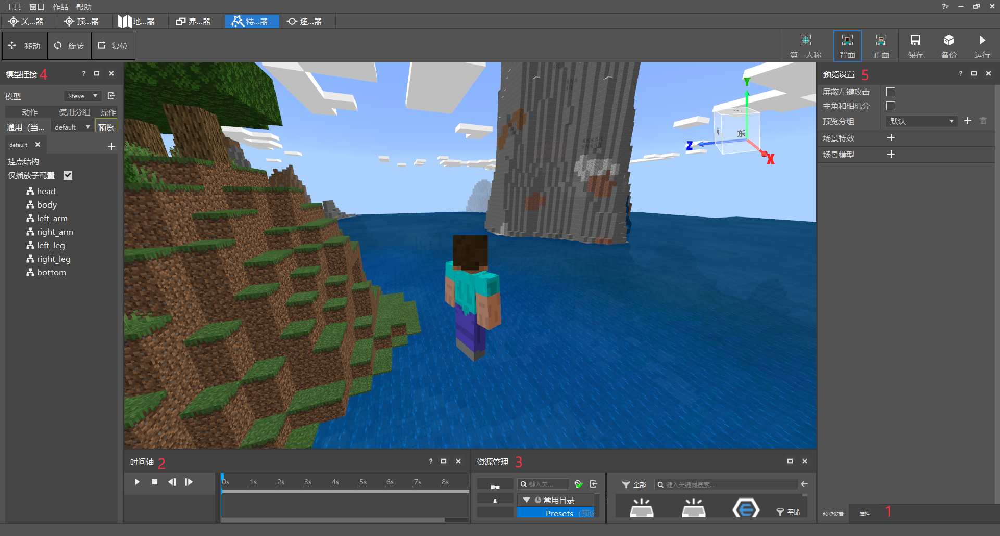

--- 
front: https://nie.res.netease.com/r/pic/20220408/99649e7c-0350-49b7-9b4c-cb14dbf8ed36.gif 
hard: Getting Started 
time: 5 minutes 
selection: true 
--- 
# Basic Introduction to Special Effects Editor 

Special Effects Editor is an editing tool for editing particle effects, sequence frame effects, and attaching special effects to skeleton models. The main functions of the current version include particle effects, sequence frame special effects viewing and editing, importing and attaching skeleton models, and previewing special effects and models. By attaching special effects resources to skeleton models, you can preview the effects of special effects in the game in real time. 

The main interface module is shown in the figure below: 

 

Includes the following important modules: 

1. Property panel, used to display or modify the properties of the selected item, including displaying/modifying the properties of particle effects and sequence frame effects, and displaying the model skeleton properties. 

2. Timeline panel, used to control the playback of special effects and character animations, including play, stop, frame-by-frame playback, and can drag the duration of special effects when playing skeleton animations. 

3. Resource manager panel, used to display and manage currently owned resources, including shortcut directories and corresponding operation buttons for special effects, models, and textures involved in special effects editing. 

4. Model attachment panel, used to attach special effects to characters, and can control the playback position of different special effects. 

5. Preview settings panel, used to preview characters/models and special effects, and can support multiple different models and special effects to play at specified locations. 
6. Toolbar, the move, rotate, and reset buttons on the left are used to visualize the hanging points, and the buttons on the right are used to adjust the current camera angle and the storage and operation of the project. 

These panels support the main functions of the special effects editor. For detailed instructions on each part, please refer to the Getting Started Tutorial. 
