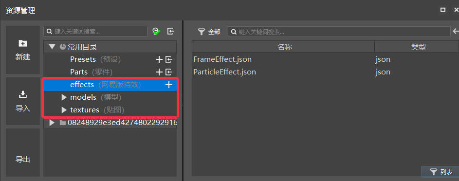
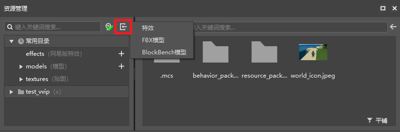
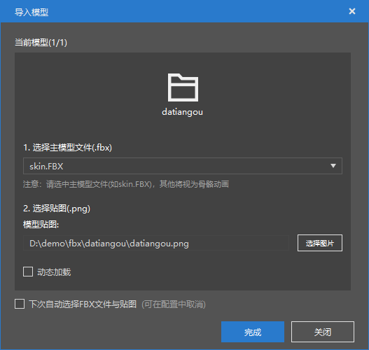
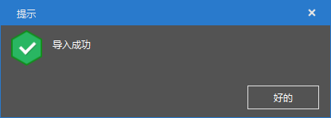
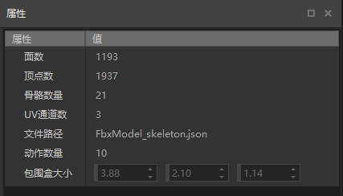
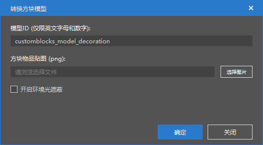
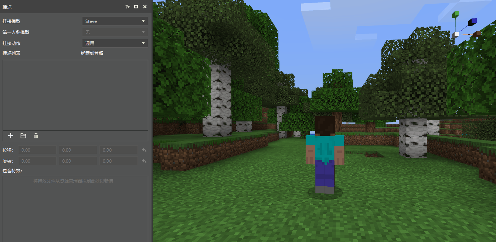
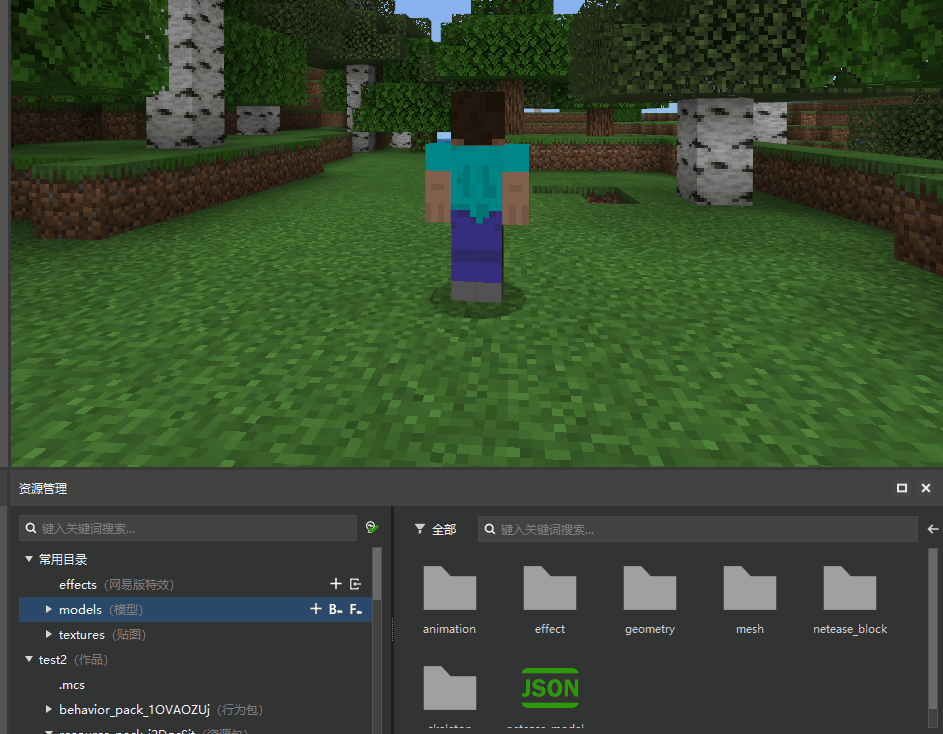

--- 
front: https://nie.res.netease.com/r/pic/20210727/ab01ce89-bbb6-4e45-b7c6-ff3f08542d86.png 
hard: Getting Started 
time: 10 minutes 
--- 
# Getting Started Tutorial 01-Model Import and Use 

This tutorial mainly introduces the following contents: 

1. What types of models are supported in Minecraft. 
2. How to import external models in the special effects editor. 
3. How to use models in the special effects editor. 

## Model Support 

In Minecraft, there are two main formats for model support: 

>1.FBX general model: model file with .fbx as the suffix format. This is a universal model format. At present, almost all mainstream 3D software can support the export of fbx models. It contains rich information. The current version mainly supports bone model mapping and bone animation.

>2. Original model: Model file with .bbmodel as suffix. This is a model format specially made for Minecraft, which is characterized by simple and free production. 

## Common directory introduction 

 

As shown in the figure above, in the special effects editor, the resource manager contains 5 common directories, 3 of which are related to special effects, namely: 

1. effects directory: NetEase custom special effects directory, created and imported custom special effects files are stored in this directory. 

2. models directory: model-related directory, imported model bones, bone actions, bone model meshes, NetEase custom blocks and special effects attachment files corresponding to each model are all stored in the corresponding folders of this directory. 

3. textures directory: texture directory, special effects textures, bone textures and animation sequence frame files are all stored in the corresponding folders of this directory. 

> The commonly used directory in the figure is just a shortcut. You can also find the corresponding directory by expanding the resource package under the work. 

## Model import 

> Tip: This chapter requires the use of external model import. If the model is missing, please download [demo resources](https://x19.gdl.netease.com/demo.zip). The demo contains a large tengu skeleton model and three bbmodel models, as well as a sequence frame file. 

 

As shown in the above picture, there are two buttons on the right side of the search bar of the resource manager, namely the filter button and the import button. Click the import button in the red area, and special effects, FBX models, and BlockBench models will appear. Select the option to perform the corresponding import function. The following introduces three ways to import resources: 

### Import fbx model 

Before importing, you can first observe what the datiangou model has. Open the folder and you can see that it contains a datiangou.png texture and several fbx files. Why are there so many fbx files? 

Usually when making a skeletal model, the corresponding skeletal animation (that is, the model's action) will also be made. Each skeletal animation will be exported as a separate fbx file. Use [Autodesk FBX Review](https://www.autodesk.com/products/fbx/fbx-review) to preview the fbx model and play the corresponding action. Among these fbx models, there is a main model file, that is, other animations are exported based on this main model. This is related to the specific export configuration, and will not be introduced in detail here. You just need to understand the concept of the main model file. 

Next, we will start to import the fbx model. First, click the  button, then select the FBX model. The folder selection interface will appear. Select the folder where the model is located, click OK, and the interface will appear as follows: 

 

The meanings of each option are as follows: 

1. Select the main model, and all other skeletal animations based on this model in the entire folder will be automatically imported. If the main model is selected incorrectly, it may cause other skeletal animations to be imported abnormally. 

2. Select the texture file. Some models may contain multiple texture files. Only a single texture is supported here, so you must select the corresponding texture file. 

3. Dynamic loading. This option is used to control the loading method of the model in the game. Dynamic loading means that the corresponding model resources will be loaded only when the model is used in the game. Because the game is loaded by default when it starts, when there are many models, it is recommended to use dynamic loading to control the number of loaded models. 

4. Automatically select FBX files and textures next time. If you check this option, the texture files and model files in this folder will be selected by default next time (you can uncheck it in Works-Settings-Others). 

When the selection is completed, the tips at the bottom left of the main interface will show that the model is being imported. When the model is imported, a pop-up window will pop up to prompt that the import is successful, and the model is imported. 

 

After importing, the files are scattered in various folders under the models folder. Expand the models folder and click the skeleton model mesh folder or the skeleton folder to view the corresponding imported files. Click the file to view the corresponding model attribute information in the property bar on the right. 

 

### Import bbmodel model 

Next, try to import bbmodel model. Click the import button and select BlockBench model. The file selection interface will appear. Select the bbmodel file in the demo/bbmodel/decoration folder you downloaded. After the selection is completed, the following import interface will appear: 

 

The meaning of each option is as follows: 

1. Model ID, the unique ID of the imported model. 

2. Block item texture. Generally, bbmodel will have built-in textures. If you need to import external textures, you can select them here. 

3. Turn on ambient occlusion to improve the model's processing of light. 

The imported bbmodel files are stored in the models/netease_block folder and the textures/blocks folder. For specific usage, please refer to [Custom Block Model](../../20-Gameplay Development/15-Custom Game Content/2-Custom Block/5-Custom Block Model.md) 

## Model Usage 

After importing the model, how should the protagonist be switched to the corresponding model? There are two ways: 

1. Select the corresponding model in the model mounting panel. 

 

2. When there is a model mounting file, directly clicking on the model mounting file will also switch the model back to the corresponding model. Expand the models folder, select the effect folder, and click on the corresponding mounting file in the effect folder. 

 

After switching the protagonist to the corresponding model, we can start creating and using special effects.