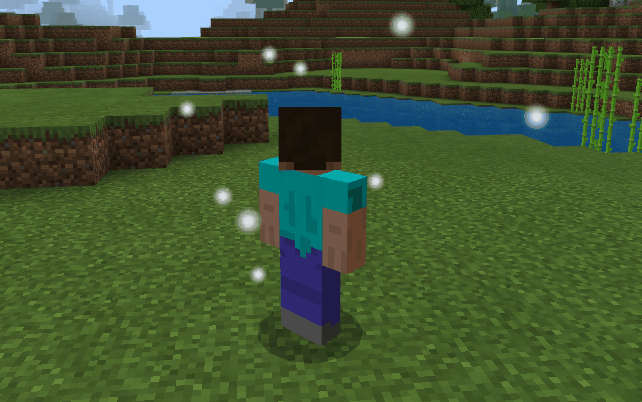
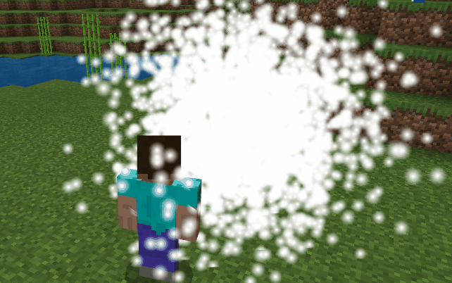
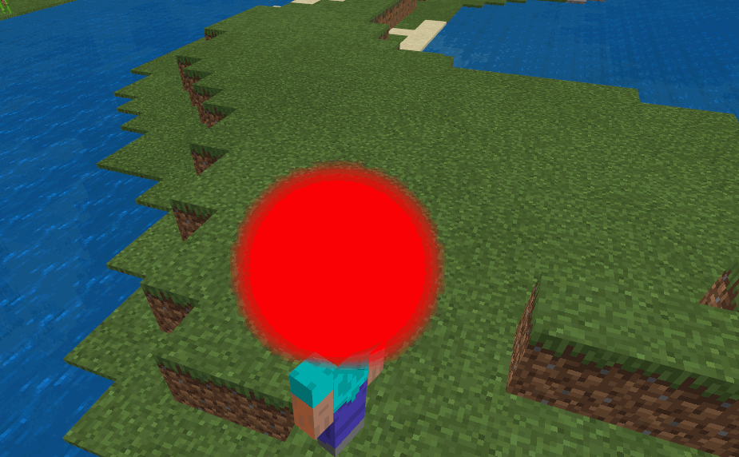
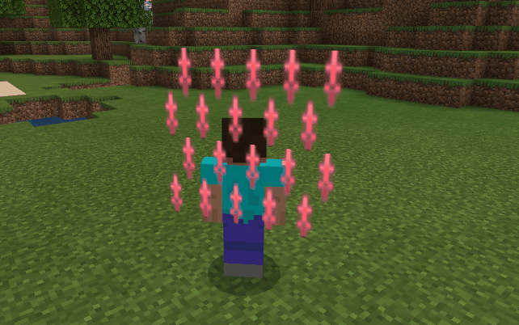
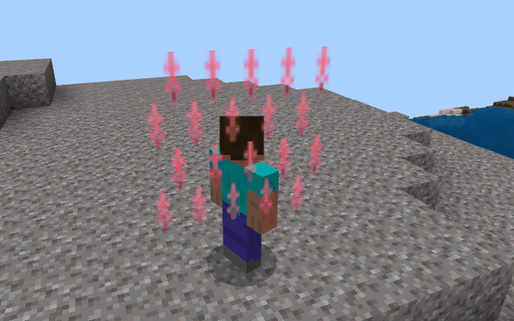

--- 
front: https://mc.res.netease.com/pc/zt/20201109161633/mc-dev/assets/img/spark_EmitterSizeScaleEffect.5458f74c.gif 
hard: Getting Started 
time: 30 minutes 
--- 
# Detailed description of special effects properties 
## Basic properties of particle special effects 
### Special effects direction 
#### direction 

Property | Description 
---- | ---------------------------------- 
Description | Set the particle direction 
Default value | `Inwards` 
Parameter range | `Inwards`, `Outwards`, `Direction` 

- Direction, use the initial direction of the particle (each direction is between `directionMin` and `directionMax`

 

- Inwards, use the centripetal direction of the emitter shape 

 

- Outwards, use the centrifugal direction of the emitter shape 

 

#### directionMin 

Property | Description 
---- | ------------------------------------- 
Description | Set the minimum value of the random direction of the particle, respectively, for the x, y, and z axis directions, negative values represent the reverse direction 
Default value | `-1.0 -1.0 -1.0` 
Parameter range | -1.0 ~ 1.0 
Tip | This parameter is only valid when the direction is `Direction` 

#### directionMax 

Property | Description 
---- | ------------------------------------------------------------ 
Description | Set the maximum value of the random direction of the particle, which is the x, y, and z axis directions respectively. Negative values represent the reverse direction. 
Default value | `1.0 1.0 1.0` 
Parameter range | -1.0 ~ 1.0 
Tip | This parameter is only valid when the direction is `Direction`, directionMax in each direction needs to be greater than the corresponding value of directionMin 


```json 
{ 
"direction": { 
"value": "Inwards", 
"min": "-1.0 -1.0 -1.0", 
"max": "1.0 1.0 1.0" 
} 
} 
``` 

### Initial velocity velocity 

Property | Description 
---- | ----------------------- 
Description | Initial velocity of the particle, vector, minimum and maximum values 
Default value | `1.0 1.0` 
Parameter range | -100000.0 ~ 100000.0 

```json 
{ 
"velocity": { 
"value": "1.0 1.0" 
} 
} 
``` 

### Constant force constantforce 

Property | Description 
---- | ------------------------- 
Description | The velocity of the particle at x, y, z The constant force on the axis is equivalent to the acceleration of the particle during motion. 
Default value | `0.0 0.0 0.0` 
Parameter range | -100000.0 ~ 100000.0 

```json 
{ 
"constantforce": { 
"value": "0.0 0.0 0.0" 
} 
} 
``` 

### Damping force dampingforce 

Property | Description 
---- | -------------------- 
Description | Acceleration in the opposite direction of the particle velocity 
Default value | `0.0` 
Parameter range | -100000.0 ~ 100000.0 
Tip | When it is a negative number, it is acceleration

Description | v is the current velocity of the particle, which is calculated as `v = v - dampingforce * v` 

```json 
{ 
"constantforce": { 
"value": "0.0 0.0 0.0" 
} 
} 
``` 

### Initial size particlesize 

Property | Description 
---- | ------------------------ 
Description | The initial size of the particle on the two-dimensional plane (x, y) facing the camera 
Default value | `0.1 0.1` 
Parameter range | -100000.0 ~ 100000.0 
Tip | max in each direction needs to be greater than the corresponding value of min 

```json 
{ 
"particlesize": { 
"min": "0.1 0.1", 
"max": "0.1 0.1" 
} 
} 
``` 

### Initial rotation rotation 

Property | Description 
---- | -------------------------- 
Description | The initial rotation of the particle on the two-dimensional plane (x, y) facing the camera, that is, the angle of rotation around the z axis 
Default value | `0.0` 
Parameter range | -999999.0 ~ 999999.0 
Tip | Positive number is counterclockwise, negative number is clockwise 
Tip | The initial rotation of the particle is between min and max 

```json 
{ 
"rotation": { 
"min": "0.0", 
"max": "0.0" 
} 
} 
``` 

### Rotation speed rotationspeed 

Property | Description

---- | ------------------------ 
Description | The rotation speed of the particle on the 2D plane (x, y) facing the camera 
Default value | `0.0` 
Parameter range | -999999.0 ~ 999999.0 
Tip | Positive number is counterclockwise, negative number is clockwise 
Tip | The actual rotation speed of the particle is between min and max 

```json 
{ 
"rotationSpeed": { 
"min": "0.0", 
"max": "0.0" 
} 
} 
``` 

### Lifetime timetolive 

Property | Description 
---- | -------------------- 
Description | Lifetime of the particle 
Default value | `1.0` 
Parameter range | 0.0 ~ 100000.0 
Tip | The actual lifetime of the particle is between min and max. For example, the following parameters set the lifetime of the particle to 1 - 2 seconds 

```json 
{ 
"timetolive": { 
"min": "1.0", 
"max": "2.0" 
} 
} 
``` 
### Preheat prewarm 
Property | Description 
---- | -------------------- 
Description | After turning on, the particle emitter starts emitting particles at the beginning of the game 
Default value | Not turned on 
```json 
{ 
"prewarm": true 
} 
``` 
### Independent survival time independent 
Property | Description 
---- | -------------------- 
Description | After turning on, the life cycle of each particle will be calculated independently. When the emitter is turned off, the particles will not disappear immediately, but will gradually dissipate according to their own life cycle 
Default value | `false` 
Parameter range | `false`,`true` 
```json

{ 
"independent": false 
} 
``` 
### Layer layer 

Property | Description 
---- | -------------------------- 
Description | Supports particle front and back layer effects. The larger the value, the later the rendering and the closer the display 
Default value | `1` 
Parameter range | 0 ~ 15 

```json 
{ 
"layer": 1 
} 
``` 

## Particle special effect dynamic property description 

### Dynamic size sizedelta 

Property | Description 
---- | -------------------- 
Description | Used to control the size change of particles at different times 
Default value | Disable 
Prompt | Contains both relative time and absolute time 

 

 

```json 
"sizedelta": [ 
{ 
"scale": "1.000 1.000", 
"time": "27%" 
}, 
{ 
"scale": "3.000 3.000", 
"time": "57%" 
} 
{ 
"scale": "1.000 1.000", 
"time": "89%" 
} 
] 
```


### Dynamic color colorfade 

Properties | Description 
---- | -------------------- 
Description | Used to control the color change of particle size at different times 
Default value | Disabled 
Tip | Color value changes linearly between different points, supports transparency setting 

 

 

```json 
"colorfade": [ 
{ 
"color": "1.00 1.00 1.00 1.00", 
"time": "0.0" 
}, 
{ 
"color": "0.67 0.00 0.00 0.44", 
"time": "0.48" 
}, 
{ 
"color": "1.00 1.00 0.24 1.00", 
"time": "1.0" 
} 
] 
``` 

### Particle Disorder 

 

Properties | Description 
--------- | ---------------------- 
Description | Supports random disturbance of particles on x, y, z axis 
min | Minimum disturbance amplitude of particles on x, y, z axis 
max | Maximum disturbance amplitude of particles on x, y, z axis 
interval | Particle disturbance time interval (seconds) 
increment | Incremental increment after each disturbance, mostly used to achieve dispersion effect 
Tip | The actual disturbance of particles is between min and max 

```json 
{ 
"disorder": { 
"min": "0.0 0.0 0.0",

"max": "0.0 0.0 0.0", 
"interval": "0.0", 
"increment": "0.0" 
} 
} 
``` 

## Particle emitter property description 

### Maximum number of particles numparticles 

 

Property | Description 
---- | ------------ 
Description | Maximum number of particles that exist at the same time 
Default value | `10` 
Parameter range | 0 ~ 100000 
Tip | The number of particles displayed on the same screen is also limited by the emission rate 

```json 
{ 
"numparticles": { 
"value": "10" 
} 
} 
``` 

### Emission cycle length activetime 

Property | Description 
---- | ---------------------------- 
Description | The time that the particle emitter continuously emits particles. During this period, particles will be continuously emitted. 
Default value | `0.0` 
Parameter range | 0.0 ~ 100000.0 
Tip | Need to be used in conjunction with the emission cooling time inactivetime 
Description | It can be regarded as the life cycle of the emitter, which is convenient for debugging time-limited effects. If set to 0, the particle emitter will continue to emit without stopping 

```json 
{ 
"activetime": { 
"value": "0.0" 
} 
} 
``` 

### Emission cycle interval inactivetime 

Property | Description 
---- | ----------------------------

Description | The interval between two emission cycles 
Default value | `0.0` 
Parameter range | 0.0 ~ 100000.0 
Tip | Need to be used in conjunction with the continuous emission time activetime 
Description | It can be regarded as the emitter cooling time 

```json 
{ 
"inactivetime": { 
"value": "0.0" 
} 
} 
``` 

### Emission rate emissionrate 

Property | Description 
---- | ------------------------------- 
Description | The number of particles emitted per second by the particle emitter during the emission cycle 
Default value | `10.0` 
Parameter range | 0.0 ~ 100000.0 
Tip | This rate will only take effect within the emission cycle length. When in the emission interval, the emission will stop 
Tip | The actual emission rate of particles is between min and max 

```json 
{ 
"emissionrate": { 
"min": "10.0", 
"max": "10.0" 
} 
} 
``` 

### Emitterpath 
 

Properties | Description 
---- | ----------------------------- 
Description | The path emitted by the particle emitter, mostly used to configure explosions and other effects 
Parameter range | Offset is unlimited, time must be within the maximum value of the particle life cycle 

 
```json 
{ 
"emitterpath": [ 
{"offset": "1.0 0.0 1.0", "time": "0.0"}, 
{"offset": "-1.0 0.0 -1.0", "time": "0.1"}, 
{"offset": "0.0 1.0 0.0", "time": "0.2"}, 
] 
}

``` 

### Emitter shape emittertype 

Property | Description 
---- | ----------------------------------------- 
Description | The shape of the particle emitter 
Default value | `Spere` 
Parameter range | `Sphere`, `Hemisphere`, `Cylinder`, `Box`,`Cone` 

- Sphere, spherical 
- Hemisphere, hemisphere 
- Cylinder, cylinder (cylindrical) 
- Box, square 
- Cone, cone 

```json 
{ 
"emittertype": { 
"value": "Spere" 
} 
} 
``` 

### Emitter size emittersize 

Property | Description 
---- | -------------- 
Description | The size of the particle emitter bounding box, corresponding to the x, y, z axis respectively 
Default value | `0.0` `0.0` `0.0` 
Parameter range | 0.0 ~ 100000.0 

```json 
{ 
"emittersize": { 
"value": "0.0 0.0 0.0" 
} 
} 
``` 

### Emitter size scaling factor emitterscale 

Property | Description 
---- | --------------------------- 
Description | The scaling factor of the particle emitter at different times, used to expand the size of the emitter 
Default value | Disabled 
Parameter range | `value` is unlimited, `time` needs to be within the maximum survival time of the particle 
Description | This parameter has no effect on the emitted particles 


 

```json 
{ 
"emitterscale": [ 
{"time": "0.26", "value": "0.9"}, 
{"time": "1.41", "value": "3.0"}, 
{"time": "2.11", "value": "0.9"} 
] 
} 
``` 

### Emitter surface thickness ratio thickness 

Property | Description 
---- | ---------------------------------------- 
Description | Emitter surface thickness ratio, when 0, the emitter only contains the surface shape, when 1, the emitter is solid 
Default value | `0.0` 
Parameter range | 0.0 ~ 1.0 

```json 
{ 
"thickness": { 
"value": "0.0" 
} 
} 
``` 

## Particle special effects resource attribute description 

### Material 

Attribute | Description 
--- | ------------------------------ 
Description | Particle material 
Default value | `"materials/particles.material"` 

```json 
{ 
"material": { 
"name": "materials/particles.material" 
} 
} 
``` 

### Texture 

Attribute | Description 
---- | -----------------------

Description | Particle map, only supports displaying the entire map 
Default value | `"textures/particle/sun"` 
Parameter range | None 

```json 
{ 
"texture": { 
"name": "textures/particle/sun" 
} 
} 
``` 

### Sequence frame ani 

Property | Description 
---- | ------------- 
Description | Sequence frame map used in particle effects 
Default value | "" 
Parameter range | None 

```json 
"texture": { 
"ani": { 
"fps": "1", 
"name": "textures/particle/my123_2" 
}, 
"name": "textures/particle/my123_2" 
} 
``` 

### Sequence frame rate fps 

Property | Description 
---- | ---------------- 
Description | The playback speed of the sequence frames carried in the particle special effects, the number of frames per second 
Default value | `0` 

```json 
"texture": { 
"ani": { 
"fps": "1", 
"name": "textures/particle/my123_2" 
}, 
"name": "textures/particle/my123_2" 
} 
``` 

### Sequence frame random playback shuffle 

Properties | Description

---- | ---------------- 
Description | Whether the sequence frames carried in the particle special effects are played randomly. If turned on, the sequence frames are played out of order, and if turned off, they are played in order. 
Default value | false 

```json 
"texture": { 
"ani": { 
"fps": "1", 
"name": "textures/particle/my123_2", 
"shuffle": true 
}, 
"name": "textures/particle/my123_2" 
} 
``` 

## Particle special effects rendering property description 

### Sequence frame loop enableloop 

Property | Description 
---- | --------------- 
Description | When the life cycle of the particle is greater than the time of the sequence frame carried, it is used to control whether the sequence frame is played in a loop. 
Default value | `true` 
Parameter range | `false`, `true` 

```json 
{ 
"enableloop": { 
"enable": "true" 
} 
} 
``` 

### Relative hanging point movement relative 

Property | Description 
---- | -------------------- 
Description | Used to control whether the running trajectory of the particle effect is relative to the hanging point 
Default value | `true` 
Parameter range | `true`, `false` 

```json 
{ 
"relative": { 
"value": "true" 
} 
} 
``` 

### Blending mode blend


Property | Description 
---- | -------------- 
Description | Used to control the mixing effect of different particle effects 
Default value | `blend` 
Parameter range | `blend`, `add`, `Opaque` 

- blend, transparency mixing, can ensure that the two colors are displayed normally 
- add, color value accumulation 
- Opaque, opaque 

```json 
{ 
"blend": { 
"name": "blend" 
} 
} 
``` 

### Particle orientation mode faceCameraMode 

Property | Description 
---- | --------------------------------------------------- 
Description | Used to control the orientation of particles 
Default value | `Rotate XYZ` 
Parameter range | `Rotate XYZ`, `Rotate Y`, `Horizontal`, `Direction`, `Direction Horizontal` 

- Rotate XYZ, particles facing the camera 
- Rotate Y, particles facing the ground 
- Horizontal, the particle faces the horizontal direction 
- Direction, the particle faces the velocity direction 
- Direction Horizontal, the particle faces the horizontal velocity direction 

```json 
{ 
"faceCameraMode": { 
"value": "Rotate XYZ" 
} 
} 
``` 

### Depth test depthtest 

Property | Description 
---- | ----------------- 
Description | Used to control whether the particle effect turns on depth detection 
Default value | `false` 
Parameter range | `true`, `false` 
Description | If the depth detection is turned off, the particle effect will cover the rendered objects on the screen plane. If it is turned on, it will be rendered according to the depth.


- Turn off depth detection 

 

- Turn on depth detection 

 

```json 
{ 
"depthtest": { 
"enable": "false" 
} 
} 
``` 

## Sequence frame special effect playback property description 

### Loop playback loop 

Property | Description 
---- | --------------- 
Description | Used to control whether the sequence frame special effect is looped 
Default value | `true` 
Parameter range | `true`, `false` 

```json 
{ 
"loop": true 
} 
``` 

### Frame random playback shuffle 

Property | Description 
---- | --------------- 
Description | Used to control whether the sequence frame special effects are played randomly, that is, the playback order of the sequence frames is not in a fixed order. 
Default value | `false` 
Parameter range | `true`, `false` 
Tip | The more sequence frames, the more obvious the effect 

```json 
{ 
"shuffle": false 
} 
``` 

### Playback frame rate fps 


Property | Description 
---- | ---------------- 
Description | Used to control the number of sequence frame effects played per second 
Default value | `30` 
Parameter range | [1 - 100] 
Tip | Limited by the screen/game refresh rate, it is recommended that the sequence frame playback frame rate should not exceed 30 

```json 
{ 
"fps": 30 
} 
``` 

### Delay start playback 

Property | Description 
---- | ---------------- 
Description | Used to control whether the sequence frame effect is delayed for a specified time (seconds) 
Default value | `0.0` 
Parameter range | [0-999999] 

```json 
{ 
"delay": 10.0 
} 
``` 

### Always face the camera face_camera 

Property | Description 
---- | ------------------ 
Description | Used to control whether the sequence frame effect is always facing the screen 
Default value | `false` 
Parameter range | `true`, `false` 

```json 
{ 
"face_camera": false 
} 
``` 

### Depth detection depth_test 

Property | Description 
---- | ----------------- 
Description | Used to control whether the sequence frame special effects turn on depth detection 
Default value | `false` 
Parameter range | `true`, `false` 
Description | If the depth detection is turned off, the sequence frame will always cover the things rendered on the screen plane. If it is turned on, it will be rendered according to the depth 


- Turn off depth detection 

 

- Turn on depth detection 

 

```json 
{ 
"depth_test": false 
} 
``` 

### Blending mode blend_mode 

Property | Description 
---- | -------------- 
Description | Used to control the blending effect of different sequence frames 
Default value | `1` 
Parameter range | `1`, `2` 

- 1, transparency blending, can ensure that the two colors are displayed normally 
- 2, color value accumulation, only the corresponding color value is simply accumulated 

```json 
{ 
"blend_mode": 1 
} 
``` 
### Fade-out distance 

Property | Description 
---- | -------------------------- 
Description | When the distance between the sequence frame and the camera is less than this value, the transparency of the sequence frame will be automatically adjusted. 
Default value | `0.0` 
Tip | The closer to the camera, the more transparent the sequence frame is 

```json 
{ 
"fade_distance": 10.0, 
} 
``` 
### Layer 

Properties | Description 
---- | -------------------------- 
Description | Supports the front and back layer effects of sequence frames. The larger the value, the later the rendering and the closer the display. 
Default value | `1` 
Parameter range | 0 ~ 15


```json 
{ 
"layer": 1 
} 
``` 
## Sequence frame special effect texture attribute description 

### Texture texture 

Attribute | Description 
---- | ----------------------------------------------- 
Description | Sequence frame texture path 
Default value | `` 
Tip | Textures only support .png format, and the suffix needs to be ignored when used 
Tip | Sequence frame .png textures require a .json configuration file with the same name in the same directory, otherwise it will only be displayed as a single frame image. For details, refer to [Sequence frame configuration](./21-Sequence frame configuration file parsing.md) 

```json 
{ 
"texture": "textures/sfxs/my123" 
} 
``` 

### Texture total scaling factor scale 

Attribute | Description 
--- | -------------------------------- 
Description | The total scaling parameters of the sequence frame texture, representing x, y, Scaling factor in z direction 
Default value | `1.0 1.0 1.0` 
Hint | The total scaling factor is added to the coefficient of each frame of the sequence frame 

```json 
{ 
"scale": [1.0, 1.0, 1.0] 
} 
``` 

### Texture repetition times tex_repeat_num 

Properties | Description 
---- | ---------- 
Description | The repetition parameters of the sequence frame in x and y respectively 
Default value | `[1, 1]` 

```json 
{ 
"tex_repeat_num": [1, 1] 
} 
```


- Use [1, 1] effect 

 

- Use [5, 2] effect 

 

### Rotation speed rot_speed 

Property | Description 
--- | ----------------------- 
Description | The rotation speed of the sequence frame map along the x, y, z directions 
Default value | `[0.0, 0.0, 0.0]` 

```json 
{ 
"rot_speed": [-1.0, 0.0, 1.0] 
} 
``` 

## Sequence frame special effect dynamic property description 
### Frame scaling scale 
Property | Description 
-- | ---------------------------------- 
Description | Used to set the scaling factor of each frame of the sequence frame 
Tip | This property is in the corresponding frame number of the sequence frame texture configuration file 
Tip | If this value is modified, all special effects using the sequence frame texture will be affected 

```json 
{ 
"scale": 
{ 
"x": 3.04, 
"y": 3.04, 
"z": 3.04 
} 
} 
``` 

 

 

### Dynamic color frame_color 

Property | Description 
---- | -------------------- 
Description | Used to control the color changes of sequence frame special effects at different times

Default value | `Not enabled` 
Tip | Color values change linearly between different points, support transparency settings 

```json 
{ 
"frame_color": 
[ 
[ 
1.0, 
0.9411764705882353, 
0.09411764705882353, 
1.0 
], 
[ 
0.06666666666666667, 
1.0, 
0.0196078431372549, 
0.7 
], 
[ 
1.0, 
0.23921568627450981, 
0.09019607843137255, 
1.0 
] 
] 
} 
``` 
 

 

## Sequence frame special effect ring sequence frame property description 

### Whether to ring sequence frame cylinder_enable 

Property | Description 
---- | -------------------- 
Description | Used to control whether the sequence frame special effect turns on the ring sequence frame property 
Default value | `false` 
Parameter range | `true`, `false` 

- Close the ring sequence frame 

 

- Open the ring sequence frame 

 


```json 
{ 
"cylinder_enable": false 
} 
``` 

### Top radius cylinder_radius_up 

Property | Description 
---- | ------------------------ 
Description | When the ring sequence frame property is enabled, it is used to control the top radius of the sequence frame 
Default value | `0.0` 
Parameter range | 0.0 - 100000.0 

```json 
{ 
"cylinder_radius_up": 1.0 
} 
``` 

### Bottom radius cylinder_radius_down 

Property | Description 
---- | ------------------------ 
Description | When the ring sequence frame property is enabled, it is used to control the bottom radius of the sequence frame 
Default value | `0.0` 
Parameter range | 0.0 - 100000.0 

```json 
{ 
"cylinder_radius_down": 1.0 
} 
``` 

### Approximate polygon number cylinder_frac_num 

Property | Description 
---- | -------------------------- 
Description | When the ring sequence frame property is turned on, it is used to control the approximate polygon number of the sequence frame 
Default value | `8` 
Parameter range | 1 - 100000 
Tip | The larger the parameter, the better the effect. When it is less than 3, this parameter has basically no effect 

```json 
{ 
"cylinder_frac_num": 10 
} 
``` 

### Height cylinder_height


Properties | Description 
---- | ---------------------- 
Description | When the circular sequence frame property is enabled, it is used to control the height of the sequence frame 
Default value | `0.0` 
Parameter range | 0.0 - 100000.0 

```json 
{ 
"cylinder_height": 1.0 
} 
```