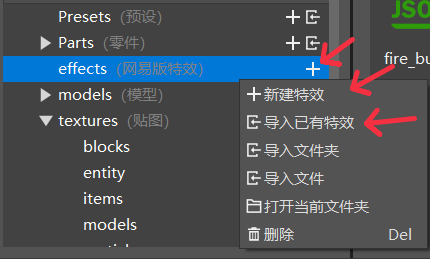
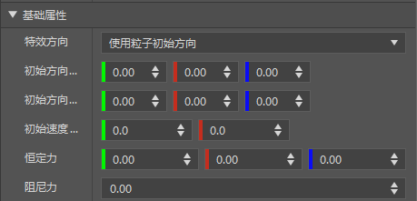
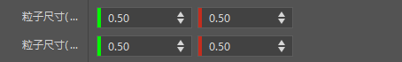
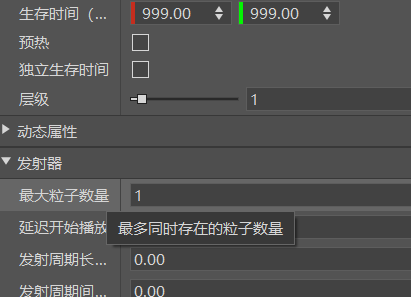
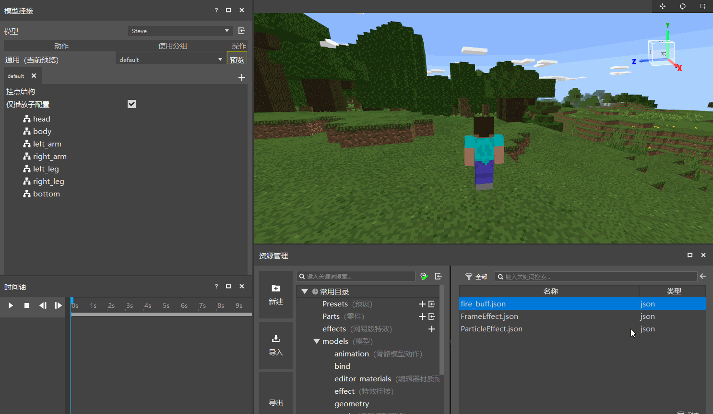
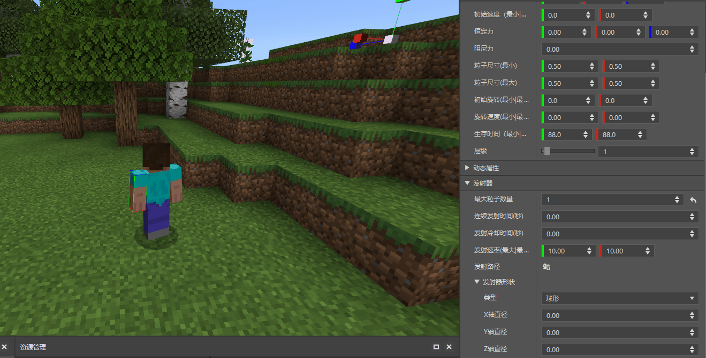
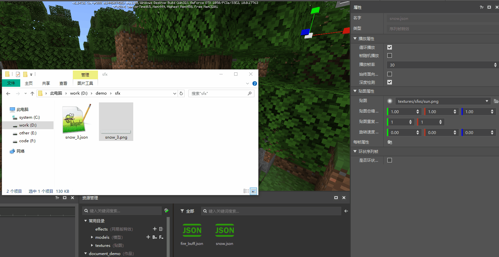
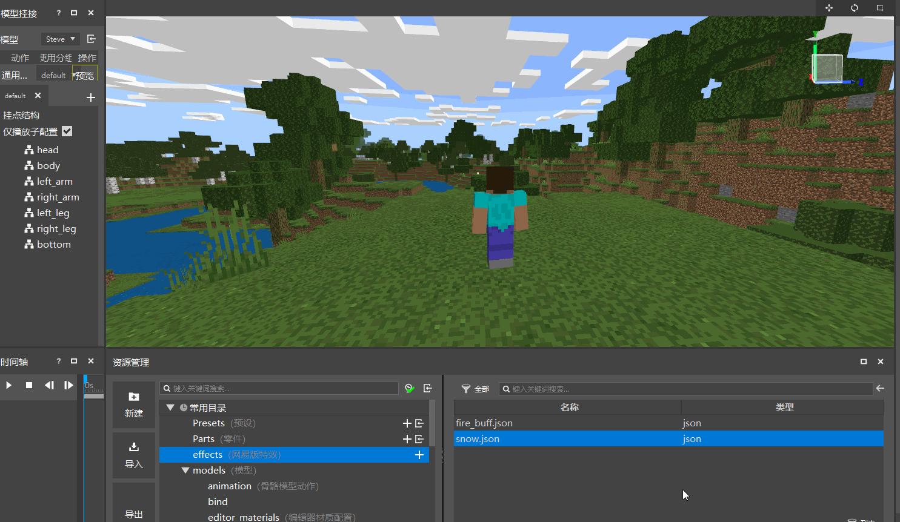
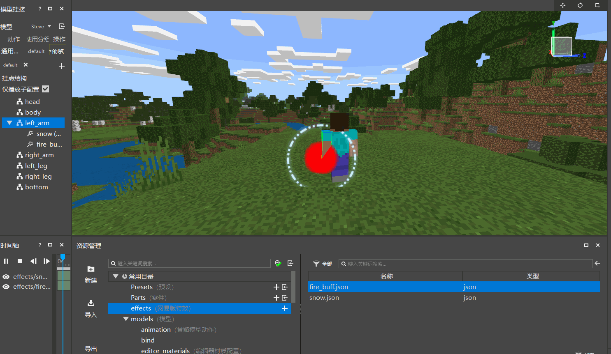

--- 
front: https://mc.res.netease.com/pc/zt/20201109161633/mc-dev/assets/img/effect_show_window.66141b28.png 
hard: Getting Started 
time: 15 minutes 
--- 
# Getting Started Tutorial 02-Special Effects Creation and Use 

This tutorial mainly introduces the following contents: 

1. The difference between particle effects and sequence frame effects. 
2. How to create/import special effects. 
3. Make the first particle effect and sequence frame effect. 

## The difference between particle effects and sequence frame effects 

1. Particle effects generate visual effects by generating a large number of particle images in the scene. Each particle represents a single element in the effect. All particles are combined to form a complete particle effect. 

2. Sequence frame special effects are created by drawing a single-sided texture in the scene and constantly replacing new images on this texture. This process forms a complete sequence frame special effect. 

## Create/Import special effects 

Now that you have understood the basic concepts, let's learn how to create special effects in the special effects editor. 

 

As shown in the figure above, the button  on the right side of the effects folder can create a new special effect. In the right-click menu of the folder, in addition to creating a new special effect, there are also related options for importing special effects. The specific instructions are as follows: 

1. Create a new special effect, which is used to create a default particle special effect or sequence frame special effect. After clicking, select the special effect type first. After selecting, you can modify the properties of the special effect through the property panel to complete the production of the special effect. 

2. Import existing special effects, used to import existing special effects files. Note that the resources corresponding to the imported special effects files must also exist. For example, the particle special effects contain the reference path of the texture file. If the corresponding texture file cannot be found under this path, the import will fail. 
3. Import folder, import the entire folder outside the project 
4. Import file, import a single file outside the project 

All custom special effects are stored in the effects folder. By clicking the special effects file in the resource manager, you can view and modify the corresponding properties in the property panel. For specific property details, please refer to [Special Effect Property Description] (./10-Property Detailed Description.md). 

> Since the special effect properties all support visual editing operations, it is not recommended that developers manually modify the special effect source file to avoid damage to the special effect file. 

## Make a particle special effect 

After understanding the basic functions, you can start to try actual operations. First, let's make a red buff particle effect. The steps are as follows: 

1. Click New Effect , select Particle, and enter the name fire_buff. This will create a file named fire_buff.json in the effects folder of the Resource Manager. Click the file to view the particle properties in the property panel. 

> The effect will be automatically selected after creation, so the property bar will display the relevant properties of the effect. 

2. Under Basic Properties, set Initial Direction (Maximum), Initial Direction (Minimum), and Initial Speed to 0 to create a particle that does not move. 

 

3. Set the particle size (maximum) and particle size (minimum) to 0.5, thus creating a particle with a fixed size of 0.5. 

 

4. Under the emitter, change the maximum number of particles to 1, so that only one particle will appear at the same time, but since the survival time is 1 by default, that is, the particle will be destroyed after 1 second, so the particle will flash once per second. To prevent this, change the particle survival time to 999, so that the particle will be destroyed after a long time. 

 

5. After modifying the particles, you can start to preview the particles. First, drag the fire_buff.json in the effects folder to the hanging point structure under the hanging panel. Here we drag it to the left_arm structure, which is Steve's left arm. After dragging, click to select left_arm in the hanging structure, and then click the play button on the timeline to see the particle effects in the preview window. 

> The hanging effect binding will be introduced in detail in the third section. Here you only need to follow the animation. If you are interested now, you can go to [Model Hanging Effects](./3-Bone Model Hanging Chinese Edition Effects.md) to view more detailed instructions and demonstrations. 

 

However, it is said that a red buff particle should be made, and it is still white now. How should the color be changed? 

As shown in the figure below, expand the dynamic properties in the property panel, click the dynamic color button to modify it. 

 

> When there is no setting, the default color of the particle is white; after clicking the particle color, you can see that the default particle color is changed to a gradient from white to yellow. The horizontal axis represents the percentage of the particle life cycle. Since we changed the particle life cycle to 999, the particle is white when it is generated, gradually turns yellow, and then turns yellow at 999 seconds. 

In order to turn the particle red, just change the color of the entire cycle of the particle to red. After changing it, turn off the dynamic color property setting, click the play of the timeline, and you can see that the particle has turned red. 

In this way, the first particle special effect is successfully made. If you want to know more about particle properties, you can refer to [Special Effect Property Description](./10-Property Detailed Description.md). Next, let's make the first sequence frame special effect. 

## Make a sequence frame effect 

Similarly, select the + sign on the right side of the effects directory, select sequence frame, enter snow in the name bar that pops up and click OK to create a new sequence frame effect named snow. At this time, you will see two files in the effects directory, one of which is the newly created snow.json sequence frame effect, and the other is of course the previously created fire_buff.json. 

After creation, observe the property panel and you will find that the properties of the sequence frame effect are much less than those of the particle effect. This is because the custom sequence frame effect is mainly controlled by sequence frame textures and sequence frame configuration files, so there are fewer properties that can be controlled. 

> What are sequence frame textures (.png) and sequence frame configuration files (.json)? Here is a brief introduction. Sequence frame textures are multiple textures spliced together in a certain pattern and output as a single picture. The pattern of the combination is written in the sequence frame configuration file. For a more detailed analysis, please refer to [Sequence frame configuration file analysis](./21-Sequence frame configuration file analysis.md). 

So for a sequence frame special effect, the sequence frame file (sequence frame texture + sequence frame configuration file) is very important. Here we use the given sequence frame texture file, so how should we import an external sequence frame file? 

The method is also very simple, just drag it from an external folder. As shown in the figure below, drag the snow_3.png file in the demo/sfx folder to the texture in the sequence frame property bar, and you can see that the text of the texture becomes textures/sfxs/snow_3.png. After dragging, the texture of the sequence frame special effect has changed and taken effect. 

 

> When dragging a sequence frame texture, the special effect editor will automatically copy the sequence frame configuration file corresponding to the sequence frame texture. The dragged file is stored in the sfxs folder under the textures directory. 

After the sequence frame special effects are completed by modifying the properties, drag the special effects file to the node corresponding to the attachment structure. After selecting the node, click the play button on the timeline to see the sequence frame special effects. 
 
> The demo resource in the previous section contains a sequence frame file. If you lack the sequence frame sample file, please download [demo resource](https://x19.gdl.netease.com/demo.zip) 

## Finished Effects 

After the above particles and sequence frame special effects are completed and attached, you can see the effect as shown below:

 

We can see that the position of the sequence frame is very strange, and why are the buff particles only produced on the left hand? They should be on both hands. This requires learning how to correctly attach special effects, which will be introduced in detail in the next introductory course. 
