--- 
front: 
hard: Getting Started 
time: minutes 
--- 

# Particle Effects 

This document mainly includes three parts: 

- [Introduction to Particle Attributes](#particleAttr) 

This document introduces each attribute of particles to help readers understand particle json 

- [Particle Effect Specification](#particleRule) 

This document provides constraints on the maximum supported particle effects in the game to ensure that particle effects can run smoothly on most models 

- [Particle Debug Instruction Set](#particleOp) 

In view of the fact that the particle editor cannot be opened externally for the time being, a game instruction set for real-time preview of particles is provided to facilitate debugging of particle effects 

<span id="particleAttr"></span> 
## 1. Particle properties 

The particle effects configuration file is in json format, as shown below: 

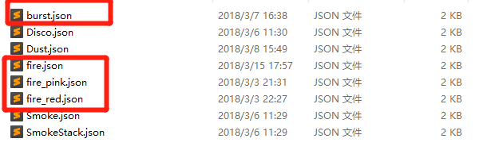 

The particle effects in the client will present different particle effects in real time according to the value changes. The following is an explanation of the particle configuration file json. 

### 1.1 Initial 

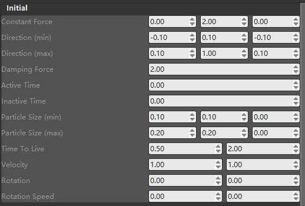 

About particle properties: 

- 3 value boxes, from left to right, correspond to x, y, z, such as Constant Force, Direction, etc. 

- 2 value boxes, from left to right, correspond to the minimum and maximum values 

- **The properties of the particle emitter are not exactly the corresponding values as above, but a random value between the maximum and minimum values** 

As shown in the figure above, Direction has two values marked with min and max, corresponding to the minimum and maximum values respectively 

- **The particles emitted by the particle emitter are actually a rectangular patch in space facing the camera, which is reflected when only x and y are set when setting the size of the particle. ** 

The following briefly introduces the function and examples of each attribute:


#### Constant Force 

The force on the particle is equivalent to the acceleration of the particle during movement 

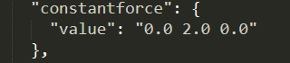 

#### Direction 

The initial direction of the particle emission, which is the difference between min and max 

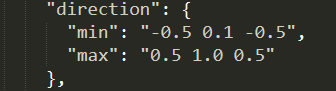 

#### Damping Force 

The resistance is understood as the acceleration in the opposite direction of the particle velocity. The calculation formula for each frame is: 

<center>v = v - damping force * v</center> 
v is the current velocity of the particle, so the damping force actually plays the role of the reverse acceleration factor. 

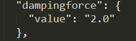 

#### Active Time and Inactive Time 

##### Active Time 

Particle emitter active time 

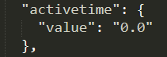 

##### Inactive Time 

Particle emitter cooling time 

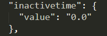 

Active Time and Inactive Time are used together, that is, after each Active Time, the particle emitter cools down the Inactive Time and then continues the cycle 

When using it, you can use Active Time as the life cycle of the emitter to facilitate debugging of time-limited effects. If Active Time is set to 0, the particle emitter will continue to emit without stopping. 

For normal effects, it is recommended not to set these two values, or to set them both to 0. 

These two parameters can be used when a cyclic injection effect is required. 

#### Particle Size 

The size of the particle when it is born. Currently, only the x and y values are valid, and the z value is invalid. It is reserved for the future emission of cubes. 

The size of a terrain block in the game is 1, which is used as a size reference. 


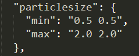 

#### Time To Live 

Particle life cycle, that is, the existence time of each particle 

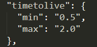 

#### Velocity 

Particle initial velocity 

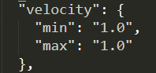 

#### Rotation (discarded, it is recommended to use Rotation Range) 

Particle initial angle, that is, the rotation angle of the particle around the z axis (0~360) 

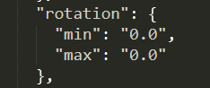 

#### Rotation Speed (discarded, it is recommended to use Rotation Speed Range) 

Particle rotation speed, Rotation per second Speed angle 

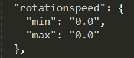 

#### Rotation Range 

The initial rotation angle of the particle, that is, the rotation angle of the particle around the x, y, and z axes at the initial moment (0-360) 

```json 
{ 
"particleeffect": { 
"rotationRange": { 
"max": "90.0 90.0 90.0", 
"min": "0.0 0.0 0.0" 
}, 
... 
} 
} 
``` 

#### Rotation Speed Range 

The rotation speed of the particle, that is, the rotation angle around the x, y, and z axes per second (0-360) 

```json 
{ 
"particleeffect": { 
"rotationSpeedRange": {

"max": "90.0 90.0 90.0", 
"min": "0.0 0.0 0.0" 
}, 
... 
} 
} 
``` 

### 1.2 Variation 

This parameter is related to the deformation of the particle during its life cycle 

- Add: The particle size increases multiples per second, that is, `size = size * (1 + add)`, the default value is 0.0. 

- Multiply: The particle size scales multiples per second, that is, `size = size * multiply`, the default value is 1.0. 

- The calculation formula for particle size per second is: `size = size * multiply * (1 + add)` 

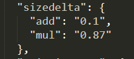 

### 1.3 Color 

#### Color 

Set the particle color in RGBA format 

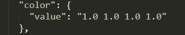 

#### Color Fade 

This parameter is related to the color change during the life cycle of the particle 

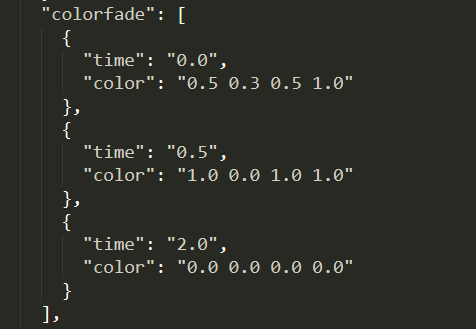 

During the life cycle of the particle, different color keyframes can be set at different time points, and the color of the particle gradually fades to the keyframe. 

As shown in the figure above, the color of the particle at 0.00s is (0.50, 0.30, 0.50, 1.0), at 0.5s the color value is (1.0, 0.0, 1.0, 1.0), and at 2.0s it is (0.0, 0.0, 0.0, 1.0) 

#### Color and Color Fade 

If Color is set, Color Fade cannot be set, and if Color Fade is set, Color cannot be set. The relationship between the two is mutually exclusive 

If neither is set, the color of the texture is read directly 

#### Enable Color and Enable Texture 

In some particle configurations, "enablecolor" and "enabletexture" configuration items will appear, and they can affect the calculation process of particle color: 

- The initial color of the particle is pure white and opaque 
- If Enable Color is enabled, the particle color will be multiplied by the color value configured in Color or Color Fade, otherwise it will be skipped

- If Enable Texture is enabled, the particle color will also be multiplied by the color of the texture, otherwise it will only be multiplied by the transparency of the texture. 

If neither of them is set, 
As long as any configuration in Color or Color Fade exists, Enable Color is enabled and Enable Texture is disabled, and the effect is to use the color specified by the setting; 
If the settings for Color and Color Fade do not exist, Enable Color is disabled and Enable Texture is enabled, and the effect is to directly read the color of the texture. 

### 1.4 Emitter 

This section mainly introduces the parameters related to the emitter 

For performance considerations, a maximum of 3000 particles are emitted per second 

#### Number Of Particles 

The maximum number of particles that can survive at the same time 

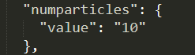 

#### Emitter Size 

The size of the particle emitter, that is, the size of the particle birth space. (0, 0, 0) means that the particles are born from the origin 

Otherwise, the particles are generated from random positions in the defined space 

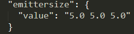 

#### Emission Rate 

Particle emission rate, the higher the value, the higher the emission frequency 

Left is min, right is max 

The figure below can be understood as a minimum of 40 emissions per second and a maximum of 50 emissions per second 

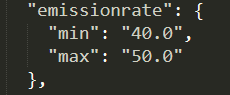 

#### Emission Shape 

Particle emitter shape, currently supports sphere and cube, parameters are "Box" and "Sphere" respectively 

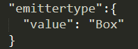 

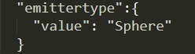 

### 1.5 Resource 

#### Material 

**Invalid, under development. ** 


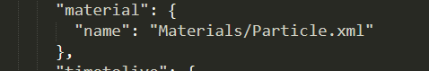 

#### Texture 

Please refer to bb.png and bb.json in the demo for reading 

- "name" is the particle texture path, the path starts from textures, no suffix is ​​required 

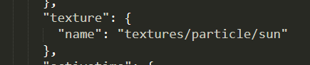 

​ If you want to add a new texture, you need to place the png (must be png) file in the particle path 

- "ani" is the particle sequence frame 
- "name" in "ani" is the json configuration file path of the sequence frame, starting from textures, no suffix is ​​required 
- "fps" in "ani" is the sequence frame playback frame rate (note that the number must be quoted), the minimum value is 0, and the default value is 30 
- "shuffle" in "ani" is whether the sequence frames are played in random order (starting from the first frame), and the default value is false (note that there are no quotes; it is not configured in the figure, so the default value is used) 

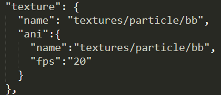 

In the figure above, the "name" of "texture" corresponds to `textures/particle/bb`, which is the sequence frame texture bb.png, and the "name" of "ani" corresponds to `textures/particle/bb`, which is the sequence frame json configuration file bb.json 

[Sequence frame packaging method](./21-Sequence frame configuration file analysis.md#TexturePacker) is introduced in the sequence frame document 

### 1.6 Render 

#### Blend Mode 

Blending mode, it is recommended that developers try it more 

- "add" and the background color are superimposed 

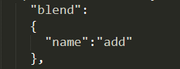 

- "blend" and background color are overlaid 

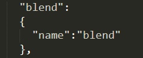 

#### Face Camera Mode 

Available modes: 

- Rotate XYZ 

Particles always face the camera, suitable for square patches 

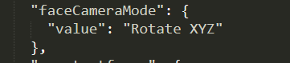 

- Direction 

The particle Y axis faces the direction of particle movement, suitable for linear diffusion effect


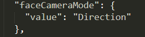 

As shown in the figure below, the particle is actually a rectangular patch with x = 0.2, y = 2.0, and the face Camera Mode is Direction: 

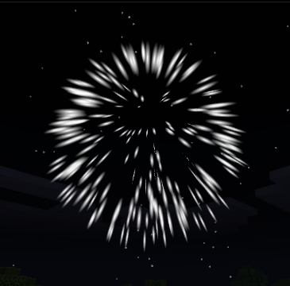 

It is recommended that developers try to change the parameters in burst.json. Observing the effect can help understand 

#### Loop 

Whether the color or texture sequence frame is looped. When the particle life cycle is greater than the duration of the Color Fade or sequence frame, the loop mode can be entered 

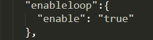 

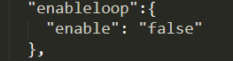 

<span id="particleRule"></span> 
## 2. Particle effect specifications 

- The size of a single particle map should not exceed 32 * 32. The particle sequence frame map refers to the sequence frame specification. 

- Small-scale particles 

Particle Num <= 30, Particle Emitter Num <= 200 

- Medium-scale particles 

Particle Num <= 100, Particle Emitter Num <= 50 

- Large-scale particles 

Particle Num <= 1000, Particle Emitter Num <= 5 

<span id="particleOp"></span> 
## 3. Particle debugging instruction set 

### 3.1 Instruction set 

#### //crp \<name> 

Create a particle effect in front of the player. name is the name of the particle configuration file, excluding the ".json" suffix 

#### ///rep <> 

Reload the particle effect, no parameters


#### //rmp <> 

Remove all particle effects in the game, no parameters 

### 3.2 Usage examples 

//crp fire 

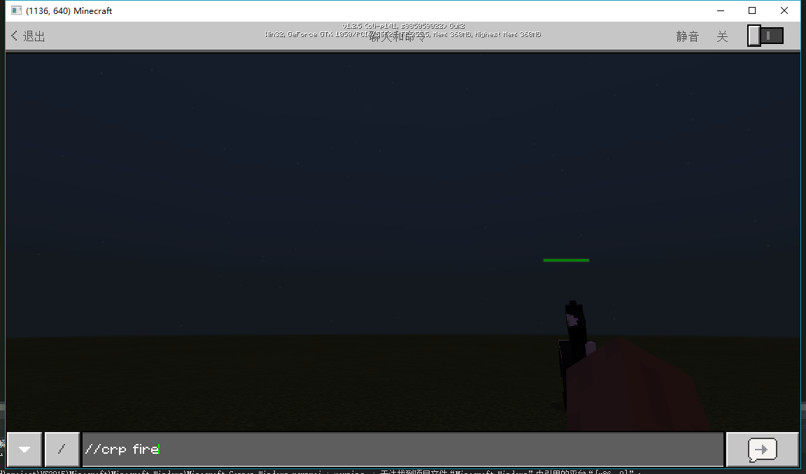 

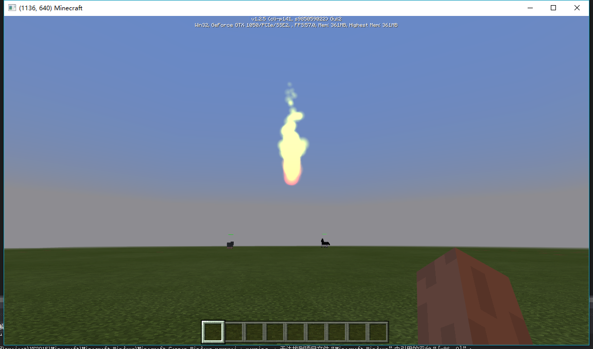 

//rmp 

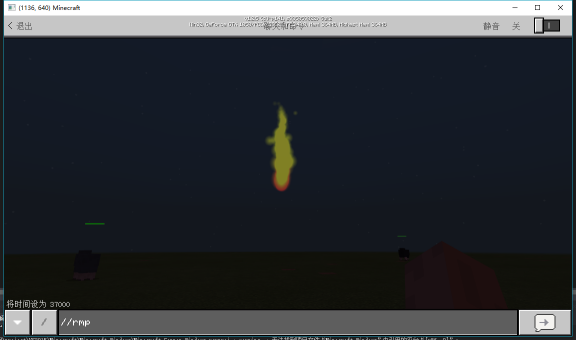 

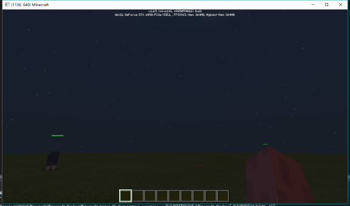 

//rep 

When loading a mod, the corresponding mod resources will be copied to the following directory 

```%AppData%\MinecraftPE_Netease\games\com.netease\resource_packs``` 

To dynamically modify the particle effect, you need to modify the corresponding particle special effect configuration file in the mod of the same name under this directory, and then use the `//rep` command. 

The following figure is the folder where fire.json is located 

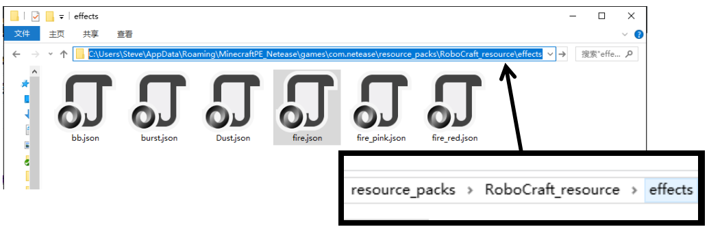 

The original configuration and performance of fire.json are as follows: 

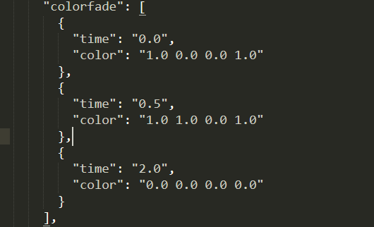 

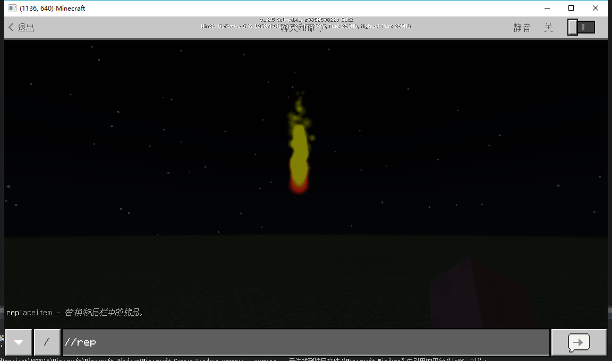 

After modifying the parameters in fire.json as shown below, enter the `//rep` command in the game, and you can see that the particle effect has changed: 

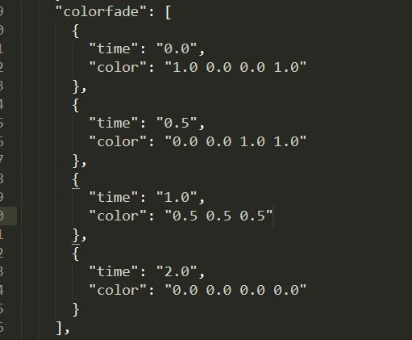 

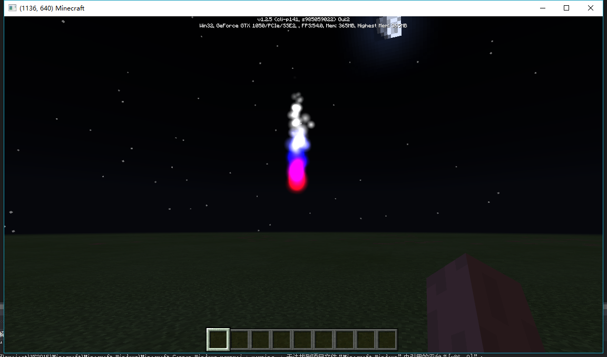 

## 4. To developers


The particle effect is very flexible. If you are familiar with the various parameters, you can create very colorful effects. 

At the same time, developers must not forget to comply with the particle effect specifications. After all, the performance of the game is limited. 

