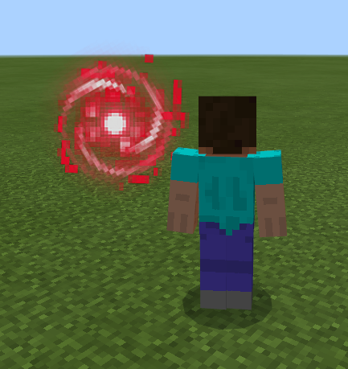
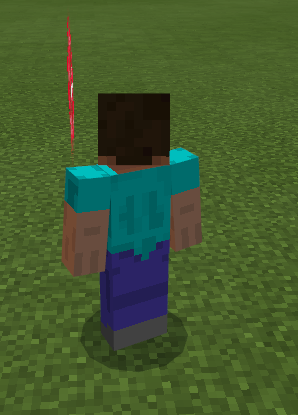
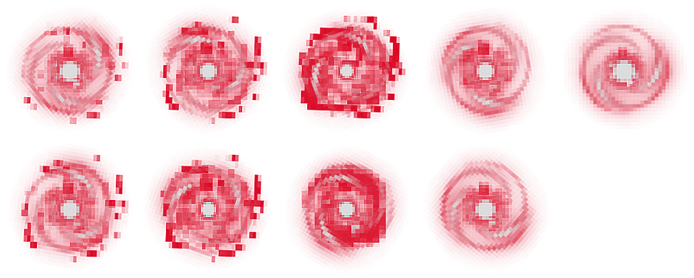
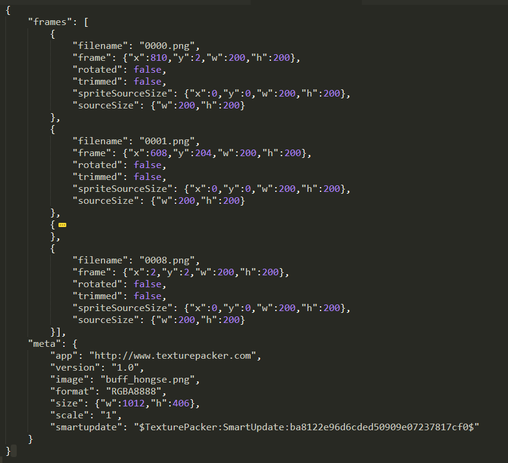
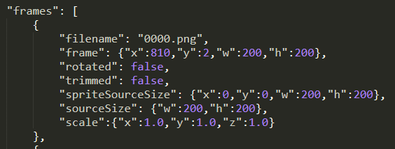
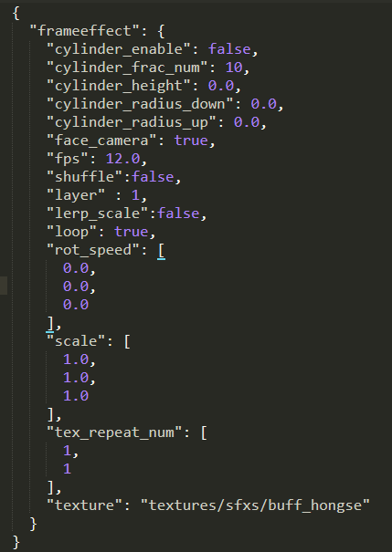
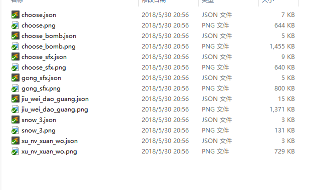
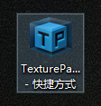
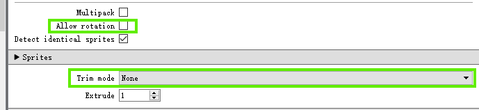

--- 
front: 
hard: Getting Started 
time: minutes 
--- 

# Analysis of Sequence Frame Configuration File 

## 1. Introduction to Sequence Frame 

Minecraft provides special effects of the sequence frame type. The sequence frame is essentially a single-sided texture. If it is not set to always face the camera, it can be seen as a single face when the viewing angle is on the side of the sequence frame. 

 
 

When the texture of the sequence frame changes continuously, a visual animation effect can be formed, so it can be used to achieve sequence frame animation special effects. In the game, it is generally necessary to combine all the textures of a single special effect into a large picture. The special effect mentioned above contains 9 textures. The 9 pictures are combined using the texture packer as shown below: 

 

## 2. Sequence frame json parameter description 

Sequence frame animation mainly contains a json file and a texture, both of which are generated by Texture Packer 

The content of the json file is as follows: 

 

It contains two fields, frames and meta: 

- **"frames"** indicates the texture information of each frame of animation 

- **"meta"** field contains information related to the image combining software 

Developers basically do not need to pay attention to this file. In the frames field, you can manually add the field **"scale"** , which means to scale the frame. If not specified, the default is 1x scaling, that is: 

 

In addition, the scaling function supports interpolation, that is, a smooth transition will be made when the size multiples are different between different frames. If you need to turn off the interpolation, you need to turn off the interpolation switch (the [**"lerp_scale"**](#lerpScale) field mentioned below) 

If you use an editor to generate a sequence frame animation, there will be an additional json corresponding to the editor on this basis, as shown in the following figure: 

 

Among them, the configuration starting with cylinder is the function of the circular sequence frame: 

- **"cylinder_enable"** indicates whether it is a circular sequence frame 

- **"cylinder_frac_num"** indicates the number of approximate polygons, that is, the ring body is composed of several polygons 

- **"cylinder_height"** Indicates the frame height of a circular sequence

- **"cylinder_radius_down"** and **"cylinder_radius_up"** indicate the bottom and top ring radius 
- **"face_camera"** indicates whether the frame animation is always facing the camera 
- **"fps"** indicates the frame rate of the frame animation, that is, how many frames of animation are played per second 
- **"shuffle"** indicates whether to enable random playback of frame animation 
- **"layer"** indicates setting the rendering layer, the default setting is 1, the setting range is 0-15, and the layer 1 means that the rendering layer function is not enabled. After enabling, the rendering layer with a higher level will block the lower level, and the special effects of the same level will have an occlusion relationship according to the position 
-  **"lerp_scale"**  indicates whether to enable interpolation between frames 
- **"loop"** indicates whether the frame animation is looped 
- **"rot_speed"** indicates the rotation speed of the frame animation 
- **"scale"** indicates the overall scale of the frame animation 
- **"tex_repeat_num"** indicates the number of special effects repeated in both the x-axis and y-axis directions 
- **"texture"** is the specific json special effect path generated by texture packer 

## 3. Sequence frame texture generation guide 

Sequence frame texture resources need to be generated using Texture Packer. The packaging format is shown below [Texture Packer usage configuration](#TexturePacker) 

Texture Packer exports large images and json files and places them under `textures/picture/sfxs` 

As shown in the figure below, the only difference between sequence frame textures and ordinary textures is that there is an additional json file with the same file name. Both the texture and json file are exported by Texture Packer 

 

 
## 4. Texture Packer usage configuration 

 

Texture Packer is mainly used to pack sequence frame files. The configurations that need to be noted are as follows: 

 

- Do not check Allow rotation 

- Select Trim mode as None 

In this way, each small image in the exported large image is the same size. **Currently, our sequence frame drawing only supports sub-images of the same size** 

## 5. Sequence frame texture specifications 

- Texture format is png 

- The size of a single texture does not exceed 512 * 512 

- The total number of pixels does not exceed 512 * 512 * 5