--- 
front: https://mc.res.netease.com/pc/zt/20201109161633/mc-dev/assets/img/create_binding04.b0b4c3e6.png 
hard: Getting Started 
time: 15 minutes 
--- 
# Getting Started Tutorial 03-Bone Model Attachment Chinese Special Effects 

This tutorial mainly introduces the following contents: 

1. Attachment panel description. 

2. How to attach Chinese special effects to the bone model. 

## Attachment panel description 
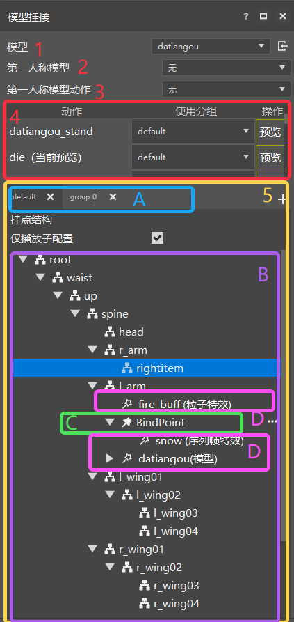 

The above picture is the model attachment panel in the special effect editor. The description of each parameter is as follows: 

1. Model: used to display and modify the name of the current attached model. 

2. First-person model: used to display and modify the first-person model of the current attached model. For specific usage, please refer to [First-person Model Modification](./5-First-person Model Modification.md) 
3. First-person Model Action: Used to display and modify the model action played in the first-person perspective of the currently mounted model 
4. Action List: Used to display, modify and preview the skeletal animation of the currently mounted model, and provide a separate group selection drop-down box for each action. Developers can choose to use different groups for each action here. Double-clicking an action or clicking the preview button on the right can switch the action previewed in the current game window, as shown in the figure below. 

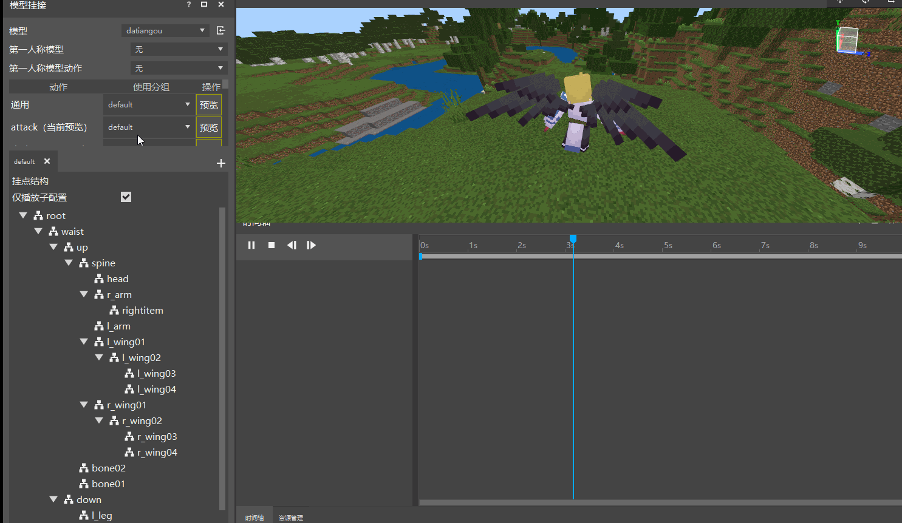 

In addition, the special effects editor adds an empty animation "General" to each model by default. Under "General", the model will not play any animation. 

> Steve is not a skeletal model, so there is no skeletal animation. 

5. Hanging point list: The part in the yellow box in the figure is the hanging point list, which is used to display and manage the current bone nodes and special effect hanging structure of the skeletal model. The attachment list includes attachment groups, attachment structures, attachment points and attachment resources (as shown in the figure ABCD). 

- A-Attachment group: stores a series of attachment information. By creating multiple different groups, you can effectively manage the attachment information of the same model in different states. The current attachment group is mainly used for the action list in point 4. You can select the attachment information under different groups for each action to achieve the function of switching special effects. 

> Operation button:  on the right side of the point group can add a new point group, and the X on the right side of each group can delete the current point (the default group can only clear the attachment information and cannot be deleted) 

- B-Point structure: Display the skeleton/component structure of the current attached model and the corresponding attachment resource information in real time through a list or tree structure 
- C-Attachment point: A type of attachment resource information, used to attach special effect resources, etc., that is, the special effect information of the model attachment is stored in the attachment point, each model has a different attachment position, and the attachment point can adjust the position of its own attachment effect. 
- D-Attachment resource: Particle special effects, sequence frame special effects, bone models and other resources that we need to attach to the current model. It can be directly attached to the bone model, component (model cannot be attached) or attachment point. 
- Quick operation: Right-click any node in the hanging point list to trigger quick operation. The quick operations supported for different types of nodes are as follows 
> Skeleton node: Create a new hanging point, bind model, copy group (hanging point information), paste group (hanging point information), copy (current node hanging point information), paste (special effect information of the current clipboard), paste information (current node hanging point information) 

> Component node: Create a new hanging point, copy group (hanging point information), paste group (hanging point information), copy (current node hanging point information), paste (special effect information of the current clipboard), paste information (current node hanging point information) 

> Hanging point node: Delete, rename, copy group (hanging point information), paste group (hanging point information), copy (current node), paste information (current node hanging point information) paste (node), create a copy 

> Special effect resource node (particle, sequence frame, model): delete, copy group (hanging point information), paste group (hanging point information), copy (current node) 

The above are the parameters of the mounting panel. Now let's use them. 

## Model mounting special effects 

After the previous two introductory tutorials, the resources in the archive are: a skeleton model dataiangou and the corresponding skeleton animation, two special effect files: fire_buff.json red particle special effect and snow.json blue snowflake circle special effect. After confirming these resources, you can officially start special effect mounting. 

> If there is no model, it does not matter. You can use the default Steve, but you cannot play other actions. 

1. First click on the mounting model and switch Steve to datiangou. You can see that the character has become a Datiangou model. Then find the action run, double-click or click the preview on the right, and then click the play button on the timeline to see the running action. 

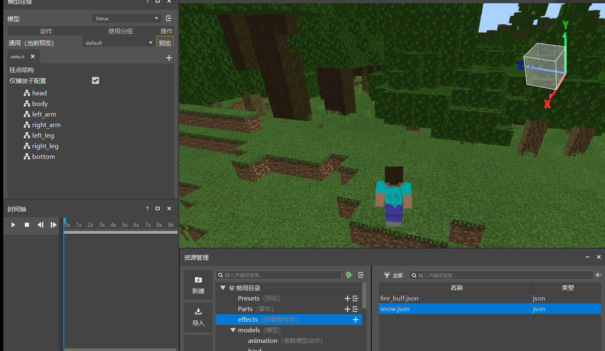 

2. Create a binding group, click the New Binding Group button , enter buff, and then create a buff group. Then select l_arm in the binding point structure in the group, right-click and select new binding points fire01 and fire02, as shown in the figure: 

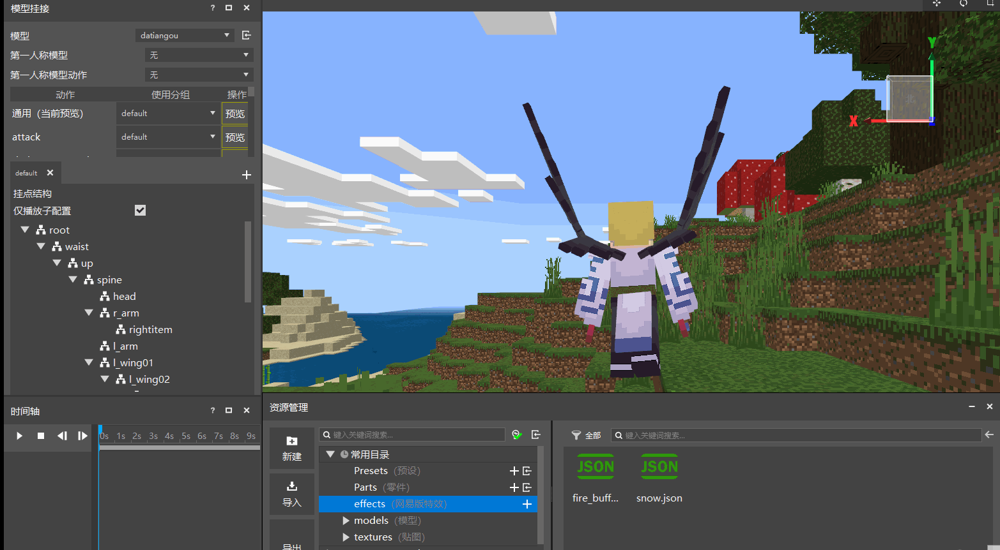 
> Note: The specific binding position of the model is determined by the model itself 

3. Click the Resource Manager, drag the fire_buff.json into the fire01 binding point, click the play timeline, and you can see the red buff effect on the left shoulder of the model 

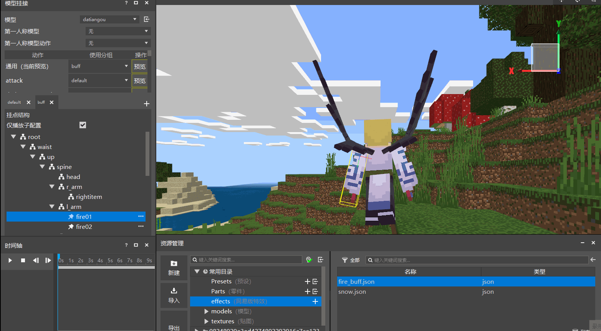 

4. Click the binding point fire02, and fire02 Change the attachment position to the right arm of Daitengu (r_arm). Similarly, drag fire_buff.json into the included special effects, and you can see the effect as follows: 

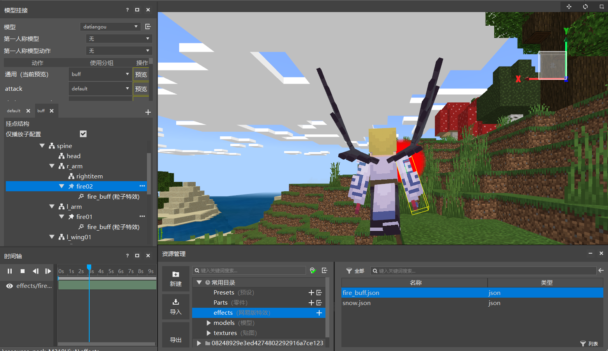 

5. After modifying fire02, why is it that only the right shoulder is playing even though the particle special effects have been attached to both the left and right shoulders? Here, you can modify the playback effect from two aspects: 

- Modify from the attachment point structure. When clicking a certain attachment point, only the included special effects of the attachment point will be displayed, so we only need to click the root node attachment group to display all. As shown in the figure: 

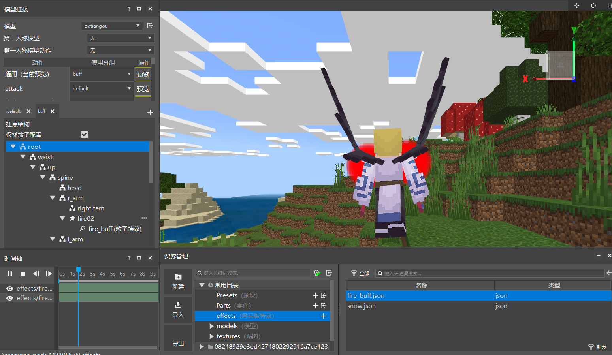 
- Uncheck the option to play only sub-configurations: After unchecking, all special effects under the current attached model group will be played, which is the same as the effect of selecting the root node, as shown in the figure 
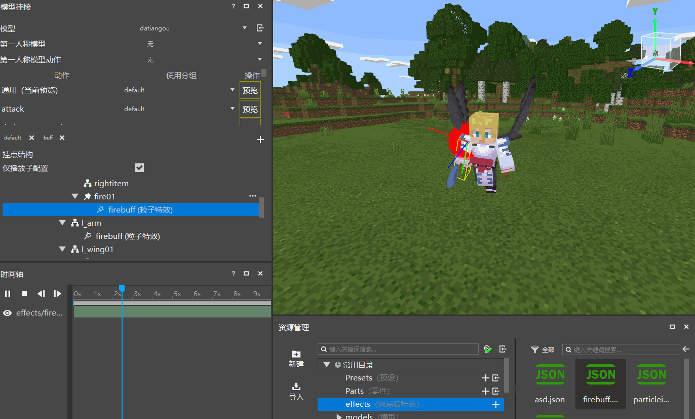 
- Modify from the timeline (not recommended). The timeline contains the display switch of the special effect, which is the special effect display state  and the special effect off state . Click  in front of fire_buff.json to turn on the display of the special effect, as shown in the figure: 

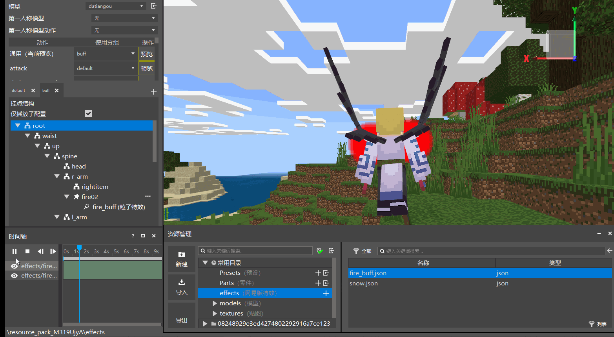 

After attaching the particle special effect, the next step is to attach the sequence frame special effect. Since the sequence frame special effect is an aperture, it is expected to be attached to two positions: one is behind the character and the other is on the top of the character's head. The steps are as follows: 

6. Create a new snow01 attachment point and select the attachment position as spine. You can see that the sequence frame special effect is right on the character. If you feel that it is not clear, you can click Preview Settings and select the separation of the protagonist and the camera, so that you can view the character 360°.

 

7. If you want to mount the sequence frame special effects behind the character, you need to adjust the position of the special effects. Here you need to use the displacement function in the mounting panel. Note that displacement is only available when the model is a skeleton model and is selected as a mounting point (if it is the default Steve, the displacement function cannot be used). There are two ways to adjust the displacement: 

- The first is to use visual adjustment. Click the move button in the upper left toolbar directly, and use the pop-up coordinate handle in the game interface to adjust the position: 

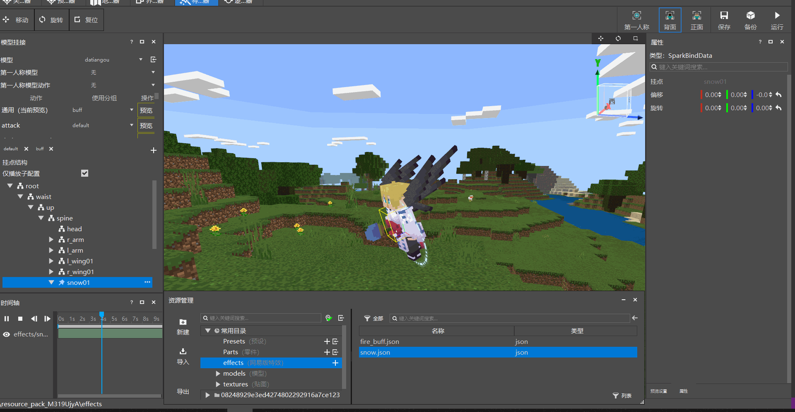 

> After clicking the button 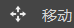, the axes in the x, y, and z directions will appear. Drag along the axis to drag the position of the special effect. 

- The second method is to directly enter the corresponding displacement in the displacement of the property panel of the attachment point, that is, change the displacement to 0, 0, -0.5 to see the effect 

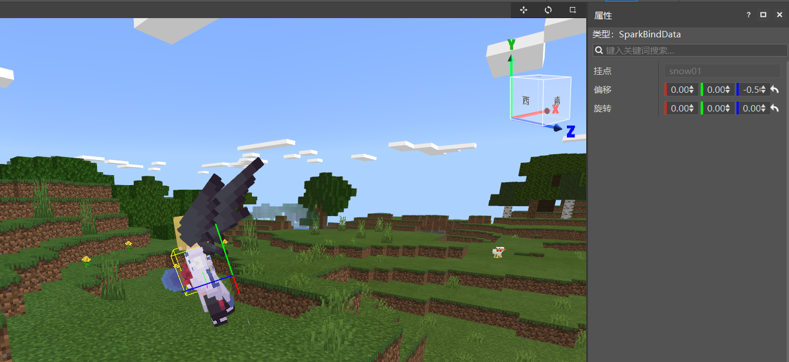 

8. After the sequence frame special effects behind are attached, you can start to attach the sequence frame special effects on the top. Create a new snow02 attachment point and select the camera position as head. Here, you need to adjust not only the displacement, but also the rotation so that the sequence frame special effects can be horizontal to the top of the character's head. The rotation adjustment has two ways, just like the displacement, and can also be adjusted in a visual way, as shown in the figure: 

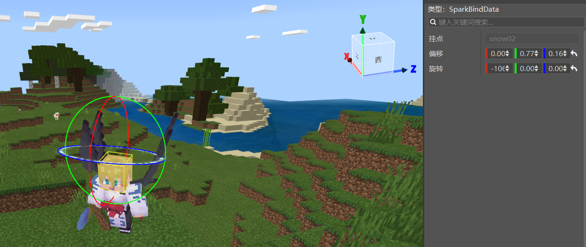 

Finally, click the root node to view the effects of all special effects as follows: 

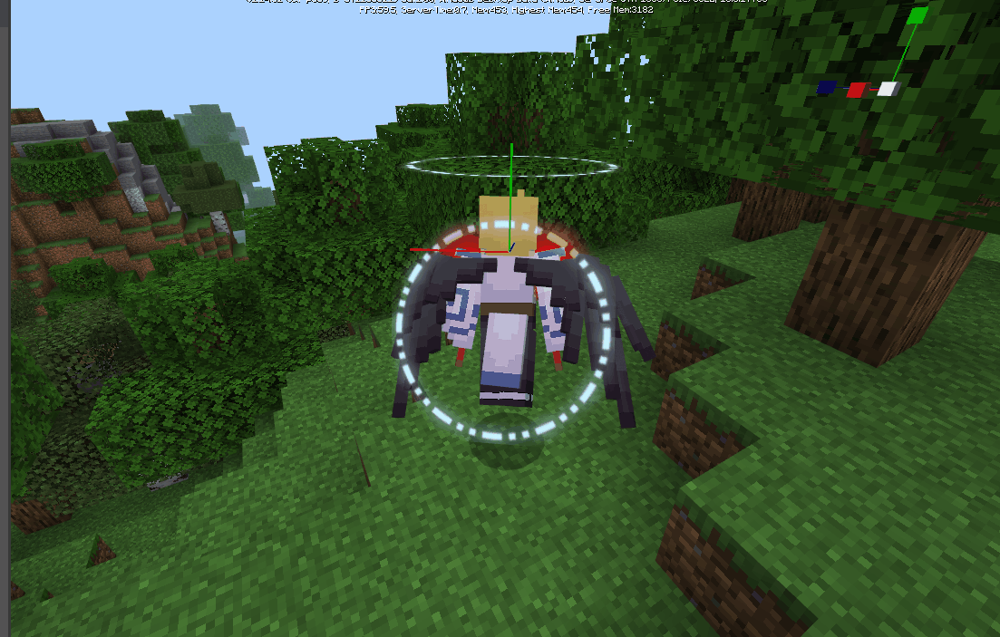 

Finally, it is obvious that it is not perfect. The sequence frame special effects on the top of the head are too large, so how to make it smaller? This is an after-class exercise for everyone who views the tutorial to try hard. 
