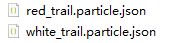
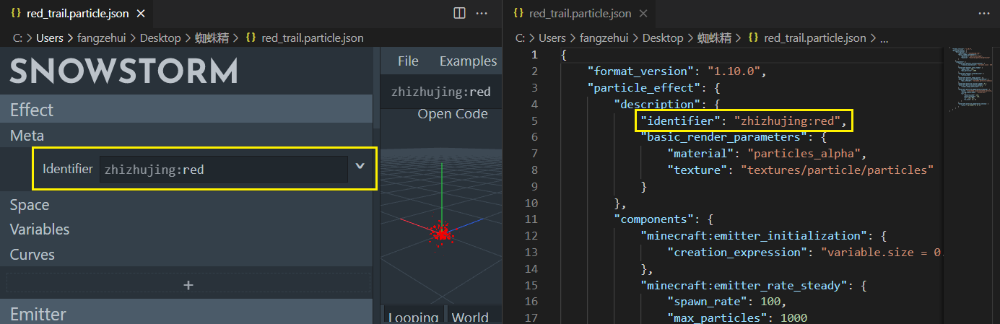
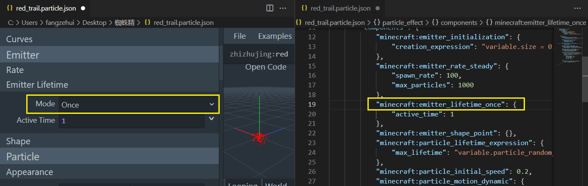
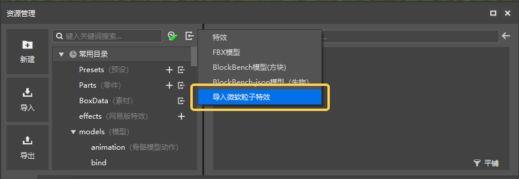
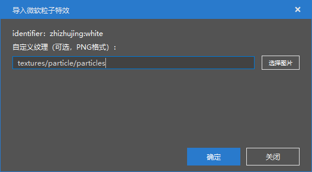
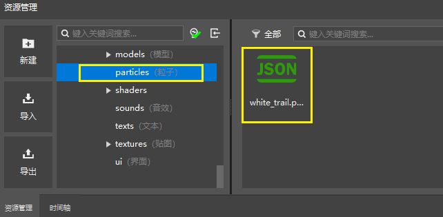
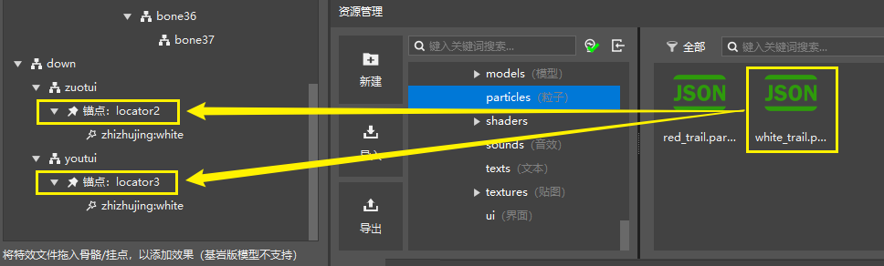
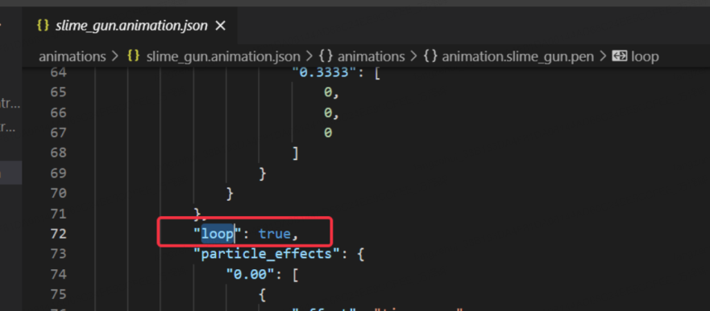

--- 
front: 
hard: Getting Started 
time: 15 minutes 
--- 

# Attaching Microsoft Particle Effects to the Original Model 

## Preparation before resource import 

Usually we will directly edit the json file or use Snowstorm to edit the Microsoft Particle Effects. After editing, we will export it into a file with the suffix [.particle.json]. For example, we have prepared two Microsoft Particle Effects files below: 

 

> 【Note】 
> 1. When importing Microsoft Particle Effects, be sure to note that the identifier of the effect file cannot be the same as the existing effect, otherwise the imported effect will directly overwrite the previously imported effect. 
>  
> 
> 2. There is an item [**Emitter Lifetime**] in the Microsoft Particle Effects configuration file, which is used to control whether the particle effect is played once or in a loop. If looping is selected and bound to an entity action, it will continue to exist at the hanging point after the entity performs the action and will not disappear automatically. In addition, high-frequency repetitive actions such as walking, running, and attacking will repeatedly produce looping particle effects, causing serious stuttering problems. Therefore, if you want the special effect to disappear after the action is played instead of staying continuously, you need to select **one** instead of **looping** for **Emitter Lifetime**. 
>  

## Microsoft Particle Effect Import Editor 

Click the resource import button in the upper left corner of the resource manager, and we can select [Import Microsoft Particle Effects] in the drop-down list. 

 

Select the previously saved white_trail.particle.json, and the following window will pop up. Here we can select the texture of the special effect. The default here is the native texture. We can click the [Select Image] button to change it to other texture resources. After clicking [Confirm], the special effects are imported successfully. We can find the Microsoft particle special effects file just imported in the particles folder of the resource package. 
In the same way, we can import the red_trail.particle.json particle. 

 

 

## Attach the Microsoft particle special effects to the original model anchor point 

Just as we attached the Chinese version of the special effects to the bone model anchor point, we can directly drag the Microsoft particle special effects resource in the resource manager to the [Anchor Point] in the model attachment panel on the left. 

> [Note] 
> 1. Currently, it is not supported to directly add or adjust the anchor points of the original model in the editor. If you need to modify it, you need to adjust it in Blockbench or the model json file before importing it. 
> 2. The special effects used in different actions need to be attached separately. Adjusting the special effects attachment of one action will not affect the special effects of other actions. 

Here, we attach the white_trail particles to the two footstep anchor points of the model under the xingzou action. 

 

Then we switch to the [Timeline] panel and click the [Play] button to view the effect of the particles after attachment in the preview window. 

 

Now, we switch to another action gongji and attach the red_trail particle to the 8 anchor points on the back of the model so that it can display the red attack effect when the attack action is played. Then we play different actions to see different Microsoft particle effects. 

 

## FAQ 

1. If the action duration of the bb model attached to the Microsoft particle effect is 0, the particle may be emitted multiple times in the editor. 
2. If the action duration of the bb model is not 0, but the particle is still played twice when the action is played, please check whether there is a "loop" field in the attached action json file. If it exists, delete it. 

 
