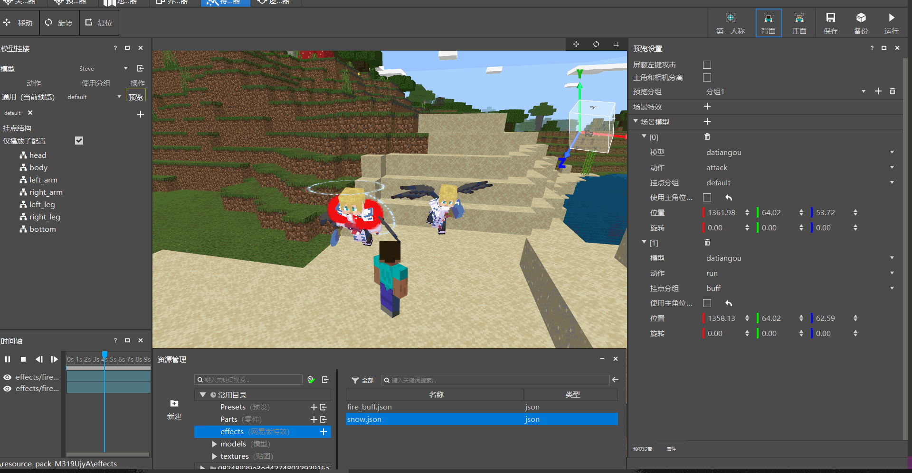

--- 
front: https://mc.res.netease.com/pc/zt/20201109161633/mc-dev/assets/img/demo_preview_model.ebc22c77.gif 
hard: Getting Started 
time: 5 minutes 
--- 

# Getting Started Tutorial 04-Preview Function 

This tutorial mainly introduces the following contents: 

1. Preview panel function. 

2. Use the preview panel to preview models and special effects. 

## Preview panel function 

The default preview panel is shown in the figure: 

 

Special effect model preview is used to quickly preview the specified model and the special effects attached to it. Not only that, other models and special effects can also be added to the scene. 

The various parameters are explained as follows: 
- **Shield left button attack**: Used to switch whether to shield Steve's left button attack action.
- **Separation of the main character and the camera**, used to switch whether the camera can view the model in 360°. The default game perspective can only view the front or back of the main character, and the perspective is fixed. By turning on the perspective separation, you can view the model more conveniently. 

 

- **Preview Group**: Save and manage a series of settings for preview settings and the attachment information of special effect models. By switching groups, you can quickly switch to preview scene special effects and models with multiple configurations. 

- **Scene Model**, used to batch display any model in the scene, its configuration items are as follows: 

 

- Model: used to select the model to be displayed (only supports skeleton models). 

- Action: Skeleton animation played when the model is previewed. 

- Attachment Group: Select the attachment group of special effects when previewing the model. 

- Use protagonist position: If checked, the current protagonist position will be used by default. If unchecked, the model can be placed in the specified coordinates. 

- Rotation: used to modify the rotation angle of the model. 

- **Scene special effects**: used to display custom special effects anywhere in the scene. The configuration items are as follows: 
- 
 
- Special effects: used to select the special effects to be played. Only NetEase custom special effects located in the effects folder are supported. 

- Use protagonist position: If checked, the current protagonist position will be used by default. If unchecked, the special effects can be placed in the specified coordinates.

- Rotation: used to modify the rotation angle of the special effect. 

## Preview Model and Special Effects 

After understanding the above preview functions, you can directly add models and special effects to the scene. First, add special effects. Click the + sign on the scene special effect, select the existing fire_buff.json, click Play, and you can see the special effects being rendered in the scene. 

> For the convenience of display, the model is changed to Steve without any special effects. 

As shown in the figure, the demo preview scene special effect: 

 

As shown in the figure, the demo preview scene model: 

 

The preview function is relatively simple overall, mainly to allow players to preview multiple models and multiple special effects more conveniently. 
