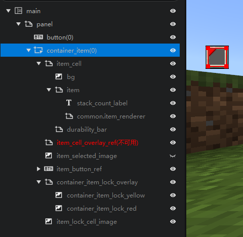
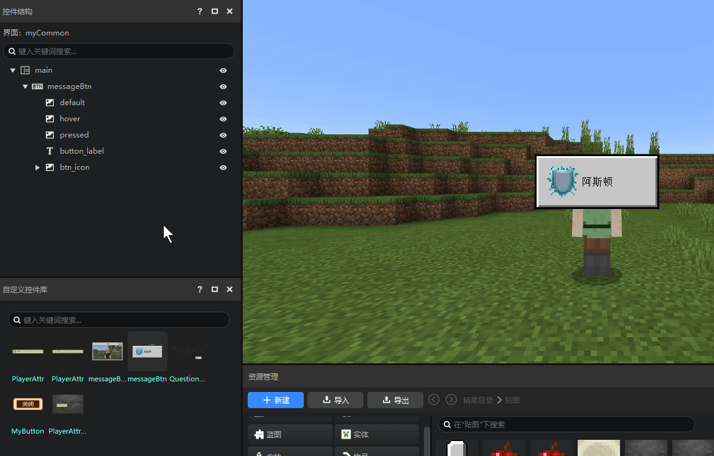
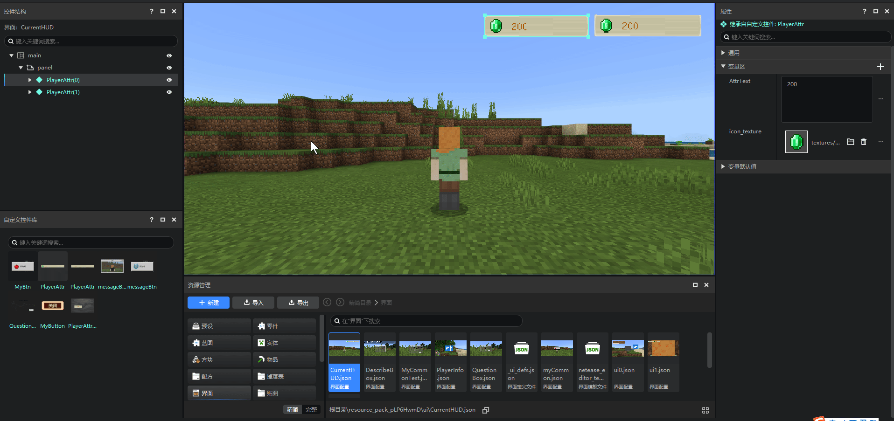
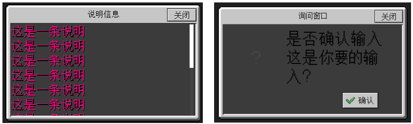

--- 
front: https://mc.res.netease.com/pc/zt/20201109161633/mc-dev/assets/img/ui_image004.29b265a4.png 
hard: Getting Started 
time: 10 minutes 
--- 
# Interface Editor Revision Notes 
Revision time: 2022.5.10 
If you have not used the interface editor heavily before, you can skip this document and start reading directly from [Interface Editor Instructions](./1-Interface Editor Instructions.md). 
The main changes to the interface editor this time are: 
1. Improved parsing ability and compatibility of interface files 
Almost all legal interface Json files can be parsed, and there will no longer be a situation where they are overwritten because they do not conform to the default writing method of the editor. You can safely import handwritten interface Json files for use. 

Even if the interface file is illegal, or there are some rare but correct writing methods, the editor will show it as a broken control instead of trying to automatically modify your interface file. 

And the special writing methods such as inheritance, variables, attribute references, and control references in the interface Json are accurately reflected in the revised interface editor. 

 

2. All inherited controls can be expanded in the editor to display the complete control structure 

For example, the figure below is the "switch" control built into the editor. You can now expand this control and learn its structure. 

> If you don't know enough about the original interface Json of Minecraft, you don't need to use this function for the time being. It is recommended to read the documents in order for further learning. 

 

3. Remove the two resource management windows for interface files and images and replace them with a general resource manager. 

The resource manager has also been greatly optimized compared to previous versions. For details, see [New Resource Manager](../15-Resource Management/2.5-Resource Manager (New Version).md). Now the simplified mode function of the resource manager has covered the two resource management windows of the old version. 

- Create a new interface file through "New" 
- View and open interface files in the interface tab of the simplified mode 
- View all stickers in the sticker of the simplified mode 

The interface files in the resource manager now support screenshots. 

For details, please see [Interface Editor Instructions](./1-Interface Editor Instructions.md#Create a new interface file) 

4. Remove the old version of the inherited control function and change it to "inherit original control" 

The old version of the inherited control function has a wide range of usage scenarios, but it is not very useful in every usage scenario. The newly added "inherit original control" function focuses on adding controls inherited from the original control to the control structure of the currently edited interface file. For details, see [Add Native Control](./18-Add Native Control.md). The controls added in this way can also be expanded. The following figure is the native item container. 

"Inherit Original Control" still contains all the functions of the old version of the inherited control, but we recommend that you use the new functions we have introduced below for requirements other than "Inherit Original Control". 

 

5. Added custom control function 

If you want to reuse your own controls in an inherited way, you can use the new custom control function. You can add a control (and sub-controls) to the control library. All custom controls will be displayed in the custom control library. 

You can reuse your custom controls from the control library by simply dragging and dropping. Custom controls are displayed in cyan in the control structure. See [Inheritance and Custom Controls](./13-Inheritance and Custom Controls.md) for details. 

 

6. Added variable and attribute reference functions 

As the control level increases and the number of custom controls increases, the interface will become more and more complex, and custom controls (inherited controls) cannot modify the properties of sub-controls when used. 

We often need to modify the property values of other controls in a certain control. This writing method supported in the interface Json of Minecraft is now also supported in the editor, that is, the attribute reference function. 

For example, the following two controls are actually from the same custom control, and they are modified to different appearances through attribute reference. 

 

The control property panel has a new variable area, and all variables in it can be added/managed through the interface editor. If your interface Json contains such a writing method, it can now be correctly parsed into the property panel. For details, see [Property Variable Reference](./15-Variable Reference and Universal Control.md#Property Variable Reference). 

The properties of many controls that come with the old version of the editor are actually implemented through property references. Now they are also uniformly parsed into the variable area. The figure below is the variable area of the button. 

 

7. Added control reference 

Control reference is actually an old friend of everyone. The scroll content property of the "Scroll List" control that comes with the editor is the control reference. In addition, the content of the "Grid" control is also a control reference. 

Now the control reference will provide a drop-down box, and the selectable range is changed to all custom controls (all displayed in the custom control library), no longer "controls under other canvases". 

 

Now you can create your own universal control reference in the editor to achieve an effect similar to the figure below. The two pop-up controls in the figure below actually inherit from the same custom control. The content of the pop-up is opened as a variable in the form of a universal control reference, which is very similar to the "Scrolling Content" property above. You only need to specify different custom controls in this property, and different content can be displayed in the pop-up window. For details, see [Control Reference and Universal Control](./15-Variable Reference and Universal Control.md#Control Reference and Universal Control).

 

8. Modification of base class canvas function 

The original base class canvas function does not work properly, and we have optimized this function. Now you can directly select the base class canvas when creating a canvas. For details, see [Special Screen Adaptation and Base Class Canvas](./20-Interface Adaptation Preview and Method.md#Special Screen Adaptation and Base Class Canvas). 

 
