--- 
front: https://mc.res.netease.com/pc/zt/20201109161633/mc-dev/assets/img/ui_image004.29b265a4.png 
hard: Getting Started 
time: 10 minutes 
selection: true 
--- 
# Getting Started with the Interface Editor 

## Basic Introduction 

The Interface Editor is used to visually edit the interface in the game "Minecraft". 

After entering the editor, if the interface editor is not currently displayed, you need to click "Interface" in the top tab to switch. As shown below: 

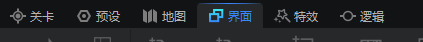 

The interface of the interface editor is as follows: 

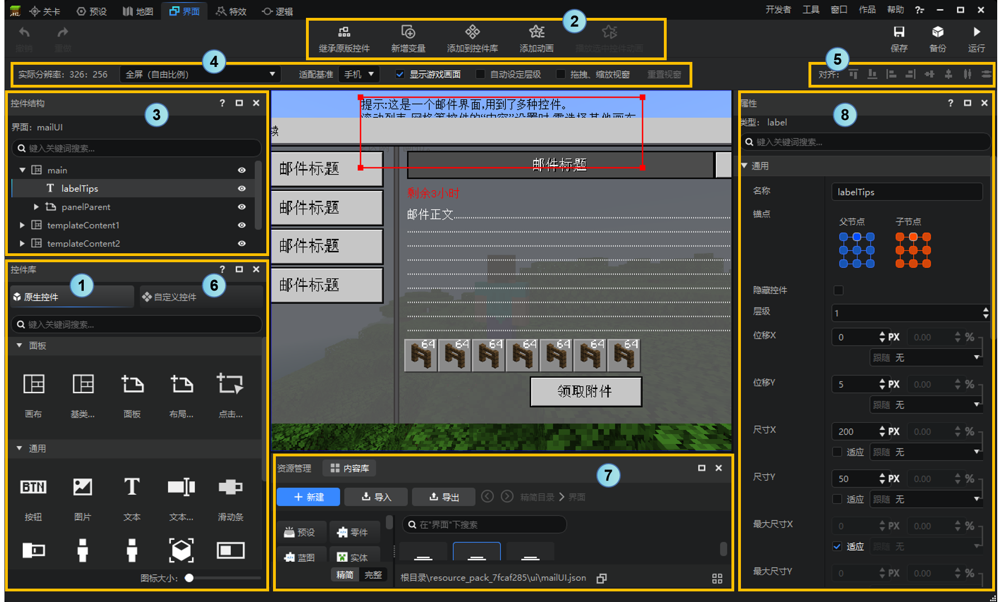 

The following is a brief introduction to the functions of each interface: 

1. **Control Library-Native Control**: Drag the control in the ① "Control Type" area to a control in ③ "Control Structure" to add a child control to it. Or drag it directly to the preview window in the middle to create a control directly at the specified position on the screen. Among them, the canvas is special. The canvas is used to mount various non-canvas controls and cannot be used as a child control of other controls. Note that not all controls can be attached with sub-controls. Instances of custom controls/inherited controls cannot add sub-controls. For details, see [Inheritance and Custom Controls](./13-Inheritance and Custom Controls.md) (it is recommended to read the documents in order, no need to pay attention in advance). 
2. **New Variable**: New function, used to add variable references and control references, see below for details. 
3. **Control Structure**: The tree structure of the interface controls of the currently selected project, where you can select, hide/show controls, and right-click controls to add sub-controls, delete, copy, and other operations. 
4. **Quick Options**: Here you can adjust the resolution, whether to display the game screen, whether to automatically set the hierarchy, and other options. 
5. **Alignment Operation**: In the interface structure, hold down the Ctrl key and select multiple controls, then click the Align button to align the selected controls. 
6. **Control Library-Custom Control**: The controls in ① are native to the Bedrock Edition of Minecraft or provided by NetEase, while the controls here are customized by developers. For details, see [Inheritance and Custom Controls](./13-Inheritance and Custom Controls.md). 
7. **Resource Management**: Displays all file resources. In interface editing, we mainly focus on interface files (Json) and textures. For details, see [Interface Resource Management](#Interface Resource Management). 
8. **Control Properties**: When a control is selected, the editable properties of the control will be displayed here. 
9. **Edit Area**: The editing area will display the interface editing effect in real time, and controls can also be selected, moved, and scaled. 

## Create a new interface file 

If you create a new blank work (map, add-on pack), or open a work without an interface, your interface editor will be similar to the following figure. 

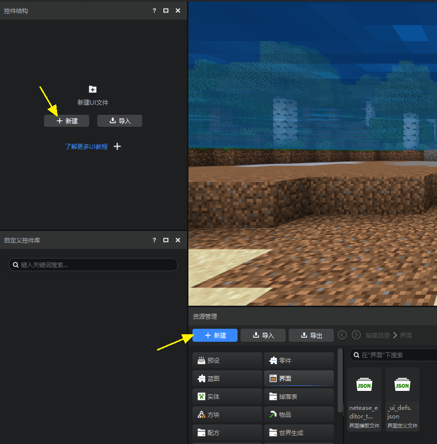 

You have two ways to create a new interface file. 

1. Click New in the Control Structure (only available when there is no interface file) 

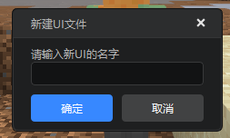 

2. Click New in the Resource Manager and create it through the New File Wizard 

Select the interface file in the Common or Interface tab of the New File Wizard and click Next 

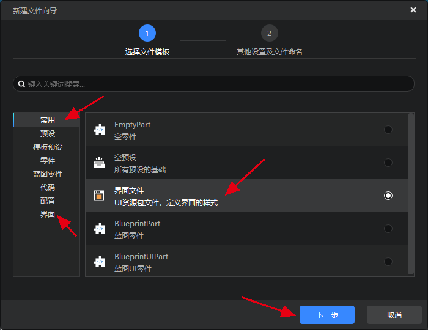 

Enter the file name of the interface file and click Next to complete the creation. 

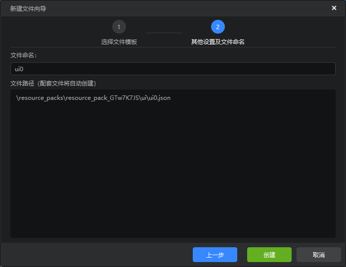 

## Interface Resource Management 

The interface editor now uses a general resource manager for file management. Taking the simplified mode as an example, when editing the interface, we mainly focus on the interface and textures. Click the button to switch between the interface and textures in the simplified mode on the left side of the resource manager. 

- Interface 

You can see 3 types of files in the interface folder. 

1. Interface configuration: that is, the interface file (Json). Double-click to open this interface in the editor. 

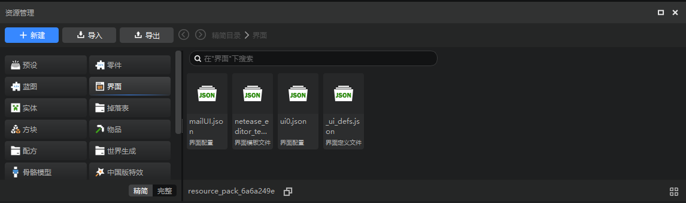 

Right-click the interface configuration, click Open File Location in the pop-up menu, and then you can open this json file in the windows folder. 

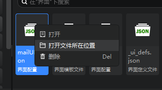 

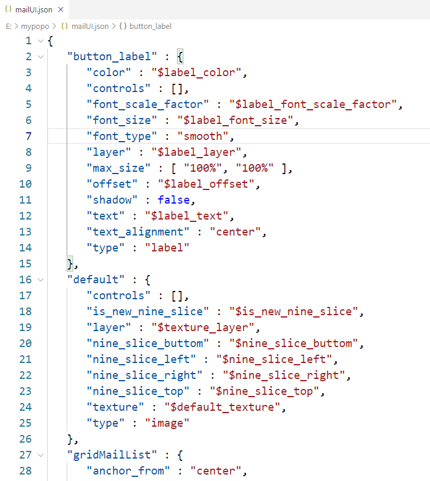 

2. Interface template file: fixedly named netease_editor_template_namespace.json, which contains some control templates provided by NetEase, no need to worry about it.
3. Interface definition file: fixedly named _ui_defs.json, which contains the file name of the interface used in this work, no need to worry about it. 

> Do not modify or delete the interface template file and interface definition file. 

- Textures 

Pull down the scroll bar of the compact mode on the left side of the resource manager, or scroll the wheel here and click on the texture to switch the directory to the texture directory, where all the textures will be displayed. 

> All the textures here can be used directly, not just the "interface texture" can be used for the interface. 

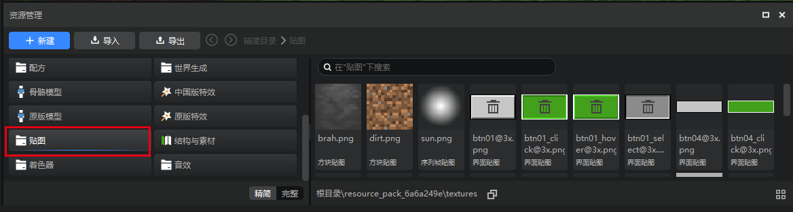 

## Assemble controls 

The interface of "Minecraft" is the same as that of most other games, and can be simply understood as a combination of controls. 

The following are the controls that can be added directly in the interface editor. For an introduction to these controls, please refer to [Controls and Control Properties](./10-Controls and Control Properties.md#Control Introduction). 

There are also a large number of controls that can be directly inherited in "Minecraft", and we will gradually add them later. 

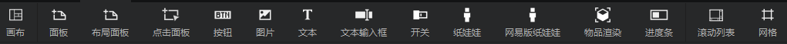 

There are two ways to add controls to the interface: 

- Drag the controls in the control library to the control structure, or drag them to the preview window;

- Right-click on the control in the control structure and select Add Object -> Control. After adding the control, the edit area will display the added control in real time. 

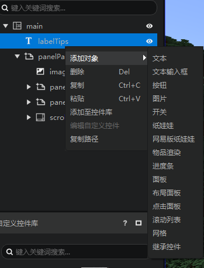 

In addition to the controls provided by the editor, you can now add custom controls to the control structure. See [Custom Controls](./13-Inheritance and Custom Controls.md) for details. 

## Edit Control Properties 

After selecting a control in the control list or edit area, the selected control will display a red box, and its parent control will display a blue box. 

 

The properties of the selected control will be displayed in the property panel on the right. Different controls have different properties. You can adjust the display effect of the control by modifying the properties. For details, see [Controls and Control Properties](./10-Controls and Control Properties.md#Control Introduction). 

> If the control is an instance of a custom control, a cyan box will be displayed. For details, see [Inheritance and Custom Controls](./13-Inheritance and Custom Controls.md). 
> 
> 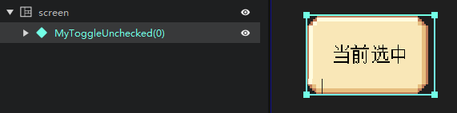 

The following figure shows the properties of the text control. You can see that we provide many properties for you to modify. 

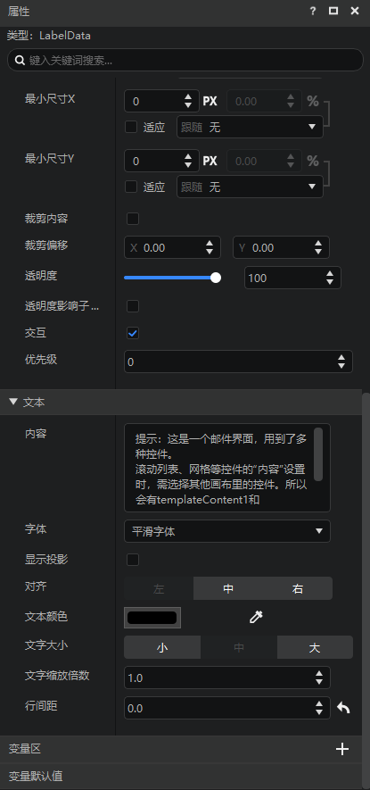