# Controls and Control Properties 

## Control Introduction 

- **Canvas**: The canvas is a complete interface. Sub-controls other than the canvas can be hung under the canvas. There can be multiple canvases in an interface project file. The newly created interface project file will come with a canvas named main. For example, in the figure below, these are all canvases. 

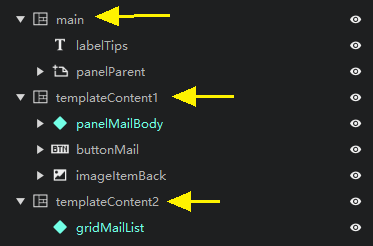 

- **Panel**: The panel itself has no visual elements. Hanging controls belonging to a module under a panel can make the interface structure clearer and easier to adjust. 

- **Image**: The image control is used to display images. The image will try to fill the size of the control without deformation. 

- **Button**: The button is an important interactive control. You can set the text, text color, text font size, and text offset on the button. The button texture is divided into three states: normal, pressed, and suspended. "Normal" refers to the texture in the normal state, "pressed" refers to the texture when the button is pressed, and "suspended" refers to the button texture when the mouse moves over the button in the PC. How to set the texture: In the resource management window, hold down the left button and drag the texture to the texture box. When the mouse changes to a style with a "+" sign, release the mouse to complete the texture setting. 

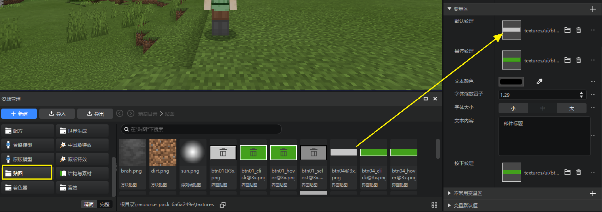 

- **Text**: The text control is used to display text, and the font size and color can be set. 

- **Scroll list**: The scrolling content can be selected in the "Scrolling content" configuration item in the variable area of the property panel. In the drop-down list of "Scrolling content", your custom controls will appear for selection. In the figure below, mailUI is the interface file name, and buttonMail, panelMailBody, gridMailList, etc. are custom control names. If you want to learn more, you can check out [Custom Controls](./13-Inheritance and Custom Controls.md). If you want to learn more about the principle of "scrolling content", you can check out [Universal Controls](./15-Variable References and Universal Controls.md). Of course, we recommend that you check the documents in order. 

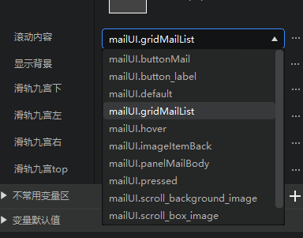 

Not all controls can be used as the content of a scroll list. Currently, only three types of controls, namely panels, buttons, and grids, can be used as the content of a scroll list. If you want to display a text control in a scroll panel, you can place the text control under the panel and then use the panel as the content of a scroll list. However, it does not support hanging a scroll list under a panel and then using the panel as the content of another scroll list. 

- **Grid**: Grids are used for interfaces that require regular layout, such as backpack interfaces. The content is configured in a similar way to the content in a scroll list. The grid scale is used to configure the number of rows and columns of the grid. The grid will automatically display the content evenly in each grid. 

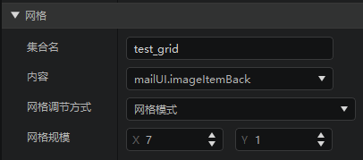 

It should be noted that in the Minecraft game engine, there are certain requirements for the size of the grid and the size of the content, otherwise the display will not meet expectations. The specific requirements are: 

- When the size of the content is fixed pixels: 
- The width of the grid should be greater than or equal to the width of the content multiplied by the number of columns, and less than the width of the content multiplied by (number of columns + 1); 
- The height of the grid should be greater than or equal to the height of the content multiplied by the number of rows; 
- When the size of the content is a percentage: 
- The width of the content multiplied by the number of columns must be less than or equal to 100%, and the width of the content multiplied by (number of columns + 1) must be greater than 100%; 
- The height of the content multiplied by the number of rows must be greater than or equal to 100%. 

The collection name will be used when binding UI controls in the code. For details, please refer to [UI Description Document](./30-UI Description Document.md). 

## Structure/Grouping of Control Properties 

Here we mainly introduce the grouping of control properties in the editor. 

Because there are many properties of controls and they can be increased or decreased by themselves, we group the properties of controls by default. 

Take text (Label) as an example: 

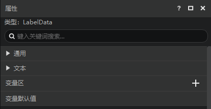

You can see that there are 4 groups in total, namely 

- General: properties that all controls have 
- Text: properties that are unique to text controls. If it is other controls, they may also have their own unique properties. 
- Variable area: properties used as variables, see [Variable Reference and Universal Controls](./15-Variable Reference and Universal Controls.md) for details. 
- Variable default value: refers to a variable name that has been assigned to a property, but the property/variable has not been referenced, see [Variable Reference and Universal Controls](./15-Variable Reference and Universal Controls.md) for details. 

Let's take another control scroll list (Scroll View) as an example: 

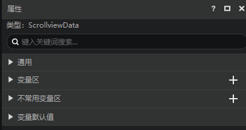 

You can see that there is also an uncommon variable area. The meaning of this group is the same as the variable area. The difference is that the properties in this group are rarely used, so we divide it into this group. 

## Common control properties 

The following are the properties of each control. 

- **Anchor point**: Each control has 9 anchor points, including four corners, the midpoints of the four sides, and the center point. The anchor point can set which anchor point of the child control coincides with which anchor point of the parent control. The left side of the figure below corresponds to the parent control and the right side corresponds to the child control. 

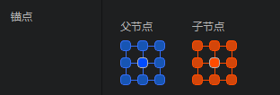 

The following figure shows the situation where the center of the child control coincides with the middle point of the upper edge of the parent control. 

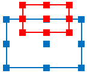 

The following figure shows the situation where the lower right corner of the child control coincides with the upper left corner of the parent control. 

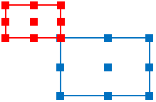 

- **Name**: The name of the control, which can only be a combination of letters and numbers. 

- **Hide control**: Check to hide the control. In the control list, click the eye on the right side of the control to achieve a similar effect. 

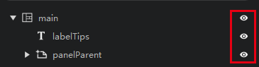 

- **Level**: Level is used to control the upper and lower relationship of controls. The higher level is displayed on top. 

- **Displacement XY**: Controls the offset of the control relative to the anchor point. In the red box below, you can directly fill in the value in pixels. In addition to directly filling in pixels, there are more advanced uses. For details, see [Advanced Use of Displacement Size](#Advanced Use of Displacement Size Attributes). 

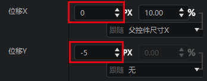 

- **Size XY**: Size XY, maximum size XY, minimum size XY, the meanings of the three sets of data are similar, all of which are descriptions of the size (width and height) of the control. Similar to displacement XY, it also supports direct pixel filling and [more advanced usage](#Advanced usage of displacement size attributes). If the maximum size XY and the minimum size XY are filled in 0, these attributes are not enabled by default. If adaptation is checked, such as size X, the actual value of size X will remain 100% of the parent control's size X. 

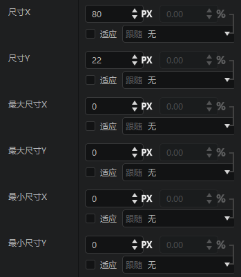 

> The interface editor provides many attributes. The best way to learn these attributes is to adjust them and observe the effects. 

## Advanced usage of displacement size attributes 

Take displacement X as an example. 

Displacement is used to control the offset of the control relative to the anchor point. The format is Px+%. Px represents pixels, and % represents the percentage of a certain size. 

For example, if the displacement X configuration (as shown below) is: follow 10Px+10% of the parent control size X, if the width (size X) of the parent control is 100 pixels, then the offset X of the child control is 10Px + 10% * 100Px = 20Px. 

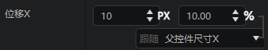 

In addition to following the parent control size X, we also provide other following methods. If you want to know the effects of other following items, in addition to understanding them literally, we strongly recommend that you try the usage of these following items in practice, which will greatly deepen your understanding of this option. 

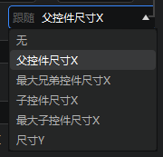 

If you open this interface file directly in a text editor such as vscode, you can find that the first value of the offset field is very similar to the configuration in the editor. 

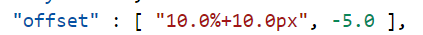 

% and Px are buttons that can be clicked. After clicking, the displacement X setting will be changed from Px+% to Px or % according to the current setting. 

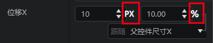 

- Click Px, as shown in the figure below, and convert it to 20Px 

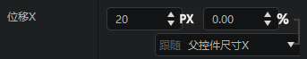 

- Click %, as shown in the figure below, and convert it to 20%, because the size X of the parent control is 100Px, 20% × 100Px = 20Px 

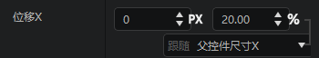 

## Practical application of advanced usage of displacement size 

The following figure is a pop-up window with a content used as a universal control (if you are interested, you can refer to [Universal Control](./15-Variable Reference and Universal Control.md), but we recommend that you read the documents in order). 

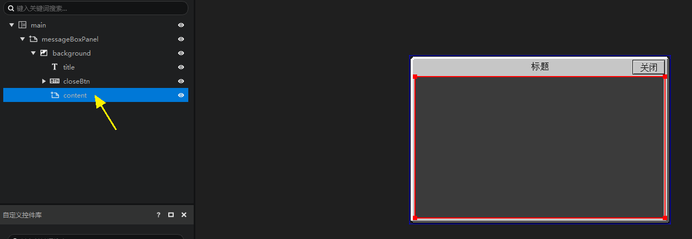 

messageBoxPanel is a panel, and then a background image is attached below. The image size XY is checked to adapt, so that the image always fills the parent control panel. 

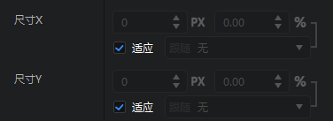 

The effect we hope to achieve is that no matter how the outer control (messageBoxPanel) is enlarged or reduced, the content can occupy the area within the red box. 

Adjust the displacement and size of the content according to the following figure: 

- Displacement X, because the content is always in the center of the X direction (horizontal direction), just fill in 0 
- Displacement Y, because the content will be a little lower (the title bar has a certain height), so we fill in 7 here 
- Size X, because the width of the content changes with the width of the parent control, the parent control is wide, and it is also wide, so here we choose to follow 100% of the parent control size X. Because the left and right borders of this pop-up window also have width, we need to subtract this width (-10) 
- Size Y, because the height of the content changes with the height of the parent control, the parent control is high, and it is also high, so here we choose to follow 100% of the parent control size Y. Because the bottom border and title bar of this pop-up window also have height, we need to subtract this height (-25) 

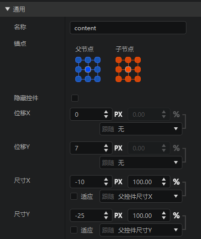 
