# Image scaling and nine-grid cutting 

## Image scaling and aspect ratio 

The following image is the sample image we need. You can download it in the browser, or click this [address](https://g79.gdl.netease.com/goods_print02.png) to download it and import it into the editor for use. 

This is a very small image. The images used in Minecraft are usually small. 

 

The size of this image is 16*16. Hover the mouse over the image file in the resource manager and you can see this data in the pop-up floating prompt. 

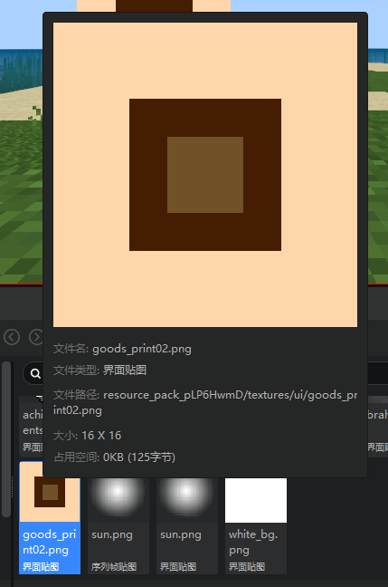 

We zoom in on this image and see the pixel information of each color block in this image. This image is divided into 3 parts, the diameter of the outer ring is 4 pixels, the diameter of the middle ring is 2 pixels, and the side length of the inner square is 4. 

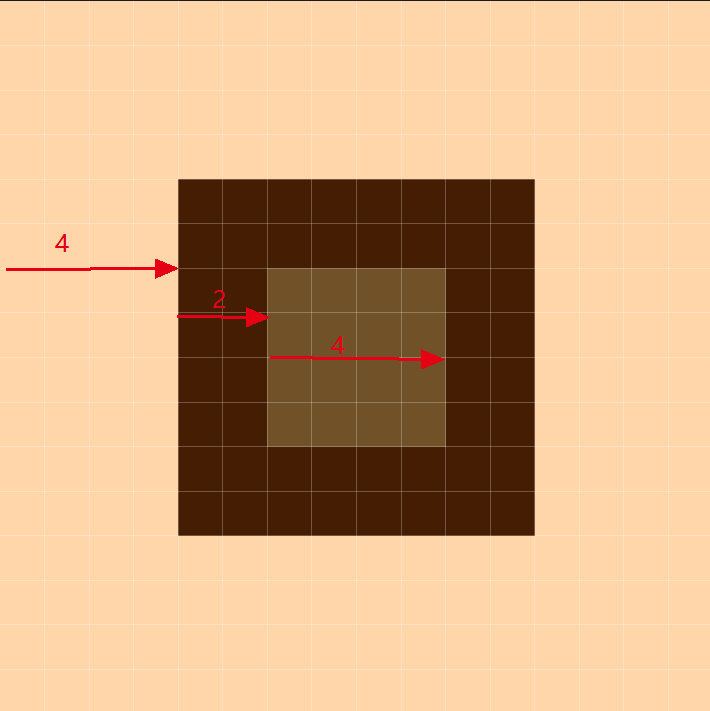 

We place an image in the editor and specify it as this image using a texture, then stretch this image in the preview window. You can see that by default, this image only has one direction (horizontally or vertically) against the red frame, and the displayed image is not deformed. 

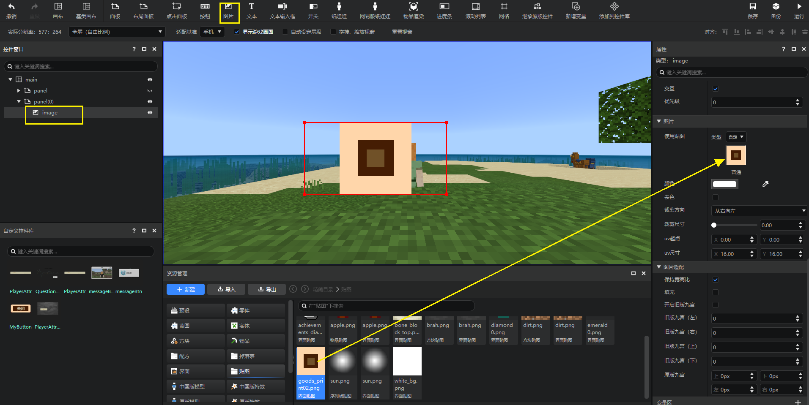 

After turning off "Maintain aspect ratio" in the image adaptation, this image can fill the entire red frame. 

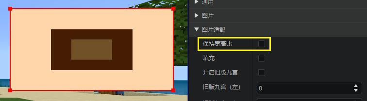 

If we want to enlarge this image as much as possible, even if we don't care to crop a part of it, we can choose to fill it. The example effect of filling is as follows. You can see that the image is filled with the red frame in the horizontal direction, and the vertical direction is cropped by the red frame. 

> "Fill" has a higher priority than "Maintain aspect ratio". Once filling is checked, the aspect ratio will no longer be maintained. 

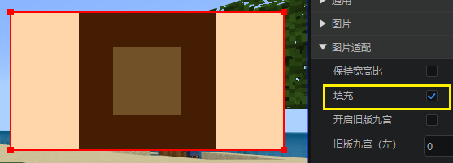 

## Nine-grid cutting 

As you can see, when the aspect ratio of the image is uncertain, no matter which of the above adaptation methods is not beautiful enough. Is there an adaptation method to achieve the following effect of filling the red frame and visually maintaining the aspect ratio? This requires the use of nine-grid cutting. 

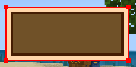 

### Principle 

In game production, there are often such requirements as above. When we get the picture below, we will find that we can cut the picture into 9 parts according to the method of the cyan line in the picture below (that is, nine-square cutting), where 

- 1 cannot be scaled, which will cause the aspect ratio to change 
- 2 can be scaled horizontally 
- 3 can be scaled vertically 
- 4 can be scaled arbitrarily (it is a solid color anyway, so you can scale it any way you want) 

After the nine-square cutting

- If we want to stretch this picture horizontally, then blocks 1 and 3 will not move, only blocks 2 and 4 will stretch horizontally 
- If we want to stretch this picture vertically, then blocks 1 and 2 will not move, only blocks 3 and 4 will stretch vertically 

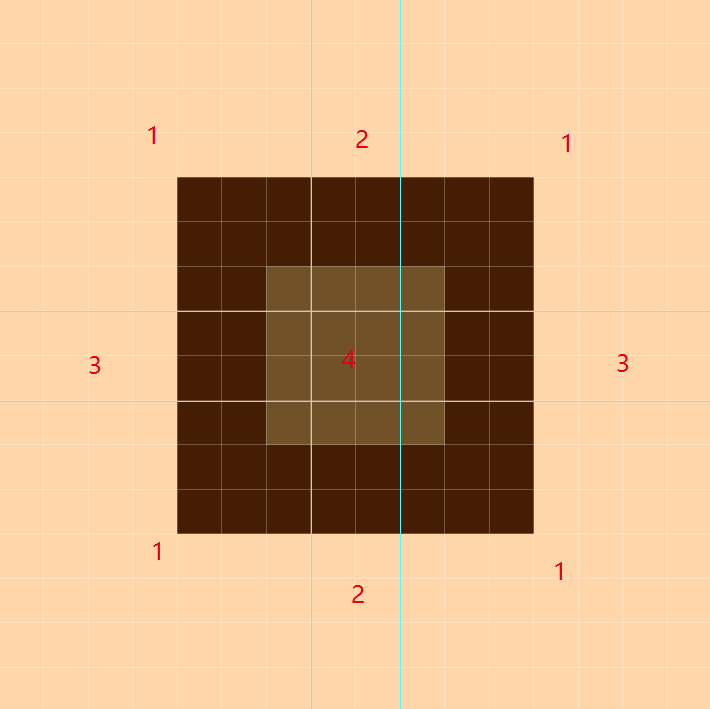 

The data of the Jiugong cut picture is the distance between these 4 cyan lines and the 4 sides of the picture. You can see 

- The distance between the vertical cyan line on the left and the left is 7 
- The distance between the vertical cyan line on the right and the right is 7 
- The distance between the vertical cyan line on the top and the top is 7 
- The vertical cyan line below is 7 away from the bottom

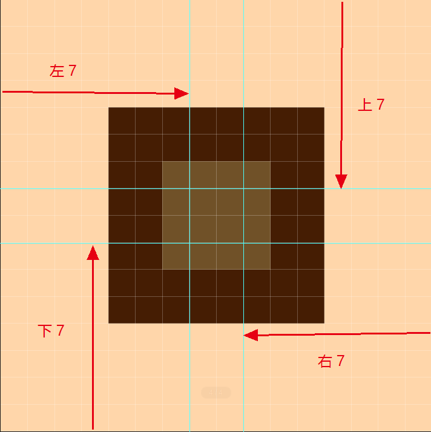

### Original Nine Palaces

We adjust the value of "Original Nine Palaces" to complete the Nine Palaces adaptation on this image control.

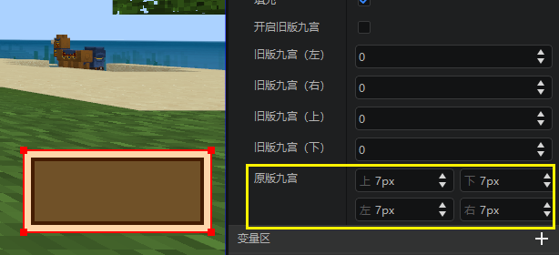

### New Nine Palaces

In addition to the original Nine Palaces, there is another Nine Palaces rule (new Nine Palaces).

We open the old Nine Palaces according to the following figure, and cut the Nine Palaces in the same way that all four sides are 7, and you can see different results.

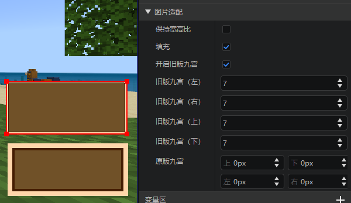 

This is because the two Jiugong adapt to the screen resolution in different ways. 

- The original Jiugong adapts to the actual game resolution after scaling, refer to [Interface Adaptation Preview and Method](./20-Interface Adaptation Preview and Method.md). 
- The new Jiugong adapts to the game resolution on the screen 

You can use different Jiugong methods according to your usage scenarios. 

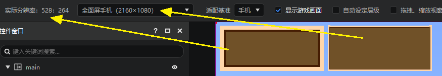 

For more information, please refer to [MC Jiugongge Usage and Texture Specifications](../16-Art/50-Texture Specifications and Jiugongge Usage.md). 
