# Inheritance and custom controls 

## Create custom controls 

For example, we want to implement the following player attribute interface. 

As you can see, this interface contains 4 attributes, and each attribute looks very similar. 

 

They are all composed of an image, an item rendering, and a text 

- Image: as background 
- Item rendering: used as an icon (we are just borrowing some materials from the original version of Minecraft here, and a better approach is of course to use pictures drawn by ourselves) 
- Text: used for attribute descriptions and values 

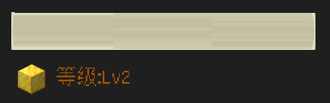 

His control structure is as follows. Here we use a panel to organize these controls. 

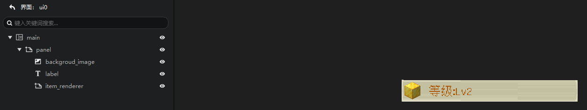 

Is there a way to reuse it? 

Yes, we provide a way to save this structure as a custom control. 

Right-click the panel and select Add to Control Library in the menu. 

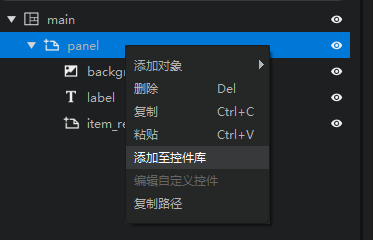 

In the pop-up window, enter a name and click OK to add this control to the custom control library. 

> Be careful not to fill in the same name as the selected node. Taking the above figure as an example, please do not use "panel" as the control name. 

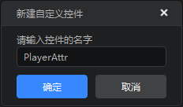 

You can see that there is an additional custom control of your own in the control library. 

Right-click the custom control and select Edit Control Body to open the custom control in the control structure for editing. You can also simply edit a control by double-clicking it in the custom control library. 

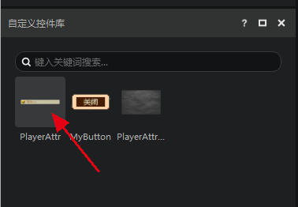 

Custom controls are represented by cyan in the interface editor. 

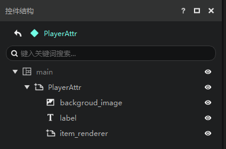 

## Use custom controls 

After creating a custom control, the next step is how to use it. 

1. In the Control Structure panel, select the node to which you want to attach the custom control 
2. In the Custom Control Library, right-click the custom control you want to attach 
3. Select Create Instance in the menu 

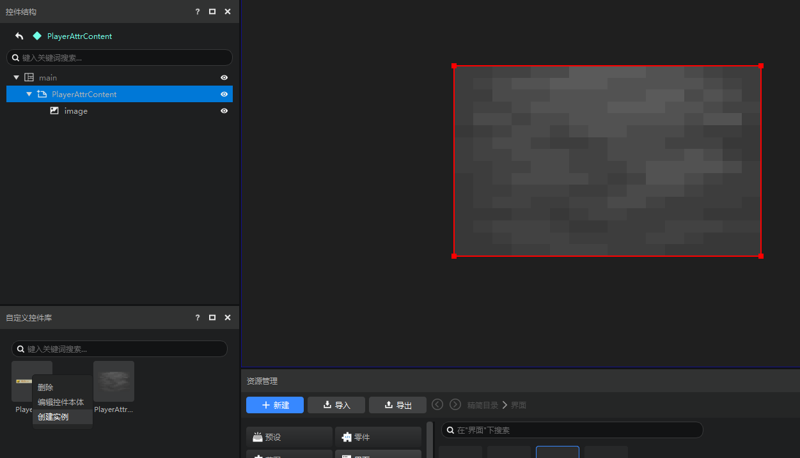 

As you can see, we have successfully added a PlayerAttr control under PlayerAttrContent. 

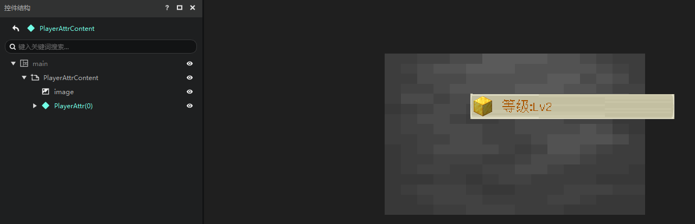 

There is also a simpler and more direct way to add a custom control. You can directly drag the custom control to the node you want to attach, as shown in the figure below. 

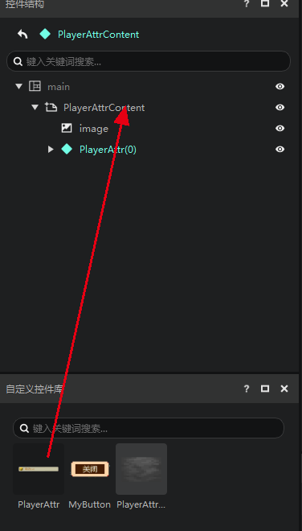 

Simply adjust the position and we will get the following effect. 

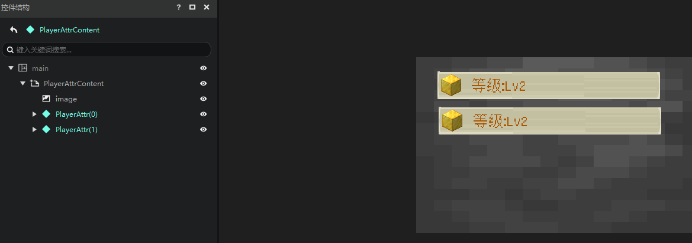 

## Inheritance (the principle of custom controls) 

### Ontology and instances 

Custom controls are actually the UI inheritance of the Bedrock Edition of Minecraft. 

We are not concerned with the inheritance writing at the Json level here, but only with the characteristics of inheritance itself. 

In the editor 

- We call the control in the custom control library "**body**", which is ① in the figure below 

- We call the actual use of the custom control in the control structure "**instance**", which is ② in the figure below 

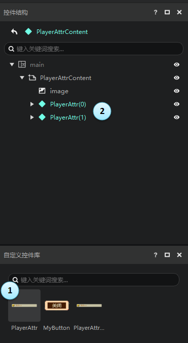 

Note that when no variable reference is used, the child controls of the instance control cannot be modified. 

Therefore, if we try to expand an instance of a custom control, we will remind you. 

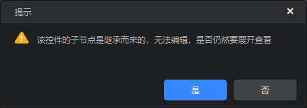 

When you expand the instance of the custom control, you will find that except for the root node of the custom control, other nodes (child nodes) are gray, and the modification of their properties is also disabled. 

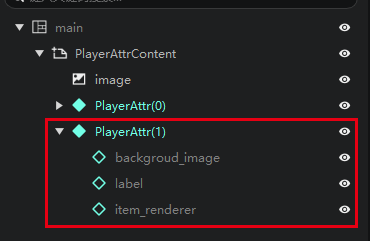 

That is, **for an instance of a custom control, you can only modify the properties of the root node of this control**. 

### Modify the main body 

If you modify the main body, such as in the figure below, we change the prop material of item_renderer to emerald block.

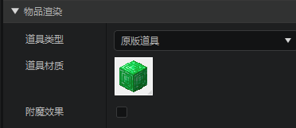 

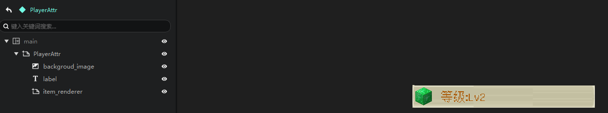 

You will find that all its instances have "**inherited**" this change. 

This is a very useful feature that can help you quickly modify a large number of interfaces. So if you have reuse in your interface, we strongly recommend that you use the custom control library (ie inheritance) to assemble the interface. 

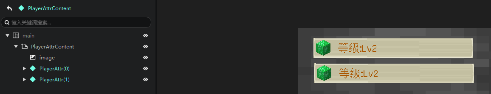 

At this point, you may be wondering, if the properties of the child control cannot be modified, then how can I achieve the initial effect, because the text is a property of the Label child control. 

This requires the use of variables. The combination of variables and custom controls will bring out the true power of **inheritance**. For details, see [Variable Reference and Universal Control](./15-Variable Reference and Universal Control.md). 

 

For more low-level knowledge about inheritance, please refer to [Inheritance Control](./30-UI Instructions.md#Inheritance Control). 
