--- 
front: 
hard: Getting Started 
time: 10 minutes 
--- 

# Variable reference and universal control 

## Attribute variable reference 

The four controls in the figure below are instances of the same custom control. If you want to achieve different effects like the following, you need to use the attribute reference function. 

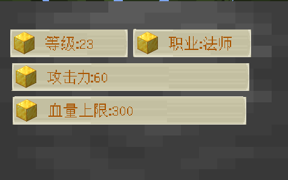 

Instances of custom controls can only modify the attributes of the root node. So we have to find a way to directly control the content attributes of the Label node in the PlayerAttr node. 

That is, add a variable to the PlayerAttr node and bind the content of the Label node. 

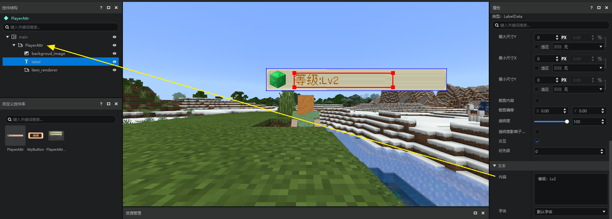 

The following operations need to be performed: 

1. Select the root node of the custom control (as shown in the figure, here is PlayerAttr) 

2. Click New Variable in the ribbon 

3. Select: Add Attribute Variable in the menu 

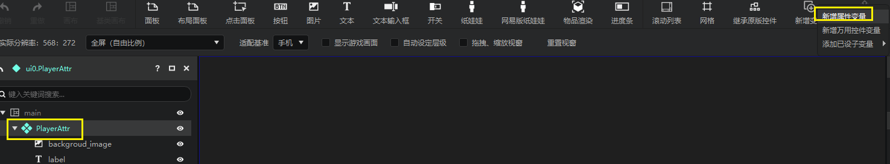 

This will open a new panel - the New Attribute Variable Panel. 

We open it by selecting the PlayerAttr node 

- You can select all attributes of the **PlayerAttr** node and **its child controls** in this panel 
- And open these attributes as **variables** to the **PlayerAttr** variable area 

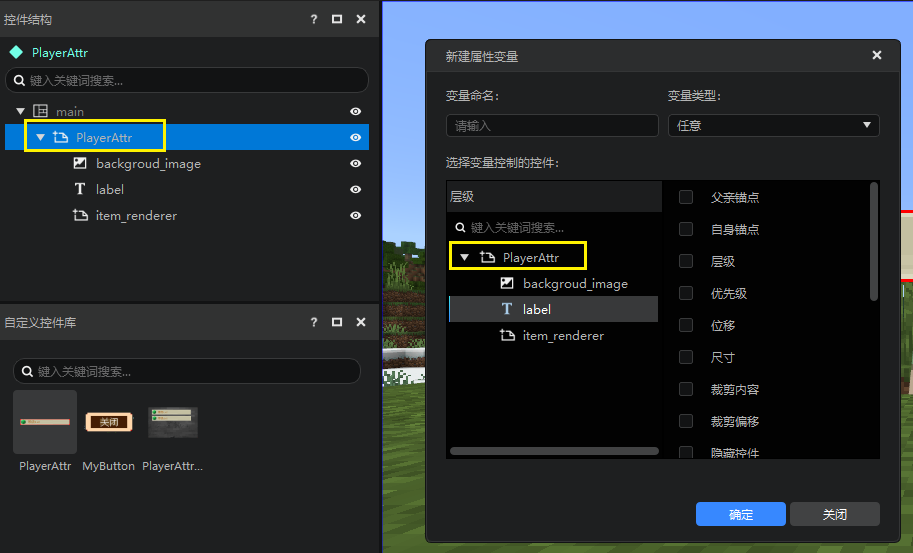 

We select **label** and select the **content** attribute. 

You can see that when you select content, the variable type automatically selects text content. 

This is because you can bind multiple attributes of the same type at one time, and we automatically filter them for you here. 

After filling in the variable name (such as AttrText), click OK. 

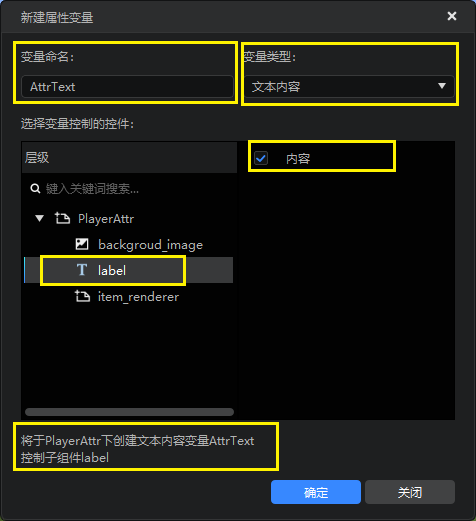 

Now, we have successfully created the AttrText attribute in the variable area of PlayerAttr, and this attribute is bound to the content attribute of the label control. 

We change the value to 200 here, and you can see that the value displayed in the preview window has also become 200.

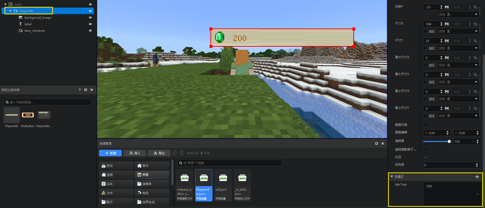 

### Property Reference Example 

Now let's use this custom control to quickly implement a currency display HUD. 

Since the properties of item rendering do not currently support property variable references, we use an image control instead and name this image control icon. 

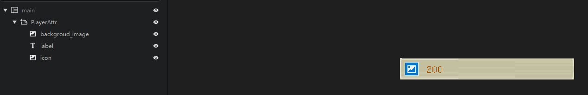 

Next, add a new variable (icon_texture) to PlayerAttr and bind the texture property of the icon control. 

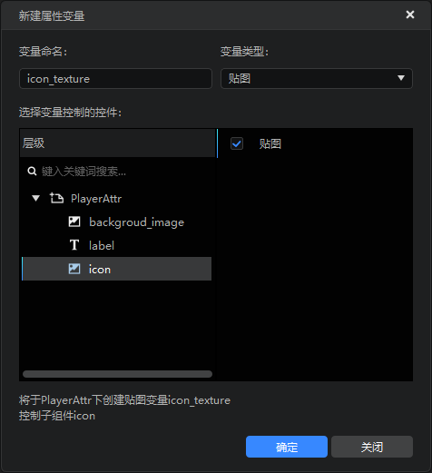 

You can see that the image has "disappeared". 

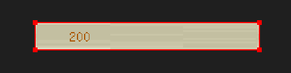 

This is because in the variable area of PlayerAttr, the newly created variable (icon_texture) has not been assigned a value. 

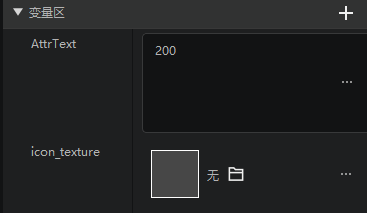 

Next, we find the editor download path in the workbench download path through the windows folder, where we can find the item texture folder. 

Then find the emerald and diamond textures and import them into the editor texture. 

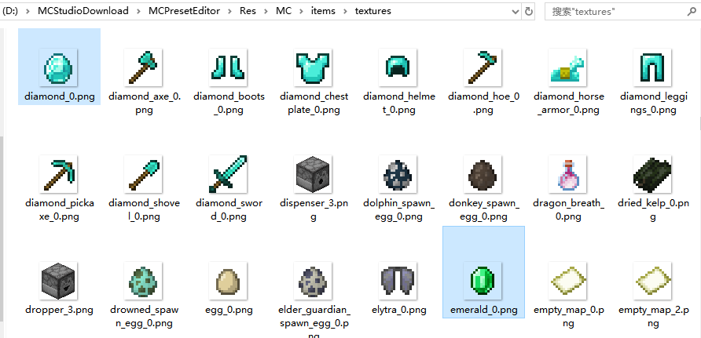 

The preparations are done here. Next, we create a new interface file. And create two instances of PlayerAttr under the main canvas. 

Then set the icon_texture variables in the variable area of the two instances to the diamond texture and the emerald texture respectively. 

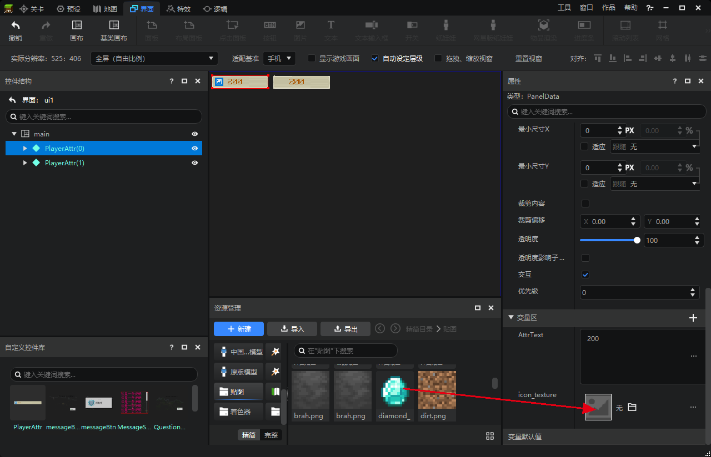 

The effect is as follows. 

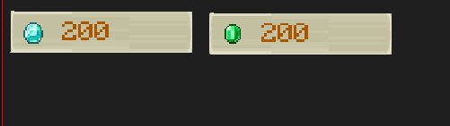 

The icon seems a bit small. We open this custom control, adjust the size of the icon control, and then return to the interface file. We can see that the styles of the two custom control instances have been modified normally. 

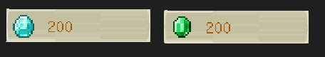 

## Control reference and universal control 

### Introduction 

The following figure shows two pop-up windows. Their frames are very similar, but the contents are different. 

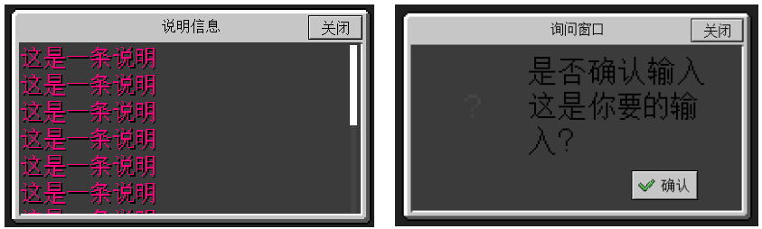

In fact, they use the same outer frame. You can use control references to achieve this effect. 

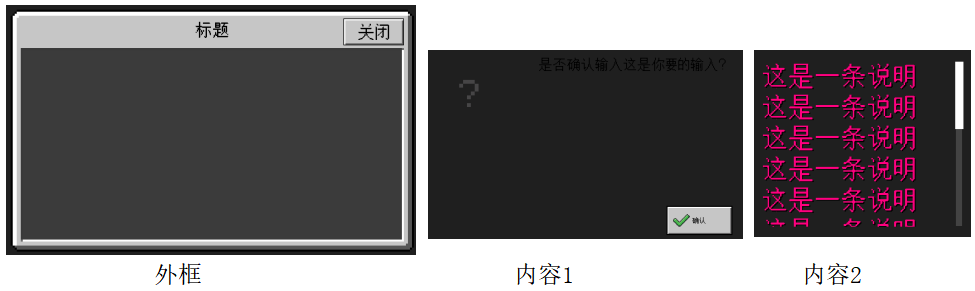 

### Make content 

Let's make two contents first. 

- Content 1 

Combining the two documents [Interface Editor Introduction](./1-Interface Editor Instructions.md) and [Controls and Control Properties](10-Controls and Control Properties.md), we can easily implement this control. After the production is completed, we need to add it to the control library. For details, see [Inheritance and Custom Controls](13-Inheritance and Custom Controls.md). Here we name it QuestionContent. 

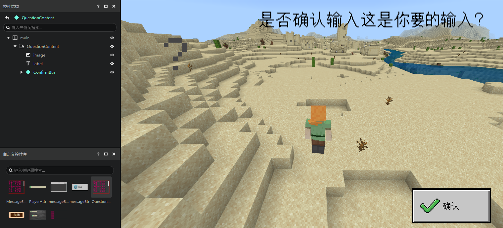 

- Content 2 

Content 2 is a scroll list. To implement the above scroll list, we need to create a text control first and add it to the control library, for example, name it myLbl. 

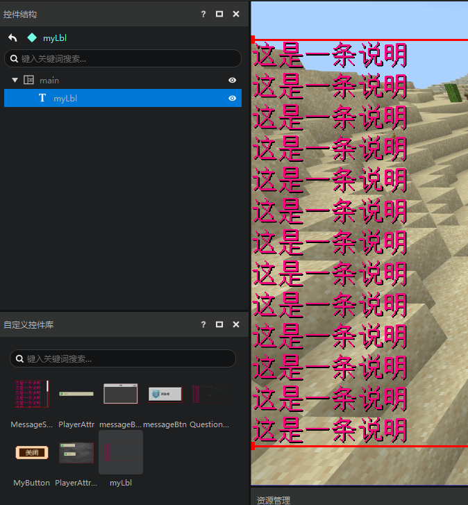 

Then, we create a scroll list and select the custom control myLbl in the property "Scroll Content". And uncheck "Show Background" below. Then, add this scroll list to the control library, and here we name it MessageScrollView. 

> In fact, "Scroll Content" is a universal control variable. 

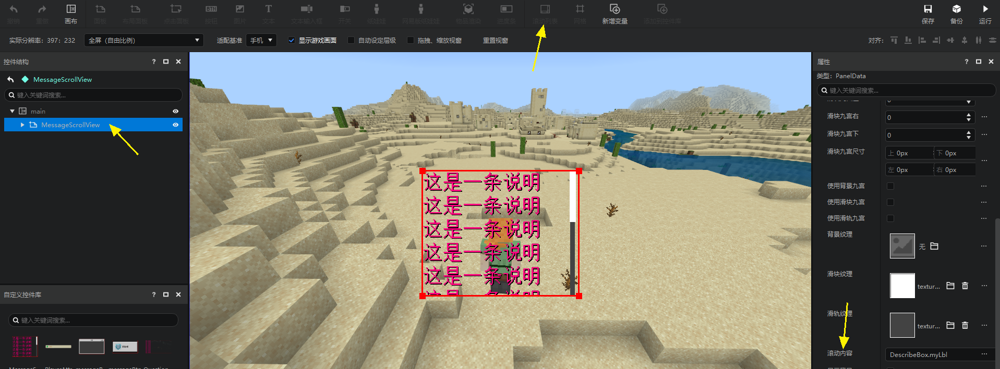 

### Make a frame 

Next, we will implement a frame. 

The frame is very simple and consists of the following three controls 

- An image as the background image (background node) 
- A text as the title (title node) 
- A button as the close button (closeBtn node) 

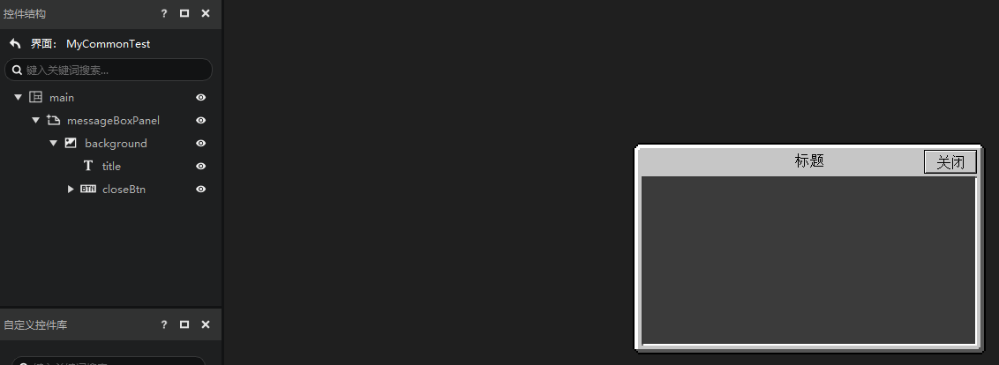 

It is worth mentioning that the texture of the background image control uses a native texture. 

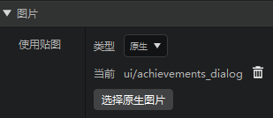 

The path of the texture is as follows. This texture automatically supports the Nine Grids in Minecraft and does not need to be filled in the properties of the interface editor. It is a good resource for making pop-up controls. 

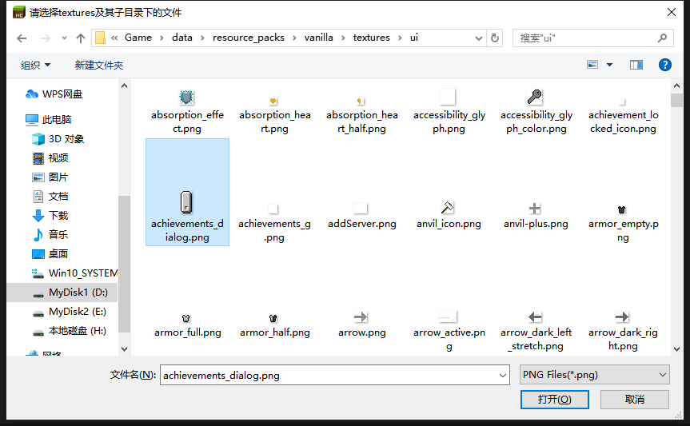 

### Add universal control variables 

Next, we need to add a universal control under the background node and open it as a variable to the messageBoxPanel node. This function is difficult to understand, and we recommend that you follow it and then we will explain it.

The operation steps are similar to those of attribute variables: 

1. Select the messageBoxPanel node 
2. Click Add Universal Control Variable 

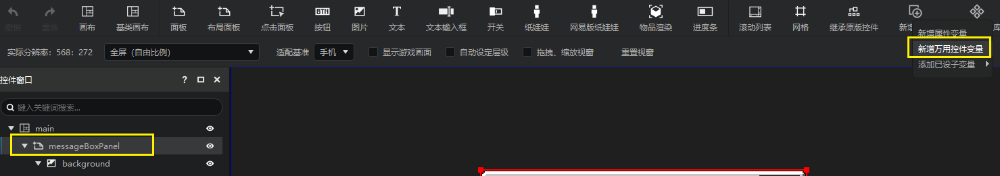 

In the pop-up menu 

1. Select the background node. We want to attach the universal control as a child of this node 
2. Fill in the universal control name 
3. Fill in the variable name 
4. You can see that after filling in the information above, the editor will help us implement the operation. Click OK 

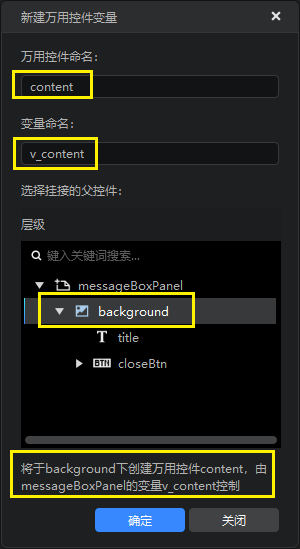 

Observe the results and you can find that 

1. Add a v_content variable to the messageBoxPanel node 
2. Add a content control under the background node 

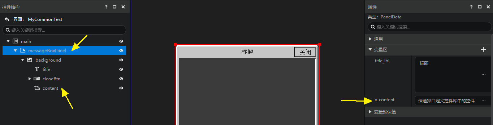 

3. You can select a control from a custom control library in v_content 

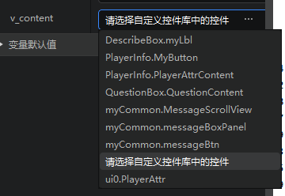 

Before modifying the property value of v_content, let's adjust the size of the content control so that it can always fill the visual content part of the outer frame. For specific methods, please refer to [Controls and Control Properties](./10-Controls and Control Properties.md#Practical Application of Advanced Usage of Displacement Size). 

We have already made two content controls, QuestionContent and MessageScrollView. 

Here we select QuestionContent, and you can see that our universal control looks exactly the same as QuestionContent. 

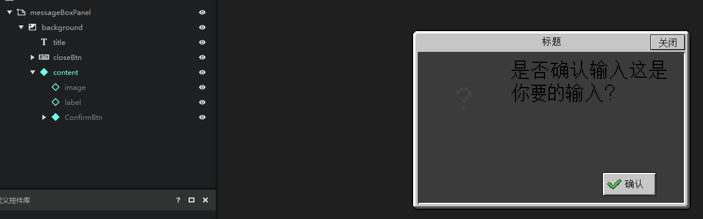 

### Control reference summary 

That is, the effect that control reference variables and universal controls can achieve is: **You can change the universal control of the child control to a custom control by modifying the value of the variable in the property panel**. 

After understanding this, let's take a look at the scrolling list control. 

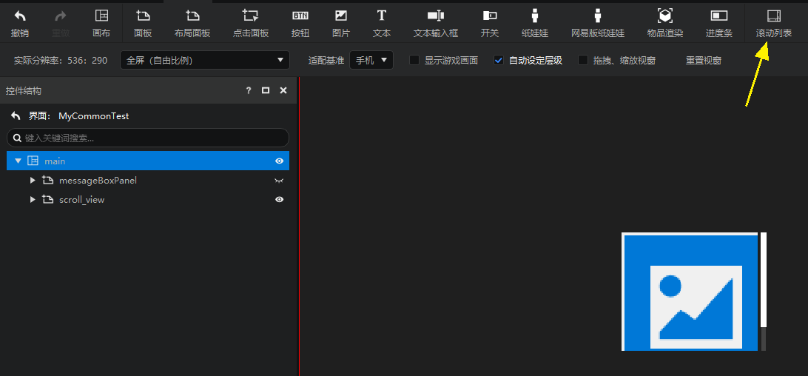 

We force it to expand in the editor, and you will find that the scrolling list uses a universal control (scrolling_content). 

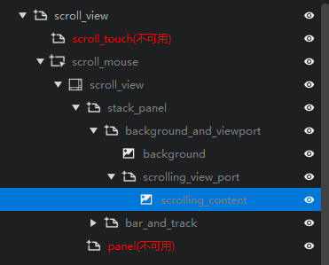 

And the value of this universal control is opened to the "Scrolling Content" property in the variable area of the property panel of the root node (scroll_view). This allows you to modify the content control of the scroll list directly at the outermost layer (scroll_view). 

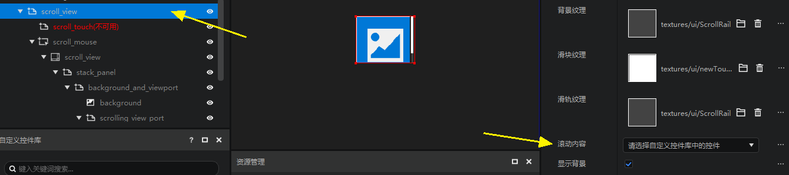