--- 
front: 
hard: Getting Started 
time: 10 minutes 
--- 

# Example: Switch and Label Switching 

## Switch 

This is a built-in switch in the editor (inherited from the original switch of my world). The switch can be understood as a button with two states, and each click will switch between the two states. 

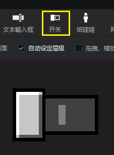 

The main 6 states of textures that can be defined for a switch are: 

- The state corresponding to the switch on: Select the lock texture, float texture, press the float texture 

- The state corresponding to the switch off (the switch is off by default): normal texture (that is, the default appearance), press the texture, and unselect the lock texture 

Lock means that the switch is unavailable and cannot be clicked. 

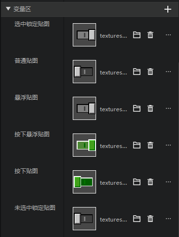 

## Complex switch effects 

The following figure is also a switch on/off state, which is often used to make tabs. In addition to the different textures, the two states also have different texts. 

This leads to the need to make some changes to the switches that come with the editor to meet our needs. 

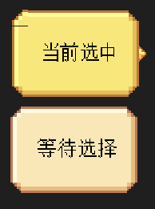 

The UI in the above figure only uses the following two pictures, Picture 1 is the button body picture, and Picture 2 is the sharp corner picture on the right side of the button. 

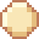 

 

## Steps to make a complex switch 

### Control structure 

First, we create an interface file, and then create the control structure shown in the figure below. Among them, the two panels under main - panel(0) are 

- panel: corresponds to the switch in the checked state on the upper right, and the two textures below correspond to the button base and the sharp corner respectively 
- panel(0): corresponds to the switch in the unchecked state on the lower right 

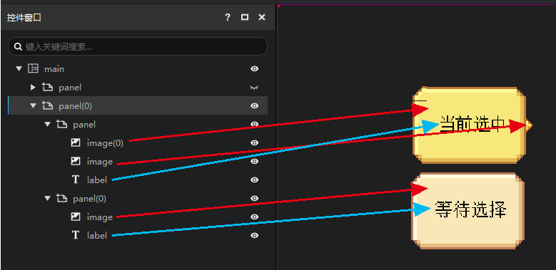 

### Texture settings 

The bottom plate images of the above two panel controls use the following image. 

 

The colors of the two controls look slightly different because we adjusted the color properties in the bottom plate image under the panel. The property values are shown in the figure below. 

This color is a superposition of the original image color. The effect that can be achieved is greatly affected by the original color of the image. The lighter the color of the original image, the more obvious the effect. 

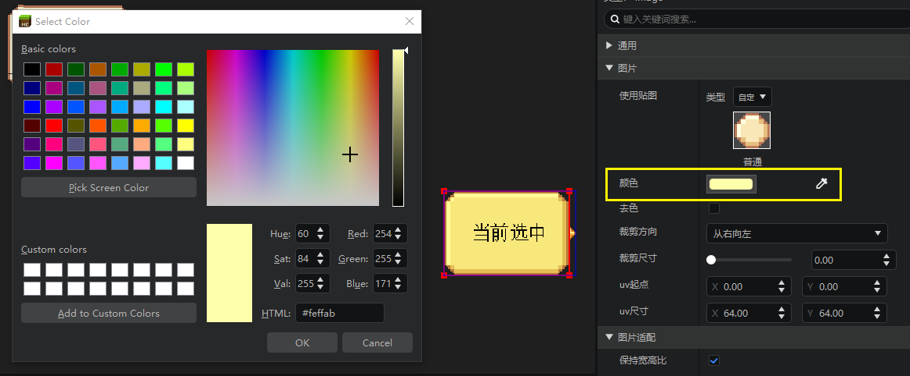 

See the figure below for the adaptation settings. Here we use the old version of Jiugong, which can achieve a more refined effect. 

For more usage of Jiugong, please refer to [Image Scaling Adaptation and Jiugong Cutting](./11-Image Scaling Adaptation and Jiugong Cutting.md). 

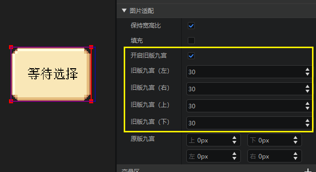 

The settings of the sharp corner image are relatively simple, so I will not go into details. 

### Size settings 

The anchor point and size XY data of the sharp corner image are as follows. 

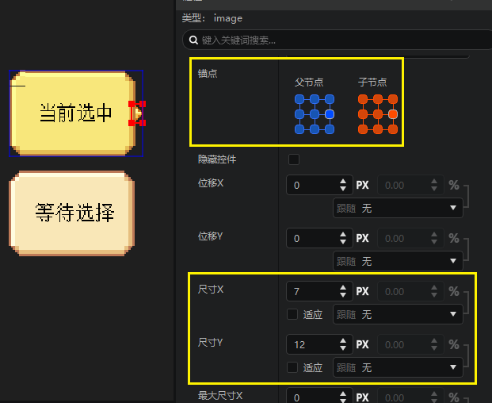 

The anchor point and size XY data of the button base are as shown below. 

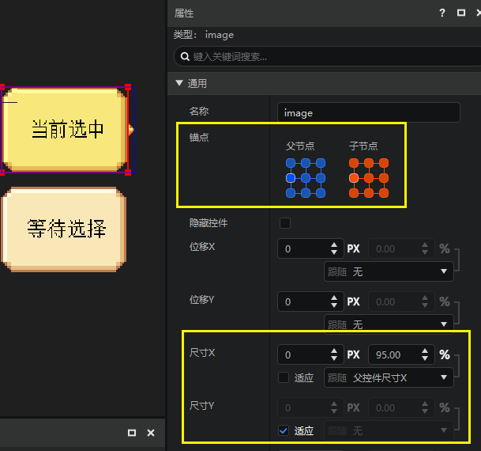 

This setting ensures that when the size of the parent node changes within a certain range, the visual effect of the control always maintains the shape of a base plate + a sharp corner, and the relative position does not change too much. 

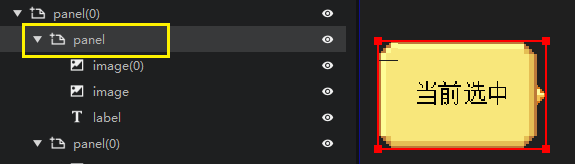 

### Open attribute reference and delete variables 

We add two attribute reference variables to panel. For attribute reference, please refer to [attribute variable reference](./15-variable reference and universal control.md#attribute variable reference): 

- Open the size attribute of panel to panel and name it my_toggle_size 
- Open the content attribute of label to panel and name it my_toggle_text 

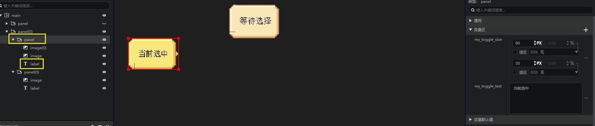 

Find the size XY of panel and you can see that this attribute is now uneditable. You can only affect this value by editing the value of my_toggle_size. 

There is a reference button on the right side of size X. When you put the mouse on it, a floating prompt will be displayed, which contains the variable that references this attribute. 

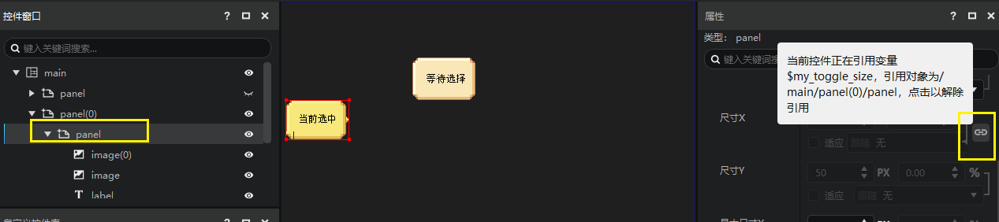 

We find my_toggle_size in the variable area, and then click the "···" button and delete it to delete this variable. 

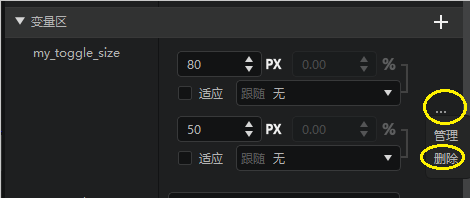

We will find that this variable has been deleted, but we can find this variable in the variable default value group (here we fill in a default value of 80,50). 

This is because the size of the panel is still bound to the my_toggle_size variable, but this variable has not been officially enabled. 

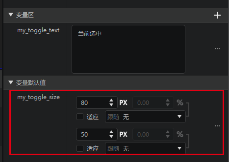 

Next, we delete the my_toggle_text variable in the variable area, and we can find that the my_toggle_text attribute also appears in the variable default value group of the label control (here we fill in "Currently Selected" as the default value). 

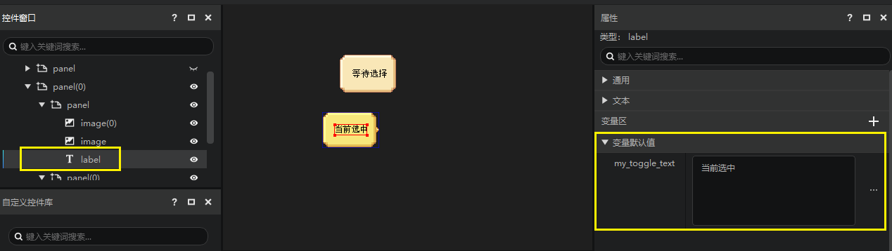 

Next, we will do the same for panel(0). Please make sure that the variable names of the two attributes referenced here are the same as before, which must still be my_toggle_size and my_toggle_text. 

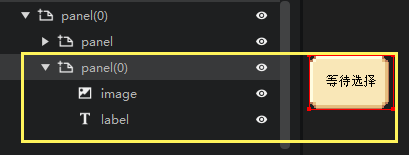 

### Add to the control library 

We add both panel and panel(0) to the control library and name them as follows: 

- panel: MyToggleChecked 

- panel(0): MyToggleUnchecked 

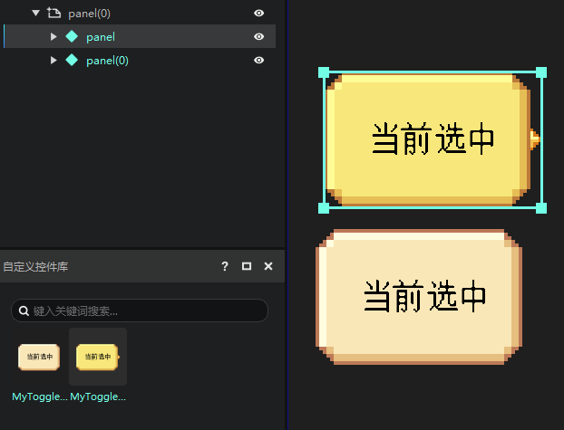 

Remember to double-click to open these two custom controls and reset the displacement XY of the root nodes of these two controls to zero. 

Now that we are done, we can delete panel and panel(0) in the control window. 

### Apply custom controls in switches 

Create a new switch in the control window. 

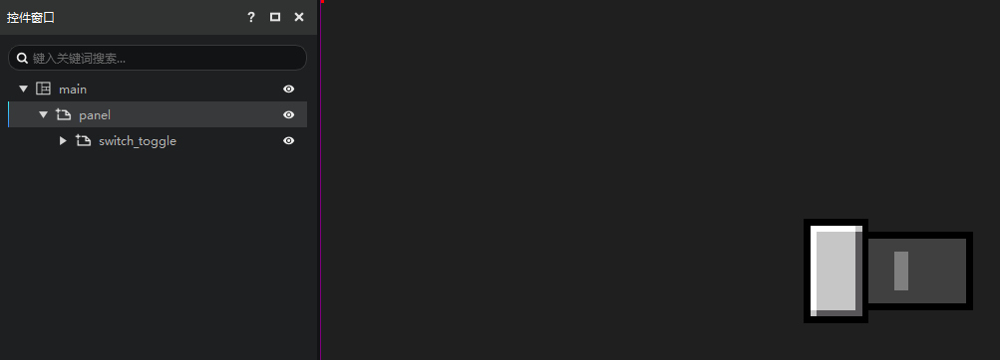 

If we forcefully expand the switch in the control window, we can see that the switch is composed of 8 universal controls, and different controls are displayed in different states of the switch. 

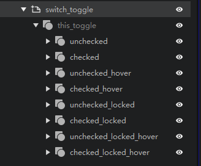 

Here we are not focusing on the variable area, but opening the "uncommon variable area", where we can see a large number of control references. For details on control references, please refer to [here](./15-Variable references and universal controls.md#Control references and universal controls). 

We will not make too detailed effects, and temporarily divide them into two groups: 

- All selected... properties: use MyToggleChecked control 
- All unchecked... properties: use MyToggleUnchecked control 

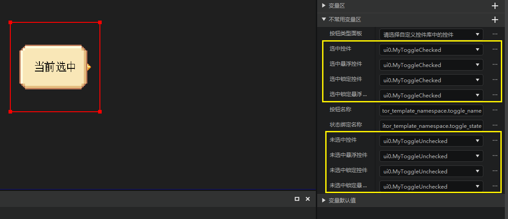 

That is, when the switch is turned on (selected), our switch will display the appearance of MyToggleChecked. 

When the switch is turned off (unchecked), our switch will display the appearance of MyToggleUnchecked.

### Reference the properties of custom controls in the switch 

In the step [Open property references and delete variables](#Open property references and delete variables)], we have created two properties, my_toggle_size and my_toggle_text, which we will use in the switch. 

We select the "+" in the switch_toggle variable area and choose to add the set variable. 

Here you can see the familiar my_toggle_size and my_toggle_text variables. Add them both. 

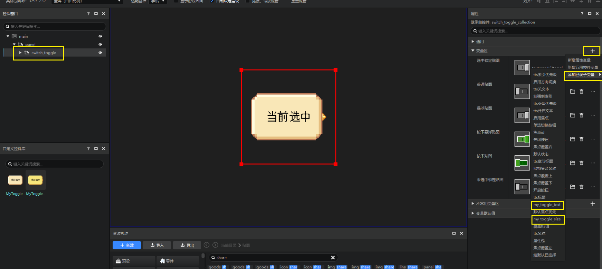 

The effect is as shown in the figure below. You can see that these two variables are added to the variable area of the switch, and they can control the properties of the same name of all universal controls under the switch. The attribute reference is matched with the variable name, that is: 

- The my_toggle_size variable of switch_toggle controls the my_toggle_size attribute of all red-framed child nodes (the size attribute of the panel) 
- The my_toggle_text variable of switch_toggle controls the my_toggle_text attribute of all yellow-framed child nodes (the content attribute of the text) 

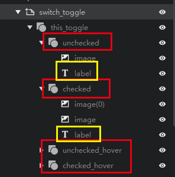 

You can adjust the value here to see the effect. 

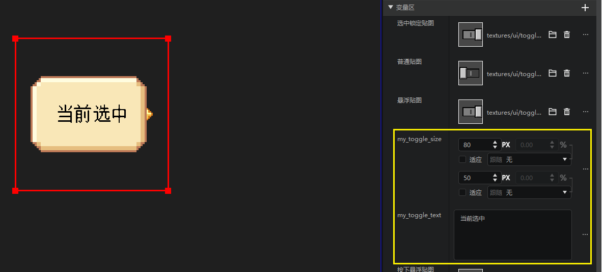 

If you want to adjust the size of each universal control by dragging the red frame of switch_toggle directly in the preview window, you can check the two "adapt" properties of my_toggle_size. 

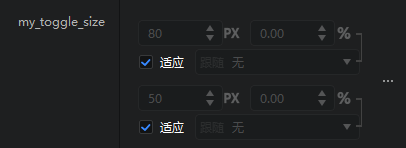 

## Test complex switch 

Use "New" in the resource manager to create an interface preset, refer to the figure below. 

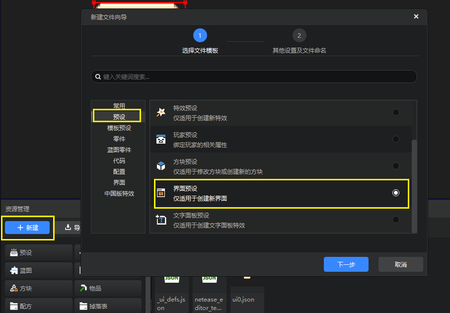 

On the second page of the New File Wizard, we don't need to modify it, just click Create. 

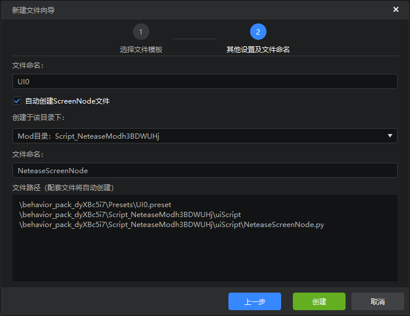 

The editor will automatically open the interface preset we just created, jump to the preset editor, and select the interface preset. 
In the property panel of the interface preset, check Preload and ensure that the bound interface canvas is the canvas that just contains switch_togggle. 

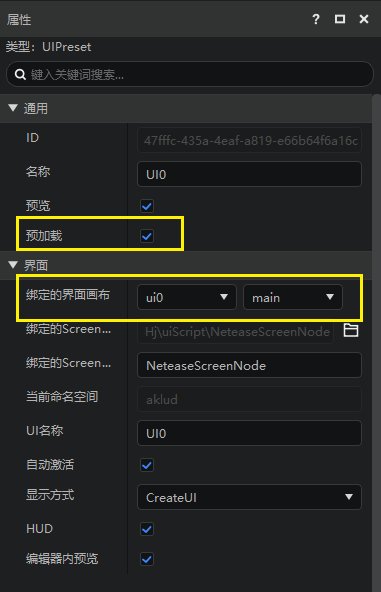 

Then click the run button in the upper right corner of the editor, select the latest stable version of the development package, and wait for the development package to open. 

Then press F11 to switch to simulated touch screen mode, and you can click this switch to switch. 

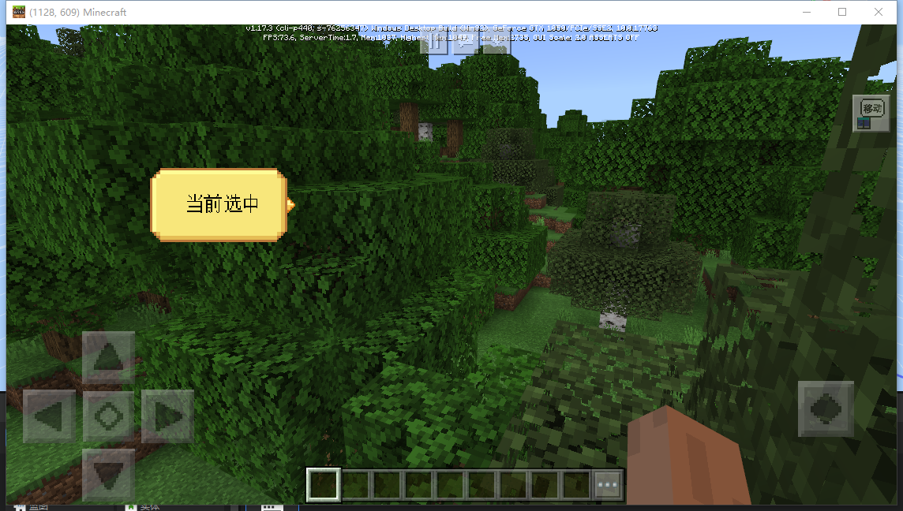 

The above is a simple example of a custom switch. For a more complex example of using this switch to implement a set of tab switches, please refer to [UI data binding](./70-UI data binding.md). 
