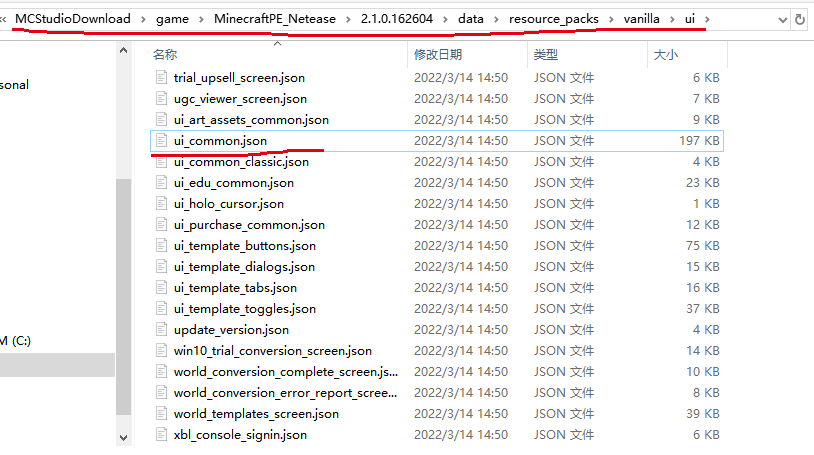
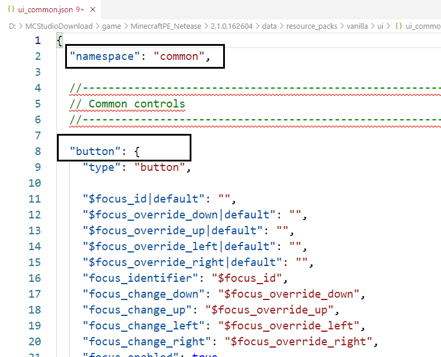
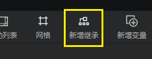
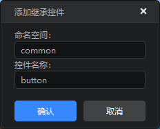
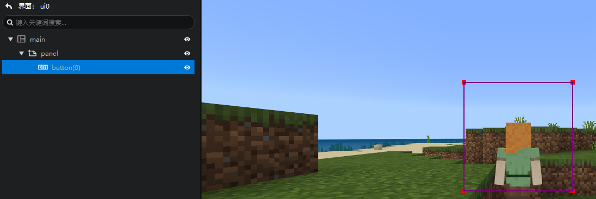
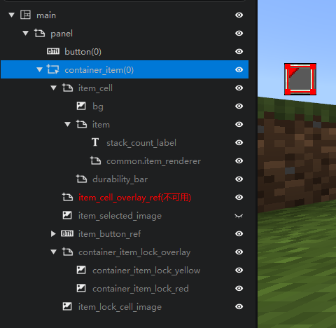

# Add native controls 

Inherited controls are widely used in Minecraft. We find the download path of the workbench and the ui directory in the resource pack, where we can see a large number of native interface files of Minecraft. 

The button we are most familiar with is actually a custom control defined in ui_common.json. 

 

When we open ui_common, the first thing that comes into view is button - the button used in Minecraft. 

Here we mainly focus on two pieces of information: 

- namespace of ui_common.json: common 
- name of the button control: button 

It will be used next. 

 

So, how to use native controls directly in your interface? 

1. Let's create an interface file first and attach a panel under the main canvas 
2. Select the panel and click the "Add Native Control" button in the function area 

 

3. Fill in the pop-up window as shown below. (Fill in the namespace common in the json file, and fill in the control name button in the json file) 

 

4. Click OK, and you will add a native button to your interface 

 

Of course, the native button is not so easy to use, so we still recommend that you use the button provided by the editor. 

Let's try another commonly used control: container_item, which is an item container widely used in various native interfaces. 

We try to expand it in the editor and see the internal structure of this control. 

Making good use of adding native controls can help you quickly build an interface similar to the native interface and learn how to write the native interface.

