--- 
front: 
hard: Getting Started 
time: minutes 
--- 

# Control Property Animation 

MC provides a set of property animation logic for some UI control properties. Using them can make your interface more exquisite and gorgeous. 

In a nutshell, interface property animation is to make a certain property value of a certain control in the interface change over time, and thus produce an animation effect. For example, the effect in the figure below is an animation of a uv property. 

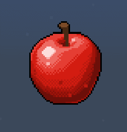 

All the following property animation examples can refer to the UIDemoModUI animation demonstration. The download location of the demo can be found [here](../20-Gameplay Development/13-Module SDK Programming/60-Demo Example.md). 

## Demo Introduction 

Import the above UIDemoModUI into Studio and open it with the editor. 

> By default, the old version of the editor will be used to open it. You need to click the upgrade button when you open it for the first time. The old version of the editor does not include property animation related functions. 

Double-click to open the UIAnimationScreen interface file. 

In essence, property animation is very similar to custom controls. Since property animation is mainly used for the animation of a specific control, it has no meaning to be displayed separately and will not appear in the custom control library at present. 

### Supported property animation types 

Not all control properties support animation. The currently supported properties are: 

- Displacement and size 
- Transparency 
- Cropping 
- Color 
- Sequence frame 
- UV animation 

For the same control, multiple properties can be set for property animation at the same time. All property animations will be automatically played after the interface is created. 

You can see that all currently supported properties exist in the picture control. All our subsequent examples will be based on the picture. 

### Create property animation 

Create a new interface file, and create a panel and a picture, as shown below. 

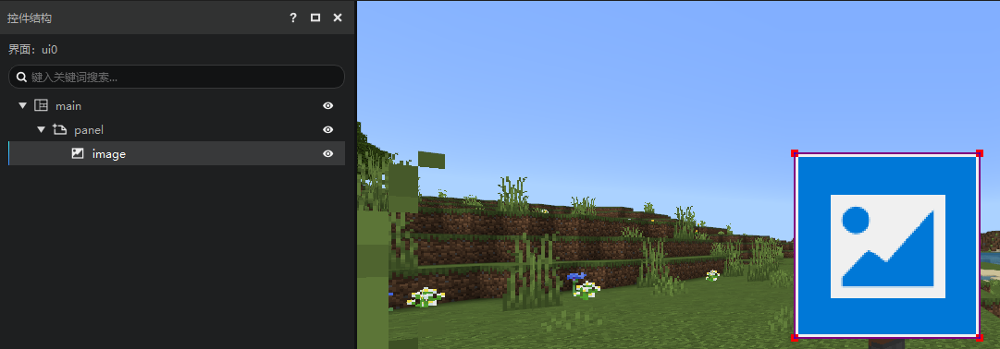 

Select the control to which you want to add animation, here is image, and then click the "Add Animation" button in the function area. 

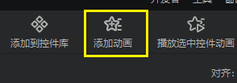


A pop-up window for adding animation will pop up, as shown below. 

- Reuse animation: Here you can select an animation from the custom control library, or leave it blank to create a new animation. 
- First animation name: The name of the created animation in the custom control library. 
- Property type selection box for property animation 

> If you reuse animation, the name of the first animation cannot be modified, and the name of the reused animation will be displayed. 
> The name of the first animation can be left blank, indicating that the animation is not added to the custom control library. It should be noted that if it is left blank, the first animation cannot be reused by other property animations, nor can it be played in a loop. 

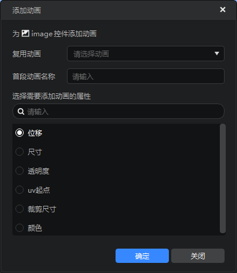 

After filling in the necessary information, click OK. Here we select transparency. 

### Edit property animation 

As shown below, you can see that in the property panel of the image control, the transparency property has changed from a value to a list. 

This list shows the details of the transparency property animation. 
The form of property animation in the editor is a list. Each element of the list represents an animation clip. When the animation is played, it will be played from the first element of the list to the last element. 

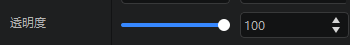 

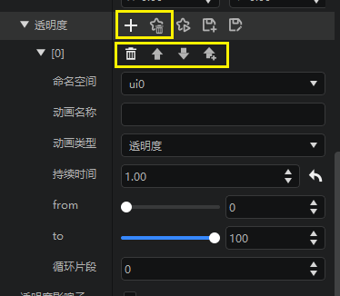 

The six buttons in the yellow box in the above picture have the following functions: 

- Add element: add a new animation clip to the animation 
- Cancel animation: cancel the animation of this property and restore it to a fixed value 
- Delete element: delete an animation clip 
- Move up: swap with the animation clip above 
- Move down: swap with the animation clip below 
- Create a new element above: insert an animation clip above 

> For canceling/deleting animation, if your animation is saved in a custom control library, this will not cause the information of the animation clip to be lost, and you can still reuse it from the custom control library. 

In addition to adding and deleting animation clips, modifying properties is the most common way to edit attribute animations. The properties of each animation clip are basically the same, and their meanings are: 

- Namespace: The namespace of the interface file where the animation is located. You can select other interface files in the drop-down box to switch the file where the animation information is saved. Generally, you don’t need to care about this property. 
- Animation name: The name of the animation clip in the custom control library 
- Animation type: Generally the same as the type of the property 
- Duration: The duration of this animation clip. After this period of time, the animation clip is finished and the next animation starts to play 
- From: The starting frame of the animation, that is, the attribute value when the animation starts to play 
- To: The final frame of the animation, that is, the attribute value when the animation is about to finish playing 
- Loop segment: Controls the last few segments of the animation to play in a loop 

> Except for the first animation, the animation name cannot be empty, that is, except for the first animation, the subsequent animation clips must be saved in the custom animation library. 
> In the same attribute animation, there cannot be two animation clips with the same animation name. 

As shown in the figure below, we add 2 additional animation clips and adjust the values as follows.


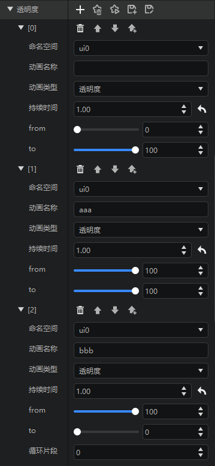 

### Save and save animation 

Due to the reuse logic, we provide two ways to save attribute animation 

- Create a copy, which is equivalent to saving as a new animation, and will create a series of new animations in the custom control library 

- Apply changes, modify the currently used animation, which will affect all custom controls that reuse this animation 

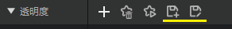 

> You must save before playing the animation, or switch to other controls, other editors 

### Play animation 

After saving, you can play the animation to preview the editing effect. We provide two preview methods. 

1. Click the play button of the property animation to preview this property animation separately 

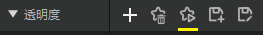 

2. Click the "Play selected control animation" button in the function area to preview all property animations of this control at the same time 

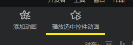 

For example, if we add a size animation to this control, the preview performance of method 2 is as follows: 

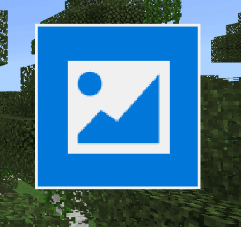 

### Animation loop 

Property animation supports looping, and you can define the segments involved in the loop. You can adjust the loop segment properties in the figure below. The loop rules are as follows: 

- For a property animation, only the last animation segment has the "loop segment" property 
- Only the last few animation segments can be looped 
- "Loop segment" = 0 means no loop 
- For example, if you fill in 5 animation clips, in order A→B→C→D→E, and "Loop Clip" = 3, then the actual playback order is A→B→C→D→E→C→D... (CDE loop) 
- "Loop Clip" cannot exceed the number of animation clips of the attribute animation 
- If the first animation has no name, it cannot participate in the loop 
- Sequence frame animation cannot be looped 

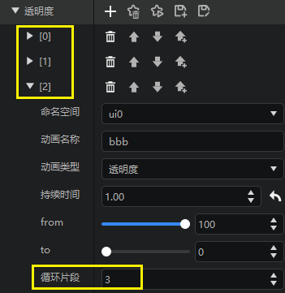 

### Cancel attribute animation 

Click the cancel button of the attribute animation to cancel the attribute animation and restore it to a fixed value state. 

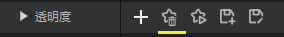 


> If the animation has been saved in the custom control library, canceling the animation will not delete the animation. 

### uv animation and sequence frame animation 

UV animation and sequence frame animation are both animations of the uv starting point attribute. Unlike other attribute animations, they can only use fixed animation clip types, which is quite special. 

We create a new picture and use my_eating_apple.png as the image resource. Then add an attribute animation, and select "uv starting point" as the animation type. As shown in the figure below, you can see 2 types of animations (switch through the drop-down box of the animation type). 

1. Sequence frame 

Sequence frame attribute animation is similar to sequence frame special effects. Both achieve animation effects by switching the display area of the image. Sequence frame animation mainly focuses on the following attributes: 

- Playback frame number: represents the total number of frames contained in the sequence frame texture resource. For example, the image we use contains a total of 36 states of the apple, so this value is filled in 36 

- Start frame: indicates which image is played in the first frame 

- Frame rate: the number of frames played per second. 10 means switching 10 images per second, a total of 36 images, and the time required for one playback is 3.6 seconds 

- Reversible: When checked, the sequence frame will be played back to the first frame after it is played 

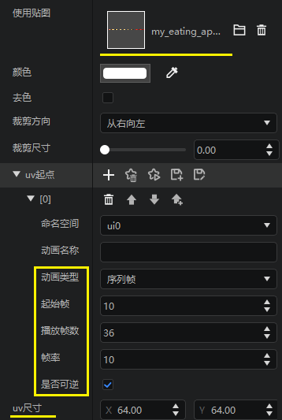 

When using sequence frame animation, the uv size of the image cannot be filled in [0,0]. The size of each frame of the sequence frame is filled in here. 

> For the images used in sequence frame animation, to achieve normal effects, the size of each sub-image must be consistent. 
> Sequence frame animation will self-loop, so there is no looping property. Because it will self-loop, the animation clips after the sequence frame animation will not be read. 

2. UV animation 

Switch the animation type from "sequence frame" to "uv" to make UV animation. UV animation is similar to other animations. Fill in the information in the figure below, save and play, and you can view the effect of UV animation. 

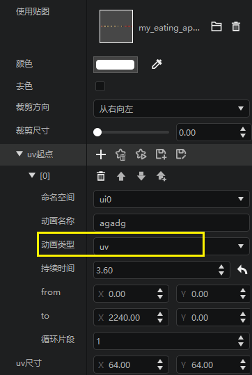 

## Introduction to Json writing of attribute animation 

Attribute animation is still written in the UI file in the form of Json data, and the format is similar to that of controls. 

To perform a property animation, you need to write a Json data block first. The transparency animation is as follows (the relevant parameters will be described in detail below): 

```json 
{ 
"anim_type" : "alpha", 
"duration" : 1.0, 
"from" : 0.0, 
"to" : 1.0 
} 
``` 

This code block represents a property animation of a control in which the alpha value changes linearly from 0 to 1 within 1 second. In order to bind this animation to the control, there are two ways to write it. 

One is to assign the Json data block directly to the alpha property: 

```json

{ 
"alphaImg" : { 
"alpha" : { 
"anim_type" : "alpha", 
"duration" : 0.30, 
"from" : 0.0, 
"to" : 1.0 
}, 
"texture" : "textures/netease/common/image/default", 
"type" : "image", 
"visible" : true 
} 
} 
``` 

Another way is to write the property animation as a custom control in the outermost layer of the UIjson file, and assign the alpha property value in the form of "@" + animation name: 

```json 
{ 
"alphaImg" : { 
"alpha" : "@show_alpha_ani", 
"texture" : "textures/netease/common/image/default", 
"type" : "image", 
"visible" : true }, 
"show_alpha_ani": { 
"anim_type" : "alpha", 
"duration" : 0.30, 
"from" : 0.0, 
"to" : 1.0 }, 
} 
``` 

Both methods can achieve the same effect, the difference is that the second method can be reused. 

Currently, the UI editor does not support the creation and editing of attribute animations, but the attribute animation defined by UIJson can be played in the UI editor. At this time, the attributes of the attribute animation mounted in the editor cannot be modified to take effect. 

## Property animation type and Json configuration 

### Common properties 

Common properties are properties supported by every property animation 

| <div style="width:150px">Variable</div> | Explanation | 
| :------------: | ----------------------------------------------------------- | 
| anim_type | Animation type, value ["alpha", "clip", "color", "flip_book", "offset", "size", "uv"]. Different animation types can only be assigned to corresponding properties. | 
| duration | Animation duration, in seconds. | 
| from | Animation start data. Depending on the animation type, the supported data types are different. When the control is initialized, the corresponding property will be initialized with this value. | 
| to | Animation end data. Depending on the animation type, the supported data types are different. |

| next | The animation that will be played after the current animation is finished. **Note 2** gives an example of a gradual animation that changes the alpha value of a picture control from 0 to 1 and then to 0. | 

* Note 1 

When filling in the attribute animation attribute value, please note that different animations may require different attribute value types or value ranges. Wrong filling will cause the animation to fail to take effect or behave abnormally. 

* Note 2

```json
        "alphaImg" : {
            "alpha" : "@show_alpha_ani",
            "texture" : "textures/netease/common/image/default",
            "type" : "image",
            "visible" : true
        },
        "show_alpha_ani": {
            "anim_type" : "alpha",
            "duration" : 0.30,
            "from" : 0.0,
            "next" : "@hold_alpha_ani",
            "to" : 1.0
        },
        "hold_alpha_ani" : {
            "anim_type" : "alpha",
            "duration" : 1,
            "from" : 1.0,
            "next" : "@hide_alpha_ani",
            "to" : 1.0 }, 
"hide_alpha_ani" : { 
"anim_type" : "alpha", 
"duration" : 0.30, 
"from" : 1.0, 
"to" : 0.0 
}, 

``` 

### Transparency animation 

Control transparency animation needs to be mounted on the "alpha" attribute value 

| <div style="width:150px">Variable</div> | Explanation | 
| :------------: | ----------------------------------------------------------- | 
| anim_type | "alpha" | 
| from | Transparency starting value, value 0-1.0. | 
| to | Transparency ending value, value 0-1.0. | 

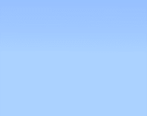 


```json
        "alphaImg" : {
            "alpha" : "@show_alpha_ani",
            "texture" : "textures/netease/common/image/default",
            "type" : "image",
            "visible" : true
        },
        "show_alpha_ani": {
            "anim_type" : "alpha",
            "duration" : 0.30,
            "from" : 0.0,
            "next" : "@hold_alpha_ani",
            "to" : 1.0
        },
        "hold_alpha_ani" : {
            "anim_type" : "alpha",
            "duration" : 1,
            "from" : 1.0,
            "next" : "@hide_alpha_ani",
            "to" : 1.0
        }, "hide_alpha_ani" : { 
"anim_type" : "alpha", 
"duration" : 0.30, 
"from" : 1.0, 
"to" : 0.0 
}, 

``` 

### Cropping animation 

Control clipping animation, need to be mounted on the "clip_ratio" attribute value of the image control 

| <div style="width:150px">Variable</div> | Explanation | 
| :------------: | ----------------------------------------------------------- | 
| anim_type | "clip" | 
| from | The starting value of the clipping degree, the value is 0-1.0. 0 means no clipping, 1 means full clipping, that is, the control is not rendered | 
| to | The ending value of the clipping degree, the value is 0-1.0. |

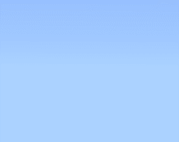

```json
        "clipImg" : {
            "clip_ratio" : {
                  "anim_type" : "clip",
                  "duration" : 1.0,
                  "from" : 0.0,
                  "to" : 1.0
               },

"texture" : "textures/netease/common/image/default", 
"type" : "image", 
"visible" : true 
}, 

``` 

### Color animation 

Control color animation, need to be mounted on the "color" attribute value of the image control 

| <div style="width:150px">variable</div> | Explanation | 
| :------------: | ----------------------------------------------------------- | 
| anim_type | "color" | 
| from | Color starting value, color (r, g, b) value range [0, 1], does not support alpha value attribute setting or animation | 
| to | Color end value | 

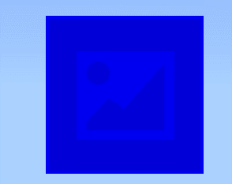 

```json 
"colorImg" : { 
"color": "@color_ani", 
"texture" : "textures/netease/common/image/default", 
"type" : "image", 
"visible" : true 
}, 
"color_ani": { 
"anim_type" : "color", 
"duration" : 1.0, 
"from" : [1,0,0], 
"to" : [0,0,1] 
}, 

``` 

### Sequence frame animation 

Control sequence frame animation needs to be mounted on the "uv" attribute value of the image control. 

Sequence frame animation, also known as frame-by-frame animation, is based on the principle of decomposing animation actions in "continuous key frames", that is, drawing different contents frame by frame on each frame of the timeline to make it play continuously into animation. Through a sequence frame animation resource map and some custom settings, you can display sequence frame animation on the image control. 

| <div style="width:150px">Variable</div> | Explanation | 
| :-----------------: | -------------------------------------------- | 
| anim_type | "flip_book" | 
| initial_frame | UV animation starting frame | 
| frame_count | Number of frames, representing the total number of frames contained in the sequence frame texture resource | 
| fps | Frame rate, the number of frames played per second | 
| reversible | Whether it is reversible, the default value is false, when true, the sequence frame will be played back to the first frame after it is finished | 

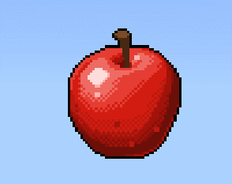


```json 
"flipbookImg" : { 
"texture" : "textures/ui/my_eating_apple", 
"type" : "image", 
"uv" : "@flipbook_ani", 
"uv_size" : [ 64.0, 64.0 ], 
"visible" : true 
}, 
"flipbook_ani": { 
"anim_type": "flip_book", 
"initial_frame": 10, 
"frame_count": 36, 
"fps": 10, 
"reversible": false 
}, 
``` 

When an image control is used as a carrier of sequence frames, the property configuration of the control has the following rules to follow: 

| <div style="width:150px">Variable</div> | Explanation | 
| :-----------------: | -------------------------------------------- | 
| texture | The path of the texture, the texture needs to conform to the sequence frame style, as shown below | 
| uv | Sequence frame is essentially a special uv animation. | 
| uv_size | The uv size indicates the size to be displayed, which should be the same as the size of a frame in the sequence frame map | 

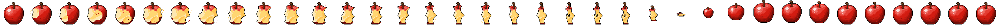 

### Displacement animation 

Control displacement animation needs to be mounted on the "offset" attribute value of the control 

| <div style="width:150px">Variable</div> | Explanation | 
| :------------: | ----------------------------------------------------------- | 
| anim_type | "offset" | 
| from | Displacement start value, the offset of the parent node, see [Common Properties](./30-UI Description Document.md#Common Properties) for details | 
| to | Displacement end value | 

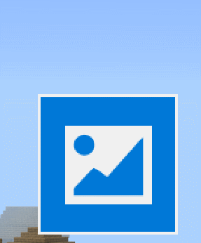 

```json 
"offsetImg" : { 
"offset" : "@offset_ani",
            "texture" : "textures/netease/common/image/default",
            "type" : "image",
            "visible" : true
        },
        "offset_ani": {
            "anim_type" : "offset",
            "duration" : 1.0,

"from" : [0, 0], 
"to" : [0, 50] 
}, 

``` 

**Note** 

Displacement animation requires the same offset type for the start value and the end value. For example, if the start value is ["50%", 0], the end value needs to be ["100%", 50], that is, the type of change must be consistent. 

If you need to call the interface to dynamically modify the size of the control, please avoid using <a href="../../mcdocs/1-ModAPI/接口/自定义UI/UI控制.html#SetSize">SetSize</a> and use <a href="../../mcdocs/1-ModAPI/接口/自定义UI/UI控制.html#SetFullSize">SetFullSize</a> instead. 

If you need to call the interface to dynamically modify the offset property of the control, please avoid using <a href="../../mcdocs/1-ModAPI/接口/自定义UI/UI控制.html#SetPosition">SetPosition</a> and use <a href="../../mcdocs/1-ModAPI/界面/自定义UI/UI控制.html#SetFullPosition">SetFullPosition</a> instead. 

### Size animation 

Control size animation, needs to be mounted on the "size" attribute value of the control 

| <div style="width:150px">Variable</div> | Explanation | 
| :------------: | ----------------------------------------------------------- | 
| anim_type | "size" | 
| from | Size starting value, control size, see [Common Properties](./30-UI Description Document.md#Common Properties) for details | 
| to | Size ending value | 

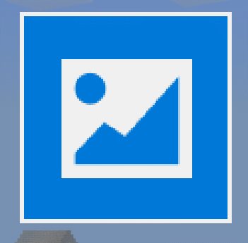 

```json 
"sizeImg" : { 
"size" : "@size_ani", 
"texture" : "textures/netease/common/image/default", 
"type" : "image", 
"visible" : true 
}, 
"size_ani": { 
"anim_type" : "size", 
"duration" : 1.0, 
"from" : [100, 100], 
"to" : [150, 150] 
}, 

``` 

**Note** 

Size animation requires the same offset type for the start value and the end value. For example, if the start value is ["50%", 0], the end value needs to be ["100%", 50], that is, the type of change must be consistent. 

If you need to call the interface to dynamically modify the size of the control, please avoid using <a href="../../mcdocs/1-ModAPI/接口/自定义UI/UI控制.html#SetSize">SetSize</a> and use <a href="../../mcdocs/1-ModAPI/接口/自定义UI/UI控制.html#SetFullSize">SetFullSize</a> instead. 

If you need to call the interface to dynamically modify the offset property of the control, please avoid using <a href="../../mcdocs/1-ModAPI/接口/自定义UI/UI控制.html#SetPosition">SetPosition</a> and use <a href="../../mcdocs/1-ModAPI/界面/自定义UI/UI控制.html#SetFullPosition">SetFullPosition</a> instead. 


### UV animation 

Control UV animation needs to be mounted on the "uv" attribute value of the image control 

| <div style="width:150px">Variable</div> | Explanation | 
| :------------: | ----------------------------------------------------------- | 
| anim_type | "uv" | 
| from | Initial value of uv coordinates. The uv coordinates are [x,y], which means that the image control takes the upper left corner of the selected image as the origin and starts to capture the image with an offset of (x,y) pixels. | 
| to | uv coordinate end value | 

 

```json 
"sizeImg" : { 
"uv" : "@uv_ani", 
"texture" : "textures/netease/common/image/default", 
"type" : "image", 
"visible" : true 
}, 
"uv_ani": { 
"anim_type" : "uv", 
"duration" : 5, 
"from" : [0, 0], 
"to" : [2240, 0] 
}, 

``` 
