--- 
front: 
hard: Getting Started 
time: minutes 
selection: true 
--- 

# Create a UI interface from scratch 

This tutorial will introduce in detail how to create a basic FPS combat interface through the UI editor embedded in the workbench. The tutorial includes the creation of interface controls (including panels, images and buttons) and button-related logic binding. The following steps will be introduced: 
* How to use the UI editor to edit and save the interface according to your needs 
* How to perform button logic python related binding based on the content in json 

## Use the UI editor 

Our goal is to make a simple shooting template. 

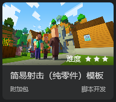 

Realize some functions of this template mobile version interface. 

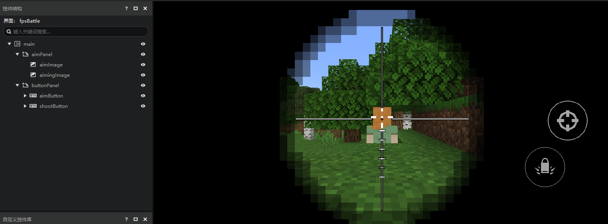 

### Enter the UI Editor 

Open the MC workbench and click Create Blank AddOn. 

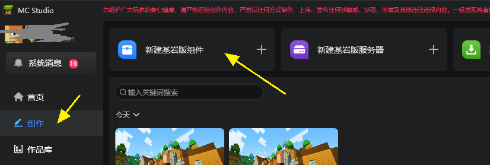 

Select Blank Add-on, fill in the information in the pop-up window of "Create a New Blank Add-on", and click Start Editing to enter the editor. 

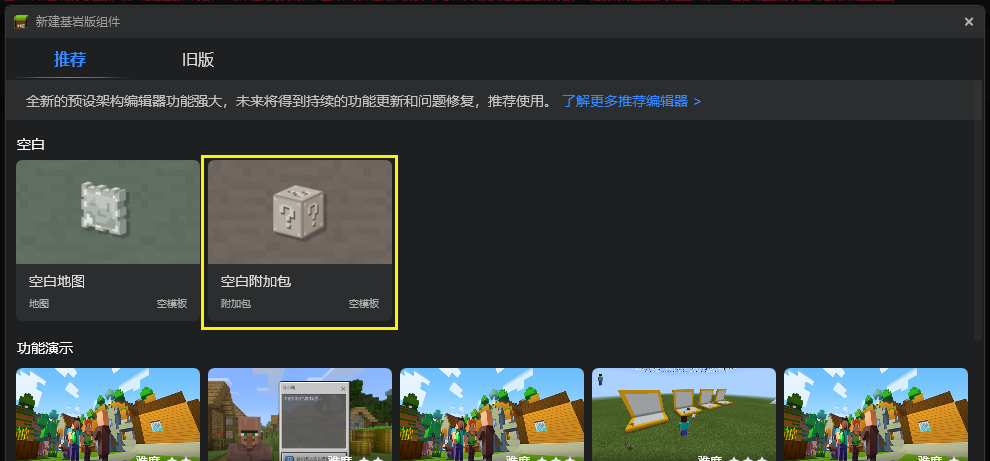 

After entering the editor, you need to switch to "Interface" through the top tab to open the interface editor, as shown below: 

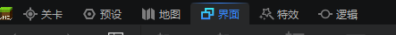 

### Import UI resources 
First, we import the images needed to make the interface through the resource manager window of the UI editor and select the image file. As shown below. 

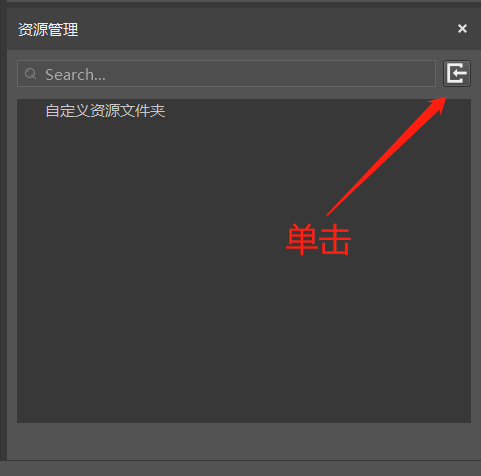 

Note that we currently only support image files in png format. In addition, image names only support names composed of numbers, letters, and underscores. This naming rule is also the common naming rule of the entire UI editor. If the above rules are not met, resource import will fail. 

Click here to download the image resources required for the interface: [Simple shooting template interface texture resources](https://g79.gdl.netease.com/awesome_ui_textures.zip). 

The resource management window after successfully importing the image is shown in the figure below. Switch to textures in the simplified mode of the resource manager to see all the textures. 

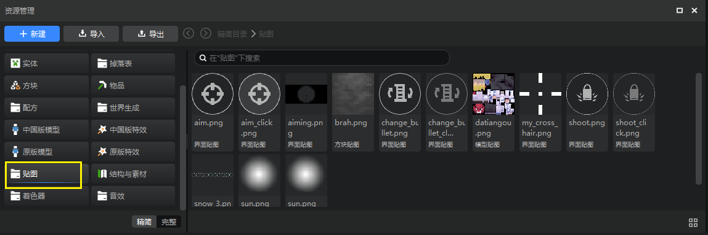 


If you use the full mode, the UI textures are in this directory (root directory\resourcepack\textures\ui). For more information about resource management, please refer to [File Structure](../15-Resource Management/2-File Structure.md). 

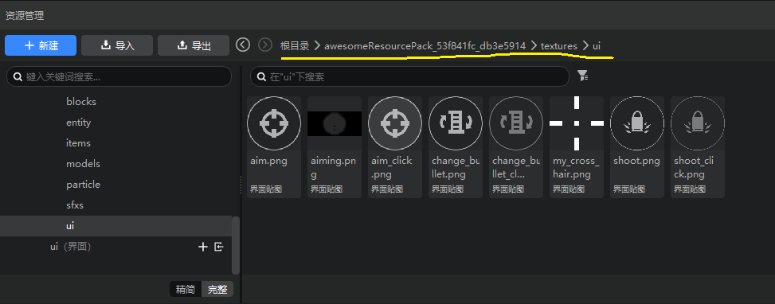 

> The textures in the simplified mode do not distinguish the specific uses, and all the textures in the work directory are displayed. You can use the textures in other directories. If it is not in the ui folder, the editor will automatically copy a copy to the ui folder for you. 

### Create a new UI file 

Now let's create an interface file: 

1. Use the New button in the Resource Manager 
2. Select the interface file in the New File window that pops up and click Next 
3. Fill in the file name, here we name it fpsBattle, and click Create 

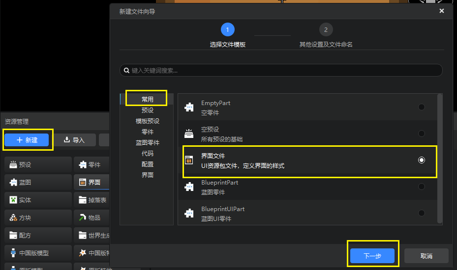 

After successfully creating a new UI file, the UI editor will automatically load the edit mode of the UI file and come with its own main canvas. The overall interface is shown in the figure below. You can switch the Resource Manager (Simple Mode) to the interface, where all interface files will be displayed. 

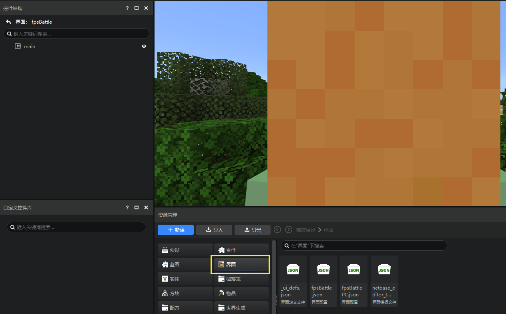 

If you like the full mode, the path to the interface file (root directory\resourcepack\ui) is as shown below. 

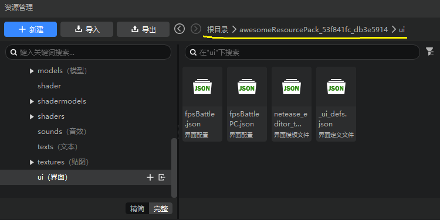 

As you can see, the huge yellow pixel block in the middle of the preview window is Alex's cute back of the head. If you want to focus on interface editing and don't want to be disturbed by the game, you can turn off the "Show game screen" option. 

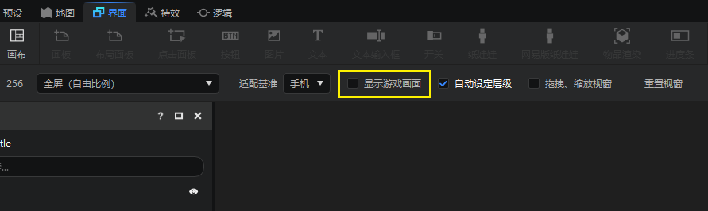 

### Create panel panel controls 

First, we create two panels. Panel is the most basic of all controls. It has no exclusive properties except for common properties. It is mainly used to summarize controls, just like a folder. Creating a panel is the same as creating all other controls. We left-click to select main, then right-click to pop up the menu, select "Add Object"-"Panel", as shown below. 

 

Or drag the panel control in the control library directly to the main control in the control structure to complete the creation, as shown below. 

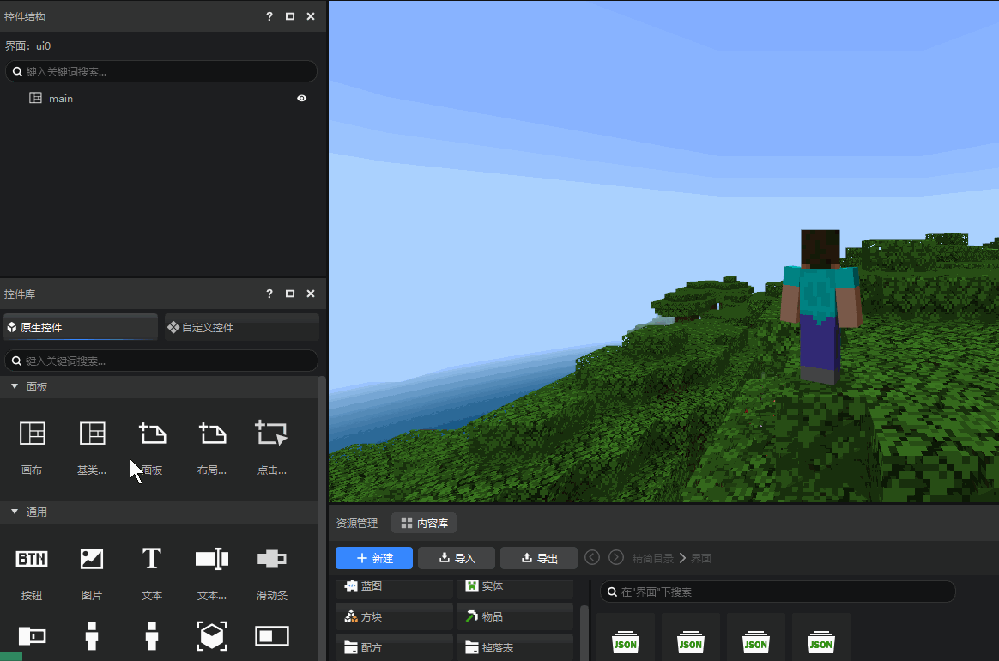 

You can also select main in the control structure first, and then drag the panel directly to the preview window, as shown below. 

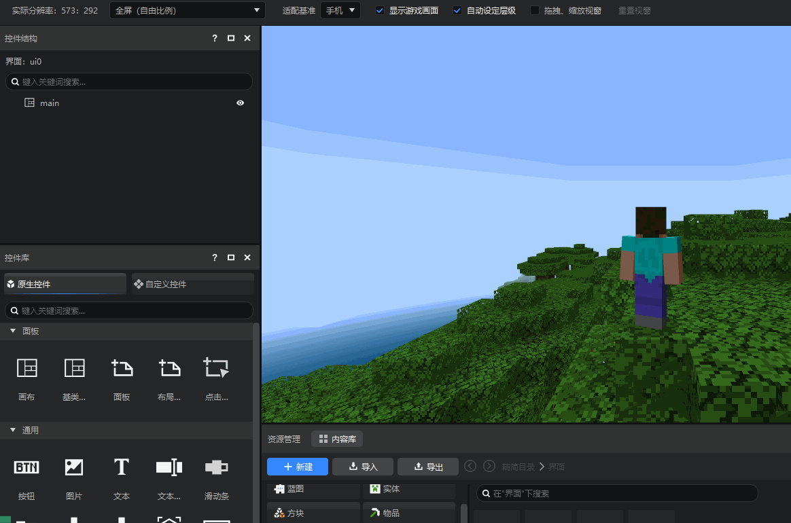 

### Rename the control 
After creation, rename the two panels. Click to select the panel to be renamed and modify its name in the property panel on the right, as shown below. Rename it to aimPanel and buttonPanel to store the crosshair picture control and all button controls respectively. 

 

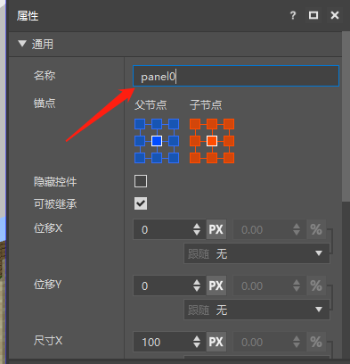 

### Create a crosshair picture control

After the panel is created successfully, we create the crosshair, which is usually an image. Just like creating a new panel, we select aimPanel and create a new image control. In this way, the newly created control will use aimPanel as the parent node. Then rename it to aimImage, as shown below. 

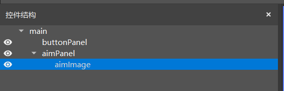 

After the creation is completed, select the image control. We want to replace its image. Slide down the property window to the "Image" column. We drag the previously imported image resource to the texture setting to assign it. After completion, the image in the scene will change from the default image display to the image display we imported, as shown below. 

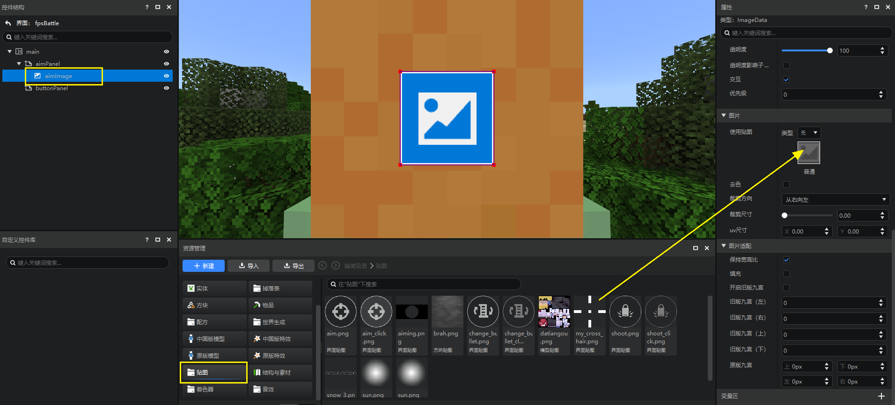 

After the image is set, we can adjust the position of the control relative to the parent node by adjusting the anchor point, size and displacement. The three properties are described as follows: 

Anchor point: Each control has 9 anchor points, including four corners, the midpoints of the four sides, and the center point. The anchor point can set which anchor point of the child control coincides with which anchor point of the parent control. The left side of the figure below corresponds to the parent control and the right side corresponds to the child control. 

Displacement: Displacement is used to control the offset of the control relative to the anchor point position. The displacement is in the form of %+Px. % represents the percentage of the parent control size, and Px represents pixels. 

Size: The size is the width (X) and height (Y) of the control. It is also in the form of %+Px, and its meaning is the same as displacement. 

Generally speaking, the offset and size of the control can be configured with Px, and % is only needed in more complex situations. Here we just briefly summarize the role and usage of control properties. For details, please go to [Controls and Control Properties](./10-Controls and Control Properties.md). 

We adjust aimPanel and aimImage as follows, and the interface after setting is as shown below: 

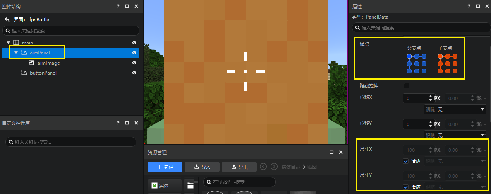 

<center>aimPanel attribute</center><br> 

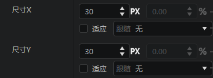 

<center>aimImage attribute</center> 

### Create an aiming button control 
After the crosshair is completed, we will then make an aiming button. Select buttonPanel and create a button control with this node as the parent node and name it aimButton. The steps are the same as creating an image control. 

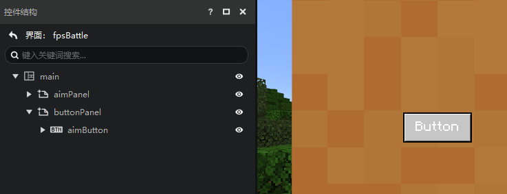 

Set the properties of buttonPanel, which are the same as aimPanel, so no separate screenshots are required. 

Set the properties of aimButton as shown below. 

> The values of displacement XY can be positive or negative 
> 
> - For displacement X, **positive numbers indicate displacement to the right**, and negative numbers indicate displacement to the left 
> - For displacement Y, **positive numbers indicate downward displacement**, and negative numbers indicate upward displacement 

Since our anchor point is set at the lower right corner, we need this button to be displaced to the upper left relative to the anchor point, that is, the final values of displacement XY need to be negative. 

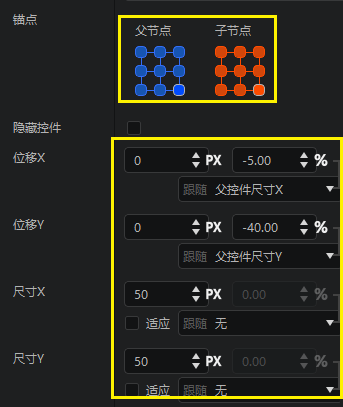 

<center>aimButton attribute</center> 

This setting ensures that regardless of the screen ratio or resolution, the button is always in the middle right, and the outer frame size is a square. 


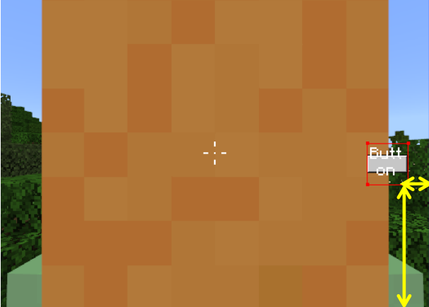 

Unlike the image control, the button control has three image states to set, corresponding to the default state, the pressed state and the mouse hover state. For the mouse hover state, we use the same image as the pressed state. Drag the image to the corresponding texture position as follows. The images of the two states are: 

- Normal texture: aim.png 
- Pressed texture: aim_click.png 

In addition, because the aiming button does not require button text, we can also set the button text in the button properties to empty. 

Because we are going to make a mobile version of the interface, we don't care about the hover texture (if it is a computer version, the hover image must also be provided). 

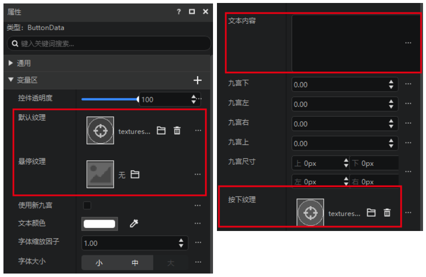 

So far, your interface should be like this: 

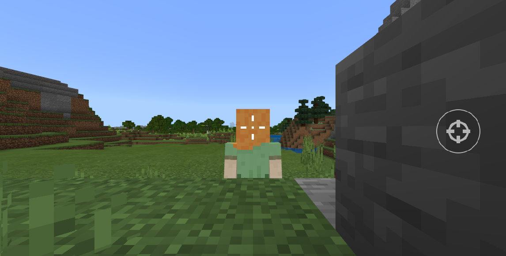 

### Create a scope control 

Next, we create the scope image control aimingImage, and create the image control with aimPanel as the parent node. After the creation is completed, check the size XY adaptation to make the image fill the screen. 

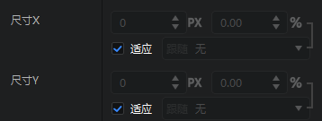 

Drag the scope image to assign the value, as shown below. 

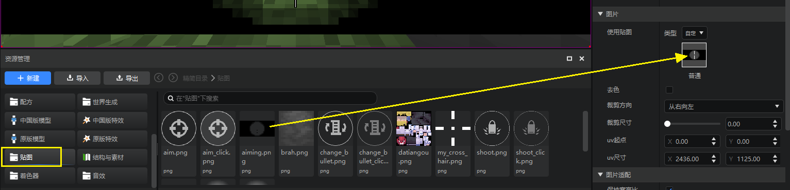 

After the assignment is completed, the interface is as shown below. 

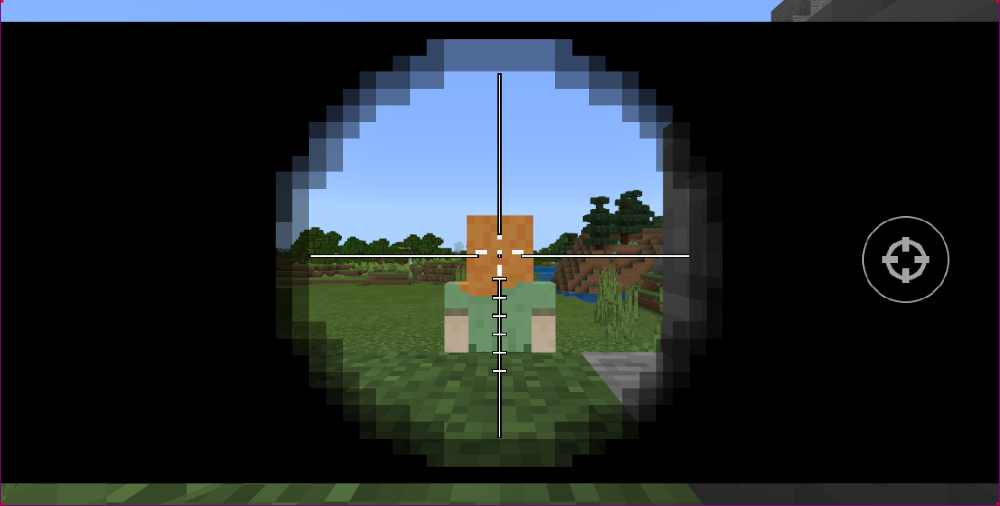 

By default, the UI system will default to the original ratio of the image, as shown above, you need to uncheck the image's aspect ratio. 

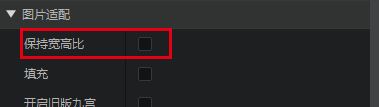 

### Adjustment Level 

If your scope image blocks your aim button, it may be because your aimPanel blocks the buttonPanel. Please make sure your buttonPanel is below the aimPanel. The editor rule is that the controls below will block the controls above. Only the following order can ensure that the aiming button can normally block other controls. 

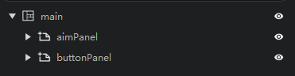 

If you don't want the occlusion relationship of the controls to be controlled by the order of the controls, then you need to uncheck the automatic setting of the hierarchy. 

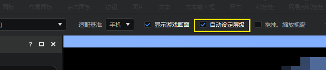 

After canceling the automatic hierarchy, you can manually modify the hierarchy properties in the property panel. The interface with a larger hierarchy will block the interface with a smaller hierarchy. 

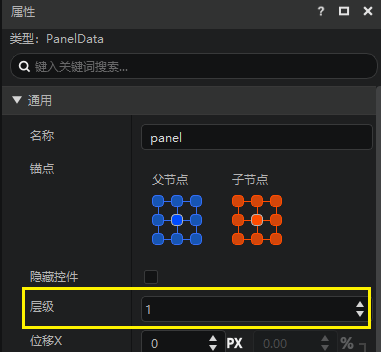 

Note: Once the automatic level is unchecked, it cannot be checked again.


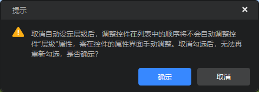 

### Perfect our UI 
By analogy, we create a new shootButton under buttonPanel to simulate the left-click shooting button, and adjust their anchor points, sizes, and positions to reach the correct position, as shown below. 

 

The reference properties of the anchor point, displacement XY, and size XY of shootButton are as follows. Filling in this way can ensure that after the screen is stretched or shrunk, the position and size of the two button controls shootButton and aimButton relative to buttonPanel change normally. You can drag and scale the preview window in the editor to observe this effect. 

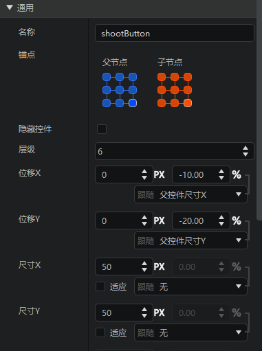 

### Save UI file 

After the interface is completed, click the Save button in the upper right corner, as shown below, and the UI file is completed. 

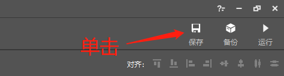 

After saving successfully, the fpsBattls.json file will be output to the ui folder of the mod archive resource package, as shown below. 

 

## Create python logic 
From the description in the previous part, we can know that the json file created by the UI editor is only responsible for the interface layout and the initial state of each control attribute. The UI in the game not only contains layout but also specific interface logic, which requires us to implement it through python code. 

This document mainly focuses on interface creation, and the code part can refer to the template of the workbench.

 

We open the level editor, and you can see a UI logic part and a PE version UI interface under the permanent on the stage. 

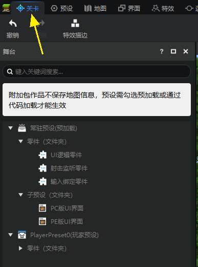 

Click "PE version UI interface" on the stage, and you can see in its property panel that this interface preset is bound to the interface file we just created. For details on the use of interface presets, see: [Interface Presets](../20-Gameplay Development/11-Assembly Simple Gameplay/10-Presets/5-Interface Presets.md). 

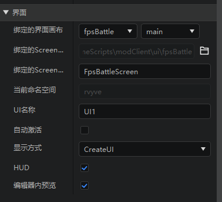 

Click "UI Logic Part" on the stage, and click the supporting file - script - open file button in the property panel to open its script file. 

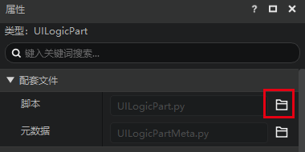 

The following code snippet is taken from this script, and the effect achieved is 

1. When the OnUIInitFinished event of the engine is triggered 
2. Get the platform (PC or PE) on which the current Mod is running 
3. Then activate (display) the corresponding interface preset 

```python

	def InitClient(self):
		import mod.client.extraClientApi as clientApi
		self.ListenForEngineEvent(UiInitFinishedEvent, self, self.OnUIInitFinished)
```

```python
	def OnUIInitFinished(self, args):
		import mod.client.extraClientApi as clientApi
		if clientApi.GetPlatform() == 0:
			uiNodePreset = self.GetParent().GetChildPresetsByName("PC version UI interface")[0]
		else:
			uiNodePreset = self.GetParent().GetChildPresetsByName("PE version UI interface")[0]
		if uiNodePreset:
			uiNodePreset.SetUiActive(True)
```

We utilize [UI The API document](40-UIAPI document.html) contains the interface of each control and the formatting supported by the game natively. You can dynamically change the interface performance in Python code. For details, please refer to [Style Code](https://minecraft-zh.gamepedia.com/index.php?title=%E6%A0%B7%E5%BC%8F%E4%BB%A3%E7%A0%81&variant=zh) 

Of course, more API functions still require your discovery and experimentation. 

