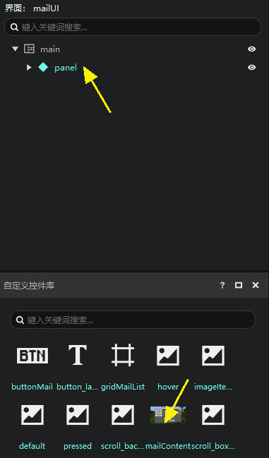
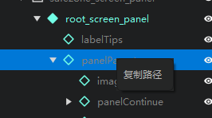

--- 
front: 
hard: Getting Started 
time: minutes 
--- 

# Interface adaptation for different resolutions 

## Preview the effects at different resolutions 

In the interface editor, you can find a series of resolution-related options as shown below 

 

We provide simulations of various common resolutions in the interface editor. You can select the resolution you want to adapt to view the effect. 

 

As shown in the figure below, you can see that the resolution currently selected is the full-screen mobile phone (2160×1080). There is also an actual resolution on the left, which shows that the actual resolution of "Minecraft" in the current preview window is 540:270, which is determined by the adaptation rules of "Minecraft" itself, see the [Adaptation Principle](#Adaptation Principle) below. 

It should be noted that all pixels in the game are calculated according to the actual resolution, and the actual resolution is usually much smaller than the screen of a mobile phone or computer, so when you set the displacement size, if you need to fill in pixels directly, you need to pay special attention to the adaptation problem. 

 

## Adaptation Principle 

The resolution of mobile phones is diverse. If you want to adapt to more resolutions as much as possible, you need to understand the interface adaptation method in "Minecraft". The sizes involved in adapting the interface are as follows: 

 

The canvas is generally the same size as the screen, and in a few cases it may be smaller than the screen, which is determined by the system and player settings. 

As we have already known, the size of a control is a percentage plus a fixed pixel value. When the system calculates the actual display size of the control, it multiplies all fixed pixels by a ratio a. For example: 

| | **Canvas size** | **Parent control size** | **Subcontrol set size** | **Subcontrol actual display size** | 
| ------ | ------------ | -------------- | ------------------ | ---------------------- | 
| **Width** | 900Px | 800Px | 10%+50Px | 80Px+50Px\*a | 
| **Height** | 750Px | 750Px | 20%+100Px | 150Px+100Px\*a | 

So how is the ratio a determined? The system will calculate this ratio as follows: 

1. **Calculate the value of the canvas width divided by 320 and the canvas height divided by 210**. In the above example, these two values are 900/320=2.81, 750/210=3.57. 
2. **Calculate the maximum value of a**. The two ratios calculated in 1) are rounded up, and then the minimum value is taken as the maximum value of a. In the above example, the two ratios are rounded to 2 and 3 respectively, and the minimum value is 2. 
3. **Calculate the final value of a**. According to certain rules, a value smaller than that in 2) is obtained as the final value of a. Developers do not need to care about this rule. Generally speaking, the final value is the same as the maximum value calculated in 2). 

In the above example, the value of a is 2, so the width of the control display is 80Px+50Px\*a=180Px, and the height is 150Px+100Px\*a=350Px. 

In layman's terms, there is a 320Px\*210Px adaptation area in the game (the purple solid line part in the figure below). The game expands this adaptation area by integer multiples until it exceeds the canvas. Then multiply this integer ratio by the fixed pixels in the control size, and add the pixels calculated by the ratio part as the final control display size. 

Therefore, if we want the UI to not exceed the screen boundary under various screen resolutions, we can set the size of the parent control that determines the display range (such as the top-level panel control) to a fixed size, and the value should be below 320\*210. It should be noted that the texture does not need to be limited to this size, and the texture size can be appropriately enlarged to achieve better results on large-resolution screens. 

In addition, in the PC Bedrock Edition, the adaptation benchmark value is 376x250, which is slightly larger than the 320x210 adapted for mobile phones. If you want an interface resource to adapt to both mobile phones and PC Bedrock Edition, you need to make it according to the mobile phone standard. 

## Alien screen adaptation and base class canvas 

If you are making a mobile phone mod, you may encounter a situation where the player's screen is an alien screen, such as a punch-hole screen, a bangs screen, etc. 

There is a simple way to adapt, which is to use the base class canvas. If you plan to adapt to special-shaped screens, it is best to use the base class canvas from the beginning. If you are halfway done, you can do this (we take the email interface of the interface template as an example): 

1. Create a new panel under the main canvas and check the XY adaptation of the panel size. 
2. Drag other controls under the original main canvas to the panel (surface 

 

1. Right-click the panel to add it to the control library. Here we name it mailContent. The result is as shown below 

 

> This operation is to allow all the contents under the main canvas to be stuffed into the same custom control. If there is only one instance of a custom control under your main canvas, you can skip this step, or if there is only one direct child node under the main canvas (don't pay attention to grandchild nodes, etc.), then just create this only child node as a custom control. 

1. Create a base class canvas, select the mailContent you just created in the variable area of the canvas's properties panel, and you have completed the use of the base class canvas. 

 

> If you created variables on the canvas before, unfortunately, you have to create them again manually. 

You may have noticed that if you use the base class canvas, you cannot edit the control directly under the base class canvas, but need to edit this custom control. 

 

The base class canvas actually uses [control reference](./15-Variable reference and universal control.md#Control reference and universal control). 

Expand the screen canvas, and then continue to expand it as shown in the figure below. You can see that this root_screen_panel is actually a universal control. 

Continue to expand, and you will see the content of the familiar mailContent control. 

 

You can easily copy the path here, and the copied path can be directly used in the SDK code of the module. 

 

As you can see, after enabling the base class canvas, the path has changed significantly, so we strongly recommend that you think about whether to use the base class canvas before making the UI. 

