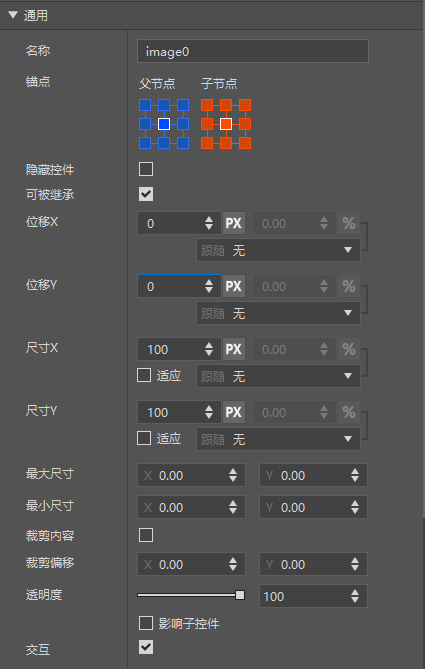
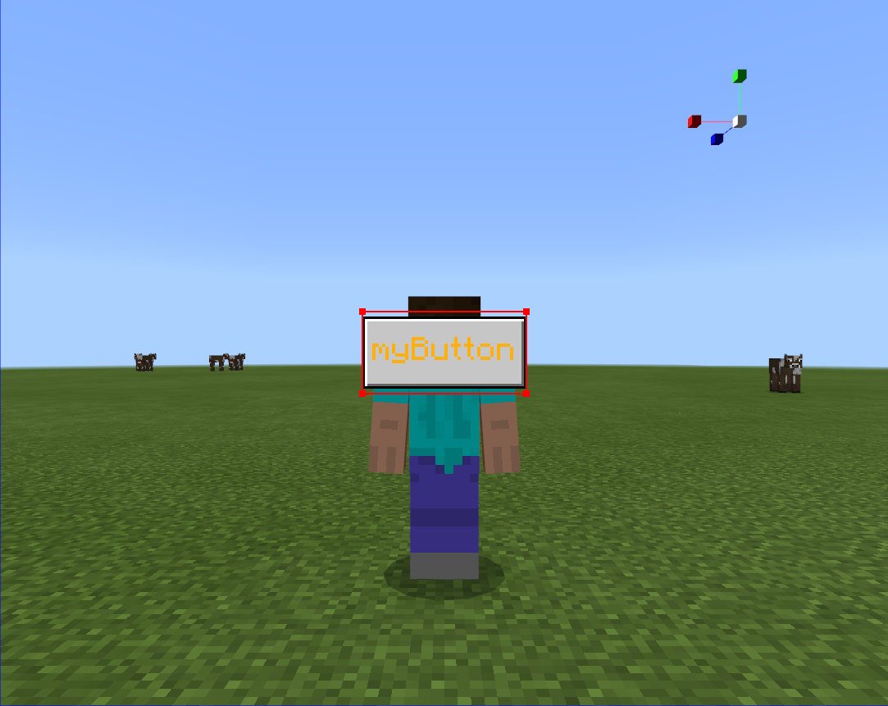
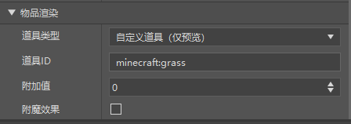
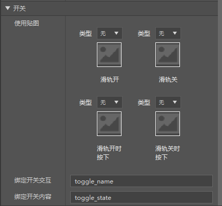

--- 
front: 
hard: Getting Started 
time: minutes 
--- 

# UI documentation 

## File naming instructions 

* json file name namespace in json python file name The three must be consistent 

* "myUIName" in the example 

```json 
myUIName.json 

"namespace" : "myUIName" 

myUIName.py 

``` 

## JSON writing instructions 

Json is a collection of UI interface display content and bindings. UI is a tree-like organizational structure. The interface and the controls in the interface are all UI Node nodes. Many subsequent method calls also require the path of this tree structure to identify. 

* Note: MCStudio currently provides a UI editor. Developers can visually edit the interface in the UI editor and export a usable json file. The use of each control in the UI editor will be introduced in detail below. 

### Namespace 

Namespace is the name of this interface. We stipulate that the json file name is consistent with the namespace. 

```json 
"namespace" : "myUIName" 
``` 

### Main Screen 

main is the name of this interface. We stipulate that main is used, that is, one json file is one interface. 

The content in controls is the tree node under this interface, that is, the child node. 

```json 
"main@common.base_screen" : { 
"controls" : [ 
] 
} 
``` 


| Variable | Explanation | 
| :---------------------: | :-------------------------------------------- | 
| main@common.base_screen | Indicates that main screen is a subclass of common.base_screen | 

``` 
my_namespace 
|____main 
|test_image 
|test_panel 
|test_label 
``` 

* Regarding the adaptation of controls, fixed-size pixels can keep the shape and size unchanged when the screen pixels change, while percentages can maintain a consistent ratio with the screen resolution, which may cause the control to deform. 

### Root node path changes in special cases 

Generally, when using the UI API, we need to pass in the relative path of the control relative to the display screen to operate the control instance, such as the following UI interface structure 

``` 
my_namespace 
| main 
| panel0 
| text0 
``` 

The path of text0 is 

``` 
path = "/panel0/text0" 
``` 

However, when the display screen inherits common.base_screen in order to use native functions, the effectiveness of some functions will be accompanied by the modification of the root node path, so the path of the control has changed when using the UI API. 

#### Adapting to special-shaped screens 

In order to adapt to special-shaped screens, we can write the content in the display screen in the $screen_content attribute of the screen by reference. 

```json
	"main@common.base_screen" : {
		"$screen_content":"myUIName.panel0"
    },
    "panel0":{
        "controls" : [
            {
                "text0@myUIName.text0" : {}
            }
        ],
        "type" : "panel"
    },

"text0" : { 
"text" : "Hello World!", 
"type" : "label", 
"visible" : true 
} 
``` 

The content referenced by $screen_content will not be blocked by the special-shaped screen. At this time, the path of text0 is 

``` 
base_path = "/variables_button_mappings_and_controls/safezone_screen_matrix/inner_matrix/safezone_screen_panel/root_screen_panel" 
path = base_path + "/text0" 
``` 

It can be seen that the path of the control relative to the relative path of the display screen needs to be added with the base_path path to correctly obtain the path of the corresponding text0 control, and the API related to text0 will take effect. 

## Control Introduction 

### screen 

Screen, that is, canvas control, is the root node of a UI interface in the game. All other controls can only be displayed correctly when they are hung under the canvas.

```json
"main1" : {
      "absorbs_input" : true,
      "always_accepts_input" : false,
      "controls" : [
         {
            "label0@test.label0" : {}
         }
      ],
      "force_render_below" : false,
      "is_showing_menu" : true,
      "render_game_behind" : true,
      "render_only_when_topmost" : true,
      "should_steal_mouse" : false,
      "type" : "screen"
   },
   "main2@common.base_screen" : {
      "$screen_content" : "test.netease_editor_root_panel_base_screen0",
      "absorbs_input" : true,      "always_accepts_input" : false,
      "force_render_below" : false,
      "is_showing_menu" : true,
      "render_game_behind" : true,
      "render_only_when_topmost" : true,
      "should_steal_mouse" : false
   },
   "netease_editor_root_panel_base_screen0" : {
      "anchor_from" : "top_left",

"anchor_to" : "top_left", 
"controls" : [ 
{ 
"label1@test.label1" : {} 
} 
], 
"layer" : 1, 
"offset" : [ 0, 0 ], 
"size" : [ "100%", "100%" ], 
"type" : "panel", 
"visible" : true 
} 
``` 

| <div style="width:100px">Variable</div> | Explanation | 
| :------------: | ----------------------------------------------------------- | 
| type | Current control type | 
| absorbs_input | Whether to block input, the default value is true, when set to false, the arrow keys take effect | 
| always_accepts_input | Whether to always accept mouse events, the default value is false, when set to true, the interface can also accept events even if it is not at the top of the stack | 
| force_render_below | Whether to render the interface below, the default value is false, when set to true, the interface covered by this interface will also be rendered | 
| is_showing_menu | Whether it is a non-resident UI interface, the default value is true, when set to false, this interface will not affect the rendering of hud_screen | 
| render_game_behind | Whether to render the game when this interface is created, the default value is true, when set to false, the game interface is frozen when this interface is created | 
| render_only_when_topmost | Whether to render only when it is at the top of the stack, the default value is true, when set to false, it will be rendered even if it is covered by other interfaces | 
| should_steal_mouse | Whether to hide the mouse, the default value is false, when set to true, the mouse will not appear when this interface is created | 
| $screen_content | When the canvas inherits from common.base_screen, the control corresponding to this property will be displayed as the content of the canvas, and the content will adapt to the special-shaped screen | 

* Note 

always_accepts_input, force_render_below, The render_game_behind and render_only_when_topmost properties will only work properly when the PushScreen interface is called to create the UI. 

absorbs_input, is_showing_menu, should_steal_mouse are temporarily ineffective and are waiting for subsequent repairs. 

The following figure is the canvas property editing panel in the UI editor 

 

| <div style="width:100px">Variables</div> | Explanation | 
| :------------: | ----------------------------------------------------------- | 
| Always support keys | Corresponding to the always_accepts_input field | 
| Run the game when creating | Corresponding to the render_game_behind field | 
| Force continuous rendering | Corresponding to the force_render_below field | 
| Render only at the top | Corresponding to the render_only_when_topmost field | 
| Inherit the base class canvas | Whether to inherit the base class control. If checked, the UI editor will automatically create an invisible panel starting with netease_editor_root_panel, place the contents of the canvas under the panel, and point the control represented by the $screen_content property to the panel. After inheriting the base class control, the canvas content will adapt to the special-shaped screen. | 

### <span id="Control Common Properties"></span> Common Properties 

Common properties are properties that each control supports editing, and they set basic properties such as the position and size of each control. 
| <div style="width:100px">Variable</div> | Explanation | 
| :------------: | ----------------------------------------------------------- | 
| anchor_from | The position of the parent node anchor point, the value range is ["top_left", "top_middle", "top_right", "left_middle", "center", "right_middle", "bottom_left", "bottom_middle", "bottom_right"] |

| anchor_to | The position of the anchor point, the same value as anchor_from | 
| layer | The level of the current control relative to the parent node. The final display level depends on the sum of the layers from the parent node to the node | 
| offset | The offset of the control relative to the parent node, the value is percentage + pixel (1 pixel equals 3 pixels on the screen) | 
| size | The size relative to the parent node, the same value as offset | 
| max_size | The maximum size, the same value as offset. When the size of the control is variable, the maximum cannot exceed the size configured by this attribute | 
| min_size | The minimum size, the same value as offset. When the size of the control is variable, the minimum cannot be less than the size configured by this attribute | 
| clips_children | Clip child controls, the value is bool. When turned on, child controls outside the range of the control will not be rendered | 
| clip_offset | Clip offset, the value is [x, y]. When the clipping subcontrol is enabled, it is used to adjust the offset of the clipping range. | 
| alpha | Transparency, value 0-1.0. Adjust the transparency of the control | 
| propagate_alpha | Transparency propagation, value bool. Whether the transparency of this control will affect the subcontrols | 
| enable | Whether it is interactive, value bool. After turning off this property, buttons and other controls become non-interactive | 
| type | Current control type | 
| visible | Default display, true for display, false for non-display | 

The following figure is the common property editing panel of the control in the UI editor 

 

| <div style="width:100px">Variable</div> | Explanation | 
| :-----------------: | ----------------------------------------------------------- | 
| Anchor | The button groups on the left and right sides represent the values of the anchor_from field and the anchor_to field, respectively. From left to right and from top to bottom, they represent one of the values in the range ["top_left", "top_middle", "top_right", "left_middle", "center", "right_middle", "bottom_left", "bottom_middle", "bottom_right"] | 
| Name | Change the name of the control. Only letters, numbers, and underscores are accepted. | 
| Hide Control | Corresponds to the visible field. Setting the visible property will be reflected in the control structure window on the left side of the UI editor in real time. | 
| Level | Corresponds to the layer field. When the UI editor turns off the automatic level adjustment function, this property will appear in the property window. This property only supports positive integers. | 
| Displacement X | Corresponds to the first data in the offset field, which is used to control the offset of the control relative to the anchor point. The displacement is in the form of %+Px, where Px represents pixels and % represents percentage follow. Taking displacement X as an example, the follow options are ["None", "Parent Control Size X", "Maximum Brother Control Size X", "Child Control Size X", "Maximum Child Control Size X", "Size Y"]. See **Note** for details. Click the "PX" and "%" buttons to convert between percentage follow and pixels. | 
| Displacement Y |Corresponds to the second data of the offset field, which is used to control the offset of the control relative to the anchor position, and together with displacement X, constitutes the offset property of the control| 
| Size X | Corresponds to the first data of the size field. The configuration form is the same as displacement, and the interface and displacement properties are basically the same, except for the "Adapt" property checkbox. After checking, the width of the size will adapt to the content of the control, such as the text content of a Label control or the image width of an image control. The size style in the generated json is "default"| 
| Maximum size | Corresponds to the max_size field. | 
| Minimum size | Corresponds to the min_size field. | 
| Clipping content | Corresponds to the clips_children field. | 
| Clipping offset | Corresponds to the clip_offset field. | 
| Transparency | Corresponds to the alpha field. If the child control is checked, the propagate_alpha property of the control will be set to True, and False for propagation| 
| Interaction | Corresponds to the enable field. | 
| Can be inherited | If you check Can be inherited, the control can be inherited and used by the inherited control, otherwise it cannot be inherited. After checking, the control will be generated in the outermost layer of the json file, at the same level as main, that is, unique in a namespace. If not checked, it will be generated in the controls field of the parent node of the control | 

**Note Explanation of follow options using displacement X as an example** 

| <div style="width:100px">Options</div> | Explanation | 
| :------------: | ----------------------------------------------------------- | 
| None | No follow, only Px is effective, the displacement style in the generated json is similar to "100px" or 100 | 
| Parent control size X | Follow the width of the parent control, and generate a displacement style in the json similar to "100%+100px" | 
| Maximum sibling control size X | Follow the width of the largest control in the control width of its sibling controls. After checking, the percentage will be locked to 100, and the displacement style in the generated json is similar to "100%sm+100px" | 
| Child control size X | Follow the sum of the widths of the child controls, and generate a displacement style similar to "100%c+100px" in json | 
| Maximum child control size X | Follow the width of the largest control in its child controls. After selection, the percentage will be locked to 100, and generate a displacement style similar to "100%cm+100px" in json | 
| Size Y | Follow the height of its own control, and generate a displacement style similar to "100%y+100px" in json | 

Displacement Y, size X, size Y are similar 

### Label 


Label is a text box control used to display text information. The default font is MC font. If there is Chinese, it will be in Chinese font format. Font change is not supported for the time being. You can set the font uniformly through the interface. If you need to set it, there will be an introduction later. 
```json
  "label0" : {
      "anchor_from" : "center",
      "anchor_to" : "center",
      "color" : [ 1, 1, 1 ],
      "font_scale_factor" : 1.0,
      "font_size" : "normal",
      "font_type" : "smooth",
      "layer" : 1,
      "offset" : [ 0, 0 ],
      "shadow" : false,
      "size" : [ 100, 100 ],
      "text" : "Hello World!",
      "text_alignment" : "center",
      "line_padding" : 0.0,
      "type" : "label",
      "visible" : true
   },
```
| <div style="width:150px">Variable</div> | Explanation | 
| :------------: | ----------------------------------------------------------- | 
| color | Font color (r, g, b, a) value range [0, 1] | 
| font_size | Font size, value ["large", "normal", "small"] | 
| font_scale_factor | Font scaling factor | 
| shadow | MC's own font shadow, true means display, false means no display | 
| text | The content displayed by the Label, you can set this value in the code through subsequent APIs | 
| text_alignment | The alignment of the text in the Label, value ["left", "center", "right"] | 
| line_padding | Line spacing, you can set the spacing between each line of text | 
| font_type | Font, value ["smooth", "unicode", "default", "rune"] | 

The following figure is the property editing panel of the text control in the UI editor 

 

 

| <div style="width:100px">Variable</div> | Explanation | 
| :------------: | ----------------------------------------------------------- | 
| Content | Corresponds to the text field, supports any form of text | 
| Display projection | Corresponds to the shadow field | 
| Font | Corresponds to the font_type field, you can modify the font of the text. It should be noted that when Chinese appears in the text, the font display will be forced to unicode, and this property will not take effect. | 
| Alignment | Corresponds to the text_alignment field, left, center, and right correspond to ["left", "center", "right"] data | 
| Text color | Corresponds to the color field, click the button to pop up the color selection window, you can pick a color on the palette or use the eyedropper to absorb the color on the interface | 
| Font size | Corresponds to the font_size and font_scale_factor fields, set the two fields at the same time according to certain rules to achieve the font size effect | 
| Line spacing | Corresponds to the line_padding field | 

**Note** 

Because the game's UI framework follows [integer multiple scaling] (./1-Interface Editor Instructions.md#"My World" Interface Adaptation Method), there are slight differences in the scaling ratio and performance of models with different resolutions. Among them, text controls are more affected. When the font size is small, the text display of some models will be blurred. After testing, the font size in the UI editor is set to 8 or above


 

That is, when the attribute font_size is normal and font_scale_factor is 1.0 or above 

 

The text will not be blurred on any model. When the font size is smaller than this standard, it is not guaranteed that the text can be displayed clearly on any model. 

Due to the existence of format control characters, try not to use "%" in the text. If you must display "%", you should enter "%%%%" in the code to make it effective. 

### NineSliceImage 

NineSliceImage refers to the nine-grid image control, which can dynamically set the control image. Compared with Image, this control will change the shape of the nine-grid as it stretches. This nine-grid only displays the content of the center palace after slicing. 

```json
   "image0" : {
      "anchor_from" : "center",
      "anchor_to" : "center",
      "is_new_nine_slice" : false,
      "layer" : 2,
      "nine_slice_buttom" : 0,
      "nine_slice_left" : 0,
      "nine_slice_right" : 0,
      "nine_slice_top" : 0,
      "offset" : [ 0, 0 ],
      "size" : [ 100, 100 ],
      "texture" : "textures/netease/common/image/default",
      "nineslice_size" : [ 0, 0, 0, 0 ],
      "grayscale" : false,
      "keep_ratio" : true, 
"clip_direction" : "left", 
"clip_ratio" : 0.0, 
"type" : "image", 
"uv" : [ 0, 0 ], 
"uv_size" : [ 107, 107 ], 
"visible" : true 
}, 
``` 

| <div style="width:150px">Variable</div> | Explanation | 
| :-----------------: | -------------------------------------------- | 
| texture | The path of the texture, which starts from the textures directory in resouce_pack | 
| uv | The initial value of the uv coordinate is [0, 0]. The uv coordinate is [x,y], which means that the image control takes the upper left corner of the selected image as the origin and starts to capture the image with an offset of (x,y) pixels. | 
| uv_size | The uv size indicates the size to be displayed. The default value is the width and height of the image. The uv size is [x,y], which means that the image control will display the image range of x*y pixels in the control. | 
| keep_ratio | Keep the aspect ratio. The value is bool. | 
| grayscale | Whether to decolorize, the value is bool. After checking, the image becomes a black and white image. | 
| clip_direction | Cropping direction, the value range is ["left", "right", "up", "down", "center"] | 
| clip_ratio | Cropping size, the value range is 0-1.0. 0 means no cropping, 1 means complete cropping, that is, the control does not render | 
| is_new_nine_slice | Set to true to mark the image as a NineSliceImage type image, and set the old version of the Nine Palace attributes together with the nine_slice_bottom, nine_slice_left, nine_slice_right, and nine_slice_top below|

| nine_slice_bottom | The distance from the bottom of the slice, the default value is 0 | 
| nine_slice_left | The distance from the left of the slice, the default value is 0 | 
| nine_slice_right | The distance from the right of the slice, the default value is 0 | 
| nine_slice_top | The distance from the top of the slice, the default value is 0 | 
| nineslice_size | Set the original Nine Palace attributes, which are more in line with the pixel style than the old Nine Palace attributes. When the old Nine Palace attributes are set, the old attributes are given priority. This value supports arrays and single numbers. The array represents the [left, top, right, down] Nine-grid attributes. A single value represents that the value is used as the Nine-grid attribute for all four directions. When the values in the four directions are all 0, it means that the original Nine-grid is not enabled. | 

The following figure shows the property editing panel of the image control in the UI editor. From the supported properties, it can be seen that the image control type supported in the UI editor is NineSliceImage 

 

 

| <div style="width:100px">Variable</div> | Explanation | 
| :------------: | ---------------------------------------------------- | 
| Use texture | Corresponding to the texture field, drag the image resource in the resource management window to the image window to assign a value. You can reselect the default image in the drop-down option bar above | 
| Image adaptation | Normal means not to open Nine-grid and keep the aspect ratio, fill means to fill the current control, if the old Nine-grid is selected, is_new_nine_slice is set to true to open the old Nine-grid setting, if the original Nine-grid is selected, the original Nine-grid is opened. | 
| Decolorization | Corresponds to the grayscale field. | 
| Clipping direction | Corresponds to the clip_direction field. Corresponds to ["Crop from right to left", "Crop from left to right", "Crop from bottom to top", "Crop from top to bottom", "Crop from all sides to the center"] respectively | 
| Clipping size | Corresponds to the clip_ratio field. | 
| UV start point | Corresponds to the uv field, the default is 0, 0 | 
| UV size | Corresponds to the uv_size field, the default value is the width and height of the texture | 

### <span id="Button"></span>Image Button 

ImageButton refers to a button that can dynamically set the texture, and contains NineSliceImage and Label. The button has three states: default/hover/pressed, which can correspond to different textures. 

* Note: $ symbol indicates variable definition 
* controls indicates the child node of the control, 

```json 
"button0@common.button" : { 
"$default_texture" : "textures/netease/common/button/default", 
"$hover_texture" : "textures/netease/common/button/hover", 
"$is_new_nine_slice" : false, 
"$label_color" : [ 1, 1, 1 ], 
"$label_font_scale_factor" : 1.0, 
"$label_font_size" : "large", 
"$label_layer" : 3, 
"$label_offset" : [ 0, 0 ], 
"$label_text" : "Button", 
"$nine_slice_buttom" : 0, 
      "$nine_slice_left" : 0,
      "$nine_slice_right" : 0,
      "$nine_slice_top" : 0,
      "$nineslice_size" : [ 0, 0, 0, 0 ],
      "$pressed_button_name" : "%fpsBattle.click",
      "$pressed_texture" : "textures/netease/common/button/pressed",
      "$texture_layer" : 2,
      "anchor_from" : "center",

      "anchor_to" : "center",
      "is_handle_button_move_event" : true,
      "button_mappings" : [],
      "bindings" : [
         {
            "binding_collection_name" : "",
            "binding_condition" : "always_when_visible",
            "binding_type" : "collection_details"
         }
      ],
      "controls" : [
         {
            "default@fpsBattle.default" : {}
         },
         {
            "hover@fpsBattle.hover" : {}
         },
         {
            "pressed@fpsBattle.pressed" : {}
         },
         {
            "button_label@fpsBattle.button_label" : {}
         }
      ],
      "default_control" : "default",
      "hover_control" : "hover",
      "layer" : 3,
      "offset" : [ 0, 0 ],
      "pressed_control" : "pressed",
      "size" : [ 100, 50 ],
      "type" : "button",
      "visible" : true
   },
   "button_label" : {
      "color" : "$label_color",
      "font_scale_factor" : "$label_font_scale_factor",
      "font_size" : "$label_font_size",
      "font_type" : "smooth",
      "layer" : "$label_layer",
      "max_size" : [ "100%", "100%" ],
      "offset" : [ 0, 0 ],
      "shadow" : false,      "text" : "$label_text",
      "text_alignment" : "center",
      "type" : "label"
   },
   "default" : {
      "is_new_nine_slice" : "$is_new_nine_slice",
      "layer" : "$texture_layer",
      "nine_slice_buttom" : "$nine_slice_buttom",

      "nine_slice_left" : "$nine_slice_left",
      "nine_slice_right" : "$nine_slice_right",
      "nine_slice_top" : "$nine_slice_top",
      "texture" : "$default_texture",
      "type" : "image"
   },
   "hover" : {
      "is_new_nine_slice" : "$is_new_nine_slice",
      "layer" : "$texture_layer",
      "nine_slice_buttom" : "$nine_slice_buttom",
      "nine_slice_left" : "$nine_slice_left",
      "nine_slice_right" : "$nine_slice_right",
      "nine_slice_top" : "$nine_slice_top",
      "texture" : "$hover_texture",
      "type" : "image"
   },
   "pressed" : {
      "is_new_nine_slice" : "$is_new_nine_slice",
      "layer" : "$texture_layer",
      "nine_slice_buttom" : "$nine_slice_buttom",
      "nine_slice_left" : "$nine_slice_left",
      "nine_slice_right" : "$nine_slice_right",
      "nine_slice_top" : "$nine_slice_top",
      "texture" : "$pressed_texture",
      "type" : "image"
   },
```

| <div style="width:200px">Variable</div> | Explanation | 
| :------------------: | ---------------------------------- | 
| default | Indicates the image content displayed in the default state of the button | 
| hover | Indicates the image content when the button is in the hover state | 
| pressed | Indicates the image content when the button is in the pressed state | 
| $is_new_nine_slice | Set to true to mark the image as a NineSliceImage type image. From the Json structure, we can see that the nine-grid settings of the three images use the same one | 
| $nine_slice_bottom | The distance from the slice to the bottom, the default value is 0 | 
| $nine_slice_left | The distance from the slice to the left, the default value is 0 | 
| $nine_slice_right | The distance from the slice to the right, the default value is 0 | 
| $nine_slice_top | The distance from the slice to the top, the default value is 0 | 
| $nineslice_size | Set the original Jiugong attributes, which are more in line with the pixel style than the old Jiugong attributes. When the old Jiugong attributes are set, the old attributes are given priority. This value supports arrays and single numbers. The array represents the Jiugong attributes [left, top, right, down]. A single value represents that the value is used as the Jiugong attribute for the top, bottom, left, and right. When the values of the four directions are all 0, it means that the original Jiugong is not enabled. | 
| $pressed_button_name | fpsBattle represents the python class name for writing UI logic, and click represents that the click function of the python class will be executed when the button is pressed. You can also use the API AddTouchEventHandler to dynamically register button callbacks | 
| is_handle_button_move_event | Indicates whether the button can respond to button move events. It needs to be set to true to cooperate with API AddTouchEventHandler | 
| button_mappings | Indicates the button event response mapping network. It needs to be set to [] to cooperate with API AddTouchEventHandler | 

The following figure shows the attribute editing panel of the button control in the UI editor. 

 

 

| <div style="width:100px">Variable</div> | Explanation |

| :------------: | ---------------------------------------------------- | 
| Text | Corresponds to the value referenced by the button_label/text field, supports any form of text | 
| Text color | Corresponds to the value referenced by the button_label/color field, click the button to pop up the color selection window, you can pick a color on the palette or use the eyedropper to absorb the color on the interface | 
| Font size | Corresponds to the button_label/font_size and button_label/font_scale_factor fields, set the two fields at the same time according to certain rules to achieve the font size effect | 
| Text offset | Corresponds to the value referenced by the button_label/offset field, sets the offset of the text on the button relative to the center point | 
| Use texture | Corresponds to the values referenced by the default/texture, pressed/texture, hover/texture fields respectively, drag the image resource in the resource management window to the image window to assign the value, you can reselect the default image in the drop-down option bar above | 
| Image adaptation | Normal means that Nine Palaces are not enabled. If the old version of Nine Palaces is selected, is_new_nine_slice is set to true to enable the old version of Nine Palaces settings. If the original version of Nine Palaces is selected, the original version of Nine Palaces is enabled. | 
### Panel 

Panel is a panel control, which is mainly used to classify and manage controls, similar to folders. 

```json 
"panel" : { 
"anchor_from" : "center", 
"anchor_to" : "center", 
"layer" : 0, 
"offset" : [ 0, 0 ], 
"size" : [ "50.000000%+0 px", "50.000000%+0px" ], 
"type" : "panel", 
"visible" : true 
} 
``` 

| Variable | Explanation | 
| :--: | ---------- | 
| type | Type is panel | 

Panel controls do not have exclusive properties for the time being. If they do, they will be added here later. 

### InputPanel 

Input_panel is similar to panel and can be used to place other controls, but in addition it can also be used to drag or implement the "modal box" function. 

```json
"InputPanel" : {
      "anchor_from" : "top_left",
      "anchor_to" : "top_left",
      "button_mappings": [
         {
           "from_button_id": "button.menu_select",
           "to_button_id": "#netease_to_button_id",
           "mapping_type": "pressed"
         }
      ],
      "layer" : 10,
      "modal" : true,
      "contained": true,
      "draggable": "both",
      "offset" : [ 0.0, 0.0 ],
      "size" : [ 198.0, 137.0 ],

"type" : "input_panel", 
"visible" : true 
} 
``` 

| Variable | Default value | Explanation | 
| :-------------: | ------------- | ------------------------------------------------------------ | 
| modal | false | When set to true, the InputPanel is considered a modal box, see **Note 2** | 
| draggable | not_draggable | The current control is draggable, the default is not_draggable, "horizontal" represents horizontal drag, "vertical" represents vertical drag, "both" represents free drag | 
| contained | false | When the control is draggable, whether it will be limited by the size range of the parent control, the default value is false, see **Note 3** | 
| button_mappings | [] | This value is a required attribute to enable the drag function, which can be understood as enabling the acceptance of screen click events | 

* Note 1 

``` 
The dragging function of this control also follows the collision rules of UI controls. When there are buttons, scroll lists and other controls that accept mouse events in InputPanel, clicking on these controls will not trigger the dragging operation of InputPanel. 
``` 

* Note 2 

``` 
"Modal box" means that the user's UI click operation is limited to this control and its sub-controls, and other controls will not respond to user operations. 

If there are multiple modal boxes on the interface at the same time, the one with the highest level will take effect. 

It can be used to handle the problem that when other controls are displayed on the ScrollView control, the click will penetrate the ScrollView. Please refer to the "InputPanel Demo" of the UIDemo example 

The interface editor does not support it yet. You can first use Panel to build it and then manually modify the properties in json. 

``` 

* Note 3 

``` 
InputPanel maintains a drag offset, which represents the offset of InputPanel relative to the coordinates of the control's birth point during the entire drag process. **It has nothing to do with the offset of the control itself**. For example, after the InputPanel is manually dragged 5 times, it moves 5 pixels to the right, and the value of the drag offset is (5, 0). 

When contained is true, there is a limit to the drag offset. The minimum value cannot exceed (0,0), and the maximum value cannot exceed the size of the parent control minus the size of the InputPanel control. 

This means that regardless of whether the InputPanel has an offset set, since the initial drag offset is (0,0), the control cannot move in the negative direction. Therefore, the InputPanel needs to be placed in the upper left corner of its parent control, or the SetOffsetDelta interface needs to be called to manually set the drag offset. 

``` 

### StackPanel 

Layout panel, used to automatically layout the child controls of this control 

```json 
"stack_panel0" : { 
"alpha" : 1.0, 
"anchor_from" : "center",

      "anchor_to" : "center",
      "clip_offset" : [ 0, 0 ],
      "clips_children" : false,
      "enabled" : true,
      "layer" : 1,
      "max_size" : [ 0, 0 ],
      "min_size" : [ 0, 0 ],
      "offset" : [ 0, 0 ],
      "orientation" : "vertical",
      "propagate_alpha" : false,
      "size" : [ 100, 100 ],
      "type" : "stack_panel",
      "visible" : true
   },
```

| Variable | Explanation |
| :-------------: | --------------------------------------------------------------- |
| orientation | The current control layout mode, "horizontal" represents horizontal layout, "vertical" represents vertical layout| 
| type | The type is stack_panel | 

The following figure shows the property editing panel of the layout panel control in the UI editor. 

 

 

| Variable | Explanation | 
| :-------------: | ------------------------------------------------------------ | 
| Arrangement | Corresponding to the orientation field | 

**Note** 

The sorting order is related to the sorting of the child controls and needs to be adjusted manually. 

### TextEditBox 

TextEditBox is an input box control used to enter text information. It can obtain input content, set input box content, trigger input and input completion events, set the maximum input value, etc. The following example shows the information of a search box. 

```json 
"text_edit_box0@common.text_edit_box" : { 
"$edit_box_default_texture" : "textures/ui/edit_box_indent", 
"$edit_box_hover_texture" : "textures/ui/edit_box_indent_hover", 
"$font_size" : "normal", 
"$is_new_nine_slice" : false, 
"$nine_slice_buttom" : 0, 
"$nine_slice_left" : 0, 
"$nine_slice_right" : 0, 
"$nine_slice_top" : 0, 
"$nineslice_size" : [ 0, 0, 0, 0 ],

      "$place_holder_text" : "Please enter content",
      "$place_holder_text_color" : [ 0.50, 0.50, 0.50 ],
      "$text_background_default" : "fpsBattle.edit_box_background_default",
      "$text_background_hover" : "fpsBattle.edit_box_background_hover",
      "$text_box_name" : "%fpsBattle.message_text_box",
      "$text_box_text_color" : [ 1, 1, 1 ],
      "$text_edit_box_content_binding_name" : "#fpsBattle.message_text_box_content",
      "anchor_from" : "center",
      "anchor_to" : "center",
      "enabled_newline" : false,
      "layer" : 5,      "max_length" : 512,
      "offset" : [ 0, 0 ],
      "size" : [ 300, 27 ],
      "type" : "edit_box",
      "visible" : true
   },
   "edit_box_background_default" : {
      "is_new_nine_slice" : "$is_new_nine_slice",
      "nine_slice_buttom" : "$nine_slice_buttom",
      "nine_slice_left" : "$nine_slice_left",
      "nine_slice_right" : "$nine_slice_right",
      "nine_slice_top" : "$nine_slice_top",
      "texture" : "$edit_box_default_texture",
      "type" : "image"
   },
   "edit_box_background_hover" : {
      "is_new_nine_slice" : "$is_new_nine_slice",
      "nine_slice_buttom" : "$nine_slice_buttom",
      "nine_slice_left" : "$nine_slice_left",
      "nine_slice_right" : "$nine_slice_right",
      "nine_slice_top" : "$nine_slice_top",
      "texture" : "$edit_box_hover_texture",
      "type" : "image"
   },
```

| <div style="width:150px">Variable</div> | Explanation |
| :-------------------------------------------------------------: | --------------------------------------------------------------- |
|max_length | Initial maximum input length, which can be set by code later | 
| $text_box_name | Get the input information, listen to the BF_EditChanged and BF_EditFinished functions Textbox, and call this function when the input box content is modified and the input is completed. Please refer to **Note 1** below | 
| $text_edit_box_content_binding_name | The input box displays the content returned in ReturnTextString, which forms a two-way binding with the above. Please refer to **Note 1** below | 
| $place_holder_text | Prompt message when the input box is initialized without input | 
| $is_new_nine_slice | Set to true to mark the image as a NineSliceImage type image. From the Json structure, it can be seen that the nine-grid settings of the two images use the same | 
| $nine_slice_bottom | The distance from the slice to the bottom, the default value is 0 | 
| $nine_slice_left | The distance from the slice to the left, the default value is 0 | 
| $nine_slice_right | The distance of the slice from the right, the default value is 0 | 
| $nine_slice_top | The distance of the slice from the top, the default value is 0 | 
| $nineslice_size | Set the original Nine Palace attributes, which are more in line with the pixel style than the old Nine Palace attributes. When the old Nine Palace attributes are set, the old attributes are given priority. This value supports arrays and single numbers. The array represents the [left, top, right, down] Nine Palace attributes. A single value represents that the top, bottom, left, and right sides use this value as the Nine Palace attribute. When the values in the four directions are all 0, it means that the original Nine Palace is not enabled | 


* Note 1 

```python 
class TestScreen(ScreenNode): 
def __init__(self, namespace, name, param): 
ScreenNode.__init__(self, namespace, name, param) 
self.text = "" 
self.holder = str("Please enter your name") 

@ViewBinder.binding(ViewBinder.BF_EditChanged | ViewBinder.BF_EditFinished) 
def TextBox(self, args): 
print "SearchTextBox ", args 
self.text = args["Text"] 
return ViewRequest.Refresh 

@ViewBinder.binding(ViewBinder.BF_BindString) 
def ReturnTextString(self): 
return self.text 

``` 

* Note 2 

max_length can be set through the interface SetEditTextMaxLength. The detailed interface call can be seen below. 

Note: It is recommended to use the input box when isHud is 0 when creating the UI, such as: 

clientApi.CreateUI("testMod", "testUI", {**"isHud":0**}) 

Because on Android machines, when isHud is 1, after selecting the text input box, you cannot unselect it with one finger, and you need to click the screen with two fingers to unselect it, as shown below: 

 

PC and IOS platforms do not have this problem 

The following figure shows the property editing panel of the text input box control in the UI editor. 

 

 

| <div style="width:100px">Variable</div> | Explanation | 
| :------------: | ---------------------------------------------------- | 
| Prompt text | Corresponds to the $place_holder_text field, indicating the bottom display when there is no text input | 
| Prompt text color | Corresponds to the $place_holder_text_color field, indicating the color of the prompt text. Click the button to pop up the color selection window. You can pick a color on the palette or use the eyedropper to absorb the color on the interface | 
| Input text color | Corresponds to the $text_box_text_color field, indicating the color of the input text | 
| Binding input box interaction | Corresponds to the $text_box_name field | 
| Binding input box content | Corresponds to the $text_edit_box_content_binding_name field | 
| Prompt text font size | Corresponds to the $font_size field, the available options are ["small", "middle", "large"], corresponding values are [4, 8, 16]| 
| Maximum text length | Corresponds to the max_length field, which means the maximum length of the text that can be entered |

| Use Texture | Correspond to the default state of $edit_box_default_texture control, the value referenced by the mouse hover state field of $edit_box_hover_texture control, drag the image resource in the resource management window to the image window to assign the value, and you can reselect the default in the drop-down option bar above | 
| Image Adaptation | Normal means that Nine Palaces is not enabled. If the old version of Nine Palaces is selected, is_new_nine_slice is set to true to enable the old version of Nine Palaces settings. If the original version of Nine Palaces is selected, the original Nine Palaces is enabled. | 

### PaperDoll 

This control can be used to display the skeleton model on the UI 

```json 
"paper_doll0" : { 
"anchor_from" : "center", 
"anchor_to" : "center", 
"animation" : "", 
"animation_looped": true, 
"layer" : 7, 
"modelname" : "", 
"modelsize" : 1.0, 
"offset" : [ 0, 0 ], 
"renderer" : "paper_doll_renderer", 
"size" : [ 100, 100 ], 
"type" : "custom", 
"visible" : true 
}, 
``` 
| <div style="width:100px">variable</div> | Explanation | 
| :----------: | ----------------------------------------------------------- | 
| modelname | The name of the skeleton model to be displayed, which can be modified dynamically through the SetUiModel interface in the API | 
| animation | The action played by the skeleton model, which can be modified dynamically through the SetUiModel interface in the API | 
| animation_looped | Whether the skeleton model playback action is looped, which can be modified dynamically through the SetUiModel interface in the API | 
| modelsize | The display scale of the skeleton model | 
| renderer | For the custom rendering module of the paper doll control, it is not recommended to change this field | 

The following figure shows the property editing panel of the text input box control in the UI editor. 

 

 

| <div style="width:100px">Variable</div> | Explanation | 
| :------------: | ---------------------------------------------------- | 
| Model type | You can choose between the original model and the FBX model. The FBX model can be imported through the resource manager interface. When the FBX model is selected, the model name option is displayed, and the imported FBX model can be selected. When the original model is selected, the default modelname uses steve | 
| Model name | Corresponding to the modelname field | 
| Model scaling | Corresponding to the modelsize field, supporting positive integers from 0 to 100 | 

### NeteasePaperDoll 

This control can be used to display on the UI: 

1) Creatures, including players and ordinary creatures; 

2) Skeleton model display;


3) Display of original models of biological types. 

```json 
"paper_doll0" : { 
"anchor_from" : "center", 
"anchor_to" : "center", 
"layer" : 22, 
"offset" : [ 0.0, 0.0 ], 
"renderer" : "netease_paper_doll_renderer", 
"init_rot_y": 60.0, 
"rotation": "gesture_x", 
"screen_scale": 1.0, 
"size" : [ 100, 100 ], 
"type" : "custom", 
"visible" : true 
} 
``` 

Related field description: 

| <div style="width:100px">Variable</div> | Explanation | 
| :---------------------------------: | ------------------------------------------------------------ | 
| renderer | This field cannot be changed | 
| rotation | The orientation of the rendered model. The optional values are: <br/>none: Default value, no rotation angle <br/>auto: Rotates over time <br/>gesture_x: Can be rotated along the Y axis by touch, but requires the InputPanel control to work. For details, please refer to the paper doll demonstration example in UIDemoMod<br/> | 
| init_rot_y | Initial orientation (Y axis is the rotation axis), unit: angle, [RenderPaperDoll](./40-UIAPI Document.md#renderpaperdoll) parameter init_rot_y dynamically set | 
| screen_scale | Scaling factor, default is 1, scaling based on UI size, [RenderPaperDoll](./40-UIAPI Document.md#renderpaperdoll) parameter scale dynamically set | 
| skeleton_model_name | Skeleton model name, default is empty string, [RenderPaperDoll](./40-UIAPI Document.md#renderpaperdoll) parameter skeleton_model_name dynamically set | 
| animation | Skeleton model animation name, default is idle, [RenderPaperDoll](./40-UIAPI Document.md#renderpaperdoll) parameter animation dynamically set | 
| animation_looped | Whether the skeleton animation is looped, the default is true, [RenderPaperDoll](./40-UIAPI Document.md#renderpaperdoll) parameter animation_looped is set dynamically | 
| entity_identifier | Mob identifier, such as minecraft:cat, the default is an empty string, [RenderPaperDoll](./40-UIAPI Document.md#renderpaperdoll) parameter entity_identifier is set dynamically | 

**Interface usage examples and instructions:** 

1) Rendering players or mobs, including rendering of player equipment and other items 

```python 
path = '/demoPanel/dollPanel/viewer_panel/paper_doll_panel/paper_doll' 
param = { 
"entity_id": "-8589934591", # Player or mob ID 
"scale": 0.5, # Scaling factor 
"render_depth": -50, # Rendering depth, the default value for players is -50, and for ordinary creatures is -15. This parameter can solve the UI occlusion culling problem. 
"init_rot_y": 60, # Initial orientation 
"molang_dict": {"variable.liedownamount": 1} # molang variable dict, where key is a string and value is a float type 
} 
uiNode.RenderPaperDoll(path, param) 
``` 

2) Rendering skeleton model 


```python 
path = '/demoPanel/dollPanel/viewer_panel/paper_doll_panel/paper_doll' 
param = { 
"skeleton_model_name": "datiangou", # Datiangou model 
"scale": 1.0, 
"animation": "fengxi", # Animation name 
"animation_looped": False, # Whether to loop 
} 
uiNode.RenderPaperDoll(path, param) 
``` 

3) Render the original creature model (no creature instance required) 

```python 
path = '/demoPanel/dollPanel/viewer_panel/paper_doll_panel/paper_doll' 
param = { 
"scale": 1.0, 
"entity_identifier": "minecraft:cat", # Render the original model of the cat 
"init_rot_y": 60, 
"molang_dict": {"variable.state": 2, "variable.liedownamount": 1} # Use molang variables to adjust the rendering effect (sitting cat) 
} 
uiNode.RenderPaperDoll(path, param) 
``` 

Notes on use: 

1) If the rendering position is incorrect, please adjust the position of the UI; 

2) If the rendered model is too large or too small, please adjust the size of the UI or the parameter scale; 

3) If the biological model is cropped, please adjust the parameter render_depth or the layer of the UI; 

4) You can use the parameter molang_dict to drive the rendering of the original model. If a rendering error occurs as shown in the following figure, you need to adjust the molang expression yourself; 

 

### ItemRenderer 

This control can be used to display items on the UI 

```json 
"item_renderer0" : { 
"anchor_from" : "center", 
"anchor_to" : "center", 
"layer" : 1, 
"offset" : [ 0, 0 ], 
"property_bag" : { 
"#item_id_aux" : 131072 
},

"renderer" : "inventory_item_renderer", 
"size" : [ 100, 100 ], 
"type" : "custom", 
"visible" : true 
}, 
``` 
| <div style="width:100px">Variable</div> | Explanation | 
| :----------: | ----------------------------------------------------------- | 
| renderer | For the rendering module that displays customized items, it is not recommended to change this field | 
| property_bag | Control property information, #item_id_aux represents the item id, 131072 represents the value of the grass block in the game | 

The following figure shows the control performance of ItemRenderer in the UI editor 

 

 

 

| <div style="width:100px">Variable</div> | Explanation | 
| :------------: | ---------------------------------------------------- | 
| Prop type | You can choose original props and custom props. Custom props can be set in the level editor. When a custom prop is selected, the prop ID and additional value input fields are displayed, and you can enter your own prop ID and additional value. When the original prop is selected, the prop ID and additional value input fields are hidden, and the prop material is displayed. Click to pop up the prop material selection window | 
| Prop material | Click to pop up the prop material selection window, display all the original prop pictures, and the editor automatically sets the prop ID and additional value corresponding to the prop after selection | 
| Prop ID and additional value | Fill in the prop ID and additional value set when setting custom props | 
| Enchantment effect | After checking, the prop will show an enchanted streamer effect | 

* Note 

The item ID of the prop in the game will change according to the game running platform, the number of loaded mods, the major version of the game, etc. Therefore, the data statically saved in json by the ItemRenderer control of the UI editor may not be displayed correctly in the game. It is recommended to use UIAPI-SetUiItem to dynamically set the control. See the "UIAPI Documentation" for details. 

The original props are displayed normally. 

### ScrollView 

This control is a sliding window and needs to be attached to other controls. 

```json
   "scroll_view0@common.scrolling_panel" : {
      "$background_nine_slice_buttom" : 0,
      "$background_nine_slice_left" : 0,
      "$background_nine_slice_right" : 0,
      "$background_nine_slice_top" : 0,
      "$background_nineslice_size" : [ 0, 0, 0, 0 ],
      "$box_nine_slice_buttom" : 0,
      "$box_nine_slice_left" : 0,
      "$box_nine_slice_right" : 0,
      "$box_nine_slice_top" : 0,
      "$box_nineslice_size" : [ 0, 0, 0, 0 ],
      "$is_background_nine_slice" : false,
      "$is_box_nine_slice" : false,

      "$is_track_nine_slice" : false,
      "$scroll_background_image_control" : "fpsBattle.scroll_background_image",
      "$scroll_background_texture" : "textures/ui/ScrollRail",
      "$scroll_box_mouse_image_control" : "fpsBattle.scroll_box_image",
      "$scroll_box_texture" : "textures/ui/newTouchScrollBox",
      "$scroll_box_touch_image_control" : "fpsBattle.scroll_box_image",
      "$scroll_track_image_control" : "fpsBattle.scroll_track_image",
      "$scroll_track_texture" : "textures/ui/ScrollRail",
      "$scrolling_content" : "fpsBattle.image",
      "$show_background" : true,      "$track_nine_slice_buttom" : 0,
      "$track_nine_slice_left" : 0,
      "$track_nine_slice_right" : 0,
      "$track_nine_slice_top" : 0,
      "$track_nineslice_size" : [ 0, 0, 0, 0 ],
      "anchor_from" : "center",
      "anchor_to" : "center",
      "layer" : 9,
      "offset" : [ 0, 0 ],
      "size" : [ 100, 80 ],
      "type" : "scroll_view",
      "visible" : true
   },
```

|<div style="width:100px">Variable</div> | Explanation |
|-----------------------------| ----------------------------------------------- | 
| scrolling_content | The content of the sliding window is saved here | 
| show_background | Whether to show the background | 
| $is_background_nine_slice | Set to true to mark the background image as a NineSliceImage type image | 
| $background_nine_slice_buttom | The distance from the slice to the bottom, the default value is 0 | 
| $background_nine_slice_left | The distance from the slice to the left, the default value is 0 | 
| $background_nine_slice_right | The distance from the slice to the right, the default value is 0 | 
| $background_nine_slice_top | The distance from the slice to the top, the default value is 0 | 
| $background_nineslice_size | Set the original Nine Palace attributes, which are more in line with the pixel style than the old Nine Palace attributes. When the old Nine Palace attributes are set, the old attributes are given priority. This value supports arrays and single numbers. The array represents the [left, top, right, down] Nine-grid attributes. A single value represents that the top, bottom, left, and right sides all use this value as the Nine-grid attribute. When the values in the four directions are all 0, it means that the original Nine-grid is not enabled. | 
| $is_box_nine_slice | Set to true to mark the slider image as a NineSliceImage type image | 
| $box_nine_slice_buttom | The distance from the slice to the bottom, the default value is 0 | 
| $box_nine_slice_left | The distance from the slice to the left, the default value is 0 | 
| $box_nine_slice_right | The distance from the slice to the right, the default value is 0 | 
| $box_nine_slice_top | The distance from the slice to the top, the default value is 0 | 
| $box_nineslice_size | Set the original Nine-grid attributes, which are more in line with the pixel style than the old Nine-grid attributes. | 
| $is_track_nine_slice | Set to true to mark the slide track image as a NineSliceImage type image | 
| $track_nine_slice_buttom | The distance of the slice from the bottom, the default value is 0 | 
| $track_nine_slice_left | The distance of the slice from the left, the default value is 0 | 
| $track_nine_slice_right | The distance of the slice from the right, the default value is 0 | 
| $track_nine_slice_top | The distance of the slice from the top, the default value is 0 | 
| $track_nineslice_size | Set the original Nine Palace attributes, which is more in line with the pixel style than the old Nine Palace attributes. | 
| $scroll_background_texture | Scrolling list background image | 
| $scroll_box_texture | Slider image | 
| $scroll_track_texture | Slide track image |


The following figure shows the property editing panel of the scroll list control in the UI editor. 

 

 

 

| <div style="width:150px">Variable</div> | Explanation | 
| :------------: | ---------------------------------------------------- | 
| Scroll list-content | Corresponding to the $scrolling_content field, only accepts controls in other screen canvases, and the selected control cannot be text, image, or scroll list control. If the selected control is a panel, the panel control with a scroll list in the child node cannot be selected either | 
| Scroll list-hide background | Corresponding to the show_background field | 
| Scroll list-use texture | Corresponding to the $scroll_background_texture field, drag the image resource in the resource management window to the image window to assign a value, and you can reselect the default image in the drop-down option bar above | 
| Scroll list-image adaptation | Normal means that the Nine Palaces are not enabled. If the old version of the Nine Palaces is selected, is_new_nine_slice is set to true to enable the old version of the Nine Palaces settings. If the original version of the Nine Palaces is selected, the original Nine Palaces are enabled. | 
| Scroll bar slider-use texture | Corresponding to the $scroll_box_texture field, drag the image resource in the resource management window to the image window to assign a value, and you can reselect the default image in the drop-down option bar above | 
| Scroll bar slider-image adaptation | Normal means that the Nine Palaces are not enabled. If the old version of the Nine Palaces is selected, is_new_nine_slice is set to true to enable the old version of the Nine Palaces settings. If the original version of the Nine Palaces is selected, the original Nine Palaces are enabled. | 
| Scrollbar background - use texture | Corresponding to the $scroll_track_texture field, drag the image resource in the resource management window to the image window to assign the value, and you can reselect the default image in the drop-down option bar above | 
| Scrollbar background - image adaptation | Normal means that the Nine Palaces are not enabled. If the old version of the Nine Palaces is selected, is_new_nine_slice is set to true to enable the old version of the Nine Palaces settings. If the original Nine Palaces is selected, the original Nine Palaces are enabled. | 

The content of the scrolling list can be customized by us with scrolling_content as a reference, but the size of the parent control scrolling_view_port that carries scrolling_content is ["100%", "100%"] by default if it is not modified, which is the same as the size of our scrolling list. The scrollable area is determined by comparing the size of scrolling_content with its parent control scrolling_view_port. The difference between the two sizes is the draggable range. The size of our UI control will not be dynamically and completely covered according to the size of its child control. Therefore, if the size of our scrolling_content changes dynamically, we need to manually set the size of scrolling_content in the code. For details, see UI-API[SetSize](./40-UIAPI.md#SetSize) 

As for the absolute path of scrolling_content, there are two types, which can be clearly seen through UI-API[GetAllChildrenPath](./40-UIAPI.md#GetAllChildrenPath). 

```python 
scroll_view_path = "/scroll_view0" 
touch_path = scroll_view_path + "/scroll_touch/scroll_view/panel/background_and_viewport/scrolling_view_port/scrolling_content" 
mouse_path = scroll_view_path + "/scroll_mouse/scroll_view/stack_panel/background_and_viewport/scrolling_view_port/scrolling_content" 
``` 

We know that when playing games on PC, pressing F11 can switch between mouse control and remote control, while there is only remote control when playing games on mobile. In different operation modes, scrolling_content of scroll_view will be generated under different paths. The remote sensing mode uses touch_path to obtain the absolute path of scrolling_content, while the mouse control uses mouse_path. 

### Grid 

The Grid component is a grid-type arrangement that can be attached to a scroll bar to implement functions such as a backpack. 

```json
   "grid0" : {
      "anchor_from" : "center",
      "anchor_to" : "center",
      "collection_name" : "test_grid",
      "grid_dimensions" : [ 2, 2 ],
      "grid_item_template" : "fpsBattle.netease_editor_template_image",
      "grid_rescaling_type" : "none",
      "maximum_grid_items" : 0,
      "layer" : 1,
      "offset" : [ 0, 0 ],
      "size" : [ 200, 200 ],
      "type" : "grid",
      "visible" : true

   },
   "netease_editor_template_image" : {
      "anchor_from" : "center",
      "anchor_to" : "center",
      "layer" : 1,
      "offset" : [ 0, 0 ],
      "size" : [ "50%", "50%" ],
      "texture" : "textures/netease/common/image/default",
      "type" : "image",
      "uv" : [ 0, 0 ],
      "uv_size" : [ 107, 107 ],
      "visible" : true
   },
```

| <div style="width:100px">Variable</div> | Explanation |
|---------------------------------------------------------------- | ----------------------- |
|grid_rescaling_type | Grid adjustment mode, currently the possible value range is ["none", "horizontal"]. When the value is none, grid_dimensions takes effect, and when the value is horizontal, maximum_grid_items takes effect| 
|maximum_grid_items | Maximum number of grids| 
| grid_dimensions | Initial value size 2X2 | 
|grid_item_template | Used as a control template for generating grid units| 

The following figure shows the property editing panel of the grid control in the UI editor. 

 

 

 

|<div style="width:100px">Variable</div> | Explanation | 
| :------------: | ---------------------------------------------------- | 
| Collection name | Corresponding to the collection_name field | 
| Content | Corresponding to the grid_item_template field, only accepting controls in other screen canvases, and the selected control cannot be a scroll list or grid control. If the selected control is a panel, then the panel control with a scroll list or grid in the child node cannot be selected. | 
| Grid adjustment method | Corresponding to the grid_rescaling_type field, when configuring the grid mode, the grid is fixed to generate m * n grids; when configuring horizontal mode, the grid generates several grids horizontally and continuously according to the maximum number of grids. Generally, it is used with the control size Y and "Adapt" is checked | 
| Grid scale | Corresponding to the grid_dimensions field | 
| Maximum number of grids | Corresponding to the maximum_grid_items field | 

**Note:** 

1. The grid is created when the renderer renders, so as long as the interface has not been displayed, calling GetChildrenName and GetAllChildrenPath cannot obtain the child node information of the grid. If you want to initialize the grid information, you must call these two interfaces to obtain the child node information and initialize it one frame after the UI rendering ends. 

2. When the grid control is used with ScrollView, if the number of single UI elements (such as buttons) set in the grid control exceeds the maximum number displayed by the current grid control, it needs to be used with scrollview. When the scrollview is pulled, due to the built-in logic implementation of MC, the grid control will remove and cache the grids that are not necessary for rendering to save rendering costs, and add them back to the grid's child node list when it is necessary to resume rendering. In this process, each UI element may not be in its original position, resulting in content misalignment. At this time, the developer needs to listen to the **GridComponentSizeChangedClientEvent** event. After receiving the event, the path values of all UI elements returned in the grid need to be obtained through the **GetAllChildrenPath** interface. The tail of these path values contains the index number of the UI element in the grid. According to the index number, the mod developer sets the UI information values required for the display of the item backpack or similar to the child elements in the grid in turn. It is recommended that developers use the MVC mode to control the display of content in the grid: M represents the data information container to be displayed, V represents the grid container and the child UI controls contained in the container, and C represents the function or module that controls the assembled UI elements, and is triggered and driven by initialization and listening to the **GridComponentSizeChangedClientEvent** event. For details, please refer to the scroll list demonstration example in UIDemoMod. 

3. The grid control does not recommend using its child control path to directly perform operations such as SetVisible on its dynamically generated grid control, because the grid control will update the data of all grids every time the interface is refreshed, and the grid visibility will be forced to be set to True during the update process. If you need to operate the grid, you can use data binding, as shown in the following code and json. It should be noted that in the data binding callback function, it is necessary to clarify whether the grid itself is visible, otherwise it will cause abnormal visibility data of the grid child node control, thereby affecting the interface operation logic. 

```json 
"grid1" : { 
"anchor_from" : "center", 
"anchor_to" : "center",

      "collection_name" : "gridDemo",
      "grid_dimensions" : [ 2, 2 ],
      "grid_item_template" : "UIDemo.scrollviewBtn0",
      "layer" : 39,
      "offset" : [ 0, 0 ],
      "size" : [ 200, 200 ],
      "type" : "grid",
      "visible" : true
   },
   "scrollviewBtn0@UIDemo.scrollviewBtn": {
	  "bindings" : [
         {
			"binding_collection_name" : "gridDemo",
			"binding_condition" : "always",
			"binding_name" : "#UIDemo.visible",
			"binding_name_override" : "#visible",			"binding_type" : "collection"
		}
      ],
      "visible" : "#UIDemo.visible"
   },
```

```python
class UIDemoScreen(ScreenNode):
	def __init__(self, namespace, name, param):
      self.demoGridControl = None
      ...

   def Create(self):
      self.demoGridControl = self.GetBaseUIControl("/grid1")
      ...

   @ViewBinder.binding_collection(ViewBinder.BF_BindBool, "gridDemo", "#UIDemo.visible")
	def GridItemVisible(self, index):
		return index < self.showNum and self.demoGridControl.GetVisible() 
``` 

We can see that the visible property of the grid is set with "#UIDemo.visible", and this field replaces the system variable #visible through the setting of the bindings field, and then the function update callback of the "#UIDemo.visible" field is bound in the python code. Therefore, the visible property of each grid will read the return value of the python function for dynamic setting. For details about data binding, see [UI Binding and Return](#UI Binding and Return) 

### ProgressBar 

ProgressBar progress bar control, used to display progress in percentage 
```json 
"progress_bar0" : { 
"$clip_direction" : "left", 
"$clip_ratio" : 0.0, 
"$is_new_nine_slice" : false, 
"$nine_slice_buttom" : 0, 
"$nine_slice_left" : 0,

      "$nine_slice_right" : 0,
      "$nine_slice_top" : 0,
      "$nineslice_size" : [ 0, 0, 0, 0 ],
      "$progress_bar_empty_texture" : "textures/ui/empty_progress_bar",
      "$progress_bar_filled_texture" : "textures/ui/filled_progress_bar",
      "anchor_from" : "center",
      "anchor_to" : "center",
      "controls" : [
         {
            "empty_progress_bar@fpsBattle.empty_progress_bar" : {}
         },
         {
            "filled_progress_bar@fpsBattle.filled_progress_bar" : {}
         }
      ],
      "layer" : 8,
      "offset" : [ 0, 0 ],
      "size" : [ 100, 10 ],
      "type" : "panel",
      "visible" : true
   },
   "empty_progress_bar" : {
      "is_new_nine_slice" : "$is_new_nine_slice",
      "layer" : 1,
      "nine_slice_buttom" : "$nine_slice_buttom",
      "nine_slice_left" : "$nine_slice_left",
      "nine_slice_right" : "$nine_slice_right",
      "nine_slice_top" : "$nine_slice_top",
      "texture" : "$progress_bar_empty_texture",
      "type" : "image"
   },
   "filled_progress_bar" : {
      "clip_direction" : "$clip_direction",
      "clip_ratio" : "$clip_ratio",
      "is_new_nine_slice" : "$is_new_nine_slice",
      "layer" : 2,
      "nine_slice_buttom" : "$nine_slice_buttom",
      "nine_slice_left" : "$nine_slice_left",
      "nine_slice_right" : "$nine_slice_right",
      "nine_slice_top" : "$nine_slice_top",
      "texture" : "$progress_bar_filled_texture",
      "type" : "image" }, 
``` 

| <div style="width:200px">Variable</div> | Explanation | 
| :-----------------------------------------------------------: | ---------------------- | 
| $progress_bar_empty_texture | Progress bar background image | 
| $progress_bar_filled_texture | Progress bar foreground image | 
| $clip_direction | Progress bar loading direction, currently supports ["left", "right", "up", "down", "center"] |

|grid_item_template | Control template used to generate grid cells| 
| $is_new_nine_slice | Set to true to mark the image as a NineSliceImage type image. From the Json structure, we can see that the Nine-grid settings of the two images use the same | 
| $nine_slice_bottom | The distance from the slice to the bottom, the default value is 0 | 
| $nine_slice_left | The distance from the slice to the left, the default value is 0 | 
| $nine_slice_right | The distance from the slice to the right, the default value is 0 | 
| $nine_slice_top | The distance from the slice to the top, the default value is 0 | 
| $nineslice_size | Set the original Nine-grid attributes, which are more in line with the pixel style than the old Nine-grid attributes. When the old Nine-grid attributes are set, the old attributes are given priority. This value supports arrays and single numbers. The array represents the [left, top, right, down] Nine-square properties. A single value represents that the value is used as the Nine-square property for the top, bottom, left, and right directions. When the values in the four directions are all 0, it means that the original Nine-square is not enabled. | 

The following figure shows the property editing panel of the progress bar control in the UI editor. 

 

 

| <div style="width:100px">Variable</div> | Explanation | 
| :------------: | ---------------------------------------------------- | 
| Use texture | Fill corresponds to $progress_bar_filled_texture field, blank corresponds to $progress_bar_empty_texture, drag the image resource in the resource management window to the image window to assign the value, you can reselect the default image in the drop-down option bar above | 
| Image adaptation | Normal means that the Nine Palaces are not turned on. If the old version of the Nine Palaces is selected, is_new_nine_slice is set to true to turn on the old version of the Nine Palaces settings. If the original version of the Nine Palaces is selected, the original version of the Nine Palaces is turned on. | 

### SwitchToggle 

Switch control, used to switch between two states 
```json 
"switch_toggle0@common_toggles.switch_toggle_collection" : { 
"$default_texture" : "textures/ui/toggle_off", 
"$hover_texture" : "textures/ui/toggle_on", 
"$pressed_no_hover_texture" : "textures/ui/toggle_on_hover", 
"$pressed_texture" : "textures/ui/toggle_off_hover", 
"$toggle_name" : "#fpsBattle.toggle_name", 
"$toggle_state_binding_name" : "#fpsBattle.toggle_state", 
"anchor_from" : "center", 
"anchor_to" : "center", 
"bindings" : [ 
{ 
"binding_collection_name" : "", 
"binding_condition" : "always_when_visible", 
"binding_type" : "collection_details" 
} 
], 
"layer" : 6, 
"offset" : [ 0, 0 ], 
"size" : [ 100, 100 ], 
"type" : "panel", 
"visible" : true 
}, 
``` 

| <div style="width:200px">variable</div> | Explanation | 
| :-----------------------------------------------------------: | ---------------------- | 
| $default_texture | Switch default image |

| $hover_texture | Switch mouse hover state image | 
| $pressed_texture | Switch pressed image | 
| $pressed_no_hover_texture | Switch mouse hover state pressed image | 
| $toggle_name | Get the input information, listen to the BF_ToggleChanged function, similar to the text input box | 
|$toggle_state_binding_name | The switch control displays the content returned in toggle_state, which forms a two-way binding with the above, similar to the text input box | 

* Note 1 

```python 
class TestScreen(ScreenNode): 
def __init__(self, namespace, name, param): 
ScreenNode.__init__(self, namespace, name, param) 
self.currentToggleShow = True 

@ViewBinder.binding(ViewBinder.BF_ToggleChanged) 
def OnDemoToggleChangeCallback(self,args): 
self.currentToggleShow = args["state"] 
return ViewRequest.Refresh 

@ViewBinder.binding(ViewBinder.BF_BindBool) 
def ReturnToggleState(self): 
return self.currentToggleShow 

``` 

The following figure shows the property editing panel of the switch control in the UI editor. 

 

 

| <div style="width:100px">Variable</div> | Explanation | 
| :------------: | ---------------------------------------------------- | 
| Use textures | The slider on corresponds to the $hover_texture field, the slider off corresponds to the $default_texture, the slider on press corresponds to the $pressed_no_hover_texture field, the slider off press corresponds to the $pressed_texture, drag the image resource in the resource management window to the image window to assign the value, you can reselect the default image in the drop-down option bar above | 
| Binding switch interaction | Corresponding to the $toggle_name field | 
| Binding switch content | Corresponding to the $toggle_state_binding_name field | 

### Slider 

Slider control, used to drag to set progress or percentage. 

```json 
"slider0@common.slider": { 
"$slider_tts_text_value": "#netease_tts_text_value", 
"$slider_name": "#UIDemoScreen.OnDemoSliderChange", 
"$slider_value_binding_name":"#UIDemoScreen.ReturnSliderValue", 
"$slider_steps_binding_name": "#UIDemoScreen.ReturnSliderStep", 
"$background_default_control": "common.slider_background", 
"$progress_default_control": "common.slider_progress", 
"$progress_default_clip_direction": "left",

      "$background_hover_control": "common.slider_background_hover",
      "$progress_hover_control": "common.slider_progress_hover",
      "$progress_hover_clip_direction": "left",
      "$slider_direction": "horizontal",
      "$slider_box_layout": "common.slider_button_layout",
      "$slider_box_hover_layout": "common.slider_button_hover_layout",
      "$slider_box_locked_layout": "common.slider_button_locked_layout",
      "$slider_box_indent_layout": "common.slider_button_indent_layout",
      "$slider_box_size": [ 10, 16 ],
      "size": [ 100, 10 ], 
"offset": [ 0, 0 ], 
"$slider_step_factory_control_ids": { 
"slider_step": "@common.slider_step", 
"slider_step_hover": "@common.slider_step_hover", 
"slider_step_progress": "@common.slider_step_progress", 
"slider_step_progress_hover": "@common.slider_step_progress_hover" 
}, 
} 
``` 

| <div style="width:200px">Variable</div> | Explanation | 
| :---------------------------------: | ------------------------------------------------------------ | 
| $slider_tts_text_value | Developers do not need to pay attention, but it is a required attribute | 
| $slider_name | Get the information of the slider, listen to the function OnDemoSliderChange of BF_SliderChanged, and call this function when the slider value changes. Please refer to **Note 1** below | 
| $slider_value_binding_name | The slider displays the value returned in ReturnSliderValue, which forms a two-way binding with the above. The value must be of float type. Please refer to **Note 1** below | 
| $slider_steps_binding_name | The total step length of the slider is set by the value returned in the ReturnSliderStep function. When the setting is greater than 1, the slider is a fixed grid type, similar to the visibility setting in the setting panel, and the sliding range is 0-total step length; when the setting is less than or equal to 1, the slider is a percentage type, similar to the volume setting in the setting panel, and the sliding range is 0-1. | 
| $background_default_control | The default control displayed by the slider background. It must be an image. | 
| $progress_default_control | The default control displayed by the slider foreground. It will be clipped according to the current progress. It must be an image. | 
| $progress_default_clip_direction | The default clipping direction of the slider foreground. You can fill in "left", "right", "up", "down", "center" | 
| $background_hover_control | The control displayed by the slider background when the mouse is hovering or pressed. It must be an image. | 
| $progress_hover_control | The control displayed by the slider foreground when the mouse is hovering or pressed. It will be clipped according to the current progress. It must be an image. | 
| $progress_hover_clip_direction | The clipping direction of the slider foreground when the mouse is hovering or pressed. You can fill in "left", "right", "up", "down", "center" | 
| $slider_direction | The direction of the slider. You can enter "horizontal", "vertical" and "none". The default value is "horizontal". Note that when the slider direction changes, the default foreground and the clipped direction of the slider in hover and pressed situations will not be automatically changed. If necessary, please modify the $progress_default_clip_direction and $progress_hover_clip_direction properties | 
| $slider_box_layout | The controls displayed by the slider by default | 
| $slider_box_hover_layout | The controls displayed when the slider mouse is hovered | 
| $slider_box_locked_layout | The controls displayed when the slider mouse is unavailable | 
| $slider_box_indent_layout | The controls displayed when the slider is pressed | 
| $slider_box_size | The size of the slider | 
| $slider_step_factory_control_ids | When the slider is a fixed-grid type slider, the slider will generate equidistant dividers to indicate the position of the single-step slide. This series of dividing lines is controlled by the various controls in the $slider_step_factory_control_ids attribute. | 
| slider_step | Controls displayed by default for background dividing lines | 
| slider_step_hover | Controls displayed when the mouse hovers over the background dividing lines | 
| slider_step_progress | Controls displayed by default for foreground dividing lines | 
| slider_step_progress_hover | Controls displayed when the mouse hovers over the foreground dividing lines | 

* Note 1 

```python 
class UIDemoScreen(ScreenNode): 
def __init__(self, namespace, name, param): 
ScreenNode.__init__(self, namespace, name, param)

self.sliderPercentValue = 0.5 # Percentage value 
# self.sliderAbsValue = 5.0 # Fixed value 

@ViewBinder.binding(ViewBinder.BF_SliderChanged | ViewBinder.BF_SliderFinished) 
def OnDemoSliderChange(self, value, _unused): 
self.sliderPercentValue = value # Percentage type slider save value 
# self.sliderAbsValue = value # Fixed grid type slider save value 
return ViewRequest.Refresh 

@ViewBinder.binding(ViewBinder.BF_BindFloat) 
def ReturnSliderValue(self): 
return self.sliderPercentValue # Percentage type slider return value 
# return self.sliderAbsValue # Fixed grid type slider return value 

@ViewBinder.binding(ViewBinder.BF_BindInt) 
def ReturnSliderStep(self): 
return 1 # Percentage type slider 
# return 10 # Fixed grid type slider 
``` 

The following figure shows the Slider control in the game 

 

The UI editor does not support editing for the time being 

### NeteaseComboBox 

NetEase version of the single-select drop-down box, you can choose from the given options. 

```json
"comboBoxPanel@combo_box.comboBoxPanel" : {
               "$content_size":[ "100.0%+0.0px", 100 ],
               "$item_size":[ "100.0%+0.0px", "10.0%x+0.0px" ],
               "$title_label":"combo_box.titleLabel",
               "$content_label":"combo_box.label",
               "$title_down_image":"combo_box.dropdownImage",
               "$title_up_image":"combo_box.dropupImage",
               "$default_title_texture" : "textures/ui/button_borderless_light",
               "$hover_title_texture" : "textures/ui/button_borderless_lighthover",
               "$pressed_title_texture" : "textures/ui/button_borderless_lightpressed",
               "$title_nineslice_size|default" : [ 0.0, 0.0, 0.0, 0.0 ],
               "$default_item_texture" : "textures/ui/button_borderless_light",
               "$hover_item_texture" : "textures/ui/button_borderless_lighthover",
               "$pressed_item_texture" : "textures/ui/button_borderless_lightpressed",
               "$item_nineslice_size|default" : [ 0.0, 0.0, 0.0, 0.0 ],
               "$scroll_background_texture" : "textures/ui/ScrollRail",
               "alpha" : 1.0,
               "anchor_from" : "center",               "anchor_to" : "center",

"clip_offset" : [ 0, 0 ], 
"clips_children" : false, 
"enabled" : true, 
"layer" : 0, 
"max_size" : [ 0, 0 ], 
"min_size" : [ 0, 0 ], 
"offset" : [ 0.0, 0.0 ], 
"priority" : 0, 
"propagate_alpha" : false, 
"size" : [ 120, 20 ], 
"type" : "panel", 
"visible" : true 
} 
``` 

| <div style="width:200px">variable</div> | Explanation | 
| :---------------------------------: | ------------------------------------------------------------ | 
| $content_size | The size of the pop-up box when the drop-down box is clicked. The default value is [ "100.0%+0.0px", 100 ] | 
| $item_size | The size of a single drop-down item in a combo box. The default value is [ "100.0%+0.0px", "10.0%x+0.0px" ] | 
| $title_label | The reference to the combo box title text control. The default value is "combo_box.titleLabel" | 
| $content_label | The reference to the combo box single drop-down item text control. The default value is "combo_box.label". | 
| $title_down_image | The small icon control reference on the right side of the title when the drop-down box does not expand the pop-up box. The default value is "combo_box.dropdownImage" | 
| $title_up_image | The small icon control reference on the right side of the title when the drop-down box expands the pop-up box. The default value is "combo_box.dropupImage" | 
| $default_title_texture | The default state image path of the drop-down box title. The default value is "textures/ui/button_borderless_light" | 
| $hover_title_texture | The floating state image path of the drop-down box title. The default value is "textures/ui/button_borderless_lighthover" | 
| $pressed_title_texture | The pressed state image path of the drop-down box title. The default value is "textures/ui/button_borderless_lightpressed" | 
| $default_item_texture | The default state image path of a single drop-down item in the drop-down box. The default value is "textures/ui/button_borderless_light" | 
| $hover_item_texture | Path of the hover state image of a single drop-down item in the drop-down box. The default value is "textures/ui/button_borderless_lighthover" | 
| $pressed_item_texture | Path of the pressed state image of a single drop-down item in the drop-down box. The default value is "textures/ui/button_borderless_lightpressed" | 
| $title_nineslice_size | Nine-grid cut image of the drop-down box title image. The default value is [ 0.0, 0.0, 0.0, 0.0 ] | 
| $item_nineslice_size | Nine-grid cut image of a single drop-down item in the drop-down box. The default value is [ 0.0, 0.0, 0.0, 0.0 ] | 
| $scroll_background_texture | Background image of the drop-down box pop-up box. The default value is "textures/ui/ScrollRail" | 

Adding content to the drop-down box, registering selected callbacks, and other operations all require calling UIAPI. For details, please refer to <a href="../../mcdocs/1-ModAPI//UI/UI.html#neteasecomboboxuicontrol" rel="noopenner"> NeteaseComboBoxUIControl </a> 

The following figure shows the control performance of the NetEase version of the single-select drop-down box in the game 

 

The UI editor does not support editing for the time being 

### MiniMap 

This control can draw a small map on the UI and needs to inherit the mini_map_wrapper control under the mini_map namespace. 

The official encapsulated the map interface base class <a href="../../mcdocs/1-ModAPI//UI/UI.html#minimapbasescreen" rel="noopenner"> MiniMapBaseScreen </a> for developers to extend. 

```json 
"mainPanel@mini_map.mini_map_wrapper" : {

"anchor_from" : "top_right", 
"anchor_to" : "top_right", 
"layer" : 1, 
"offset" : [ -10.0, 10.0 ], 
"$enable_live_update": false, 
"$live_update_interval": 5, 
"$use_default_face_icon": true, 
"$face_icon_size": [4,4], 
"$face_icon_bg_color": "white", 
"$highest_y": 0 
} 
``` 

Related field description: 

| <div style="width:100px">Variable</div> | Explanation | 
| :---------------------------------: | ------------------------------------------------------------ | 
| $enable_live_update | Whether to enable block changes to be updated to the minimap (referred to as "hot update") | 
| $live_update_interval | The time interval of "hot update", in seconds (s). It is not recommended to have a too small interval. Too frequent updates may cause performance problems on low-end machines. | 
| $use_default_face_icon | Whether the local player uses the default face as the marker icon | 
| $face_icon_size | The size of the face icon, default is [4,4] | 
| $face_icon_bg_color | The background color of the bottom of the marker icon, default is white | 
| $highest_y | The maximum height of the drawing, the default is the maximum value of the current block, when the value is -1, it means that the maximum height value is the height of the player's current position | 

### Inherited controls 

Inherited controls allow developers to select and inherit target controls. After the inheritance is successful, the control has all the properties of the target control and can rewrite the data of any of the properties. 

#### Brief description of inheritance writing 

Among all the writing techniques of interface json files, the most useful and flexible function is inheritance writing. When there is a requirement in the interface to arrange several identical controls in order, in addition to copying and pasting several copies of the controls, inheriting the template control and only modifying the properties we need to modify, while the other properties still use the data of the template control is the most convenient and beautiful way of writing. Let's start with a simple example to get familiar with the inheritance writing method. From the example, we can quickly get familiar with the inheritance skills. 

```json 
{ 
"main" : { 
"absorbs_input" : true, 
"always_accepts_input" : false, 
"controls" : [ 
{ 
"label0@myInherit.label0" : {} 
}, 
{ 
"inheritor0@myInherit.label0" : { 
"offset" : [ 10.0, 0.0 ] 
} 
}, 
{ 
"inheritor1@myInherit.label0" : {

               "offset" : [ 20.0, 0.0 ]
            }
         }
      ],
      "force_render_below" : false,
      "is_showing_menu" : true,
      "render_game_behind" : true,
      "render_only_when_topmost" : true,
      "should_steal_mouse" : false,
      "type" : "screen"
   },
   "label0" : {
      "anchor_from" : "center",
      "anchor_to" : "center",
      "color" : [ 1, 1, 1 ],
      "font_scale_factor" : 1.0,
      "font_size" : "normal",
      "font_type" : "smooth",
      "layer" : 0,
      "offset" : [ 0, 0 ], 
"shadow" : false, 
"size" : [ 100, 100 ], 
"text" : "Hello World!", 
"text_alignment" : "center", 
"type" : "label", 
"visible" : true 
}, 
"namespace" : "myInherit" 
} 
``` 

This json describes that a text control label0 is created in the main canvas, and the inherited controls inherit0 and inherit1 both inherit the label0 control, and the offset property is rewritten. Three text controls are obtained in the scene. Except for the different positions in the scene due to rewriting, the other properties of these three text controls are exactly the same. However, it should be noted that the controls that can be inherited must be written in the outermost layer of the json file, at the same level as the main, that is, there is only one control of the name in a namespace, and the controls that meet this condition can be inherited. 

#### Inheritance in UI Editor 

The new version of UI Editor provides a more visual method for inheritance, please refer to [Inheritance and Custom Controls](./13-Inheritance and Custom Controls.md). 

## Python Writing Instructions 

### Necessary properties 

```python 
import mod.client.extraClientApi as clientApi 
ViewBinder = clientApi.GetViewBinderCls() 
ViewRequest = clientApi.GetViewViewRequestCls() 
ScreenNode = clientApi.GetScreenNodeCls() 
``` 
| Variables | Explanation | 
| :------------: | :----------------------------------- | 
| extraClientApi | The Client-side Api interface file we developed |

| ViewBinder | Method for binding callback function type and response | 
| ViewRequest | Method for returning the return value of the bound function | 
| ScreenNode | UI base class, used to inherit base class methods and UI management | 

### UI interface initialization 

```python 
class TestScreen(ScreenNode): 
def __init__(self, namespace, name, param): 
ScreenNode.__init__(self, namespace, name, param) 
``` 

ScreenNode is our UI node base class and must be inherited. 

```python
#Bind Type
class ViewBinder(object):
	ButtonFilter = 0x10000000
	BF_ButtonClickUp = 0 | ButtonFilter
	BF_ButtonClickDown = 1 | ButtonFilter
	BF_ButtonClick = 2 | ButtonFilter
	BF_ButtonClickCancel= 3
	BF_InteractButtonClick = 4
	BindFilter = 0x01000000
	BF_BindBool = 5 | BindFilter
	BF_BindInt = 6 | BindFilter
	BF_BindFloat = 7 | BindFilter
	BF_BindString = 8 | BindFilter
	BF_BindGridSize = 9 | BindFilter
	BF_BindColor = 10 | BindFilter
	EditFilter = 0x00100000
	BF_EditChanged = 11 | EditFilter 
BF_EditFinished = 12 | EditFilter 
ToggleFilter = 0x00010000 
BF_ToggleChanged = 13 | ToggleFilter 
# Return Type 
class ViewRequest(object): 
Nothing = 0 
Refresh = 1 << 0 
PointerHeldEventsRequest = 1 << 1 
PointerHeldEventsCancel = 1 << 2 
Exit = 1 << 3 
``` 

### UI binding and return 

The binding of UI is divided into binding single binding and binding_collection collection binding, which is suitable for collection containers. 

| Binding type | Binding method | Explanation |

| :--------------------- | :---------------------------: | :------------------------------------- | 
| BF_ButtonClickUp | binding | Bind button's Up event | 
| BF_ButtonClickDown | binding | Bind button's Down event | 
| BF_ButtonClick | binding | Bind both Up and Down events | 
| BF_ButtonClickCancel | binding | Bind button's Cancel event (button down, other up) | 
| BF_InteractButtonClick | binding | Bind game's native button click event | 
| BF_BindBool | binding \| binding_collection | Bind Bool variables | 
| BF_BindInt | binding \| binding_collection | Bind Int variables | 
| BF_BindFloat | binding \| binding_collection | Bind Float variables | 
| BF_BindString | binding \| binding_collection | Bind String variables | 
| BF_BindGridSize | binding | Bind GridSize variable | 
| BF_BindColor | binding \| binding_collection | Bind color variable | 
| BF_EditChanged | binding | Bind input box input change event | 
| BF_EditFinished | binding | Bind input box input completion event | 
| BF_ToggleChanged | binding | Switch state change event | 

**binding(bind_flag, binding_name = None)** 

bind_flag is the binding type mentioned above, and binding_name is the binding name. 

binding_name is the script binding variable, binding_name_override is the engine variable, the json format is as follows 

```json 
"bindings" : [ 
{ 
"binding_condition" : "always", 
"binding_name" : "#scoreboard_grid.item_count", 
"binding_name_override" : "#StackGridItemsCount" 
} 
] 
``` 
The corresponding Python code is as follows 
```python 
@ViewBinder.binding(ViewBinder.BF_BindInt, "#scoreboard_grid.item_count") 
def OnStarkGridResize(self): 
return len(self.scoreBoardList) 
``` 

**binding_collection(bind_flag, collection_name, binding_name = None)** 

bind_flag is the binding type mentioned above, collection_name is the collection name, and binding_name is the name of the bound variable. 

The json of the collection is as follows: 

```json 
"collection_name" : "scoreboard_stackgrid" 
``` 

In the sub-control of the collection, binding_collection_name is the collection name, binding_condition is the binding condition, binding_name is the binding name, binding_type is the collection binding, property_bag sets its initial value, and text is its binding value. 


```json
   "label_score_board" : {
      "bindings" : [
         {
            "binding_collection_name" : "scoreboard_stackgrid",
            "binding_condition" : "always",
            "binding_name" : "#label_score_board.text",
            "binding_type" : "collection"
         }
      ],
      "offset" : [ "0%+0 px", "0%+0px" ],
      "property_bag" : {
         "#label_score_board.text" : "666666666666"
      },
      "text" : "#label_score_board.text",
      "text_alignment" : "left",
      "type" : "label",
      "visible" : true }, 
``` 

The corresponding Python code is as follows, where index indicates which element in the set. 

```python 
@ViewBinder.binding_collection(ViewBinder.BF_BindString, "scoreboard_stackgrid", "#label_score_board.text") 
def OnRefreshScoreBoardLabel(self, index): 
return self.scoreBoardList[index] if len(self.scoreBoardList) > index else "" 
``` 

## Interface call description 

### Parameter naming description 

@Mod.Binding(name = myModName, version = myModVersion) 

| Parameter | Type | Explanation | 
| :----------: | :--: | :------ | 
| myModName | str | Mod name | 
| myModVersion | str | Mod version | 

Assuming the Mod name is set to "myModName", example: 
```python 
@Mod.Binding(name = "myModName", version = "0.1") 
class MyModClass(object): 
def __init__(self): 
pass 
``` 

### Interface creation process and life cycle 


The interface can be created after the <a href="../../mcdocs/1-ModAPI//UI.html#uiinitfinished" rel="noopenner"> UiInitFinished </a> event is sent. 

The first step in creating a UI is to register the UI. By calling the <a href="../../mcdocs/1-ModAPI//UI/.html#registerui" rel="noopenner"> RegisterUI </a> interface, register the relevant data of the UI you want to open. The same UI only needs to be registered once 

After registration, you can instantiate the UI when needed. The available interfaces are <a href="../../mcdocs/1-ModAPI//UI/.html#createui" rel="noopenner"> CreateUI </a> and <a href="../../mcdocs/1-ModAPI//UI/.html#pushscreen" rel="noopenner"> PushScreen </a>. The interfaces generated by <a href="../../mcdocs/1-ModAPI//UI/.html#createui" rel="noopenner"> CreateUI </a> are all generated under the operation UI, and different generation parameters have different UI levels. The interfaces generated by <a href="../../mcdocs/1-ModAPI//UI/.html#pushscreen" rel="noopenner"> PushScreen </a> are generated in a stack management manner. When this interface is generated, the interface generated by the previous <a href="../../mcdocs/1-ModAPI//UI/.html#pushscreen" rel="noopenner"> PushScreen </a> will be hidden. 

After the UI is created, you can call the <a href="../../mcdocs/1-ModAPI//UI/.html#getui" rel="noopenner"> GetUI </a> interface to get the ScreenNode instance corresponding to the UI. 

Each ScreenNode has a life cycle function, which will be automatically called in the following situations. Rewriting the function can complete some logic. 

| Function | Purpose | 
| :--------: | :----------------------- | 
| <a href="../../mcdocs/1-ModAPI//UI/UI.html#create" rel="noopenner"> Create </a> | Called when the UI is created successfully | 
| <a href="../../mcdocs/1-ModAPI//UI/UI.html#onactive" rel="noopenner"> OnActive </a> | Called when the UI returns to the top of the stack (this life cycle function will not take effect for UI created using the PushScreen interface) | 
| <a href="../../mcdocs/1-ModAPI//UI/UI.html#ondeactive" rel="noopenner"> OnDeactive </a> | Called when other UIs are pushed onto the top of the stack (this life cycle function will not take effect for UI created using the PushScreen interface) | 
| <a href="../../mcdocs/1-ModAPI//UI/UI.html#destroy" rel="noopenner"> Destroy </a> | Called when UI is destroyed | 

Finally, when the UI needs to be destroyed, you can call the <a href="../../mcdocs/1-ModAPI//UI/UI.html#setremove" rel="noopenner"> SetRemove </a> interface of the ScreenNode instance. In addition, the interface created using the <a href="../../mcdocs/1-ModAPI//UI/.html#pushscreen" rel="noopenner"> PushScreen </a> interface can also be destroyed using the <a href="../../mcdocs/1-ModAPI//UI/.html#popscreen" rel="noopenner"> PopScreen </a> interface. 

## UIDemoMod Introduction 

In order to let developers better understand the use of various UI controls and their application in the mod interface, we have developed a simple [UIDemoMod](../20-Gameplay Development/13-Module SDK Programming/60-Demo Example.md#UIDemoMod), which developers can download from the official website. The demo includes the operation and logic demonstration of text, text input box, scroll list, grid, progress bar, button, picture, switch, paper doll, and prop rendering controls. The following figure is the UIDemoMod menu interface. 

 

For example, if we want to understand how the text control is used, click the "Text Control Demo" button to enter the demonstration interface, as shown below. 

 

Due to the functional relevance and convenience of demonstration, we demonstrate the text and text input box controls together in one interface. The control demonstration interface contains the UI controls to be demonstrated, the operation method, and the return menu interface button. As described in the operation method, we enter text in the text input box, and the text control above will change accordingly according to the content entered in the text input box. The logic can be found in the script code of UIDemoMod, as shown in the figure below. 

 

If you want to know the usage of other controls, just go to the next UIDemo! 

## Introduction to Rich Text Control 

The Rich Text Control provides a composite text control that supports text, images, buttons, hyperlinks, and sequence frames. The Rich Text Control accepts strings composed according to certain rules. In addition to regular text, customized text and non-text controls are separated by HTML tags (such as `<button></button>`), and JSON format data is filled in the middle. Developers can reference this control in the UI and pass strings that meet the parsing rules to the parsing interface. The Rich Text Control will generate rich text according to the order of the passed strings. The following is a detailed introduction to usage. 

### Rich Text Supports Customized Text and Non-Text Controls and Writing 

#### Customized Text Control 

Embedding `<label>label_data</label>` style text in a string will be parsed into customized text. Unlike regular text, customized text can independently set the font, size, color, etc. of the text to enrich the text style of rich text. label_data is specialized data. The following attributes are required attributes: text is text, font is font, the default value is unicode, scale is font scaling factor, the default value is 1.0, and color is font color, the default value is [1,1,1,1]. It should be noted that if there are Chinese characters in the text, the font will be forced to be set to unicode. In addition, if the font scaling factor is too large, the text will not be displayed. 

```json 
label_data: { 
"text" : "Player 1", 
"font" : "smooth",

"scale": 3, 
"color": [1,0,0,1] 
} 
``` 

#### Image control 

Embedding `<image>image_data</image>` style text in a string will be parsed into an image. image_data is specialized data. The following attributes are required attributes. texture is the resource path, x is the image width, and y is the image height. 

```json 
image_data: { 
"texture":"texture/ui/laugh", 
"x":30, 
"y":30 
} 
``` 

#### Button 

Embedding `<button>button_data</button>` style in a string will be parsed into a button. button_data is specialized data. Developers can add custom data in json format. When clicking the corresponding button in the rich text, button_data will be returned through the callback function. The following attributes are required attributes. press_texture is the button pressed texture, hover_texture is the button mouse hover texture, default_texture is the button texture in the default state, button_label is the question on the button, x is the button width, y is the button height 

```json 
button_data:{ 
"press_texture": "", 
"hover_texture": "", 
"default_texture": "", 
"button_label": "", 
"x":20, 
"y":20 
} 
``` 

#### Hyperlink 

Embedding `<link>link_data</link>` style in a string will be parsed into a hyperlink, which looks the same as ordinary text but can be clicked. link_data is specialized data, and developers can add custom data in json format. When clicking the corresponding hyperlink in the rich text, link_data will be returned as a whole through the callback function. The following attributes are required attributes, text represents the display text, format_code represents the style code of the display text, and note that the text control of Bedrock Edition does not support underline and strikethrough. 

```json 
link_data:{ 
"text":"Enderman", 
"format_code":"2" 
} 
``` 

#### Sequence frame animation 

Embedding `<sfx>sfx_data</sfx>` style text in a string will be parsed into an image. sfx_data is specialized data. The following attributes are required attributes. texture is the resource path, x is the display image width, y is the display image height, uv_x is the intercepted image width, uv_y is the intercepted image height, frame_count indicates the total number of frames in the sequence frame, and fps is the number of frames executed per second. 

```json 
sfx_data:{ 
"texture": "textures/ui/eating_apple",

"x":30, 
"y":30, 
"uv_x": 64, 
"uv_y": 64, 
"frame_count": 36, 
"fps": 10 
} 
``` 

### Rich text finished product example 

#### Text 

```python 
'[Player]<label>{"text" : "Player 1", "font" : "smooth", "scale": 3, "color": [1,0,0,1]}</label><button>{"press_texture" : "textures/ui/btn_pressed","hover_texture" : "textures/ui/btn_hover","default_texture" : "textures/ui/btn_light_default","x":20, "y":20}</button>: Congratulations! <image>{"texture":"textures/ui/skin/ty_yuanshenghuli_0_0", "x":30, "y":30}</image> killed <link>{"text" : "Enderman", "format_code":"2"}</link><sfx>{"texture": "textures/ui/eating_apple","x":30, "y":30,"uv_x": 64,"uv_y": 64,"frame_count": 36,"fps": 10}</sfx>' 
``` 

#### Effect 

 

### How to use rich text 

#### UI file writing 

If you need to use rich text, developers only need to inherit the RichTextPanel control under the rich_text namespace. It is a panel control and the root node of a single rich text control. The width of the panel determines the width of the rich text. We have opened several reference properties for setting. 
- $rich_panel_bg 

Developers can set the background image of the rich text 

- $rich_panel_nineslice_size 

Developers can set the nine-square cut of the background image. The value of 0.01 means that the nine-square cut of the Microsoft version is enabled, and the top, bottom, left and right pixels of the cut are 0.01, which is equivalent to [0.01, 0.01, 0.01, 0.01]. 

- $rich_panel_font_size 

Developers can set the font size of rich text. The options are small, normal, large. The default value is normal 

- $rich_panel_font_scale_factor 

Developers can set the font scaling factor of rich text. Together with $rich_panel_font_size, it affects the final size of rich text font. The default value is 1.0 

- $rich_panel_color 

Developers can set the font color of rich text. The default value is [1,1,1], white 

```json 
"main" : { 
"absorbs_input" : true,

      "always_accepts_input" : false,
      "controls" : [
         {
            "RichTextPanel@RichText.RichTextPanel" : {}
         }
      ],
      "force_render_below" : false,
      "is_showing_menu" : true,
      "render_game_behind" : true,
      "render_only_when_topmost" : true,
      "should_steal_mouse" : false,
      "type" : "screen"
   },
   "RichTextPanel@rich_text.RichTextPanel" : {
      "$rich_panel_bg": "textures/ui/effect_background",
      "$rich_panel_nineslice_size": 0.01,
      "$rich_panel_font_size" : "large", "$rich_panel_font_scale_factor" : 2.0, 
"$rich_panel_color" : [1,1,1] 
}, 
``` 

#### python scripting 

When you need to create rich text, call UIAPI GetRichTextItem and pass the rich text control path as a parameter. You can return a RichTextItem instance and complete the initialization of rich text. 

Rich text provides three callback registration interfaces and one text setting interface. 

##### registerLinkItemClickCallback 

Register the callback function for clicking a hyperlink. The parameter is a function reference. When a hyperlink is clicked, the data set by the developer for the hyperlink will be returned, as well as the coordinate values of the current click screen, touchX and touchY 

##### registerButtonItemClickCallback 

Register the callback function for clicking a button. The parameter is a function reference. When the button is clicked, it will return the data set by the developer for the button, as well as the coordinate values of the current click on the screen, touchX and touchY 

##### registerRichTextFinishCallback 

Register the callback function for the completion of rich text creation. Since the structure of rich text is relatively complex and cannot be generated within one frame, it takes a little time to generate. The callback function will be called after the rich text is created. 

##### readRichText 

Create a rich text entry, accept a string that meets the format, and convert it into rich text for display. 

The following is an example 

```python 
def CreateRichText(self): 
self.richTextPath = "/RichTextPanel" 
self.richTextItem = self.GetRichTextItem(self.richTextPath)

      self.richTextItem.registerLinkItemClickCallback(self.OnLinkItemClickCallback)
      self.richTextItem.registerButtonItemClickCallback(self.OnButtonItemClickCallback)
      self.richTextItem.registerRichTextFinishCallback(self.OnRichTextCreateFinishCallback)
      self.richTextItem.readRichText('[Player]<label>{"text" : "Player One", "font" : "smooth", "scale": 3, "color": [1,0,0,1]}</label><button>{"press_texture" : "textures/ui/btn_pressed","hover_texture" : "textures/ui/btn_hover","default_texture" : "textures/ui/btn_light_default","x":20, "y":20}</button>:Congratulations! <image>{"texture":"textures/ui/skin/ty_yuanshenghuli_0_0", "x":30, "y":30}</image>Killed<link>{"text" : "Enderman", "format_code":"2"}</link><sfx>{"texture": "textures/ui/eating_apple","x":30, "y":30,"uv_x": 64,"uv_y": 64,"frame_count": 36,"fps": 10}</sfx>')

   def OnButtonItemClickCallback(self, data, touchX, touchY):
      print("---OnButtonItemClickCallback---", data, touchX, touchY)

   def OnLinkItemClickCallback(self, data, touchX, touchY): print("---OnLinkItemClickCallback---", data, touchX, touchY) 

def OnRichTextCreateFinishCallback(self): 
print("---OnRichTextCreateFinishCallback---") 
``` 

##### Usage Notes 
- Rich text is a composite control implemented in Python. After generating rich text, some data will be cached in the RichTextItem instance. Therefore, it is not supported to use the clone interface to copy the created rich text. However, it is feasible to clone the rich text without calling readRichText. 
- We will cache the mapping between the path and the RichTextItem instance internally. When using the GetRichTextItem interface, the RichTextItem instance returned by passing in the same path will be the same. 
