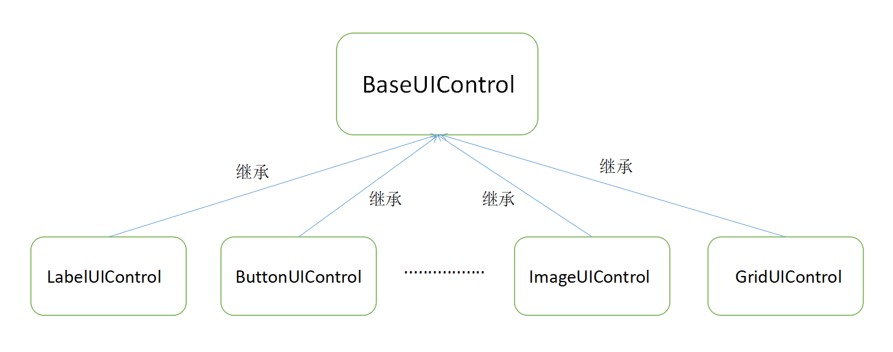
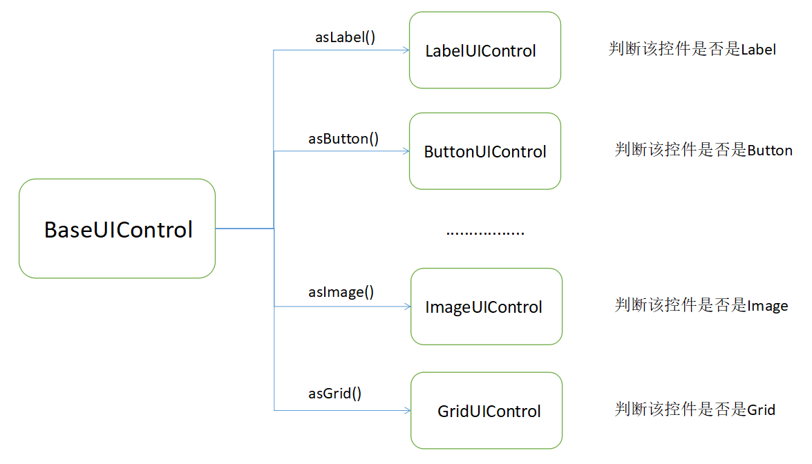

--- 
front: 
hard: Getting Started 
time: minutes 
--- 

# UI Control Object 

## Design Intention 

Currently, when writing UI logic, the relevant functional interfaces of each control are placed in the ScreenNode class. When developers query the available UIAPI, they can only preliminarily judge the function by the interface name, and determine whether the functional interface can be used on the desired control through annotations and trials. In addition, the connectivity between controls is weak, and the control of a single control can only be obtained by handwriting the path of the control, so that a considerable part of the UI code is in the handwritten control path. 

In order to solve the above problems, we objectify a single control at the script layer. Each control inherits from the same base class, and can use some common functions, while retaining the functions unique to this type of control, completing the classification of UIAPI. Through the UI control object, developers can better clarify the control type and its available functions during the development process, reduce the time of writing repeated code and querying UIAPI, and improve ease of use. 

## Usage of control objects 

### Control object structure 

 

As shown in the diagram, all control objects inherit from the same base class BaseUIControl. The base class implements common functions of UI controls such as SetVisible and SetSize, while the subclasses implement functions unique to each control, such as LabelUIControl implements functions such as SetText, and ImageUIControl implements functions such as SetSprite. 

### Obtaining control objects 

As shown in the control object structure, no matter what type a control is, it is first a BaseUIControl, and then a specific control type. ScreenNode provides the GetBaseUIControl interface to support developers to obtain a BaseUIControl instance through the control path. 

- Example 

```python 
# We get the BaseUIControl instance through the path 
textPath = "/text" 
textBaseUIControl = uiNode.GetBaseUIControl(textPath) 
``` 

This interface provides a method to convert the control path to the control object, and directly returns None when the corresponding control cannot be found in the incoming path, which can help developers find problems in the code earlier. 

When developers do not care what type of control the path corresponds to and just want to do general operations, the BaseUIControl instance is enough. If you need to call a function that specifies the control type, you need to use the specific conversion of the control object. 

### Specific conversion of control objects 

 

As can be seen from the schematic diagram, BaseUIControl provides a series of conversion interfaces to convert a base class control instance into a corresponding subclass instance. During the conversion process, it will be determined whether the control meets the conversion requirements. For example, when the asLabel interface is called, it will determine whether the interface control corresponding to the BaseUIControl instance is of the label type. If so, the conversion is successful and the LabelUIControl instance is returned. Otherwise, None is returned. 

- Example 

```python 
# We get the Label instance through the path and set the text 
textPath = "/text" 
textBaseUIControl = uiNode.GetBaseUIControl(textPath).asLabel()

if textBaseUIControl: 
textBaseUIControl.SetText("myLabel") 
``` 

The conversion interface of some controls is relatively broad, so you still need to pay attention to whether the conversion is successful when using it. 

### Chain search method of control objects 

The BaseUIControl class provides the GetChildByName interface for obtaining the child BaseUIControl instance based on the child node name and the GetChildByPath interface for obtaining the child BaseUIControl instance based on the relative path. 

- Example 

```python 
buttonPath = "/button0" 
buttonBaseUIControl = uiNode.GetBaseUIControl(buttonPath) 
# We get the sub-control instance by the sub-control name 
labelBaseUIControl = buttonBaseUIControl.GetChildByName("button_label") 
# We get the sub-control instance by the sub-control path 
labelUIControl = buttonBaseUIControl.GetChildByPath("/button_label").asLabel() 
``` 

Developers can only get a root BaseUIControl from the ScreenNode.GetBaseUIControl interface, and get other node objects related to the root node through the chain search interface, which enhances the connectivity between controls and improves ease of use. 

#### For more UI control object documents and interfaces, see the UI control object API document, and for code examples, see the text and button examples in UIDemoMod.