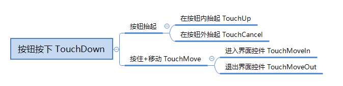

--- 
front: 
hard: Getting Started 
time: minutes 
sidebarDepth: 1 
--- 

# <span id="UI Control Object API"></span>UI Control Object API 

<span id="BaseUIControl"></span> 
## BaseUIControl 

UI Object-Oriented Base Class 

<span id="GetChildByName"></span> 
### GetChildByName 

- Description 

Get the BaseUIControl instance based on the name of the child control 

- Parameters 

| Parameter name | Data type | Description | 
| :--- | :--- | :--- | 
| childName | str | Child node name | 

- Return value 

| Data type | Description | 
| :--- | :--- | 
| BaseUIControl | BaseUIControl instance of the child control | 

- Example 

```python 
# Get the BaseUIControl instance of text1 from the BaseUIControl instance of text2 
text1Path = "/text1" 
text1Control = uiNode.GetBaseUIControl(text1Path) 
text2Control = text1Control.GetChildByName("text2") 
``` 

<span id="GetChildByPath"></span> 
### GetChildByPath 

- Description 

Get the BaseUIControl instance based on the relative path 

- Parameters


| Parameter name | Data type | Description | 
| :--- | :--- | :--- | 
| childPath | str | Path relative to the current BaseUIControl path | 

- Return value 

| Data type | Description | 
| :--- | :--- | 
| BaseUIControl | BaseUIControl instance of the child control | 

- Example 

```python 
# Get the BaseUIControl instance with the path "/text1/text2/text3" according to the BaseUIControl instance with the path "/text1" 
text1Path = "/text1" 
text1Control = uiNode.GetBaseUIControl(text1Path) 
text3Control = text1Control.GetChildByPath("/text2/text3") 
``` 

<span id="GetPosition"></span> 
### GetPosition 

- Description 

Get the coordinates of the control relative to the parent node 

- Parameters 

None 

- Return value 

| Data type | Description | 
| :--- | :--- | 
| tuple(float,float) | The coordinate information of the control relative to the parent node, the first item is the horizontal axis, the second item is the vertical axis | 

- Example 

```python 
# we want to get text2 position 
text2Path = "/panel/text2" 
baseUIControl = uiNode.GetBaseUIControl(text2Path) 
textPosition = baseUIControl.GetPosition() 
``` 

<span id="GetSize"></span> 
### GetSize 

- Description


    Get the size of the control 

- Parameters 

None 

- Return value 

| Data type | Description | 
| :--- | :--- | 
| tuple(float,float) | The size information of the control, the first item is the horizontal axis, the second item is the vertical axis | 

- Example 

```python 
# we want to get text2 size 
text2Path = "/panel/text2" 
baseUIControl = uiNode.GetBaseUIControl(text2Path) 
text2Size = baseUIControl.GetSize() 
``` 

<span id="GetVisible"></span> 
### GetVisible 

- Description 

Returns whether a control is displayed based on the control path 

- Parameters 

None 

- Return value 

| Data type | Description | 
| :--- | :--- | 
| bool | Is the control displayed? | 

- Example 

```python 
# We get whether text2 under the panel is displayed 
text2Path = "/panel/text2" 
baseUIControl = uiNode.GetBaseUIControl(text2Path) 
textVisible = baseUIControl.GetVisible() 
``` 

<span id="SetAlpha"></span> 
### SetAlpha


- Description 

Set the transparency of the node, only valid for image and label controls 

- Parameters 

| Parameter name | Data type | Description | 
| :--- | :--- | :--- | 
| alpha | float | Transparency, value between 0 and 1, 0 means completely transparent, 1 means completely opaque | 

- Return value 

None 

- Example 

```python 
# Set the transparency of text2 to semi-transparent 
text2Path = "/panel/text2" 
baseUIControl = uiNode.GetBaseUIControl(text2Path) 
baseUIControl.SetAlpha(0.5) 
``` 

<span id="SetPosition"></span> 
### SetPosition 

- Description 

Set the coordinates of the control relative to the parent node 

- Parameters 

| Parameter name | Data type | Description | 
| :--- | :--- | :--- | 
| pos | tuple(float,float) | The coordinate information of the control relative to the parent node, the first item is the horizontal axis, the second item is the vertical axis | 

- Return value 

None 

- Example 

```python 
# we want to set text2 position 
text2Path = "/panel/text2" 
pos = (10, 10) 
baseUIControl = uiNode.GetBaseUIControl(text2Path) 
baseUIControl.SetPosition(pos) 
```


<span id="SetSize"></span> 
### SetSize 

- Description 

Set the size of the control 

- Parameters 

| Parameter name | Data type | Description | 
| :--- | :--- | :--- | 
| size | tuple(float,float) | The size information of the control, the first item is the horizontal axis, the second item is the vertical axis | 
| resizeChildren | bool | Whether to adjust the size of child controls at the same time, the default is False | 

- Return value 

None 

- Example 

```python 
# we want to set text2 size 
text2Path = "/panel/text2" 
text2Size = (10, 10) 
baseUIControl = uiNode.GetBaseUIControl(text2Path) 
baseUIControl.SetSize(text2Size) 
``` 

<span id="SetTouchEnable"></span> 
### SetTouchEnable 

- Description 

Set whether the control is clickable 

- Parameters 

| Parameter name | Data type | Description | 
| :--- | :--- | :--- | 
| enable | bool | False means no response, True means resume response | 

- Return value 

None 

- Example 

```python 
# we want to set image_button unable

imageButtonPath = "/image_button" 
baseUIControl = uiNode.GetBaseUIControl(imageButtonPath) 
baseUIControl.SetTouchEnable(False) 
``` 

<span id="SetVisible"></span> 
### SetVisible 

- Description 

Choose whether to display a control based on the control path 

- Parameters 

| Parameter name | Data type | Description | 
| :--- | :--- | :--- | 
| visible | bool | False means hiding the control, True means showing the control | 

- Return value 

None 

- Example 

```python 
# We hide text2 under panel 
text2Path = "/panel/text2" 
baseUIControl = uiNode.GetBaseUIControl(text2Path) 
baseUIControl.SetVisible(False) 
``` 

<span id="asButton"></span> 
### asButton 

- Description 

Convert the current BaseUIControl to a ButtonUIControl instance. If the current control is not a button type, return None 

- Parameters 

None 

- Return value 

| Data type | Description | 
| :--- | :--- | 
| ButtonUIControl | ButtonUIControl instance | 

- Example 


```python 
buttonPath = "/button" 
buttonBaseControl = uiNode.GetBaseUIControl(buttonPath) 
buttonControl = buttonBaseControl.asButton() 
``` 

<span id="asGrid"></span> 
### asGrid 

- Description 

Convert the current BaseUIControl to a GridUIControl instance. If the current control is not a grid type, it returns None 

- Parameters 

None 

- Return value 

| Data type | Description | 
| :--- | :--- | 
| GridUIControl | GridUIControl instance | 

- Example 

```python 
gridPath = "/grid" 
gridBaseControl = uiNode.GetBaseUIControl(gridPath) 
gridControl = gridBaseControl.asGrid() 
``` 

<span id="asImage"></span> 
### asImage 

- Description 

Convert the current BaseUIControl to an ImageUIControl instance. If the current control is not of the image type, return None 

- Parameters 

None 

- Return value 

| Data type | Description | 
| :--- | :--- | 
| ImageUIControl | ImageUIControl instance | 

- Example 


```python 
imagePath = "/image" 
imageBaseControl = uiNode.GetBaseUIControl(imagePath) 
imageControl = imageBaseControl.asImage() 
``` 

<span id="asLabel"></span> 
### asLabel 

- Description 

Convert the current BaseUIControl to a LabelUIControl instance. If the current control is not of Label type, it returns None 

- Parameters 

None 

- Return value 

| Data type | Description | 
| :--- | :--- | 
| LabelUIControl | LabelUIControl instance | 

- Example 

```python 
text1Path = "/text1" 
text1BaseControl = uiNode.GetBaseUIControl(text1Path) 
text1LabelControl = text1BaseControl.asLabel() 
``` 

<span id="asNeteasePaperDoll"></span> 
### asNeteasePaperDoll 

- Description 

Convert the current BaseUIControl to a NeteasePaperDollUIControl instance. If the current control is not of custom type, return None 

- Parameters 

None 

- Return value 

| Data type | Description | 
| :--- | :--- | 
| NeteasePaperDollUIControl | NeteasePaperDollUIControl instance | 

- Example 


```python 
paperDollPath = "/paper_doll" 
paperDollBaseControl = uiNode.GetBaseUIControl(paperDollPath) 
paperDollControl = paperDollBaseControl.asNeteasePaperDoll() 
``` 

<span id="asProgressBar"></span> 
### asProgressBar 

- Description 

Convert the current BaseUIControl to a TextEditBoxUIControl instance. If the current control is not a panel type, return None 

- Parameters 

| Parameter name | Data type | Description | 
| :--- | :--- | :--- | 
| fillImagePath | str | Progress bar fill image path, default is "/filled_progress_bar", this parameter affects the effect of the control API | 

- Return value 

| Data type | Description | 
| :--- | :--- | 
| ProgressBarUIControl | ProgressBarUIControl instance | 

- Example 

```python 
progressBarPath = "/progress_bar" 
progressBarBaseControl = uiNode.GetBaseUIControl(progressBarPath) 
progressBarControl = progressBarBaseControl.asProgressBar() 
``` 

<span id="asScrollView"></span> 
### asScrollView 

- Description 

Convert the current BaseUIControl to a ScrollViewUIControl instance. If the current control is not a scrollview type, return None 

- Parameters 

None 

- Return value 

| Data type | Description | 
| :--- | :--- | 
| ScrollViewUIControl | ScrollViewUIControl instance | 


- Example 

```python 
scrollViewPath = "/scroll_view" 
scrollViewBaseControl = uiNode.GetBaseUIControl(scrollViewPath) 
scrollViewControl = scrollviewBaseControl.asScrollView() 
``` 

<span id="asSwitchToggle"></span> 
### asSwitchToggle 

- Description 

Convert the current BaseUIControl to a SwitchToggleUIControl instance. If the current control is not a panel type, it returns None 

- Parameters 

None 

- Return value 

| Data type | Description | 
| :--- | :--- | 
| SwitchToggleUIControl | SwitchToggleUIControl instance | 

- Example 

```python 
switchTogglePath = "/switch_toggle" 
switchToggleBaseControl = uiNode.GetBaseUIControl(switchTogglePath) 
switchToggleControl = switchToggleBaseControl.asSwitchToggle() 
``` 

<span id="asTextEditBox"></span> 
### asTextEditBox 

- Description 

Convert the current BaseUIControl to a TextEditBoxUIControl instance. If the current control is not of the editbox type, return None 

- Parameters 

None 

- Return value 

| Data type | Description | 
| :--- | :--- | 
| TextEditBoxUIControl | TextEditBoxUIControl instance | 


- Example 

```python 
textEditBoxPath = "/text_edit_box" 
textEditBoxBaseControl = uiNode.GetBaseUIControl(textEditBoxPath) 
textEditBoxControl = textEditBoxBaseControl.asTextEditBox() 
``` 

<span id="GridUIControl"></span> 
## GridUIControl 

UI object-oriented grid control class 

<span id="SetGridDimension"></span> 
### SetGridDimension 

- Description 

Set the size of the Grid control 

- Parameters 

| Parameter name | Data type | Description | 
| :--- | :--- | :--- | 
| dimension | tuple(int,int) | Set the horizontal and vertical size of the grid | 

- Return value 

None 

- Example 

```python 
# we want change grid dimension 
gridPath = "/grid1" 
gridUIControl = uiNode.GetBaseUIControl(gridPath).asGrid() 
gridUIControl.SetGridDimension((2, 2)) 
``` 

<span id="ButtonUIControl"></span> 
## ButtonUIControl 

UI object-oriented button control class 

<span id="AddTouchEventParams"></span> 
### AddTouchEventParams 

- Description 

Enable the button callback function. If this function is not called, the button will have no callback.


- Parameters 

| Parameter name | Data type | Description | 
| :--- | :--- | :--- | 
| args | dict | Defaults to None. See the notes for details. | 

- Return value 

None 

- Notes 
- AddTouchEventParams parameter args description: 
| Keywords | Data type | Description | 
| ----------| --------------------- | ---------| 
| isSwallow | bool | Defaults to True, whether the button swallows the event; or when True, when the button is clicked, the click event will not penetrate into the world. For example, destroying blocks and turning the camera will not be responded to | 


- Example 

```python 
buttonPath = "/panel/test_btn" 
buttonUIControl = uiNode.GetBaseUIControl("/panel/test_btn").asButton() 
buttonUIControl.AddTouchEventParams({"isSwallow":True}) 
``` 

<span id="SetButtonTouchCancelCallback"></span> 
### SetButtonTouchCancelCallback 

- Description 

Set the callback function triggered when the touch is outside the button range 

- Parameters 

| Parameter name | Data type | Description | 
| :--- | :--- | :--- | 
| callbackFunc | function | Callback function, must be a UI class function | 

- Return value 

None 

- Notes 
- For other related instructions, see the SetButtonTouchDownCallback interface: 

- Example 

```python 
def onButtonTouchCancelCallback(args):

pass 

buttonPath = "/panel/test_btn" 
buttonUIControl = uiNode.GetBaseUIControl("/panel/test_btn").asButton() 
buttonUIControl.AddTouchEventParams({"isSwallow":True}) 
buttonUIControl.SetButtonTouchCancelCallback(onButtonTouchCancelCallback) 
``` 

<span id="SetButtonTouchDownCallback"></span> 
### SetButtonTouchDownCallback 

- Description 

Set the callback function triggered when the button is pressed 

- Parameters 

| Parameter name | Data type | Description | 
| :--- | :--- | :--- | 
| callbackFunc | function | Callback function, must be a UI class function | 

- Return value 

None 

- Notes 
- onButtonTouchDownCallback parameter args description: 
| Parameter | Type | Explanation | 
| ----------------- | ----- | ------------------------------------------------------------ | 
| #collection_name | str | Collection name to which the button belongs | 
| #collection_index | int | Collection index to which the button belongs | 
| ButtonState | int | Button state: Up is 0, Down is 1, the default is -1, it is recommended to use New | 
| TouchEvent | int | New version of button state: Up is 0, Down is 1, Cancel is 3, Move is 4, the default is -1 | 
| PrevButtonDownID | str | ID of the last button that was clicked Down, if not set to "-1" | 
| TouchPosX | float | UI coordinate X value on the screen when the button is clicked | 
| TouchPosY | float | UI coordinate Y value on the screen when the button is clicked | 
| ButtonPath | str | ComponentPath of the clicked button | 

The relationship between the events is shown in the figure below: 
 

- Example 

```python 
def onButtonTouchDownCallback(args): 
pass 

buttonPath = "/panel/test_btn" 
buttonUIControl = uiNode.GetBaseUIControl("/panel/test_btn").asButton() 
buttonUIControl.AddTouchEventParams({"isSwallow":True})

buttonUIControl.SetButtonTouchDownCallback(onButtonTouchDownCallback) 
``` 

<span id="SetButtonTouchMoveCallback"></span> 
### SetButtonTouchMoveCallback 

- Description 

Set the callback function triggered when the touch moves after pressing 

- Parameters 

| Parameter name | Data type | Description | 
| :--- | :--- | :--- | 
| callbackFunc | function | Callback function, must be a UI class function | 

- Return value 

None 

- Remarks 
- For other related instructions, see SetButtonTouchDownCallback interface: 

- Example 

```python 
def onButtonTouchMoveCallback(args): 
pass 

buttonPath = "/panel/test_btn" 
buttonUIControl = uiNode.GetBaseUIControl("/panel/test_btn").asButton() 
buttonUIControl.AddTouchEventParams({"isSwallow":True}) 
buttonUIControl.SetButtonTouchMoveCallback(onButtonTouchMoveCallback) 
``` 

<span id="SetButtonTouchMoveInCallback"></span> 
### SetButtonTouchMoveInCallback 

- Description 

Set the callback function triggered when entering the control after pressing the button 

- Parameters 

| Parameter name | Data type | Description | 
| :--- | :--- | :--- | 
| callbackFunc | function | Callback function, must be a UI class function | 

- Return value 


None 

- Notes 
- For other related instructions, see SetButtonTouchDownCallback interface: 

- Example 

```python 
def onButtonTouchMoveInCallback(args): 
pass 

buttonPath = "/panel/test_btn" 
buttonUIControl = uiNode.GetBaseUIControl("/panel/test_btn").asButton() 
buttonUIControl.AddTouchEventParams({"isSwallow":True}) 
buttonUIControl.SetButtonTouchMoveInCallback(onButtonTouchMoveInCallback) 
``` 

<span id="SetButtonTouchMoveOutCallback"></span> 
### SetButtonTouchMoveOutCallback 

- Description 

Set the callback function triggered when the control is exited after pressing the button 

- Parameters 

| Parameter name | Data type | Description | 
| :--- | :--- | :--- | 
| callbackFunc | function | Callback function, must be a UI class function | 

- Return value 

None 

- Remarks 
- For other related instructions, see the SetButtonTouchDownCallback interface: 

- Example 

```python 
def onButtonTouchMoveOutCallback(args): 
pass 

buttonPath = "/panel/test_btn" 
buttonUIControl = uiNode.GetBaseUIControl("/panel/test_btn").asButton() 
buttonUIControl.AddTouchEventParams({"isSwallow":True}) 
buttonUIControl.SetButtonTouchMoveOutCallback(onButtonTouchMoveOutCallback) 
``` 

<span id="SetButtonTouchUpCallback"></span>

### SetButtonTouchUpCallback 

- Description 

Set the callback function when the touch is up within the button range 

- Parameters 

| Parameter name | Data type | Description | 
| :--- | :--- | :--- | 
| callbackFunc | function | Callback function, must be a UI class function | 

- Return value 

None 

- Remarks 
- For other related instructions, see the SetButtonTouchDownCallback interface: 

- Example 

```python 
def onButtonTouchUpCallback(args): 
pass 

buttonPath = "/panel/test_btn" 
buttonUIControl = uiNode.GetBaseUIControl("/panel/test_btn").asButton() 
buttonUIControl.AddTouchEventParams({"isSwallow":True}) 
buttonUIControl.SetButtonTouchUpCallback(onButtonTouchUpCallback) 
``` 

<span id="LabelUIControl"></span> 
## LabelUIControl 

UI object-oriented text control class 

<span id="GetText"></span> 
### GetText 

- Description 

Get the text information of the Label. If the acquisition fails, None will be returned 

- Parameters 

None 

- Return value 

| Data type | Description |

| :--- | :--- | 
| str | text information | 

- Notes 
- Failure to obtain is usually due to an incorrect path or the control is not of Label type 

- Example 

```python 
# we want to get text2 content 
text2Path = "/panel/text2" 
labelUIControl = uiNode.GetBaseUIControl(text2Path).asLabel() 
labelUIControl.GetText() 
``` 

<span id="GetTextColor"></span> 
### GetTextColor 

- Description 

Get the Label text color 

- Parameters 

None 

- Return value 

| Data type | Description | 
| :--- | :--- | 
| tuple(float,float,float,float) | Get the text color information (r, g, b, a), value [0, 1] | 

- Example 

```python 
# we want to get text2 color 
text2Path = "/panel/text2" 
labelUIControl = uiNode.GetBaseUIControl(text2Path).asLabel() 
labelUIControl.GetTextColor() 
``` 

<span id="SetText"></span> 
### SetText 

- Description 

Set the text information of the Label 

- Parameters 


| Parameter name | Data type | Description | 
| :--- | :--- | :--- | 
| text | str | Text content, can support [style code](https://minecraft-zh.gamepedia.com/%E6%A0%B7%E5%BC%8F%E4%BB%A3%E7%A0%81) (§Can set text color, format, etc., this usage is more flexible and changeable) | 
| syncSize | bool | Whether to update the text box size synchronously when setting text, the default value is False | 

- Return value 

None 

- Example 

```python 
# we want to set text2 content 
text2Path = "/panel/text2" 
text = "Hello World!" 
labelUIControl = uiNode.GetBaseUIControl(text2Path).asLabel() 
labelUIControl.SetText(text) 
``` 

<span id="SetTextColor"></span> 
### SetTextColor 

- Description 

Set the color of the Label text 

- Parameters 

| Parameter name | Data type | Description | 
| :--- | :--- | :--- | 
| color | tuple(float,float,float,float) | Text color information (r, g, b, a), value [0, 1] | 

- Return value 

None 

- Example 

```python 
# we want to set text2 green 
text2Path = "/panel/text2" 
color = (0, 1, 0, 0.8) 
labelUIControl = uiNode.GetBaseUIControl(text2Path).asLabel()
labelUIControl.SetTextColor(color)
```

<span id="SetTextFontSize"></span>
### SetTextFontSize

- describe


Set the font size of the text in the Label 

- Parameters 

| Parameter name | Data type | Description | 
| :--- | :--- | :--- | 
| componentPath | str | Control path starting from the main node | 
| scale | float | The font_size of label is the default font size in the Label. The value is limited to [small normal large]. This scale is based on the default font to scale the font size. The default font size is 1.0 | 

- Return value 

None 

- Example 

```python 
# set text font size 
text2Path = "/panel/text2" 
labelUIControl = uiNode.GetBaseUIControl(text2Path).asLabel() 
labelUIControl.SetTextFontSize(0.8) 
``` 

<span id="ScrollViewUIControl"></span> 
## ScrollViewUIControl 

UI object-oriented scroll list control class 

<span id="GetScrollViewContentControl"></span> 

### GetScrollViewContentControl 

- Description 

Returns the path of the scroll_view content 

- Parameters 

None 

- Return value 

| Data type | Description | 
| :--- | :--- | 
| BaseUIControl | BaseUIControl instance of the scroll_view content | 

- Example 

```python 
# we want get scroll_view content 
scrollViewPath = "/scroll_view0"

scrollViewUIControl = uiNode.GetBaseUIControl(scrollViewPath).asScrollView() 
contentUIControl = scrollViewUIControl.GetScrollViewContentControl() 
``` 

<span id="GetScrollViewContentPath"></span> 
### GetScrollViewContentPath 

- Description 

Returns the content path of the scroll_view 

- Parameters 

None 

- Return value 

| Data type | Description | 
| :--- | :--- | 
| str | The content path of the scroll_view | 

- Example 

```python 
# we want get scroll_view content path 
scrollViewPath = "/scroll_view0" 
scrollViewUIControl = uiNode.GetBaseUIControl(scrollViewPath).asScrollView() 
path = scrollViewUIControl.GetScrollViewContentPath() 
``` 

<span id="GetScrollViewPos"></span> 
### GetScrollViewPos 

- Description 

Get the position of the top content of the current scroll_view 

- Parameters 

None 

- Return value 

| Data type | Description | 
| :--- | :--- | 
| float | The position of the top content of the current scroll_view | 

- Example 

```python

# we want get scroll_view pos 
scrollViewPath = "/scroll_view0" 
scrollViewUIControl = uiNode.GetBaseUIControl(scrollViewPath).asScrollView() 
scrollViewUIControl.GetScrollViewPos() 
``` 

<span id="SetScrollViewPercentValue"></span> 
### SetScrollViewPercentValue 

- Description 

Set the percentage position of the current scroll_view content 

- Parameters 

| Parameter name | Data type | Description | 
| :--- | :--- | :--- | 
| percent_value | int | The percentage position to jump to. Generally, the set position will appear at the top of the scroll_view. The value range is 0-100 | 

- Return value 

None 

- Example 

```python 
# we want set scroll_view percent pos 
scrollViewPath = "/scroll_view0" 
scrollViewUIControl = uiNode.GetBaseUIControl(scrollViewPath).asScrollView() 
scrollViewUIControl.SetScrollViewPercentValue(20) 
``` 

<span id="SetScrollViewPos"></span> 
### SetScrollViewPos 

- Description 

Set the position of the current scroll_view content 

- Parameters 

| Parameter name | Data type | Description | 
| :--- | :--- | :--- | 
| pos | float | The position to jump to. Generally, the set position will appear at the top of the scroll_view. | 

- Return value 

None 

- Example


```python 
# we want set scroll_view pos 
scrollViewPath = "/scroll_view0" 
scrollViewUIControl = uiNode.GetBaseUIControl(scrollViewPath).asScrollView() 
scrollViewUIControl.SetScrollViewPos(100) 
``` 

<span id="ImageUIControl"></span> 
## ImageUIControl 

UI object-oriented image control class 

<span id="SetSprite"></span> 
### SetSprite 

- Description 

Change the specified texture to the image control 

- Parameters 

| Parameter name | Data type | Description | 
| :--- | :--- | :--- | 
| texturePath | str | Texture path, need to start from the textures directory under resource_pack | 

- Return value 

None 

- Notes 
- When changing the texture of ImageButton, pay attention to using the child control path (default / hover / pressed) to get ImageUIControl 

- Example 

```python 
# we want to set image_button textures 
imageButtonPath = "/image_button" 
buttonUIControl = uiNode.GetBaseUIControl(imageButtonPath).asButton() 
buttonDefaultUIControl = buttonUIControl.GetChildByName("default").asImage() 
buttonHoverUIControl = buttonUIControl.GetChildByName("hover").asImage() 
buttonPressedUIControl = buttonUIControl.GetChildByName("pressed").asImage()
buttonDefaultUIControl.SetSprite("textures/button01_default")
buttonHoverUIControl.SetSprite("textures/button01_hover")
buttonPressedUIControl.SetSprite("textures/button01_pressed")
```

<span id="SetSpriteClipRatio"></span>
### SetSpriteClipRatio

- Description 

Set the crop area ratio of the image (without changing the size of the control). You can use the clip_ratio property of the image control to control the direction. 

- Parameters 

| Parameter name | Data type | Description | 
| :--- | :--- | :--- | 
| clipRatio | float | The cropping ratio of the image (range 0 to 1), the cropping accuracy is related to the image resolution | 

- Return value 

None 

- Example 

```python 
# We want to set the progress of the progress bar created by the UI editor 
# The editor progress bar contains two image controls (named empty_progress_bar and filled_progress_bar) 
progress = 0.8 # When used to simulate progress, the following cropping ratio needs to be set to (1-progress) to get the correct visual effect 
imagePath = "/progress_bar0/filled_progress_bar" 
imageUIControl = uiNode.GetBaseUIControl(imagePath).asImage() 
imageUIControl.SetSpriteClipRatio(1.0 - progress) 
``` 

<span id="SetSpriteColor"></span> 
### SetSpriteColor 

- Description 

Set the image color 

- Parameters 

| Parameter name | Data type | Description | 
| :--- | :--- | :--- | 
| color | tuple(float,float,float) | Image color rgb | 

- Return value 

None 

- Example 

```python 
# We want the durability bar to change color with the durability, green when full and red when empty, where barPath is the durability bar path 
durabilityRatio = 0.8 # Durability ratio, 1 is full durability 
barPath = "/image_bar" 
imageUIControl = uiNode.GetBaseUIControl(barPath).asImage() 
imageUIControl.SetSpriteColor((1 - durabilityRatio, durabilityRatio, 0))

``` 

<span id="SetSpriteGray"></span> 
### SetSpriteGray 

- Description 

It is more efficient to set the image control to gray than to directly SetSprite a gray image 

- Parameters 

| Parameter name | Data type | Description | 
| :--- | :--- | :--- | 
| gray | bool | True sets the image to gray, False restores the original color | 

- Return value 

None 

- Example 

```python 
# we want set image gray 
imagePath = "/image" 
imageUIControl = uiNode.GetBaseUIControl(imagePath).asImage() 
imageUIControl.SetSpriteGray(True) 
``` 

<span id="SetSpriteUV"></span> 
### SetSpriteUV 

- Description 

Set the starting uv of the image, which is consistent with the "uv" attribute in json 

- Parameters 

| Parameter name | Data type | Description | 
| :--- | :--- | :--- | 
| uv | tuple(float,float) | The upper left corner of the image is (0,0), the right is the x-axis, and the bottom is the y-axis | 

- Return value 

None 

- Example 

```python 
imagePath = "/image" 
imageUIControl = uiNode.GetBaseUIControl(imagePath).asImage()

imageUIControl.SetSpriteUV((10, 0)) 
``` 

<span id="SetSpriteUVSize"></span> 
### SetSpriteUVSize 

- Description 

Set the uv size of the image, which is consistent with the "uv_size" attribute in json 

- Parameters 

| Parameter name | Data type | Description | 
| :--- | :--- | :--- | 
| uvSize | tuple(float,float) | The x-axis is to the right of the image, and the y-axis is to the bottom | 

- Return value 

None 

- Example 

```python 
imagePath = "/image" 
imageUIControl = uiNode.GetBaseUIControl(imagePath).asImage() 
imageUIControl.SetSpriteUVSize((40, 30)) 
``` 

<span id="SwitchToggleUIControl"></span> 
## SwitchToggleUIControl 

UI object-oriented switch control class 

<span id="SetToggleState"></span> 
### SetToggleState 

- Description 

Set the value of the Toggle switch control 

- Parameters 

| Parameter name | Data type | Description | 
| :--- | :--- | :--- | 
| is_on | bool | Set whether the Toggle switch control is on or off | 

- Return value 

None 


- Example 

```python 
togglePath = "/toggle1" 
switchToggleUIControl = uiNode.GetBaseUIControl(togglePath).asSwitchToggle() 
switchToggleUIControl.SetToggleState(True) 
``` 

<span id="TextEditBoxUIControl"></span> 
## TextEditBoxUIControl 

UI object-oriented text input box control class 

<span id="GetEditText"></span> 
### GetEditText 

- Description 

Get the text information of the edit_box input box. If the acquisition fails, None will be returned 

- Parameters 

None 

- Return value 

| Data type | Description | 
| :--- | :--- | 
| str | Text information | 

- Notes 
- Failure to obtain is usually due to an error in filling in the path or the control is not of the edit_box type 

- Example 

```python 
# we want to get edit2 content 
editBoxPath = "/panel/edit2" 
textEditBoxUIControl = uiNode.GetBaseUIControl(editBoxPath).asTextEditBox() 
text = textEditBoxUIControl.GetEditText() 
``` 

<span id="SetEditText"></span> 
### SetEditText 

- Description 

Set the text information of the edit_box input box 

- Parameters


| Parameter name | Data type | Description | 
| :--- | :--- | :--- | 
| text | str | Text content | 

- Return value 

None 

- Example 

```python 
# we want to clear edit2 content 
editBoxPath = "/panel/edit2" 
text = "" 
textEditBoxUIControl = uiNode.GetBaseUIControl(editBoxPath).asTextEditBox() 
textEditBoxUIControl.SetEditText(text) 
``` 

<span id="SetEditTextMaxLength"></span> 
### SetEditTextMaxLength 

- Description 

Set the maximum input length of the input box 

- Parameter 

| Parameter name | Data type | Description | 
| :--- | :--- | :--- | 
| maxLength | int | The maximum length that can be entered in the input box, the value is [0, +∞) | 

- Return value 

None 

- Example 

```python 
# we want to set text_edit_box max input length 10 
editTextPath = "/panel2/text_edit_box" 
textEditBoxUIControl = uiNode.GetBaseUIControl(editBoxPath).asTextEditBox() 
textEditBoxUIControl.SetEditTextMaxLength(10) 
``` 

<span id="NeteasePaperDollUIControl"></span> 
## NeteasePaperDollUIControl 

Object-oriented paper doll control class 
Used to render entities/bone models/special effects on the UI


<span id="GetModelId"></span> 
### GetModelId 

- Description 

Get the rendered skeleton model ID 

- Parameters 

None 

- Return value 

| Data type | Description | 
| :--- | :--- | 
| int | Skeleton model ID, returns -1 if failed or does not exist | 

- Notes 
- Note: Please do not execute immediately after calling RenderEntity/RenderSkeletonModel. 
The bone model Id can be used in the following situations: 
1. Bind another bone model; 
2. Bind sequence frame animation; 
3. Bind special effect particle animation 

- Example 

```python 
import mod.client.extraClientApi as clientApi 
path = '/demoPanel/paper_doll' 
doll = uiNode.GetBaseUIControl(path).asNeteasePaperDoll() 
modelId = doll.GetModelId() 
if modelId == -1: 
return 
#Purpose 1: Bind another bone model 
modelComp = clientApi.GetEngineCompFactory().CreateModel(modelId) 
newModelId = modelComp.BindModelToModel("rightHand", "gun") # Attach the bone model named gun to the rightHand bone 
#Purpose 2: Bind sequence frame animation 
sfxId = clientSystem.CreateEngineSfxFromEditor("effects/example_sfx.json") # Create special effects 
comp = clientApi.GetEngineCompFactory().CreateFrameAniSkeletonBind(sfxId) 
comp.Bind(modelId, "root", (0, 1, 0), (0, 0, 0)) # Bind the special effects to the bone nodes of the skeleton model 
frameComp = clientApi.GetEngineCompFactory().CreateFrameAniControl(sfxId) 
frameComp.Play() # Play animation 
clientSystem.DestroyEntity(sfxId) # Destroy animation 
#Purpose 3: Bind special effect particle animation 
particleEntityId = clientSystem.CreateEngineParticle("effects/example_particle.json", (0,0,0)) # Create special effects 
comp = clientApi.GetEngineCompFactory().CreateParticleSkeletonBind(particleEntityId) 
comp.Bind(modelId, "root", (0, 1, 0), (0, 0, 0)) # Bind the special effects to the bone nodes of the skeleton model 
particleComp = clientApi.GetEngineCompFactory().CreateParticleControl(particleEntityId) 
particleComp.Play() # Play the animation

clientSystem.DestroyEntity(particleEntityId) # Destroy animation 
``` 

<span id="RenderEntity"></span> 
### RenderEntity 

- Description 

Rendering entity 

- Parameters 

| Parameter name | Data type | Description | 
| :--- | :--- | :--- | 
| params | dict | Rendering parameters, see notes for details | 

- Return value 

| Data type | Description | 
| :--- | :--- | 
| bool | Successful or not | 

- Notes 
- RenderEntity parameter params description: 
The params parameter is explained as follows: 
| Parameter | Type | Explanation | 
| ----------------- | ----- | ------------------------------------------------------------ | 
| entity_id | str | Entity ID of the rendered creature | 
| scale | float | Rendering scale, default is 1.0 | 
| render_depth | int | Rendering depth, default is -50 for players, -15 for normal creatures, this parameter can solve the UI occlusion culling problem | 
| init_rot_y | float | Initial Y direction | 
| molang_dict | dict | molang expression dictionary, where key is str and value is float | 


- Example 

```python 
path = '/demoPanel/paper_doll' 
param = { 
"entity_id": "-8589934591", 
"scale": 0.5, 
"render_depth": -50, 
"init_rot_y": 60, 
"molang_dict": {"variable.liedownamount": 1} 
} 
doll = uiNode.GetBaseUIControl(path).asNeteasePaperDoll()
doll.RenderEntity(param)
```

<span id="RenderSkeletonModel"></span>

### RenderSkeletonModel 

- Description 

Render skeleton model (not dependent on entities) 

- Parameters 

| Parameter name | Data type | Description | 
| :--- | :--- | :--- | 
| params | dict | Rendering parameters, see the notes for detailed description | 

- Return value 

| Data type | Description | 
| :--- | :--- | 
| bool | Successful or not | 

- Notes 
- RenderSkeletonModel parameter params description: 
The params parameter is explained as follows: 
| Parameter | Type | Explanation | 
| ----------------- | ----- | ------------------------------------------------------------ | 
| skeleton_model_name | str | Skeleton model name | 
| animation | str | Skeleton action name, default is idle | 
| animation_looped | bool | Skeleton action looping, default is True | 
| scale | float | Rendering scale, default is 1.0 | 
| render_depth | int | Rendering depth, default is -50 for players, -15 for ordinary creatures, this parameter can solve the UI occlusion culling problem | 
| init_rot_y | float | Initial Y direction | 
| molang_dict | dict | molang expression dictionary, where key is str and value is float | 


- Example 

```python 
import mod.client.extraClientApi as clientApi 
path = '/demoPanel/paper_doll' 
param = { 
"skeleton_model_name": "ty_yuanshenghuli_0_0", 
"animation": "idle_stand", 
"scale": 0.5, 
"render_depth": -50, 
"init_rot_y": 60, 
"molang_dict": {"variable.liedownamount": 1}
}
doll = uiNode.GetBaseUIControl(path).asNeteasePaperDoll()
doll.RenderSkeletonModel(param)
```

<span id="ProgressBarUIControl"></span>

## ProgressBarUIControl 

UI object-oriented progress bar control class 

<span id="SetValue"></span> 
### SetValue 

- Description 

Set the progress of the progress bar 

- Parameters 

| Parameter name | Data type | Description | 
| :--- | :--- | :--- | 
| progress | float | Progress, value [0, 1] | 

- Return value 

None 

- Example 

```python 
# we want to set progress 
progressBarPath = "/panel/progress_bar" 
progressBarUIControl = uiNode.GetBaseUIControl(progressBarPath).asProgressBar() 
progressBarUIControl.SetValue(0.8) 
``` 

