--- 
front: 
hard: Getting Started 
time: minutes 
--- 

# Add custom UI to native interface 

## Design intention 

When developing game play, developers will inevitably want to make some modifications to the game's native interface, but the logic of the native interface cannot be modified by developers. In order to achieve the visual effect of changing the native interface, it seems that there are only two ways: to make an interface to cover the native interface to simulate the modification or to implement a self-made interface and replicate the functions of the native interface. However, these two methods are not very perfect or difficult to implement. For the above-mentioned desire to make some simple custom UI additions on the native interface that do not affect the logic of the native interface, we provide the following interfaces to support developers to make custom modifications on several commonly used native UIs. 

## Framework introduction 

The framework involves two classes, NativeScreenManager and CustomUIControlProxy, both of which can be obtained through the corresponding API in extraClientApi. NativeScreenManager provides the registration and deregistration interfaces for the native interface that developers want to modify. After registering through the registration interface, the custom UI specified by the developer will be attached whenever the corresponding native UI is generated, and the deregistration interface will be called to cancel the registration. CustomUIControlProxy is a custom UI proxy class, which holds the BaseUIControl instance of the custom UI generated in the native UI and its life cycle function. Developers can inherit this class to write custom logic. 

### Optional native UI path 

In order to avoid excessive modification of native interfaces by developers, we have selected several native interfaces suitable for adding custom UIs and provided them to developers in the form of enumeration. The enumeration type is obtained as follows: 
``` 
import client.extraClientApi as clientApi 
NativeScreenDataType = clientApi.GetMinecraftEnum().NativeScreenDataType 
``` 

#### NativeScreenDataType.INVENTORY_CONTENT_PANEL 

Backpack interface 

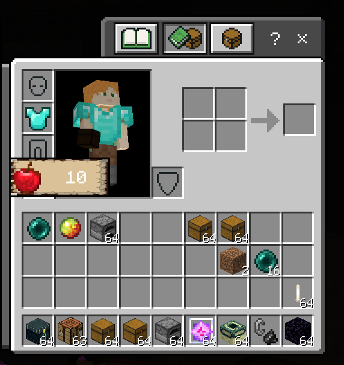 

#### NativeScreenDataType.POCKET_INVENTORY_CONTENT_PANEL 

Pocket version backpack interface 

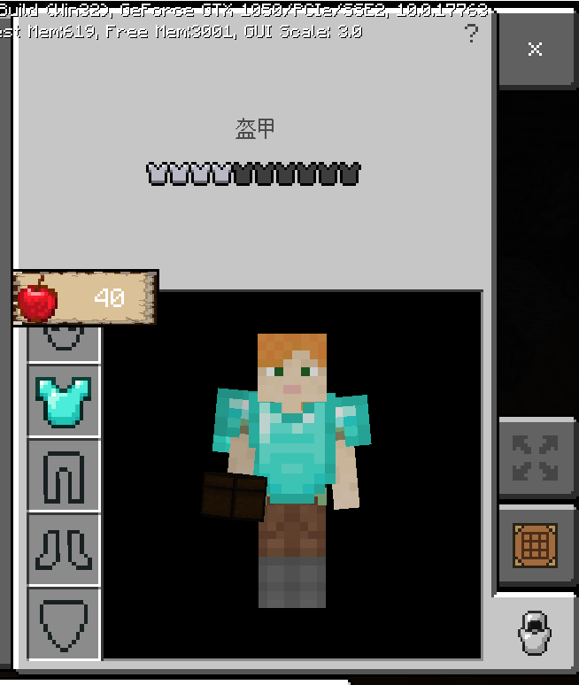 

#### NativeScreenDataType.CRAFTING_CONTENT_PANEL 

Crafting table interface 

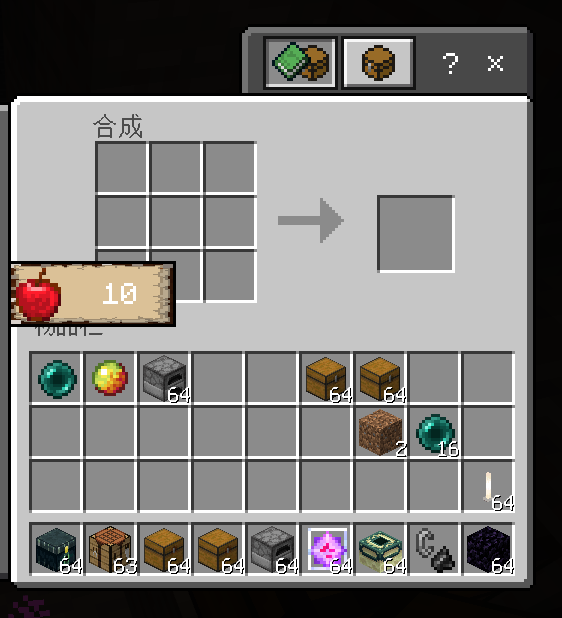 

#### NativeScreenDataType.POCKET_CRAFTING_CONTENT_PANEL 

Pocket version crafting table interface 

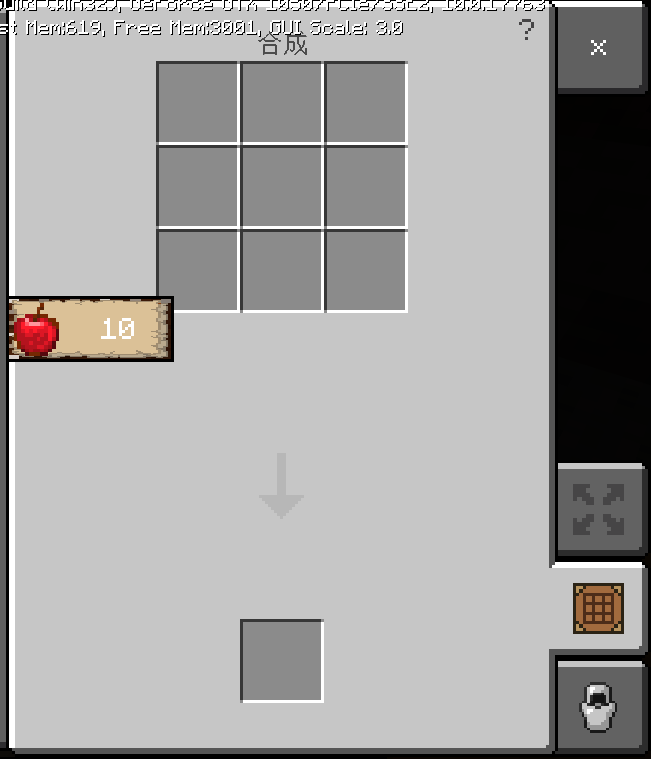 

#### NativeScreenDataType.SMALL_CHEST_PANEL 


Small chest interface 

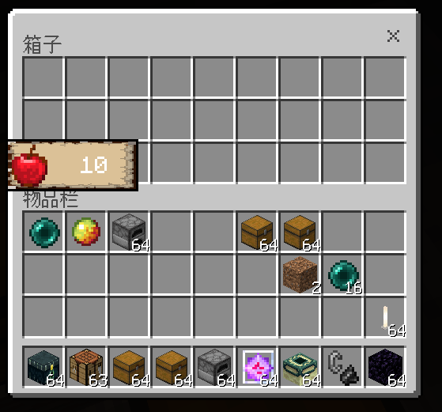 

#### NativeScreenDataType.POCKET_SMALL_CHEST_PANEL 

Pocket version small chest interface 

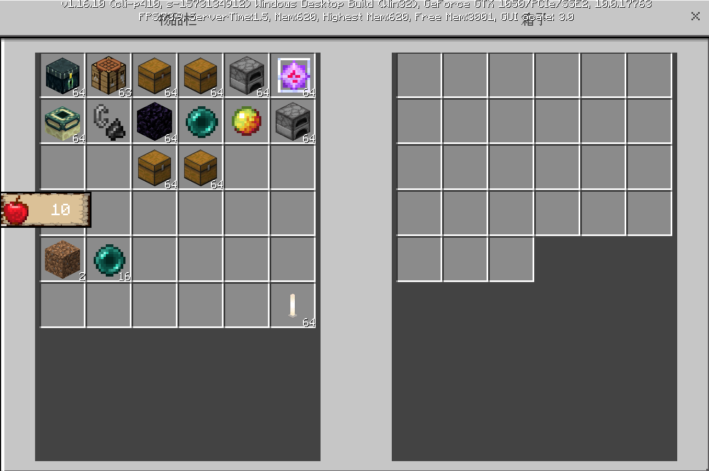 

#### NativeScreenDataType.LARGE_CHEST_PANEL 

Large chest interface 

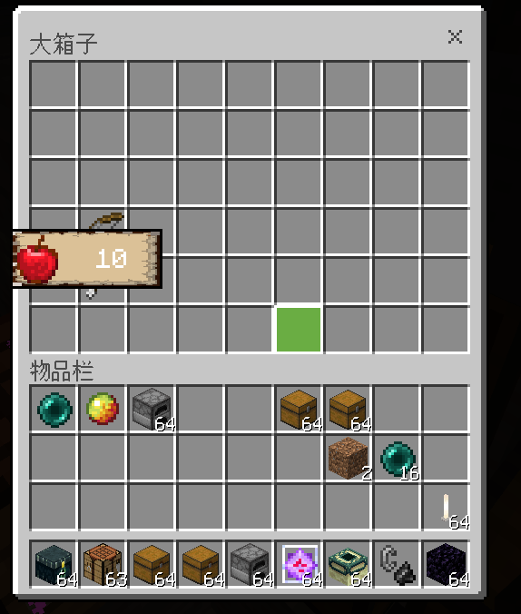 

#### NativeScreenDataType.POCKET_LARGE_CHEST_PANEL 

Pocket version large chest interface 

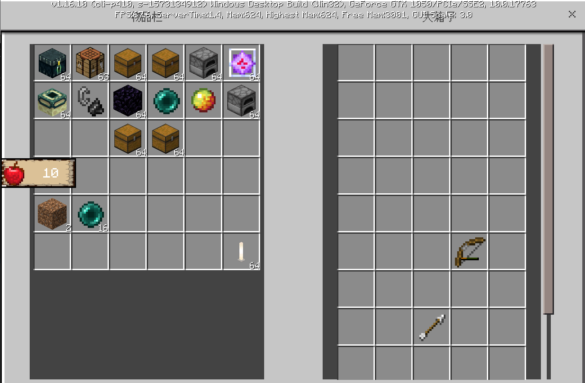 

#### NativeScreenDataType.ENDER_CHEST_PANEL 

Ender Chest Interface 

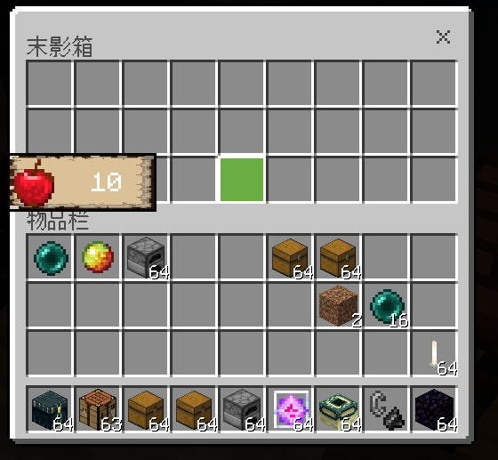 

#### NativeScreenDataType.POCKET_ENDER_CHEST_PANEL 

Pocket Edition Ender Chest Interface 

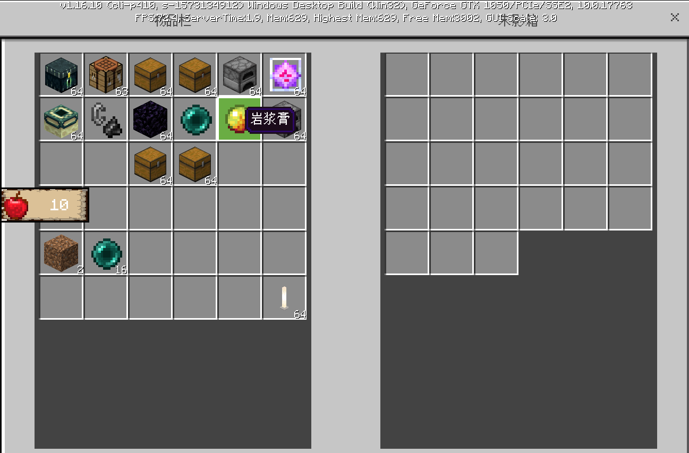 

#### NativeScreenDataType.FURNACE_PANEL 

Furnace Interface 

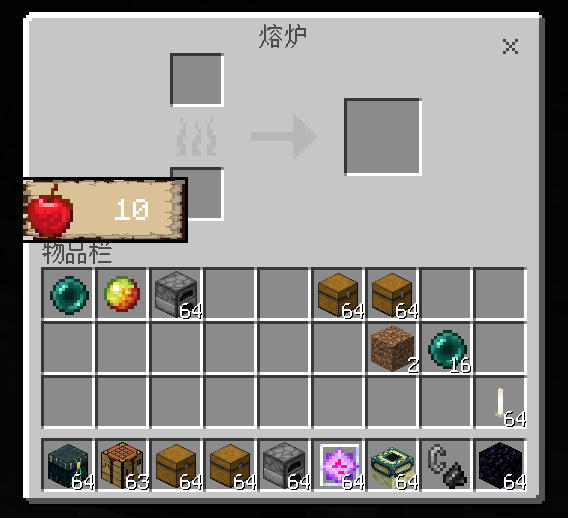 

#### NativeScreenDataType.POCKET_FURNACE_PANEL 

Pocket version of the furnace interface 

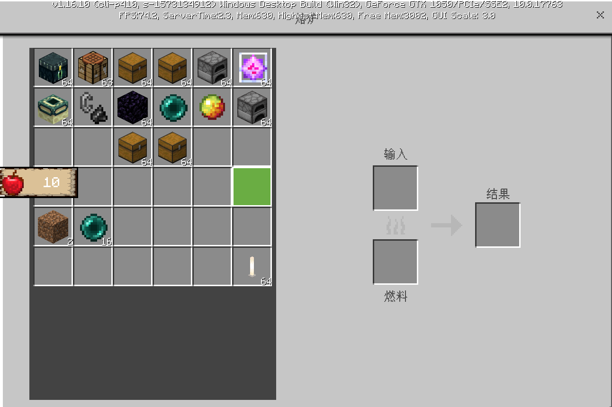 

### NativeScreenManager 

The NativeScreenManager class is a singleton class and can be obtained through extraClientApi.GetNativeScreenManagerCls(). This class is used to manage the operations that the python layer needs to perform when creating the native interface. Currently, it includes RegisterCustomControl and UnRegisterCustomControl for custom UI interfaces. More new features will be added in the future, so stay tuned. 


- Example 

```python 
import client.extraClientApi as clientApi 
NativeScreenManager = clientApi.GetNativeScreenManagerCls() 

manager = NativeScreenManager.instance() 
``` 

### Registration and unregistration interface 

#### RegisterCustomControl 

- Description 

Register the custom UI and its control delegate class that you want to attach to the native interface when the corresponding native interface is created. After successful registration, each time the native interface is created, the registered custom UI will be created on the native interface and destroyed after closing. 

- Parameters 

| Parameter name | Data type | Description | 
| :--- | :--- | :--- | 
| NativeScreenDataType | NativeScreenDataType | Optional native UI path, see above | 
| customControlName | str | Custom control name, usually composed of namespace + "." + control name, such as "UIDemo.text0" | 
| proxyClassName | str | Custom proxy class module path inherited from CustomUIControlProxy | 

- Return value 

| Data type | Description | 
| :--- | :--- | 
| bool | Whether registration is successful True: Success False: Failure | 

- Example 

```python 
import client.extraClientApi as clientApi 
ClientSystem = clientApi.GetClientSystemCls() 
NativeScreenManager = clientApi.GetNativeScreenManagerCls()
NativeScreenDataType = clientApi.GetMinecraftEnum().NativeScreenDataType

class UIDemoClientSystem(ClientSystem):
    def __init__(self, namespace, systemName):
        ClientSystem.__init__(self, namespace, systemName)
        NativeScreenManager.instance().RegisterCustomControl(
            NativeScreenDataType.INVENTORY_CONTENT_PANEL, "UIDemo.image0", "uidemoScripts.modClient.ui.UIDemoProxy.UIDemoProxy"
        )
```

#### UnRegisterCustomControl

- describe


Cancel registration. After cancellation, the corresponding custom UI will no longer be generated when the native interface is generated. 

- Parameters 

| Parameter name | Data type | Description | 
| :--- | :--- | :--- | 
| NativeScreenDataType | NativeScreenDataType | Optional native UI path, see above | 
| customControlName | str | Custom control name, generally composed of namespace + "." + control name, such as "UIDemo.text0" | 

- Return value 

None 

### CustomUIControlProxy 

CustomUIControlProxy is a custom UI proxy class, which can be obtained through extraClientApi.GetCustomUIControlProxyCls(). It holds the BaseUIControl instance and its lifecycle function of the custom UI generated in the native UI, but does not perform any operations in its lifecycle function. Developers can inherit this class to write custom logic and pass the module path of the custom class to the registration interface for registration. When the native interface is created, the lifecycle function rewritten by the developer in the custom class will be called. 

- Example

```python
import client.extraClientApi as clientApi
CustomUIControlProxy = clientApi.GetCustomUIControlProxyCls()


class UIDemoProxy(CustomUIControlProxy):
	def __init__(self, customData, customUIControl):
		CustomUIControlProxy.__init__(self, customData, customUIControl)

	def OnCreate(self):
		bgUIControl = self.GetCustomUIControl()
        labelUIControl = bgUIControl.GetChildByName("label0").asLabel()
        if labelUIControl:
            labelUIControl.SetText("10")

	def OnDestroy(self):
		print("---myProxyDestory---")

    def OnTick(self):
		print("---myProxyTick---")
```

#### GetCustomUIControl

- describe

Get the BaseUIControl instance of the custom UI created in the native interface 

- Parameters 


None 

- Return value 

| Data type | Description | 
| :--- | :--- | 
| BaseUIControl | BaseUIControl instance of custom UI | 

#### OnCreate 

- Description 

Lifecycle function called after custom UI is successfully created in native interface 

- Parameters 

None 

- Return value 

None 

#### OnDestroy 

- Description 

When native interface is closed, custom UI will be destroyed, lifecycle function called after destruction 

- Parameters 

None 

- Return value 

None 

#### OnTick 

- Description 

Lifecycle function called every frame 

- Parameters 

None 

- Return value 

None