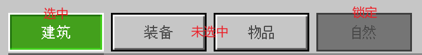

--- 
front: 
hard: Getting Started 
time: minutes 
--- 

# UI Data Binding 

## Effect Display 

As shown in the figure, the effect display of the illustrated book in the quarterly mod Journey to the West: Havoc in Heaven is shown. Below we will disassemble it step by step and introduce in detail how to implement UI data binding through a demo replica 

 

## Toggle Control 

The toggle control inherits from the original common.toggle, which can be understood as a switch or option control, and can be used for single-select and double-select in settings. Among them, we choose single-select toggle to achieve the paging effect. For specific mods and source codes, please refer to the DataBindingMod in the example. 

## stack_grid Control 

This control combines stack_panel and grid. It can be understood that it is a one-dimensional (or horizontally expanded or vertically expanded) grid. By binding collection, you can quickly implement functions such as scoreboards and list displays. In this example, the three-level paging tab list uses this control. 

## UI node tree 

In fact, in this example, the three parts in the red box all use toggle to achieve a three-level paging effect: 

 

The overall UI node tree is as follows: 

- guideBookPanel root directory 
- bookToggleGroup first-level paging 
- Biological illustrations 
- Item illustrations 
- guidePanelWrap The root node of the middle panel, the biological illustrations and item illustrations correspond to two panels, and the corresponding panel is displayed and the other panel is hidden according to the currently selected tab 
- monsterHeaderContentPanel biological illustration panel 
- monsterToggleGroup second-level paging 
- passive creatures 
- neutral creatures 
- attacking creatures 
- tamable 
- monsterGuideContentLeft The left half of the panel, used for scrolling_panel to display three-level paging

- monsterToggleGrid three-level paging, three-level paging list with dynamic data binding is realized through stack_grid 
- monsterToggleBtn template control for three-level paging tab 
- monsterGuideContentRight right half panel, used to display the detailed content of the three-level paging, the implementation details are irrelevant to the content of this article, no detailed introduction is given, and it can be modified according to your needs 
- itemHeaderContentPanel item atlas panel 
- ...The structure of the item atlas is the same as that of the biological atlas, so no repeated introduction is given 

## Specific use case 

### Simple implementation of tab paging 

The example in the above effect display is a three-level paging, so we will introduce it in two parts. First, let's introduce the fixed paging of the first and second levels. Taking the second-level tab as an example, its json code is as follows: 

```json 
{ 
"namespace": "guideBookUI", 
"locationToggleGroup": { 
"anchor_from": "top_middle", 
"anchor_to": "top_middle", 
"type": "stack_panel", 
"orientation": "horizontal", // Expansion direction, the default is vertical, here we need horizontal 
"layer": 1, 
"size": [ "100%", 22 ], 
"controls": [ 
{ 
"toggle0@guideBookUI.typeToggleBtn": { 
"$buttonLabel": "Passive Creatures", 
"$toggle_group_forced_index": 0 
} 
}, 
{ 
"content_padding_1": { 
"size" : [ 4, "100%" ], 
"type" : "panel" 
} 
}, 
{ 
"toggle1@guideBookUI.typeToggleBtn": { 
"$buttonLabel": "Neutral Creatures", 
"$toggle_group_forced_index": 1
                }
            },
            {
                "content_padding_2": {
                   "size" : [ 4, "100%" ],
                   "type" : "panel"
                }
            },
            {

                "toggle2@guideBookUI.typeToggleBtn": {
                    "$buttonLabel": "Attack creature",
                    "$toggle_group_forced_index": 2
                }
            },
            {
                "content_padding_3": {
                   "size" : [ 4, "100%" ],
                   "type" : "panel"
                }
            },
            {
                "toggle3@guideBookUI.typeToggleBtn": {
                    "$buttonLabel": "Tameable",
                    "$toggle_group_forced_index": 3
                }
            }
        ]
    },
    "typeToggleBtn@common.toggle": {
        "$checked_img": "textures/ui/guide_book/checked",
        "$default_texture": "textures/ui/guide_book/btn02_unuse",
        "$pressed_texture": "textures/ui/guide_book/btn02_click",
        "$locked_texture": "textures/ui/guide_book/btn02_unuse",
        "$default_font_color": [ 0.674, 0.482, 0.361 ],
        "$pressed_font_color": [ 0.494, 0.188, 0.02 ],
        "$locked_font_color": [ 0.674, 0.482, 0.361 ],
        "$unchecked_control": "mod7CommonUI.toggle_unchecked_state", // Unchecked state
        "$checked_control": "mod7CommonUI.toggle_checked_state", // checked state "$unchecked_hover_control": "mod7CommonUI.toggle_unchecked_state", // Unchecked hover state 
"$checked_hover_control": "mod7CommonUI.toggle_checked_state", // Checked hover state 
"$unchecked_locked_control": "mod7CommonUI.toggle_locked_state", // Unchecked and locked state (non-interactive) 
"$unchecked_locked_hover_control": "mod7CommonUI.toggle_locked_state", // Unchecked and locked hover state (non-interactive) 
"$checked_locked_control": "mod7CommonUI.toggle_locked_state", // Checked and locked hover state (non-interactive) 
"anchor_from": "top_left", 
"anchor_to": "top_left", 
"size": [ 54, 22 ], 
"$radio_toggle_group": true, // Whether to select a single option. When true, the same toggle_name is regarded as the same group. Only one toggle in the same group can be selected at the same time. 
"$toggle_name": "#typeTab", // The group name bound to the toggle 
"$toggle_group_default_selected": 0 
} 
} 
``` 

This directly inherits the toggle component encapsulated by Microsoft in ui_common.json. The meaning of the specific fields can be referred to the comments. The parameters bound to $toggle_name are managed in python: 

```python

@view_binder.binding(view_binder.BF_ToggleChanged, "#typeTab") 
def OnTypeTabChecked(self, args): 
# Triggered when the secondary tab is switched, the third-level paging is switched to the first tab details page by default 
self.mCurTypeTab = args["index"] 
self.OnMonsterToggleChecked({ "index": self.mCurMonsterIndex }) 
``` 

From the json, we can see that toggle has a total of eight states. The detailed effects of various states can be viewed in the game settings interface. The button on the left is toggle. There are mainly two basic states: selected and unselected. Each state has hover and non-hover, and then there are locked and unlocked, so there are a total of 2^3=8 state combinations, which require different controls to display. Since we are relatively simple here, we only consider the three states of selected, unselected and locked, so we only implement the corresponding three control panels. The json is as follows: 

```json 
{ 
"namespace" : "mod7CommonUI", 
"toggle_checked_state": { 
"$pressed_texture|default": "", 
"$pressed_font_color|default": [ 1, 1, 1 ], 
"type": "image", 
"texture": "$pressed_texture", 
"nineslice_size": 4, 
"controls": [ 
{ 
"toggleText": { 
"type": "label", 
"$buttonLabel|default": "测试", 
"color": "$pressed_font_color", 
"text": "$buttonLabel", 
"layer": 3 
} 
}, 
{ 
"checkedImg": { 
"type": "image",
                    "$checked_img|default": "",
                    "texture": "$checked_img",
                    "size": [ 12, 6 ],
                    "layer": 3,
                    "anchor_from": "bottom_middle",
                    "anchor_to": "bottom_middle"
                }
            }
        ],
        "layer": 10
    },
    "toggle_unchecked_state": {
        "$default_texture|default": "",
        "$default_font_color|default": [ 0, 0, 0 ],
        "type": "image",
        "texture": "$default_texture",
        "nineslice_size": 4,

        "controls": [
            {
                "toggleText": {
                    "type": "label",
                    "$buttonLabel|default": "Test",
                    "color": "$default_font_color",
                    "text": "$buttonLabel",
                    "layer": 3
                }
            }
        ],
        "layer": 1
    },
    "toggle_locked_state": {
        "$locked_texture|default": "",
        "$locked_font_color|default": [ 0, 0, 0 ],
        "type": "image",
        "texture": "$locked_texture",
        "nineslice_size": 4,
        "controls": [
            {
                "toggleText": {
                    "type": "label",
                    "offset": [ 6, 0 ],
                    "$buttonLabel|default": "Test",
                    "color": "$locked_font_color", 
"text": "$buttonLabel", 
"layer": 3 
} 
}, 
{ 
"lockedImg": { 
"type": "image", 
"size": [ 12, 12 ], 
"offset": [ -8, 0 ], 
"texture": "textures/ui/lock", 
"color": "$locked_font_color", 
"layer": 1 
} 
} 
], 
"layer": 2 
} 
} 
``` 

Here, the labels of the three states are managed uniformly through $buttonLabel, so that in the subclass (each specific toggle above), only this parameter needs to be managed. In addition, the texture and font colors of each state are also controlled separately. Careful friends may find that there is an extra checkedImg in the selected state and an extra lockedImg in the locked state. The former is used to implement the small arrow under the button when selected, while the latter is used to implement the lock icon. To lock or not, you only need to set its *enabled* field, or you can dynamically set it in python by calling the SetTouchEnable interface. The effect is shown in the figure: 


 

The above is the simplest paging implementation. 

### Highly data-bound adaptive tab list 

Next, we will introduce data binding with the third-level paging. Let's take a look at the corresponding json first: 

```json 
{ 
"namespace": "guideBookUI", 
"itemToggleGrid": { 
"anchor_from": "top_middle", 
"anchor_to": "top_middle", 
"bindings": [ 
{ 
"binding_condition": "always", 
"binding_name": "#itemToggleGrid.item_count", // We use this variable name to override the corresponding variable name in the engine 
"binding_name_override": "#StackGridItemsCount" // This is the variable name in the engine, used to control the number of stack_grid 
} 
], 
"collection_name": "itemToggles", // Bound collection name 
"controls": [ 
{ 
"itemToggleBtn@guideBookUI.itemToggleBtn" : {} // template in stack_grid, changing the value of #StackGridItemsCount will dynamically clone all controls 
} 
], 
"item_count": 10, 
"layer": 0, 
"orientation": "vertical", // expansion direction, vertical 
"property_bag": { 
"#itemToggleGrid.item_count": 10 // There are 10 items by default, and the actual update is returned in real time according to the binding value 
}, 
"size": [ "100%", "default" ], 
"type": "stack_grid", 
"visible": true 
}, 
"itemToggleBtn@common.toggle": { 
"$unchecked_control": "guideBookUI.itemUncheckedState", 
"$checked_control": "guideBookUI.itemCheckedState",
        "$unchecked_hover_control": "guideBookUI.itemUncheckedState",
        "$checked_hover_control": "guideBookUI.itemCheckedState",
        "$unchecked_locked_control": "guideBookUI.itemUncheckedState",
        "$unchecked_locked_hover_control": "guideBookUI.itemUncheckedState",
        "$checked_locked_control": "guideBookUI.itemUncheckedState",
        "$checked_locked_hover_control": "guideBookUI.itemUncheckedState",

"$toggle_grid_collection_name": "itemToggles", // Collection bound to the toggle list, defined in common.toggle 
"$item_collection_name": "itemToggles", // Collection bound to text, defined in itemLabel below 
"anchor_from": "top_left", 
"anchor_to": "top_left", 
"size": [ "100%", 16 ], 
"$radio_toggle_group": true, 
"$toggle_name": "#itemToggleGroup", 
"$toggle_group_default_selected": 0 
}, 
"itemCheckedState": { 
"type": "image", 
"texture": "textures/ui/white_bg", 
"color": [ 0.7764, 0.7764, 0.7764 ], 
        "nineslice_size": 1,
        "controls": [
            {
                "itemLabel@guideBookUI.itemLabel": {}
            }
        ],
        "layer": 2
    },
    "itemUncheckedState": {
        "type": "image",
        "texture": "textures/ui/white_bg",
        "color": [ 0.3647, 0.3647, 0.3647 ],
        "$label_color": [ 0.776, 0.776, 0.776],
        "nineslice_size": 1,
        "controls": [
            {
                "itemLabel@guideBookUI.itemLabel": {}
            }
        ],
        "layer": 2
    },
    "itemLabel": {
        "bindings": [
            {                "binding_collection_name" : "$item_collection_name",
                "binding_name" : "#label_name.text",
                "binding_type" : "collection"
            }
        ],
        "$label_color|default": [ 1, 1, 1 ],
        "color": "$label_color",
        "property_bag": {
            "#label_name.text" : "ha ha"
        },
        "layer": 3,
        "text" : "#label_name.text",
        "type" : "label"

}, 
} 
``` 

Let's first look at the implementation of toggleBtn. Compared with the second-level tab above, the third-level tab does not have a locked state, so only two state panels are used: selected and unselected. The two panels simply change different background colors and font colors. The focus is on itemLabel. By binding collection, the corresponding data can be bound in python: 

```python 
@view_binder.binding_collection(view_binder.BF_BindString, "itemToggles", "#label_name.text") 
def OnRefreshItemLabel(self, index): 
# The text returned here will be displayed on the itemLabel of the corresponding index 
return self.mItemData[self.mCurItemTab][index]["name"] if len(self.mItemData[self.mCurItemTab]) > index else "" 
``` 

Let's look at the implementation of stack_grid. The key points are the binding of collection_name and #StackGridItemsCount. Here, #StackGridItemsCount is overwritten by #itemToggleGrid.item_count and dynamic binding is implemented in python: 

```python 
@view_binder.binding(view_binder.BF_BindInt, "#itemToggleGrid.item_count") 
def OnItemGridResize(self): 
# Bind the size of stack_grid to the corresponding data quantity to realize data-driven display of as much content as possible 
return len(self.mItemData[self.mCurItemTab]) 
``` 

Finally, the callback after clicking the item list is implemented: 

```python 
@view_binder.binding(view_binder.BF_ToggleChanged, "#itemToggleGroup") 
def OnItemToggleChecked(self, args): 
# This function is called when the toggle in #itemToggleGroup is clicked. The passed args contains the index corresponding to the click. The paging content is set in this callback function. 
toggleIndex = args["index"] 
if toggleIndex >= len(self.mItemData[self.mCurItemTab]): 
toggleIndex = 0 
self.mCurItemIndex = toggleIndex 
itemDict = self.mItemData[self.mCurItemTab][toggleIndex] 
self.SetSprite(self.mItemIcon, itemDict["icon"]) 
self.SetText(self.mItemName, itemDict["name"]) 
self.SetText(self.mItemDesc, itemDict["desc"]) 
self.set_control_visible(self.mItemInfoWrap, True) 
``` 

## Summary 

### Single-select toggle


- By binding BF_ToggleChanged, click the callback of the toggle corresponding to $toggle_name, and display the corresponding paging content in the callback 
- When $radio_toggle_group is set to true, it is a single choice. Only one toggle with the same $toggle_name is turned on at the same time 

### stack_grid data binding 

- By binding "\#itemToggleGrid.item_count" to update the size of the list in real time 
- By binding to the collection, the content of each index is updated in real time. The text lists the text of the label. Similarly, the image texture can also be bound 
- The data content bound in the demo is placed in modCommon/dataBindingCfg.py. You can modify the data to see the effect