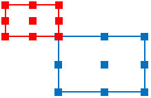

--- 
front: https://mc.res.netease.com/pc/zt/20201109161633/mc-dev/assets/img/ui_image004.29b265a4.png 
hard: Getting Started 
time: 25 minutes 
--- 
# Instructions for using the old version of the interface editor 
## Basic introduction 
The interface editor is used to visually edit the interface in the game "Minecraft". 

It is recommended to follow the video below to learn. 

<iframe src="https://cc.163.com/act/m/daily/iframeplayer/?id=5ea7d81e6a37ca8de9c0bf47" height="600" width="800" allow="fullscreen" /> 

After entering the editor, if the current display is the map editor, then click the icon in the upper left corner to display the editor list and select "Interface Editor". As shown below: 

 

The interface editor consists of the following: 

 

The following is a brief introduction to the functions of each interface: 

- **Project file**: Display the current interface project file (file suffix is .mcgui). Click "+" to add an interface project file. When saving, each mcgui file will save a corresponding Json file with the same name. The Json file is the interface file to be used in the game. 

- **Interface structure**: The tree structure of the interface controls of the currently selected project. Here you can select, hide/show controls, and right-click controls to add sub-controls, delete, copy, and other operations. 

- **Control type**: Select a control in "Interface structure" and then click the control in the "Control type" area to add a sub-control. Among them, the canvas is quite special. The canvas is used to mount various non-canvas controls and cannot be used as a sub-control of other controls. 

- **Control properties**: When a control is selected, the editable properties of the control will be displayed here. 

- **Edit area**: The editing area will display the interface editing effect in real time, and controls can also be selected, moved, and scaled. 

- **Resource management**: Click the import button in the upper right corner to import image resources (multiple selections can be imported in batches). 

- **Alignment operation**: In the interface structure, hold down the Ctrl key and select multiple controls, then click the alignment button to align the selected controls. 

## Interface editing 

### Add controls 

There are two ways to add controls to the interface: 

- Directly click the control icon in the menu bar to add a sub-control of this type under the currently selected control; 

- Right-click on the control in the control structure and select Add object->Control in turn. After adding the control, the editing area will display the added control in real time. 

### Basic properties of controls 

After selecting a control in the control list or editing area, the selected control will display a red frame, and its parent control will display a blue frame. 

 

The properties of the selected control will be displayed in the property panel on the right. Controls have some common properties, as follows: 

- **Anchor point**: Each control has 9 anchor points, including four corners, the midpoints of the four sides, and the center point. The anchor point can set which anchor point of the child control coincides with which anchor point of the parent control. The left side of the figure below corresponds to the parent control, and the right side corresponds to the child control. 

 

The figure below shows the situation where the center of the child control coincides with the upper midpoint of the parent control. 

 

The following figure shows the situation where the lower right corner of the child control overlaps with the upper left corner of the parent control. 

 

- **Name**: The name of the control, which can only be a combination of letters and numbers. 

- **Hide control**: The control will be hidden after checking. In the control list, clicking the eye on the right side of the control can also achieve a similar effect. 

 

- **Level**: The level is used to control the upper and lower relationship of the control. The higher level is displayed on the top. 

- **Displacement**: The displacement is used to control the offset of the control relative to the anchor point position. The displacement is in the form of %+Px. % indicates the percentage of the parent control size, and Px indicates pixels. If X is configured as 10%+10Px and the width of the parent control is 100 pixels, then the horizontal (X) offset of the child control is 10%*100+10=20Px. 

When the offset of the child control needs to be related to the size of the parent control, it is necessary to use % configuration. The buttons of % and Px are clickable, and they will switch between the two forms after clicking. 

 

- **Size**: The size is the width (X) and height (Y) of the control. It is also in the form of %+Px, and its meaning is the same as displacement. Compared with the displacement configuration, the size can also be set to follow the relationship. In the figure below, after "↓" is lit, it means that X follows Y. If the size of Y is 100Px and X is 20%+5Px, then the width is 20%*100+5=25. When "↑" is lit, it means that Y follows X, and the calculation method is the same. When width and height need to be associated, % configuration is required. 

 

Let's take a more complicated example. The width of the parent control is 100, the width of the child control is set to 50%+5Px, and the height of the child control is set to follow the width, with a value of 80%. Then the height of the child control is 80%\*(50%\*100Px+5Px)=44Px. 

Generally speaking, the offset and size of the control can be configured with Px, and % is only required in more complex situations. 

### Control type 

- **Canvas**: The canvas is a complete interface, and sub-controls other than the canvas can be hung under the canvas. There can be multiple canvases in an interface project file. The newly created interface project file will come with a canvas named main. 

- **Panel**: The panel itself has no visual elements. Hanging the controls belonging to a module under a panel can make the interface structure clearer and easier to adjust. 

- **Picture**: The picture control is used to display pictures. The picture will try to fill the size of the control without deformation. 

- **Button**: The button is an important interactive control. You can set the text, text color, text font size, and text offset on the button. The button texture is divided into three states: normal, pressed, and suspended. "Normal" refers to the texture in the normal state, "pressed" refers to the texture when the button is pressed, and "suspended" refers to the button texture when the mouse moves to the button in the PC. How to set the texture: In the resource management window, hold down the left button and drag the texture to the texture box. When the mouse changes to a style with a "+" sign, release the mouse to complete the texture setting. 

 

- **Text**: The text control is used to display text, and the font size and color can be set. 

- **Scroll list**: The scroll content can be selected in the "Content" configuration item. In the "Content" drop-down list, controls in other canvases will appear for selection. In the figure below, templateContent1 and templateContent2 are canvas names, and buttonMail, panelMailBody, gridMailList, etc. are control names. 

 

Not all controls can be used as the content of the scroll list. Currently, only three types of controls, namely panels, buttons, and grids, can be used as the content of the scroll list. If you want to display a text control in a scroll panel, you can place the text control under the panel and then use the panel as the content of the scroll list. However, it does not support hanging a scroll list under a panel and then using the panel as the content of another scroll list. 

- **Grid**: Grids are used for interfaces that require regular layout, such as backpack interfaces. The content is configured in a similar way to the content in a scrolling list. The grid scale is used to configure the number of rows and columns of the grid. The grid will automatically display the content evenly in each grid. 
 

It should be noted that in the Minecraft game engine, there are certain requirements for the size of the grid and the size of the content, otherwise the display will not meet expectations. The specific requirements are: 

- When the content size is fixed pixels: 
- The width of the grid should be greater than or equal to the width of the content multiplied by the number of columns, and less than the width of the content multiplied by (number of columns + 1); 
- The height of the grid should be greater than or equal to the height of the content multiplied by the number of rows; 
- When the content size is a percentage: 
- The width of the content multiplied by the number of columns must be less than or equal to 100%, and the width of the content multiplied by (number of columns + 1) must be greater than 100%; 
- The height of the content multiplied by the number of rows must be greater than or equal to 100%. 

The collection name will be used when binding UI controls in the code. For details, please refer to the "UI Description Document". 

## Interface adaptation method of "Minecraft" 

Mobile phone resolutions are varied. If you want to adapt to as many resolutions as possible, you need to understand the interface adaptation method in "Minecraft". The sizes involved in interface adaptation are as follows: 

 

The canvas is generally the same size as the screen, and in a few cases it will be smaller than the screen, which is determined by the system and player settings. 

We have already known that the size of the control is in the form of a percentage plus a fixed pixel value. When the system calculates the actual display size of the control, it multiplies all fixed pixels by a ratio a. For example: 

| | **Canvas size** | **Parent control size** | **Subcontrol set size** | **Subcontrol actual display size** | 
| ------ | ------------ | -------------- | ------------------ | ---------------------- | 
| **Width** | 900Px | 800Px | 10%+50Px | 80Px+50Px\*a | 
| **Height** | 750Px | 750Px | 20%+100Px | 150Px+100Px\*a | 

So how is the ratio a determined? The system will calculate this ratio as follows: 

1. **Calculate the value of the canvas width divided by 320 and the canvas height divided by 210**. In the above example, these two values are 900/320=2.81, 750/210=3.57. 

2. **Calculate the maximum value of a**. Round the two ratios calculated in 1) respectively, and then take the minimum value as the maximum value of a. In the above example, the two ratios are rounded to 2 and 3 respectively, and the minimum value is 2. 

3. **Calculate the final value of a**. According to certain rules, a value smaller than that in 2) is obtained as the final value of a. Developers do not need to care about this rule. Generally speaking, the final value is the same as the maximum value calculated in 2). 

In the above example, the value of a is 2, so the width of the control is 80Px+50Px\*a=180Px, and the height is 150Px+100Px\*a=350Px.

To put it simply, there is a 320Px\*210Px adaptation area in the game (the purple solid line in the figure below). The game expands this adaptation area by integer multiples until it exceeds the canvas. Then multiply this integer ratio by the fixed pixels in the control size, and add the pixels calculated by the ratio part as the final control display size. 

 

Therefore, if we want the UI to not exceed the screen boundary under various resolution screens, we can set the size of the parent control that determines the display range (such as the top-level panel control) to a fixed size, and the value should be less than 320\*210. It should be noted that the texture does not need to be limited to this size, and the texture size can be appropriately enlarged to obtain better results on large-resolution screens. 

In addition, in the PC Bedrock Edition, the benchmark value for adaptation is 376x250, which is slightly larger than the 320x210 adapted for mobile phones. If you want an interface resource to be adapted for both mobile phones and PC Bedrock Editions, you need to make it according to the mobile phone standard.