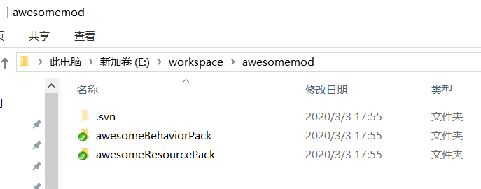
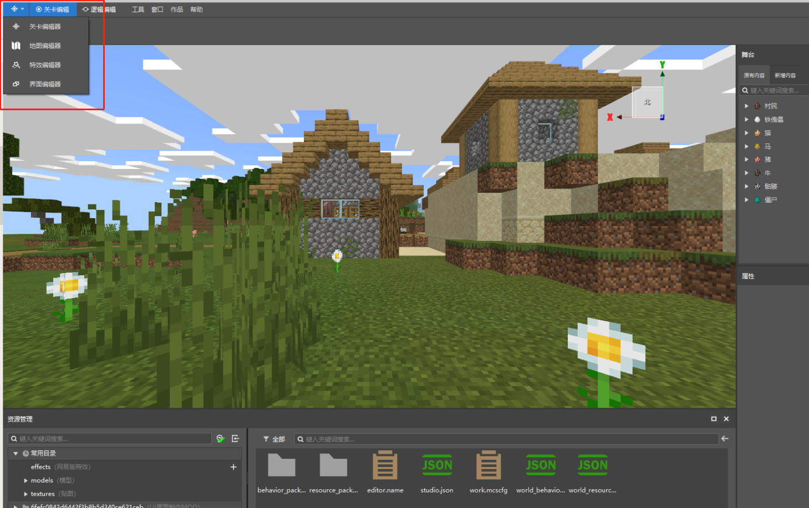
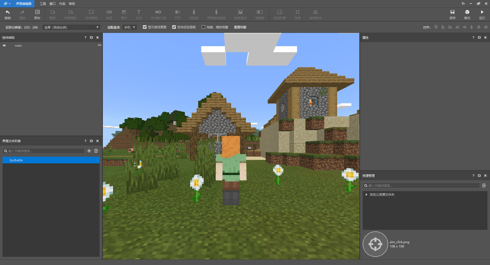
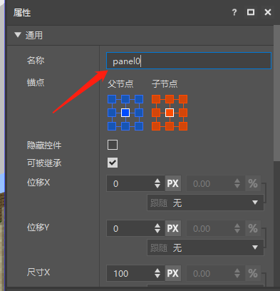
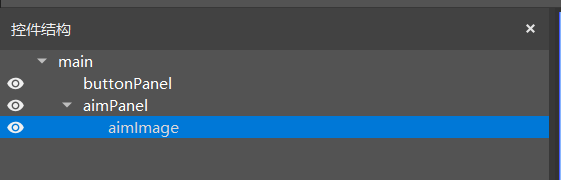
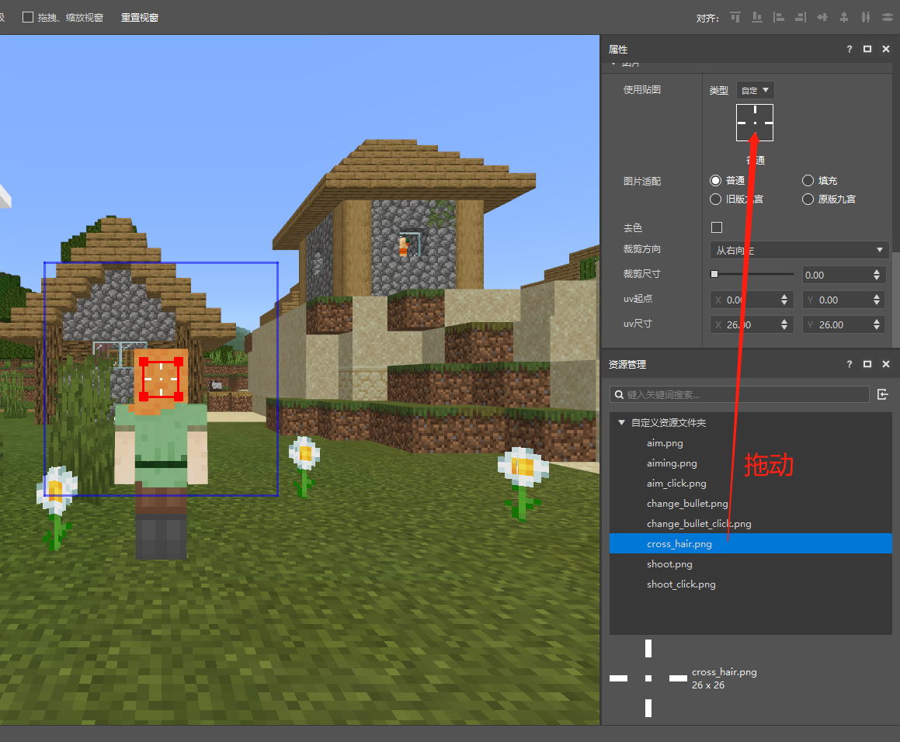
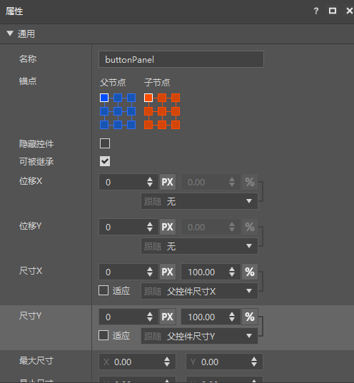
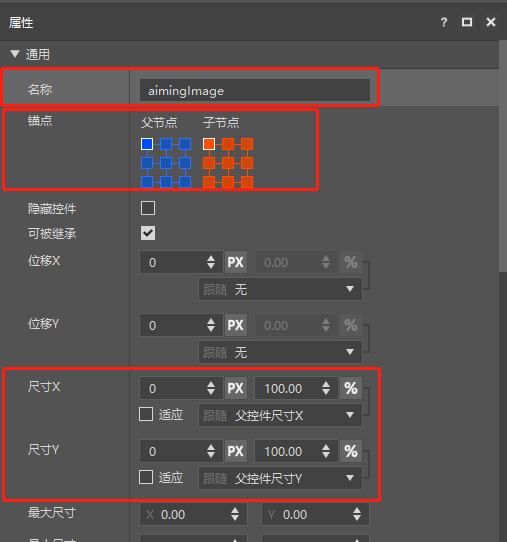
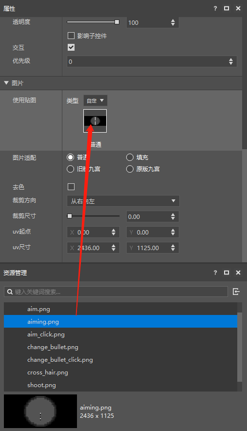
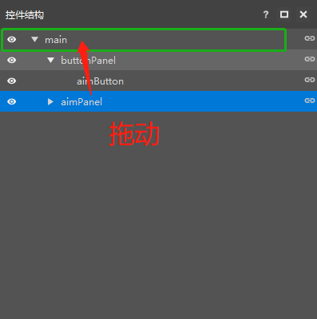

--- 
front: 
hard: Getting Started 
time: minutes 
--- 

# Old version of creating a UI interface from scratch 

This tutorial will introduce in detail how to create a basic FPS combat interface through the UI editor embedded in MCStudio. The tutorial includes the creation of interface controls (including panels, images and buttons) and button-related logic binding. The following steps will be followed for introduction: 
* How to use the UI editor to edit and save the interface according to your needs 
* How to perform button logic python binding according to the content in json 

## Using the UI editor 
Assuming that you have read [Introduction to Mod Development](../20-Gameplay Development/13-Module SDK Programming/1-Introduction to Mod Development/1-Introduction to Mod.md) and [Introduction to Script Development](../20-Gameplay Development/13-Module SDK Programming/2-Python Script Development/0-Introduction to Script Development.md), and have built a new MOD by yourself, if you are not clear, you can refer to the Demo we provide: [AwesomeMod](../20-Gameplay Development/13-Module SDK Programming/60-Demo Example.md#AwesomeMod), the directory under it is shown in the figure below, and we will also use some resources in the following steps: 

 

### Enter the UI Editor 

Open MC Studio, and click Create Blank AddOn. 

 

After entering the editor, if the current display is the map editor, then click the icon in the upper left corner, the editor list will be displayed, and select "Interface Editor" from it, as shown below: 

 

### Import UI resources 
First, we import the images needed for making the interface through the resource management window of the UI editor, and select the image file to import. As shown below. 

 

Note that we currently only support image files in png format. In addition, the image name only supports names composed of numbers, letters, and underscores. This naming rule is also the common naming rule of the entire UI editor. If the above rules are not met, the resource import will fail. 

Here we choose to use the material in [AwesomeMod](../20-Gameplay Development/13-Module SDK Programming/60-Demo Example.md#AwesomeMod), whose directory is "AwesomeMod/awesomeResourcePack/textures/ui". The resource management window after successfully importing the image is shown in the figure below. 

 

### Create a new UI file 
Now, in the interface file list interface on the left, click the New button to create a new UI file, as shown below. 

 

We name the newly created UI file fpsBattle. After successfully creating a new UI file, the UI editor will automatically load the edit mode of the UI file and come with its own main canvas. The overall interface is shown in the figure below. 

 

### Create panel controls 
First, we create two panels. Panel is the most basic of all controls. It has no exclusive properties except for common properties. It is mainly used to summarize controls, just like a folder. Creating a panel is the same as creating all other controls. We left-click to select main, then right-click to pop up the menu, and select "Add Object"-"Panel", as shown below. 

 

### Rename controls 
After creation, rename the two panels. Click to select the panel to be renamed and modify its name in the property panel on the right, as shown below. Rename it to aimPanel, and buttonPanel is used to store the crosshair image control and all button controls respectively. 

 

 

### Create a crosshair image control 
After the panel is successfully created, we create the crosshair. The crosshair is usually an image. Just like creating a new panel, we select aimPanel and create a new image control. In this way, the newly created control will use aimPanel as the parent node. Then rename it to aimImage, as shown below. 

 

After creation, select the image control. We want to replace its image. Slide down the property window to the "Image" column. Drag the previously imported image resource to the texture setting to assign it. After completion, the image in the scene will change from the default image display to the image display we imported, as shown below. 

 

After the image is set, we can adjust the position of the control relative to the parent node by adjusting the anchor point, size and displacement. These three properties are described as follows: 

Anchor point: Each control has 9 anchor points, including four corners, the midpoints of the four sides, and the center point. The anchor point can set which anchor point of the child control coincides with which anchor point of the parent control. The left side of the figure below corresponds to the parent control and the right side corresponds to the child control. 

Displacement: Displacement is used to control the offset of the control relative to the anchor point position. The form of displacement is %+Px. % indicates the percentage of the parent control size, and Px indicates pixels. 

Size: The size is the width (X) and height (Y) of the control. It is also in the form of %+Px, and its meaning is the same as displacement. Compared with the configuration of displacement, the size can also be set to follow the relationship. 

Generally speaking, the offset and size of the control can be configured with Px, and % is only needed in more complex situations. 

Here we just briefly summarize the role and usage of the control properties. For details, please go to read [UI Description Document](30-UI Description Document.html). 

We adjust aimPanel and aimImage as follows, and the interface after setting is shown in the figure below: 

 

aimPanel property
  

 

aimImage property
 

The interface after setting is as shown below. 

 

### Create an aiming button control 
After the crosshair is completed, we will then make the aiming button. Select buttonPanel and use this node as the parent node to create a button control. The steps are the same as creating an image control. After creation, set the name, anchor point, size and other common properties like the aimImage mentioned above, as shown below. 

 

buttonPanel properties
 

 

aimButton properties
 

Unlike the image control, the button control has three image states to set, namely the default state, the pressed state and the mouse hover state. For the mouse hover state, we use the same image as the pressed state. Drag the image to the corresponding map position as shown below. In addition, because the aiming button does not require button text, we can also set the button text in the button properties to empty. 

 

In this way, the aimButton is also set up, and the interface is as shown below. 

 

### Create a scope control 
Next, we create the scope image control aimingImage, and create an image control with aimPanel as the parent node. After the creation is completed, set the name, anchor point, size and other common properties as above aimImage, as shown below. 

 

Drag the scope image to assign values, as shown below. 

 

After the assignment is completed, the interface is as shown below. 

 

We can see that there are two problems after the scope control is assigned 
* The scope image covers the aiming button we just created 
* The scope image does not cover the entire scene 

For these problems, we solve them one by one. The first problem is obviously a hierarchy problem. The hierarchy of each control in the UI we make by default follows the principle of arranging the control hierarchy from small to large from top to bottom in the control structure window. If you want to control the hierarchy of each control yourself, there are two ways. 

One is to drag the control to the desired position in the control structure window, and the system will automatically recalculate the hierarchy of each control. If you drag it to a control, the dragged control will become the child object of the control and be located at the bottom layer. If you drag it between two controls, the dragged control will be at the same level as the two controls, and the hierarchy will be located between the two controls, as shown in the figure below. 

 

Or you can uncheck the option of automatic hierarchy adjustment in the toolbar, but please note that once the UI file is set to cancel the automatic hierarchy adjustment state, it cannot be set back to the automatic state. As shown in the figure below. 

 

After the setting is completed, there will be an additional level attribute in the general property area of each control. We adjust the level of buttonPanel to 2 and the level of aimPanel to 1, so that the level of all buttons will be above the picture, as shown below. 

 

Modify buttonPanel level
  

 

Modify aimPanel level
 

After the settings are completed, the hierarchy is correct. Next, the second question is that by default, the UI system will ensure the original ratio of the image by default. The way for players to customize it is to turn on the Nine-square Cutting Setting of the Image Control and let the image follow the Nine-square Cutting Principle (select "Original Nine-square"), as shown below. 

 

### Perfect our UI 
By analogy, we create a new changeButton switch magazine button under buttonPanel, shootButtonLeft simulates the left-click shooting button, and shootButtonRight simulates the right-click shooting button. Adjust their anchor points, sizes, and positions to reach the correct position, as shown below. 

 

### Save UI file 
After the interface is completed, click the Save button in the upper right corner, as shown below, and the UI file is completed. 

 

After saving successfully, the fpsBattls.json file will be output to the ui folder of the mod archive resource package, as shown below. 

 

## Create python logic 
From the description in the previous part, we can know that the json file created by the UI editor is only responsible for the interface layout and the initial state of each control attribute. The UI in the game contains not only the layout but also the specific interface logic, which requires us to implement it through python code. 

First, let's learn how to create the python class corresponding to the UI file. We find a suitable path in the behavior pack folder of [AwesomeMod](../20-Gameplay Development/13-Module SDK Programming/60-Demo Example.md#AwesomeMod) to create a python file for writing ui logic, create a new txt file and change the file suffix to py. As shown in the figure below, we name it fpsBattle. 

 

After creating the python file, we use the editor to open the file for editing. We import the client.extraClientApi module, which is the client-side Api interface file we developed, and obtain the ScreenNode class from it. All UI logic classes must inherit ScreenNode. As shown in the figure below. 

 

Then we learn to display the UI in the game. We need to write the logic code for displaying the UI in the mod client code, as shown in the figure below. 

 

The OnUIInitFinished event provided by the mod client is called after the engine is initialized. We can create our fpsBattle interface here. We use the RegisterUI interface to register the UI interface, the CreateUI interface to create the UI interface, and the GetUI interface to obtain the corresponding UI instance. After running a few lines of code in the figure, we can successfully create the UI interface in the game logic. For more details, please refer to awesomeMod content. 

In this way, we have actually completed a very basic interface, but we want to do more. 

## Using UIAPI 
After creating the UI instance, let's learn how to dynamically modify the control properties by using UI API through a simple example, as shown in the figure below. 

 

The code in the figure represents the code for hiding the sight image and displaying the crosshair when pressing the aiming button in the open scope state. When UI inherits from ScreenNode, a series of UI API functions can be called. In the figure, SetVisible can set the visible property of the corresponding control to achieve control hiding and display. 

We use the interfaces of each control in the [UI API document](40-UIAPI document.html) and the formatting supported by the game natively to dynamically change the interface performance in the Python code. For details, please refer to [Style Code](https://minecraft-zh.gamepedia.com/index.php?title=%E6%A0%B7%E5%BC%8F%E4%BB%A3%E7%A0%81&variant=zh) 

Of course, more API functions still require your discovery and experimentation. 

