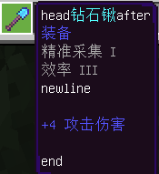

--- 
front: 
hard: Getting Started 
time: minutes 
--- 

# <span id="My World Basic Concepts"></span>My World Basic Concepts 

<span id='World'></span> 

## World 

Indicates the unit of the game. A single game archive, a single network server, etc. are all a world. 

<span id='Block'></span> 

## Block 

A block is a 16×256×16 part of the world, which is the basic unit for loading and unloading the game map. 

When a player first appears in the world, blocks will be generated around him. As the player explores the world, adjacent blocks will also be generated. 

Block X coordinate: Floor (X coordinate / 16), block Z coordinate: Floor (Z coordinate / 16), Floor means rounding down. 

The coordinates of the minimum point in a block (X, Z) are (X * 16, 0, Z * 16), and the coordinates of the maximum point are (X * 16 + 15, 255, Z * 16 + 15). 

<span id='Entity'></span> 

## Entity 

An object with distinguishability is not necessarily a physically existing entity. 

Including biological entities, item entities, block entities, projectile entities, etc. that are calculated by the server and saved to the archive 

As well as special effect entities (particle entities, sequence frame entities), text panel entities, etc. that are destroyed after exiting the game in pure client performance. 

<span id='Organism'></span> 
## Organism 

Refers to a class of living, movable entities in the game world. Among them, players are also a type of organism. 

<span id='Player'></span> 
## Player 

The entity object controlled by the player is also a type of organism. Including local players and other players. In the game, players controlled by themselves are called local players, otherwise they are other players. 

<span id='Items'></span> 
## Items 

Items with usage attributes in the inventory, dropped items on the ground, etc. are all called items. Dropped items are also a type of entity.


<span id='Item Information Dictionary'></span> 

## Item Information Dictionary 

Also called itemDict. It is a dict type variable used in Python events and interfaces to obtain item information and generate items. 

The contents of the dictionary are as follows 

| Keywords | Data Type | Description | 
| -------------- | ----------------------------- | ------------------------------------------------------------ | 
| newItemName | str | Required, item identifier, i.e. "namespace:item name" | 
| newAuxValue | int | Required, item additional value | 
| itemName | str | (Abandoned) Old identifiers of versions 1.22 and earlier, see <a href="../13-Module SDK Programming/2-Python Script Development/99-1.23 Version Item ID Change.html">1.23 Version Item ID Change</a> for details | 
| auxValue | int | (Abandoned) Old item additional values of versions 1.22 and earlier, see <a href="../13-Module SDK Programming/2-Python Script Development/99-1.23 Version Item ID Change.html">1.23 Version Item ID Change</a> for details | 
| count | int | Required, item quantity. Set to 0 for an empty item | 
| showInHand | bool | Optional, whether to display in hand, default is True | 
| enchantData | list(tuple(EnchantType, int)) | Optional, enchantment data, in the tuple <a href="../../../mcdocs/1-ModAPI/Enumeration Value/EnchantType.html" rel="noopenner"> EnchantType </a> is the enchantment type, int is the enchantment level | 
| modEnchantData | list(tuple(str, int)) | Optional, custom enchantment data, in the tuple str is the custom enchantment id, int is the custom enchantment level | 
| customTips | str | Optional, custom tips for the item | 
| extraId | str | Optional, custom identifier for the item. Can be used to save data and distinguish items | 
| userData | dict | Optional, item userData, used for items such as disaster flags and banners, please do not set this value at will | 
| durability | int | Optional, item durability, the default value of items without durability concept is zero | 

customTips Setting supports custom format: including four built-in formats: 

| format string | description | 
| --------------- | -------- | 
| %name% | item name | 
| %category% | item type | 
| %enchanting% | enchantment attribute | 
| %attack_damage% | attack damage | 

Built-in formats can be freely combined with custom text, the order can be disrupted, and the custom format text of the item does not exist will not be displayed. 

The string with the built-in format uses the original display format, with no line break before the item name, one line break before the item type and enchantment attribute, and two line breaks before the attack damage.

For example: `head%name%after%category%%enchanting%\nnewline%attack_damage%\n\nend`, the effect is as follows: 

 

<span id='Block'></span> 

## Block 

The basic unit of the scene in the game, a cubic grid with a length, width and height of 1 unit. Different blocks have different materials. 

<span id='Block Information Dictionary'></span>


## Block information dictionary 

Also called blockDict. It is a dict type variable used in Python events and interfaces to obtain block information and generate blocks. 

The contents of the dictionary are as follows 

| Keywords | Data type | Description | 
| ------ | -------- | ------------------------------------------------------------ | 
| name | str | Must be set, block identifier, including namespace and name, such as minecraft:air | 
| aux | int | Block additional value, can be defaulted, default is 0 | 

* The identifier of the original block can be viewed in the [official wiki](https://minecraft-zh.gamepedia.com/Bedrock Edition Data Value) 

<span id='Block state'></span> 

## Block state 

A block may have multiple block states, such as different colors of wool. An auxvalue actually corresponds to a block state, but compared to the auxvalue represented by int, the block state is more readable. 

For example, orange wool has an identifier of minecraft:wool and an auxvalue of 1, and is represented by the block state as follows: 

```json 
{ 
"name": "minecraft:wool", 
"states": { 
"color": "orange" 
} 
} 
``` 

You can use GetBlockStates in the game to print out the block state. 

You can also check the [Block_states page](https://minecraft.gamepedia.com/Block_states). Some of the missing ones can be found on the block page, such as [Wool](https://minecraft.gamepedia.com/Wool#Block_states) and [Dirt](https://minecraft.gamepedia.com/Dirt#Block_states). Note that you need to use the content in Bedrock Edition and Bedrock Edition. (There may be omissions or errors on the wiki) 

<span id='Block Basic Information Dictionary'></span> 

## Block Basic Information Dictionary 
Also called blockBasicDict. It is a dict type variable used in Python events and interfaces to obtain basic information about blocks. 

The contents of the dictionary are as follows 

| Keyword | Data Type | Description | 
| ------ | -------- | ------------------------------------------------------------ | 
| blockLightAbsorption | int | Block light transmittance, see [official wiki](https://minecraft.fandom.com/zh/wiki/%E4%BA%AE%E5%BA%A6) for details 
| blockLightEmission | int | Block brightness, see [official wiki](https://minecraft.fandom.com/zh/wiki/%E4%BA%AE%E5%BA%A6) for details | 
| breathability | int | Block's <a href="../../../mcdocs/1-ModAPI/Enumeration Values/BlockBreathability.html" rel="noopenner"> breathability </a>(Only blocks with the "minecraft:breathability" component defined have data, the rest default to solid enumeration values)(Holiday Creator feature needs to be enabled)| 
| explosionResistance | float | Block explosion resistance| 
| loot | str | loot table controls dropped items (only blocks with the "minecraft:loot" component defined have data, the rest default to empty strings "")| 
| mapColor | str | Use hexadecimal colors to define the color of the block displayed on the map (only blocks with the "minecraft:map_color" component defined and some original blocks have data, the rest default to "#0")|

| unwalkable | bool | Whether creatures can walk on it, default is false (only blocks with the "<a href="../../../mconline/20-Gameplay Map Tutorial/Chapter 07: Using Experimental Gameplay to Add Custom Content/Course 01. Contact New Custom Blocks.html#minecraft-unwalkable">minecraft:unwalkable</a>" component defined have data, the rest default to false)| 
| tier | dict/None | Mining-related properties, see <a href="../../20-Gameplay Development/15-Custom Game Content/2-Custom Blocks/1-JSON Components.html">Mining Properties</a> for details (only blocks with the "netease:tier" component defined have data, the rest default to None)| 
| renderLayer | int | <a href="../../../mcdocs/1-ModAPI/Enumeration Values/RenderLayer.html" used when rendering blocks rel="noopenner"> Material </a>| 
| solid | bool | Whether the block is solid, affecting whether the creature will be suffocated in the block| 
| pathable | bool | Whether the block is considered an obstacle when the game AI is pathfinding (only blocks with the "netease:pathable" component defined have data, the rest are false by default)| 
| fireResistant | bool | Whether the block is fireproof (only blocks with the "netease:fire_resistant" component defined have data, the rest are false by default)| 
| creativeCategory | int | The block's <a href="../../../mcdocs/1-ModAPI/Enumeration Value/ItemCategory.html" rel="noopenner"> Creative Column Directory </a>| 
| destroyTime | float | Block destruction time| 

<span id='Projectile'></span> 

## Projectiles 

Entities that are thrown into the air by external forces, affected by gravity and friction, such as arrows shot in the game. 

<span id='Biome'></span> 
## Biome 

The world generated in the game is divided into different natural environments, such as forests, jungles, deserts, and coniferous forests, which are all different biomes. 

<span id='Model'></span> 
## Skeleton Model 

Different from the cube-based models of the original Bedrock Edition, this is a model built using modeling software such as 3dmax. Most creatures in the game can be replaced with skeletal models to achieve different performance effects. 

<span id='Sequence Frame'></span> 
## Sequence Frame 

The animation effect formed by continuously switching between frames of pictures is a flat patch in the game. 

<span id='Particles'></span> 
## Particles 

Special effects are formed by continuously emitting multiple plane patches of different sizes. Rich performances can be simulated by replacing texture materials. 

<span id='Text Panel'></span> 

## Text Panel 

It is essentially a text panel of sequence frames. Its function is similar to text. In the game, it includes damage floating text, entity head name and other content. 

<span id='UI'></span> 

## UI 

UI interface, the interface for interaction and information exchange between the game and the user. Players can control the corresponding game logic by triggering the UI. 

