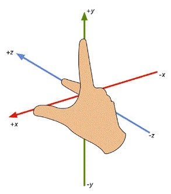

--- 
front: 
hard: Getting Started 
time: minutes 
--- 

# Vector3 

- Description 

Used to represent 3D vectors and points. 

You can use this structure to save and calculate 3D positions and directions. In addition, it also contains functions for performing common vector operations. 

The right-hand coordinate system is used in MC, as shown in the figure below. The up, down, front, back, left, and right in the following text are all derived from Steve facing the positive direction of the z-axis. In MC, the east-west direction is the X coordinate axis, where the positive direction of the X axis is east and the negative direction of the X axis is west; the north-south direction is the Z coordinate axis, where the positive direction of the Z axis is south and the negative direction of the Z axis is north. That is, left is west, right is east, front is south, and back is north. 

 

## Constructor 

### Vector3(x, y, z) 

- Description 

Used to construct a vector or 3D point coordinates.

- Parameters 

| Parameter name | Data type | Description | 
| ------ | :------- | :---------- | 
| x | float | The x component of the vector | 
| y | float | The y component of the vector | 
| z | float | The z component of the vector | 

- Return value 

| Data type | Description | 
| :------- | :------------------- | 
| Vector3 | Returns Vector3(x, y, z) | 

- Example 

```python 
from common.utils.mcmath import Vector3 
newOne = Vector3(1, 2, 3) 
``` 

### Vector3(vecTuple)


- Description 

Used to construct a vector or 3D point coordinates. 

- Parameters 

| Parameter name | Data type | Description | 
| -------- | :------------------------- | :----------------- | 
| vecTuple | tuple(float, float, float) | tuple array of length 3 | 

- Return value 

| Data type | Description | 
| :------- | :------------------------------------------------- | 
| Vector3 | Returns Vector3(vecTuple[0], vecTuple[1], vecTuple[2]) | 

- Example 

```python 
from common.utils.mcmath import Vector3 
import client.extraClientApi as clientApi 
comp = clientApi.CreateComponent(entityId, "Minecraft", "pos") 
entityFootPos = comp.GetFootPos() # Get entity position through position component 
posVec = Vector3(entityFootPos) # Directly convert the position tuple into Vector3 for subsequent calculations 
``` 

## Static method 

Static method that can be called directly through Vector3.MethodName() without creating an instance. 

### One 

- Description 

A simple method for writing Vector3(1, 1, 1). 

- Return value 

| Data type | Description | 
| :------- | :------------------- | 
| Vector3 | Returns Vector3(1, 1, 1) | 

- Example 

```python 
from common.utils.mcmath import Vector3 
newOne = Vector3.One()

``` 

### Up 

- Description 

Convenience method for writing Vector3(0, 1, 0). 

- Return value 

| Data type | Description | 
| :------- | :------------------- | 
| Vector3 | Returns Vector3(0, 1, 0) | 

- Example 

```python 
from common.utils.mcmath import Vector3 
newOne = Vector3.Up() 
``` 

### Down 

- Description 

Convenience method for writing Vector3(0, -1, 0). 

- Return value 

| Data type | Description | 
| :------- | :-------------------- | 
| Vector3 | Returns Vector3(0, -1, 0) | 

- Example 

```python 
from common.utils.mcmath import Vector3 
newOne = Vector3.Down() 
``` 

### Left 

- Description 


Convenience method for writing Vector3(-1, 0, 0), which corresponds to the west side in MC. 

- Return value 

| Data type | Description | 
| :------- | :-------------------- | 
| Vector3 | Returns Vector3(-1, 0, 0) | 

- Example 

```python 
from common.utils.mcmath import Vector3 
newOne = Vector3.Left() 
``` 

### Right 

- Description 

Convenience method for writing Vector3(1, 0, 0), which corresponds to the east side in MC. 

- Return value 

| Data type | Description | 
| :------- | :------------------- | 
| Vector3 | Returns Vector3(1, 0, 0) | 

- Example 

```python 
from common.utils.mcmath import Vector3 
newOne = Vector3.Right() 
``` 

### Forward 

- Description 

A convenient method for writing Vector3(0, 0, 1), corresponding to the south in MC. 

- Return value 

| Data type | Description | 
| :------- | :------------------- | 
| Vector3 | Returns Vector3(0, 0, 1) | 


- Example 

```python 
from common.utils.mcmath import Vector3 
newOne = Vector3.Forward() 
``` 

### Backward 

- Description 

Convenience method for writing Vector3(0, 0, -1), which corresponds to the north direction in MC. 

- Return Value 

| Data Type | Description | 
| :------- | :-------------------- | 
| Vector3 | Returns Vector3(0, 0, -1) | 

- Example 

```python 
from common.utils.mcmath import Vector3 
newOne = Vector3.Backward() 
``` 

### Dot 

- Description 

The dot product of two vectors. 

The dot product is a floating point value that is equal to multiplying the magnitudes of the two vectors together and then multiplying it by the cosine of the angle between the vectors. 

For normalized vectors, Dot returns 1 if they point in exactly the same direction; -1 if they point in completely opposite directions; and 0 if the vectors are perpendicular to each other. 

- Parameters 

| Parameter name | Data type | Description | 
| ------ | :------- | :---- | 
| a | Vector3 | vector a | 
| b | Vector3 | vector b | 

- Return value 

| Data type | Description |

| :------- | :------------- | 
| float | Dot product of two vectors | 

- Example 

```python 
from common.utils.mcmath import Vector3 
a = Vector3(1, 2, 3) 
b = Vector3(0, 3, 1) 
c = Vector3.Dot(a, b) # 1 * 0 + 2 * 3 + 3 * 1 = 9 
``` 

### Cross 

- Description 

The cross product of two vectors. 

The cross product of two vectors generates a third vector that is perpendicular to the two input vectors. The magnitude of the result is equal to: multiplying the magnitudes of the two inputs together and then multiplying by the sine of the angle between the inputs. The direction of the resulting vector can be determined using the "right-hand rule". Use the four fingers of your right hand to indicate the direction of vector a, then swing your fingers toward the palm of your hand to the direction of vector b. The direction pointed by your thumb is the direction of vector c. 

- Parameters 

| Parameter name | Data type | Description | 
| ------ | :------- | :---- | 
| a | Vector3 | Vector a | 
| b | Vector3 | Vector b | 

- Return value 

| Data type | Description | 
| :------- | :------------- | 
| float | Dot product of two vectors | 

- Example 

```python 
from common.utils.mcmath import Vector3 
a = Vector3(1, 2, 3) 
b = Vector3(0, 3, 1) 
c = Vector3.Cross(a, b) 
``` 

## Member methods 

### Length 


- Description 

Returns the length of this vector. 

The length of a vector is the square root of `(x*x+y*y+z*z)`. 

If you only need to compare the sizes of some vectors, you can use the LengthSquared() function to compare their squares (which is faster). 

- Return Value 

| Data Type | Description | 
| :------- | :--------------- | 
| float | The square of the length of this vector | 

- Example 

```python 
from common.utils.mcmath import Vector3 
a = Vector3(3, 4, 0) 
print a.Length() # prints 5.0 
``` 

### LengthSquared 

- Description 

Returns the square of the length of this vector. 

- Return value 

| Data type | Description | 
| :------- | :------------------- | 
| float | The vector after normalization | 

- Example 

```python 
from common.utils.mcmath import Vector3 
a = Vector3(3, 4, 0) 
print a.LengthSquared() # Print 25.0 
``` 

### ToTuple 

- Description 


Returns the vector in tuple form (x, y, z), which is convenient for players to convert and pass as parameters of other events. 

- Return value 

| Data type | Description | 
| :------- | :----------------------------- | 
| tuple | Returns the vector in tuple form (x, y, z) | 

- Example 

```python 
from common.utils.mcmath import Vector3 
a = Vector3(3, 4, 0) 
print a.ToTuple() # Print (3, 4, 0) 
``` 

### Normalized 

- Description 

Returns the vector with a length of 1. 

When normalizing, the vector direction remains unchanged, but its length is 1.0. 

Note that the current vector remains unchanged and a new normalized vector is returned. If you want to normalize the current vector, use the Normalize function. 

If the vector is too small to be normalized, a zero vector is returned. 

- Return value 

| Data type | Description | 
| :------- | :------------------- | 
| Vector3 | The vector after normalization | 

- Example 

```python 
from common.utils.mcmath import Vector3 
a = Vector3(3, 4, 0) 
print a.Normalized() # Print result (0.6, 0.8, 0) 
print a # Print result (3, 4, 0), a has not changed 
``` 

### Normalize 

- Description


Normalizes the vector, the direction of the vector remains unchanged, but its length becomes 1.0. 

Please note that this function has no return value and only changes the current vector. If you want to return the normalized value of the current vector without changing the vector, please use the Normalized function. 

If the vector is too small to be normalized, it is set to the zero vector. 

- Example 

```python 
from common.utils.mcmath import Vector3 
a = Vector3(3, 4, 0) 
a.Normalize() 
print a # Print result (0.6, 0.8, 0), a is normalized 
``` 

### Set 

- Description 

Set the value of this vector 

- Parameters 

| Parameter name | Data type | Description | 
| ------ | :------- | :---------- | 
| x | float | x component of the vector | 
| y | float | y component of the vector | 
| z | float | z component of the vector | 

- Example 

```python 
from common.utils.mcmath import Vector3 
a = Vector3(3, 4, 0) 
a.Set(1, 2, 3) 
print a # Print result (1, 2, 3) 
``` 

## Member variables 

- Description 

You can directly access the x, y, and z components of a vector through the `.` operator. You can also directly obtain them through `[]`, where 0, 1, and 2 correspond to x, y, and z respectively. However, you cannot directly set each component through this method, you can only set it through the Set method. 

- Example


```python 
from common.utils.mcmath import Vector3 
a = Vector3(3, 4, 5) 
print a.x # 3 
print a.y # 4 
print a.z # 5 
print a[0] # 3 
print a[1] # 4 
print a[2] # 5 
``` 

## Operator 

### operate + 

- Description 

Vector addition, the sum of two vectors is equal to the sum of their components. The sum of a vector and a constant is equal to the sum of their components plus the constant. 

- Example 

```python 
from common.utils.mcmath import Vector3 
a = Vector3(3, 4, 0) 
b = Vector3.One() 
print a + 5 # print result (8, 9, 5) 
print a + b # print result (4, 5, 1) 
``` 

### operate - 

- Description 

Vector subtraction, the sum of two vectors is equal to the difference of each component. Subtracting a vector from a constant is equal to subtracting each component from the constant. 

Negate a vector and return the vector in the opposite direction 

- Example 

```python 
from common.utils.mcmath import Vector3 
a = Vector3(3, 4, 0) 
b = Vector3.One() 
print a - 2 # print result (1, 2, -2) 
print 2 - a # print result (-1, -2, 2)

print a - b # print result (2, 3, -1) 
print -a # print result (-3, -4, 0) 
``` 

### operate \* 

- Description 

Vector multiplication, multiplication of two vectors is equal to multiplication and addition of each component, that is, vector dot product, equivalent to Vector3.Dot(a, b). Multiplication of a vector and a constant is equal to multiplying each component by the constant. 

- Example 

```python 
from common.utils.mcmath import Vector3 
a = Vector3(3, 4, 0) 
b = Vector3.Up() 
print a * 2 # print result (6, 8, 0) 
print a * b # print result 4 
``` 

### operate / 

- Description 

Vector division, only supports vector division by constant, which is equal to dividing each component by the constant. 

- Example 

```python 
from common.utils.mcmath import Vector3 
a = Vector3(3, 4, 0) 
b = Vector3.One() 
print a / 2 # print result (1.5, 2, 0) 
``` 

### operate == 

- Description 

Determine whether two vectors are equal, and return True when all components are equal 

### operate !=


- Description 

Determines whether two vectors are unequal, and returns False if all components are equal