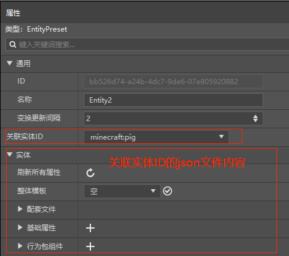
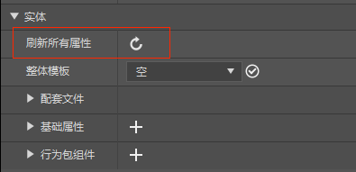
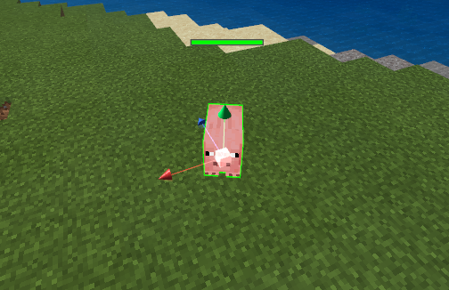
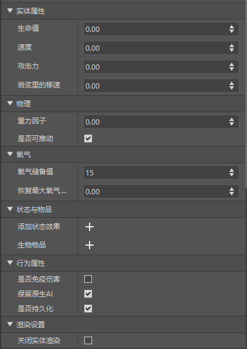

--- 
front: https://nie.res.netease.com/r/pic/20210727/1e450bb1-ee50-4e6c-b614-7fbd6a00b4e7.png 
hard: Getting Started 
time: 5 minutes 
--- 
# Entity Preset 
## Basic Introduction 

EntityPreset is a special preset that binds a certain type of entity in MC. It can be used to easily program some entity-related logic using parts. 

In addition to the basic properties of the preset, the entity preset also provides an "associated entity ID" property, which can bind the entity preset to an entity of an identifier, such as "pig" ("minecraft:pig"). At this time, the json file content of the associated entity will be automatically displayed below, but when the associated file is not in the personal archive, editing is invalid (such as MC native resources). 

 

Note that after modifying the json file content of the associated entity, if the actual performance does not match the displayed properties, you need to click the refresh all properties button to update. Or try restarting the editor. 

 

At this time, you can drag from the resource manager or preset library to the scene for instantiation, and you can see the specific entity on the map. 

 

Special note: After the entity preset is bound to the entity ID, all entities generated with the ID will be bound to an entity preset at the same time and have all the properties of the preset. 

When you use the New File Wizard to create an entity preset, an entity configuration will be created. You can also create a configuration first, and then use the configuration to create an entity preset bound to it. For more information about configuration, please see [Configuration](../../15-Custom Game Content/0-Configuration.md). 
## Set Properties 
> This part of the content will only take effect in the official game environment after the Chinese version of Minecraft 2.1 is launched. 

The above introduces the two attribute columns of entity presets, general and entity (json file content of associated entity ID). In addition, we also provide dozens of entity attributes that cannot be directly defined and modified in json files, such as entity gravity factor and status effect, etc., which are stored in multiple attribute columns according to functions, as shown in the figure: 

 

> The essence of setting entity attributes is to move the attributes that can only be set by calling API in the code to the attribute panel for visual editing, and call the corresponding interface according to the setting data of the attribute panel when the entity is initialized and take effect. For example, the gravity factor attribute in the physics column actually calls the SetGravity interface under the entity object EntityObject. 

Entities currently have the following setting properties: 

In my world, entity is a very broad definition. Whether it is a drop, a creature or a projectile, it can be called an entity. However, some of the properties listed below are actually only valid for some types of entities. For example, health is actually only valid for creatures. It is meaningless to set health for entities such as fireballs and bows, and it will not take effect. When using the following properties, developers should pay attention to whether the entity they choose supports setting the property. 

### Entity properties: Set the current value and maximum value of several basic properties of the entity at the same time. 

| Property | Description | 
| ------------ | ------------------------------------------------------------ | 
| Health | Equivalent to the <a href="../../../../mcdocs/3-PresetAPI/PresetObject/Preset/EntityObjectEntityObject.html#sethealth" rel="noopenner">SetHealth</a> and <a href="../../../../mcdocs/3-PresetAPI/PresetObject/Preset/EntityObjectEntityObject.html#setmaxhealth" rel="noopenner">SetMaxHealth</a> interfaces under the entity object EntityObject, which sets the maximum and current health of the entity. | 
| Speed | Equivalent to the <a href="../../../../mcdocs/3-PresetAPI/PresetObject/Preset/EntityObjectEntityObject.html#setspeed" rel="noopenner">SetSpeed</a> and <a href="../../../../mcdocs/3-PresetAPI/PresetObject/Preset/EntityObjectEntityObject.html#setmaxspeed" rel="noopenner">SetMaxSpeed</a> interfaces under the entity object EntityObject, which sets the maximum and current speeds of the entity. | 
| Attack power | Equivalent to the <a href="../../../../mcdocs/3-PresetAPI/Preset object/Preset/Entity objectEntityObject.html#setdamage" rel="noopenner">SetDamage</a> and <a href="../../../../mcdocs/3-PresetAPI/Preset object/Preset/Entity objectEntityObject.html#setmaxdamage" rel="noopenner">SetMaxDamage</a> interfaces under the entity object EntityObject, which sets the maximum and current attack power of the entity. | 
| Movement speed in lava | Equivalent to the <a href="../../../../mcdocs/3-PresetAPI/Preset object/Preset/Entity objectEntityObject.html#setlavaspeed" rel="noopenner">SetLavaSpeed</a> and <a href="../../../../mcdocs/3-PresetAPI/Preset object/Preset/Entity objectEntityObject.html#setmaxlavaspeed" rel="noopenner">SetMaxLavaSpeed</a> interfaces under the entity object EntityObject, which sets the maximum and current movement speed of the entity in lava. |

> ​ Note: The properties set here will set the maximum value first, then the current value. For example, if the health value of a custom cow is set to 10, its maximum health value is 10 and its current health value is also 10. 

### Physics: Set the physical property values ​​of the entity, such as gravity factor, whether it can be pushed, etc. 

| Property | Description | 
| ---------- | ------------------------------------------------------------ | 
| Gravity factor | Equivalent to the <a href="../../../../mcdocs/3-PresetAPI/Preset Object/Preset/Entity ObjectEntityObject.html#setgravity" rel="noopenner"> SetGravity</a> interface under the entity object EntityObject, which sets the initial gravity factor of the entity. The value is a negative number. | 
| Is it pushable? | Equivalent to the <a href="../../../../mcdocs/3-PresetAPI/PresetObject/Preset/EntityObjectEntityObject.html#setpushable" rel="noopenner">SetPushable</a> interface under the entity object EntityObject, which sets whether the entity can be pushed. The default value is True. | 

### Oxygen: Sets the oxygen-related property values ​​of the entity, such as oxygen reserve value and oxygen recovery time, etc. 

| Property | Description | 
| ---------------- | ------------------------------------------------------------ | 
| Oxygen reserve value | Equivalent to the <a href="../../../../mcdocs/3-PresetAPI/PresetObject/Preset/EntityObjectEntityObject.html#setcurrentairsupply" rel="noopenner">SetCurrentAirSupply</a> and <a href="../../../../mcdocs/3-PresetAPI/PresetObject/Preset/EntityObjectEntityObject.html#setmaxairsupply" rel="noopenner">SetMaxAirSupply</a> interfaces under the entity object EntityObject, and sets the current value and maximum value of the entity's oxygen reserve value at the same time. | 
| Recover maximum oxygen time | Equivalent to the <a href="../../../../mcdocs/3-PresetAPI/Preset object/Preset/Entity objectEntityObject.html#setrecovertotalairsupplytime" rel="noopenner">SetRecoverTotalAirSupplyTime</a> interface under the entity object EntityObject, set the time for the entity to recover the maximum oxygen, in seconds. | 

### Status and items: set the initial status effects and items of the entity 

| Attributes | Description | 
| ------------ | ------------------------------------------------------------ | 
| Add status effect | Equivalent to the <a href="../../../../mcdocs/3-PresetAPI/Preset object/Preset/Entity objectEntityObject.html#addeffect" rel="noopenner">AddEffect</a> interface under the entity object EntityObject, add the specified initial status effect to the entity. | 
| Biological Items | Equivalent to the <a href="../../../../mcdocs/3-PresetAPI/PresetObject/Preset/EntityObjectEntityObject.html#setitem" rel="noopenner">SetItem</a> interface under the entity object EntityObject, which sets the initial item for the entity. | 

### Behavior Attributes: Set the behavior logic attribute values ​​of the entity, such as whether to block the original AI, whether to be immune to damage, etc. 

| Attributes | Description | 
| ------------ | ------------------------------------------------------------ | 
| Whether to be immune to damage | Equivalent to the <a href="../../../../mcdocs/3-PresetAPI/PresetObject/Preset/EntityObjectEntityObject.html#setimmunedamage" rel="noopenner">SetImmuneDamage</a> interface under the entity object EntityObject, which sets whether the entity is immune to damage. This attribute is archived. | 
| Keep native AI | Equivalent to the <a href="../../../../mcdocs/3-PresetAPI/Preset object/Preset/Entity objectEntityObject.html#setblockcontrolai" rel="noopenner">SetBlockControlAi</a> interface under the entity object EntityObject, which sets whether to keep the entity's native AI. After blocking, the entity cannot move and will not be pushed by gravity. | 
| Whether to persist | Equivalent to the <a href="../../../../mcdocs/3-PresetAPI/Preset object/Preset/Entity objectEntityObject.html#setpersistence" rel="noopenner">SetPersistence</a> interface under the entity object EntityObject, which sets whether the entity will be saved when uninstalling the block and exiting the game. The default is True. | 

### Rendering settings: Set the rendering and display properties of the entity, such as whether to render the entity, etc. 

| Property | Description | 
| ------------ | ------------------------------------------------------------ | 
| Turn off entity rendering | Equivalent to the <a href="../../../../mcdocs/3-PresetAPI/Preset Object/Preset/Entity Object EntityObject.html#setnotrender" rel="noopenner">SetNotRender</a> interface under the entity object EntityObject, which sets whether to turn off entity rendering. The default value is False. | 

