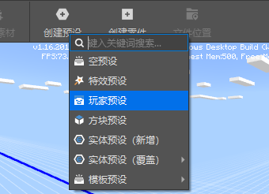
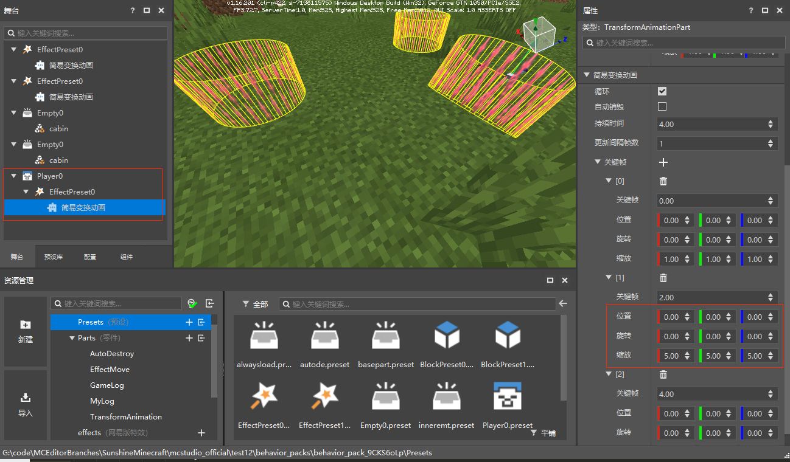
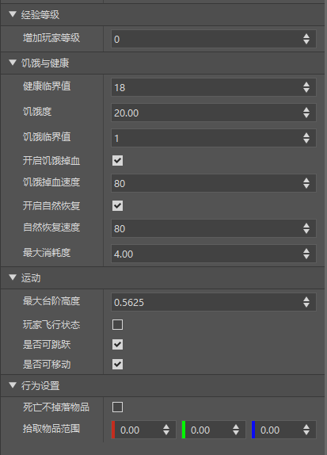

--- 
front: https://nie.res.netease.com/r/pic/20210727/1e450bb1-ee50-4e6c-b614-7fbd6a00b4e7.png 
hard: Getting Started 
time: 5 minutes 
--- 
# Player Preset 
## Basic Introduction 

PlayerPreset is a special type of entity preset, which is bound to the player entity. 

Each AddOn (editor work) only allows one player preset to be created. 

In the preset editor, we can create a player preset through the menu bar => Create Preset => Player Preset. 

 

If the player preset option is grayed out, it means that there is already a player preset in your component.

Through player presets, we can give players some cool features. 

> When the editor is saved, the instance of the player preset will not be saved in the preset archive. If you need to modify it, please modify the player preset directly in the preset editor 

## Attach special effects 

We attach the transformation animation special effect we just created to the player preset, return to the level editor, and modify the keyframe properties of the transformation animation part as shown below. 

 

After the modification, the effect of the transformation animation part becomes the special effect expands to 5 times the original size in the first two seconds, and returns to the original size in the last two seconds. 

Click Run, enter the game, switch the perspective to see that this special effect has been attached to the player and presents a continuous zooming effect. 

 

## Setting properties 
> This part will take effect in the official game environment only after the release of version 2.1 of the Chinese version of Minecraft. 

In addition to general properties, player presets also provide a variety of property settings. These properties will take effect when the player is initialized, such as setting the player's experience level, hunger and health value, etc., and are stored in multiple property columns according to their functions, as shown in the figure: 

 

> The essence of setting player properties is to move the properties that can only be set by calling the API in the code to the property panel for visual editing, and call the corresponding interface according to the setting data of the property panel when the player is initialized and take effect. For example, the increase level attribute in the experience level column actually calls the preset AddPlayerLevel interface. 

Player presets currently have the following setting properties: 
### Experience level: Set the player's level-related properties 

| Property | Description |

| ------------ | ------------------------------------------------------------ | 
| Increase player level | Equivalent to the <a href="../../../../mcdocs/3-PresetAPI/PresetObject/Preset/PlayerObjectPlayerObject.html#addlevel" rel="noopenner">AddLevel</a> interface under the player object PlayerObject, which modifies the player level and can be a negative number. | 

### Hunger and health: Set the player's hunger and health related properties 

| Property | Description | 
| ------------ | ------------------------------------------------------------ | 
| Health threshold | Equivalent to the <a href="../../../../mcdocs/3-PresetAPI/Preset object/Preset/Player objectPlayerObject.html#sethealthlevel" rel="noopenner">SetHealthLevel</a> interface under the player object PlayerObject, set the player's health threshold, when the hunger value is greater than or equal to the health threshold, the blood volume will be automatically restored, it is effective when the hunger value and natural recovery are turned on, the original default value is 18 | 
| Hunger | Equivalent to the <a href="../../../../mcdocs/3-PresetAPI/Preset object/Preset/Player objectPlayerObject.html#sethunger" rel="noopenner">SetHunger</a> interface under the player object PlayerObject, set the player's hunger | 
| Hunger threshold | Equivalent to the <a href="../../../../mcdocs/3-PresetAPI/Preset object/Preset/Player objectPlayerObject.html#setstarvelevel" rel="noopenner">SetStarveLevel</a> interface under the player object PlayerObject, which sets the player's hunger threshold. When the hunger value is less than the hunger threshold, the health will be automatically deducted. It is effective when the hunger value and hunger blood loss are turned on. The default value of the original version is 1 | 
| Enable hunger blood loss | Equivalent to the <a href="../../../../mcdocs/3-PresetAPI/Preset Object/Preset/Player ObjectPlayerObject.html#setnaturalstarve" rel="noopenner">SetNaturalStarve</a> interface under the player object PlayerObject, set whether to enable the player's hunger blood loss. When the hunger value is less than the hunger critical value, the blood volume will be automatically deducted. It is effective when the hunger value is turned on and the hunger blood loss is turned on. The original version is enabled by default | 
| Hunger blood loss speed | Equivalent to the <a href="../../../../mcdocs/3-PresetAPI/Preset Object/Preset/Player ObjectPlayerObject.html#setstarvetick" rel="noopenner">SetStarveTick</a> interface under the player object PlayerObject, set the player's hunger blood loss speed. When the hunger value is less than the hunger critical value, the blood volume will be automatically deducted. It is effective when the hunger value is turned on and the hunger blood loss is turned on | 
| Enable natural recovery | Equivalent to the <a href="../../../../mcdocs/3-PresetAPI/Preset Object/Preset/Player ObjectPlayerObject.html#setnaturalregen" rel="noopenner">SetNaturalRegen</a> interface under the player object PlayerObject, set whether to enable the player's natural recovery | 
| Natural recovery speed | Equivalent to the <a href="../../../../mcdocs/3-PresetAPI/Preset Object/Preset/Player ObjectPlayerObject.html#sethealthtick" rel="noopenner">SetHealthTick</a> interface under the player object PlayerObject, set the player's natural recovery speed | 
| Maximum consumption | Equivalent to the <a href="../../../../mcdocs/3-PresetAPI/Preset Object/Preset/Player ObjectPlayerObject.html#setmaxexhaustionvalue" under the player object PlayerObject rel="noopenner">SetMaxExhaustionValue</a> interface, set the player's maximum exhaustion (maxExhaustion) | 

### Movement: Set player movement related properties 

| Property | Description | 
| ------------ | ------------------------------------------------------------ | 
| Maximum step height | Equivalent to the <a href="../../../../mcdocs/3-PresetAPI/Preset Object/Preset/Player ObjectPlayerObject.html#setstepheight" rel="noopenner">SetStepHeight</a> interface under the player object PlayerObject, set the maximum step height that the player can climb when moving forward without jumping, the default value is 0.5625, 1 means that one step can be climbed. | 
| Player flight state | Equivalent to the <a href="../../../../mcdocs/3-PresetAPI/Preset object/Preset/Player objectPlayerObject.html#changeflystate" rel="noopenner">ChangeFlyState</a> interface under the player object PlayerObject. If checked, the player will be given the ability to fly and enter the flying state. If unchecked, the player will enter the non-flying state. | 
| Jumpable or not | Equivalent to the <a href="../../../../mcdocs/3-PresetAPI/PresetObject/Preset/PlayerObjectPlayerObject.html#setjumpable" rel="noopenner">SetJumpable</a> interface under the player object PlayerObject, set whether the player can jump | 
| Moveable or not | Equivalent to the <a href="../../../../mcdocs/3-PresetAPI/PresetObject/Preset/PlayerObjectPlayerObject.html#setmovable" rel="noopenner">SetMovable</a> interface under the player object PlayerObject, set whether the player can move | 

### Behavior settings: set properties related to player behavior logic 

| Property | Description | 
| -------------- | ------------------------------------------------------------ | 
| No items dropped upon death | Equivalent to <a href="../../../../mcdocs/3-PresetAPI/PresetObject/Preset/PlayerObjectPlayerObject.html#setmovable" rel="noopenner">SetMovable</a> interface under the player object PlayerObject, set whether the player can move | 

### Behavior settings: set properties related to player behavior logic 

| Property | Description | 
| -------------- | ------------------------------------------------------------ | 
| No items dropped upon death | Equivalent to <a href="../../../../mcdocs/3-PresetAPI/PresetObject/Preset/PlayerObjectPlayerObject.html#setmovable" rel="noopenner">SetMovable</a> interface under the player object PlayerObject href="../../../../mcdocs/3-PresetAPI/Preset Object/Preset/Player Object PlayerObject.html#enablekeepinventory" rel="noopenner">EnableKeepInventory</a> interface, set the player to not drop items when dying | 
| Pickup Item Range | Equivalent to the <a href="../../../../mcdocs/3-PresetAPI/Preset Object/Preset/Player Object PlayerObject.html#setpickuparea" rel="noopenner">SetPickUpArea</a> interface under the player object PlayerObject, set the player's pickup item range | 

### Rendering Settings 

| Attributes | Description | 
| -------------- | ------------------------------------------------------------ | 
| Original Custom Skin | Equivalent to the <a href="../../../../mcdocs/3-PresetAPI/Preset Object/Preset/Player Object PlayerObject.html#setpickuparea" rel="noopenner">SetPickUpArea</a> interface under the player object PlayerObject href="../../../../mcdocs/3-PresetAPI/Preset Object/Preset/Player Object PlayerObject.html#setskin" rel="noopenner">SetSkin</a> interface, replace the custom skin of the player's original model, which will overwrite the original skin, but will be overwritten by the skeleton model. | 
