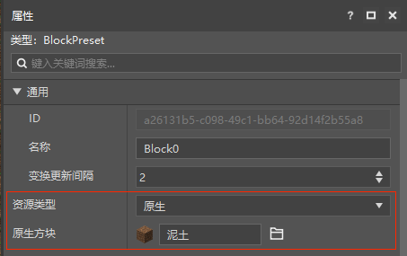
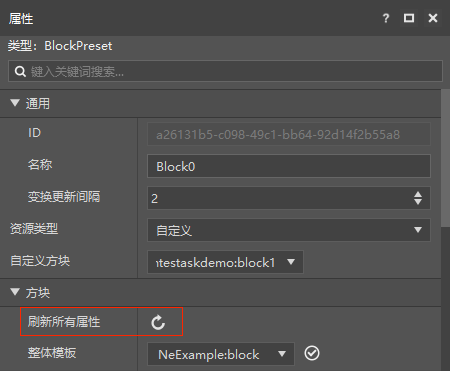
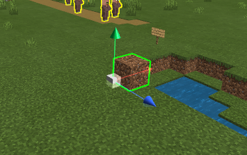
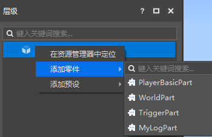

--- 
front: https://nie.res.netease.com/r/pic/20210727/1e450bb1-ee50-4e6c-b614-7fbd6a00b4e7.png 
hard: Getting Started 
time: 5 minutes 
--- 
# Block Preset 

BlockPreset can be bound to a block at a certain position, and then some block-related programming can be performed through the block preset, such as using the preset life cycle to destroy the block at a specified position at a specific time, etc., which generally requires a suitable part to implement. 

Create a new block preset in the editor. When you select the preset file to edit it, in addition to the common properties of the preset, you can additionally specify the type of block bound to the block preset, supporting native block types and custom blocks in the archive. Unlike entity presets, if a block preset selects "mud" for binding, it will only bind to the mud blocks generated using this block preset, and will not bind to the mud blocks directly generated or already existing on the map. 

 

Note: If the custom block content is updated, you need to click Refresh All Properties in the custom block properties. For editing custom blocks, please refer to [Configuration](../../15-Custom Game Content/0-Configuration.md). 

 

After setting the properties of the block preset, you can drag the block preset into the scene to place a specific block at a specified location. In this way, when you start the development kit for testing, you will find that a specified block is placed at the corresponding location. 

 

If you need to add some custom logic, you can make parts, or use some parts built into the editor and attach them to the block preset. 

