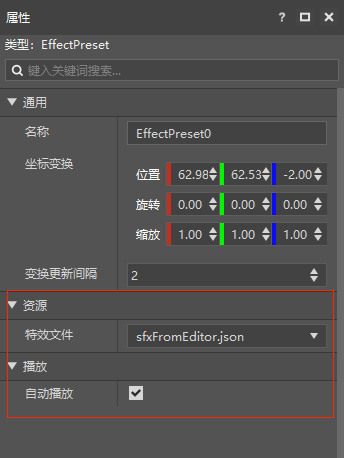
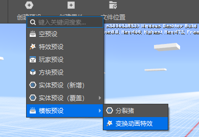
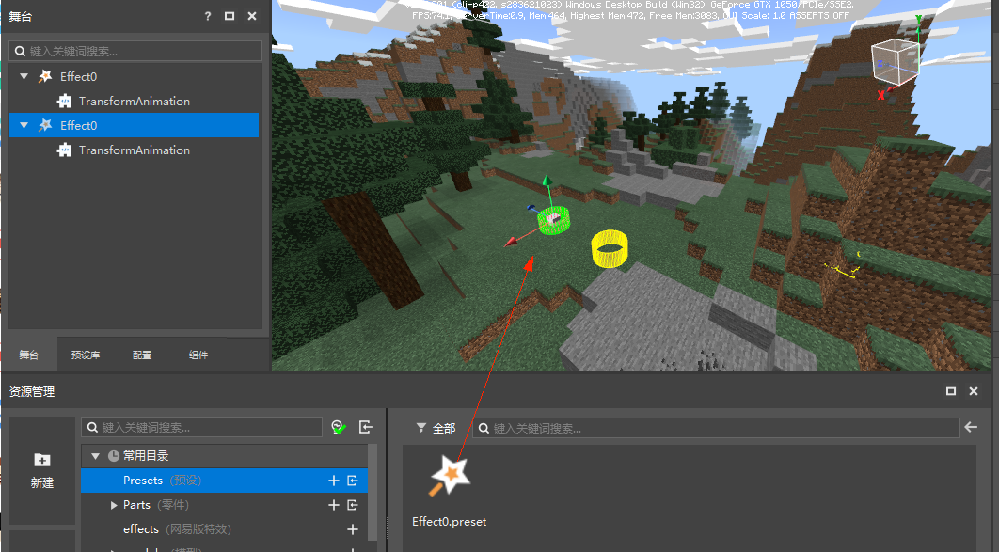
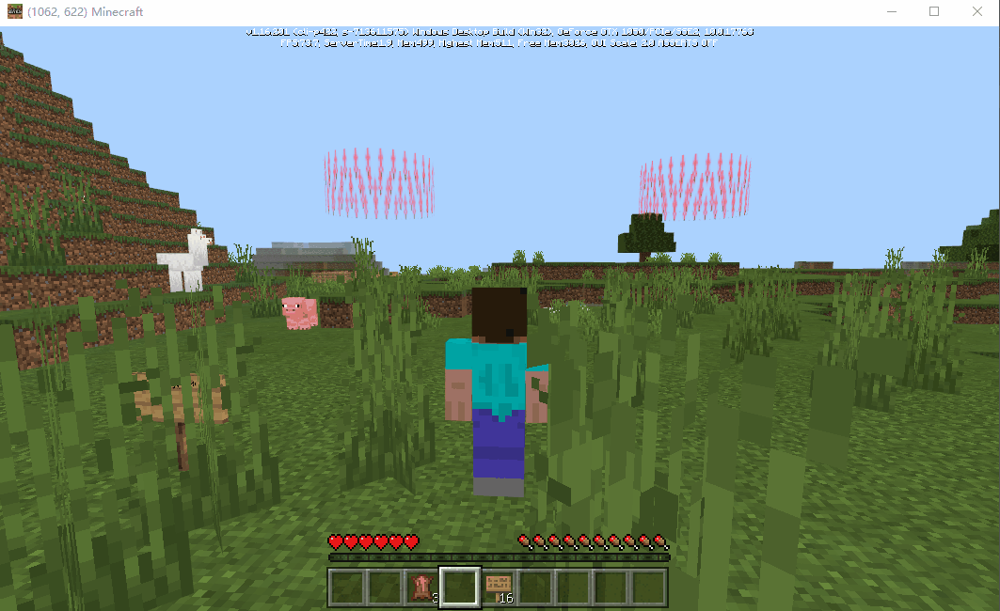

--- 
front: https://nie.res.netease.com/r/pic/20210727/1e450bb1-ee50-4e6c-b614-7fbd6a00b4e7.png 
hard: Getting Started 
time: 5 minutes 
--- 
# Effect Presets 

EffectPreset is a type of preset that binds special effect resources. Its purpose is to give special effects specific functions, rather than to create special effects. 

For relevant knowledge about special effect production, please refer to the relevant documents of [Effect Editor](../../../16-艺术/9-特效/0-基本介绍.md). 

We provide built-in special effect presets, which can be used without creating them. You can add them through the menu bar => Add Preset => Special Effect Preset. 

 

The special effect preset provides special effect files and automatic playback properties. You need to create a particle/sequence frame special effect through the special effect editor and set the special effect file before you can preview it. 

 

If the automatic playback property is not checked, you need to call the play/stop interface at the right time through the part code for manual control. 

You can also create your own custom special effect preset through the menu bar => Create Preset => Special Effect Preset. 

Here we choose an official transformation animation special effect template to show what kind of effect a custom special effect preset can achieve. 

We can add this template preset through the menu bar => Create Preset => Template Preset => Transform Animation Effect. 

 

The created special effect preset can be easily dragged from the resource manager or preset library to the scene for instantiation. Through the preview, we can drag the special effect to the position we want to place it. 

 

Click Run and enter the development package. We can see that these transformation animation effects have moved in the world. 

 
