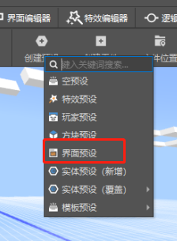
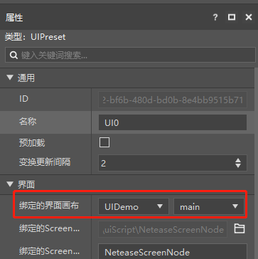
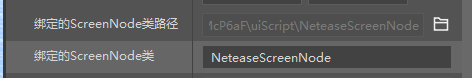
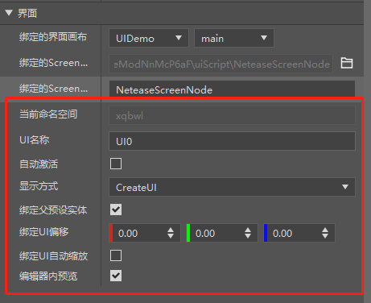
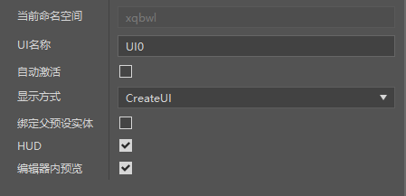
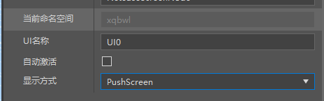
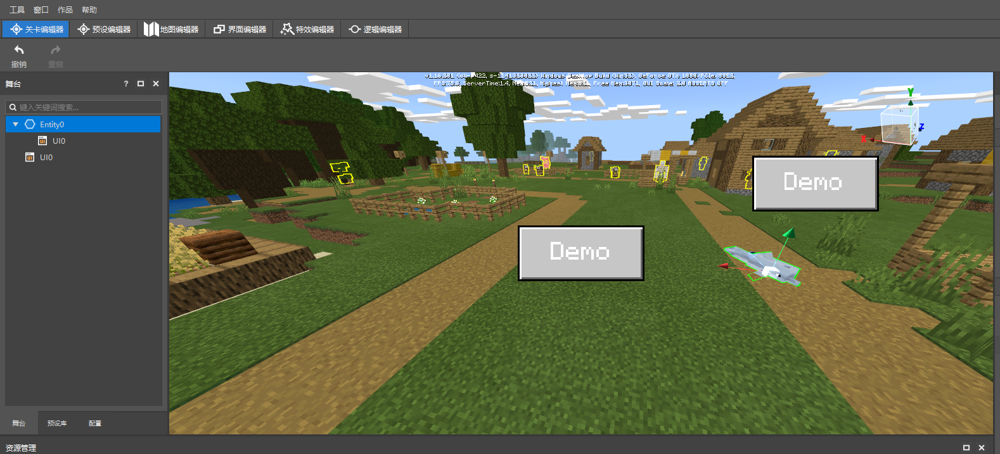

--- 
front: https://nie.res.netease.com/r/pic/20210727/1e450bb1-ee50-4e6c-b614-7fbd6a00b4e7.png 
hard: Getting Started 
time: 5 minutes 
--- 
# Interface Preset 
UIPreset is a type of preset that binds UI resources. Its purpose is to give UI preset properties, such as making the UI appear and disappear when the preset appears. Just like using the modsdk interface to create a UI, using an interface preset requires a UIJson file created by a UI editor and a script file inherited from ScreenNode. 

For relevant knowledge about UI production, please refer to the relevant documents of [Interface Editor](../../../18-Interface and Interaction/1-Interface Editor Instructions.md). 

In the preset editor, we can create an interface preset through the menu bar => Create Preset => Interface Preset. 

 

Create a new interface preset in the editor. When you select the preset file to edit it, the interface preset has common properties similar to the empty preset except for the unique editable properties. The interface preset provides quite a lot of property editing, which together determine the properties of the UI bound to the interface preset. 

First, you need to set the UI canvas bound to the interface preset. This setting requires selecting the UIJson file you want to open and the canvas name in the file. 

 

The second step is to set the script file and script class name inherited from ScreenNode bound to the interface preset. The ScreenNode class created using the New File Wizard has the same script class name as the script file name by default. 

 

After these two steps are completed, the interface preset can successfully create the UI interface. If it is not successfully created, please check whether the interface file or ScreenNode script file is damaged. 

The subsequent settings define the properties of the opened UI. 

 

 

 

| Properties | Description | 
| :--- | :--- | 
| Current Namespace | The namespace of the current work, cannot be edited | 
| UI Name | Must be unique in the current namespace | 
| Auto Activation | Whether to automatically create the UI after the interface preset is created. If checked, it will be automatically created, otherwise it will not be automatically created. This setting will not take effect in the preset editor, and the interface will be automatically activated | 
| Display mode | There are two modes for creating UI display: CreateUI and PushScreen. If PushScreen is selected to open the UI, the subsequent properties cannot be set and will not take effect | 
| Bind to parent preset entity | Whether to bind to the preset entity. When the parent preset is a preset with an entity such as a creature preset or a player preset, check this property and the UI will be bound to the entity. When checked, the offset and automatic scaling properties of the bound UI can be set, but the HUD properties cannot be set | 
| HUD | Whether the interface allows game operations. Check to allow, uncheck to block game operations | 
| Bind UI offset | Modify the offset between the bound entity | 
| Bind UI automatic scaling | Set whether the bound entity UI is dynamically scaled according to the distance between the bound entity and the local player | 
| In-editor preview | Set in the editor to control the display and hiding of the UI bound to the interface preset. This property is invalid on non-editor platforms. | 

After setting the properties, drag the interface preset to the scene and the interface will be displayed. 

