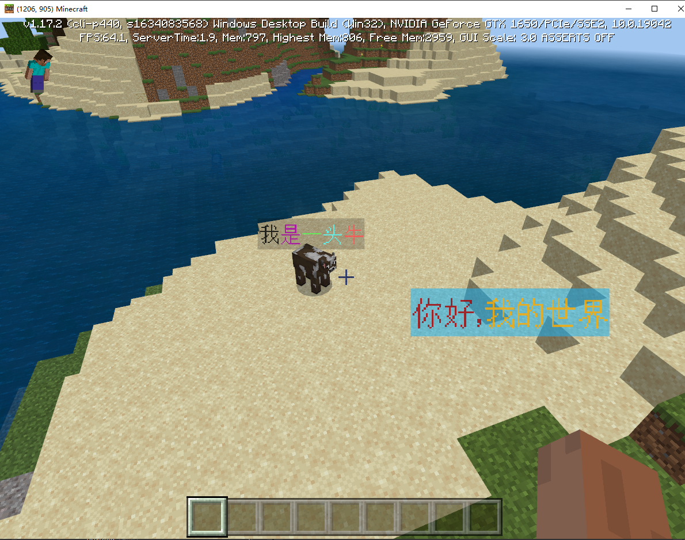

--- 
front: https://nie.res.netease.com/r/pic/20210727/1e450bb1-ee50-4e6c-b614-7fbd6a00b4e7.png 
hard: Getting Started 
time: 5 minutes 
--- 
# Text Panel Preset 

> Currently only effective in development and testing, the official server is expected to be launched in version 2.2, please developers arrange the development rhythm reasonably. 

## Basic Introduction 

TextBoardPreset is a special preset bound to **text panel**, the purpose is to quickly create, edit and use text panels. 

> For the concept of text panel, developers can refer to [Definition of text panel](../../../20-Gameplay Development/10-Basic Concepts/1-My World Basic Concepts.md#Text Panel) and <a href="../../../../mcdocs/3-PresetAPI/Preset Object/Preset/Text Panel Object TextboardObject.html" rel="noopenner"> Text Panel Preset Related Interface </a> 

## Create and Add 
We provide built-in text panel presets and common text panel presets that can be created. 

### Add built-in text panel presets 
Built-in text panel presets can be used without creating them. Add them through the menu bar => Add Preset => Text Panel Preset (from built-in presets), as shown in the figure below. 

 

### Create a normal text panel preset 

Normal text panel presets are different from built-in presets. Developers need to use the New File Wizard=→Presets tab=→find the text panel preset=→create it, as shown in the figure below 

 

## Text panel properties 
In addition to the basic properties of the preset, the text panel preset also provides additional properties unique to the text panel, as shown in the figure below 
 
| Properties | Description | 
| :--- | :--- | 
| Text content | The text content displayed on the text panel, supports [style code](https://minecraft-zh.gamepedia.com/%E6%A0%B7%E5%BC%8F%E4%BB%A3%E7%A0%81)| 
|Always facing the camera| Enabled by default. When checked, the text panel will change direction as the camera moves, and always keep the front facing the camera. | 
| Depth test | Enabled by default. When checked, the text panel will be blocked or displayed in the normal front-to-back order | 
| Text color | The color of the text content on the text panel | 
| Text transparency | The transparency of the text content on the text panel, range [0,1], the smaller the value, the more transparent. | 
| Background color | The color of the text panel itself. | 
| Background transparency | The transparency of the text panel itself, range [0,1], the smaller the value, the more transparent. | 

## Attaching entities and players 
The text panel preset can be placed directly at any coordinate position in the world, or it can be bound to the relative position of an entity or player. We only need to attach the text panel preset to the entity or player preset. Compared with the unattached case, I can see that the text panel preset under the entity and player preset has an additional column of coordinate transformation properties. At this time, adjusting the properties here is to adjust the relative position relative to the parent preset, as shown in the figure below. 

## Operation Example 
Here we make a basic case demonstration: 

Functional requirements: 
1. Place a text panel at the world coordinate (0, 65, 0) with the content "Hello, my world" 
2. Preset a text panel for a cow entity and display the content "I am a cow". 

Implementation steps: 
1. First, for the first function, we directly drag the built-in text panel preset in the preset library to the scene stage in the level editor and modify its coordinates to (0, 65, 0), as shown in the figure below 

 

2. For the second function, we first create an entity preset using the cow template 

 

3. Create another text panel preset and attach it to the entity preset 

 

4. Adjust the position and properties (position, rotation, and scale can be adjusted directly using the drag handle) 

 

5. Drag the entity preset to the scene stage in the level editor 

 

6. Run the test and see the final effect as shown below 

 

7. If we further adjust the preset panel properties and make full use of the [style code](https://minecraft-zh.gamepedia.com/%E6%A0%B7%E5%BC%8F%E4%BB%A3%E7%A0%81), we can create richer effects. 

