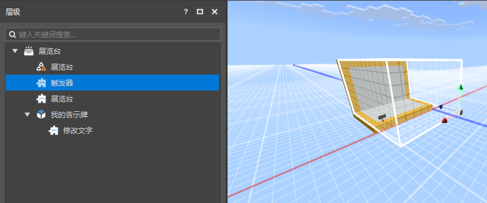
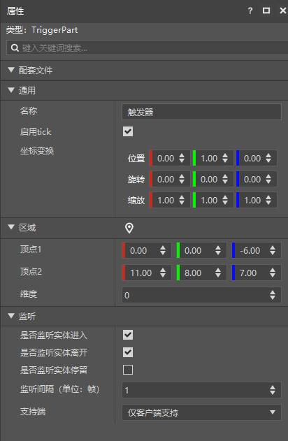

--- 
front: https://nie.res.netease.com/r/pic/20210727/76bfa7be-0be4-4e27-91a3-b5268695f359.png 
hard: Getting Started 
time: 20 minutes 
--- 
# Trigger 

TriggerPart contains a rectangular area, and the trigger part can be used to detect entities entering and leaving the area. 

 

Click on the trigger, and you can see the following properties in its property panel: 

- Region, used to specify the region of the trigger 

- Dimension: used to specify the dimension of this region 

- Listening, affecting the event sending of the trigger 

 

Click the positioning button next to the region tab to display the region of the trigger (as shown below). Then you can move the position of the region as a whole by moving the coordinate system, or use the mouse to drag each face of the trigger region. 

> The coordinates of the region are relative to the coordinates of the trigger. Dragging the trigger can also change the overall position of the region. 

 

>If you need to use scripts to call this part in the game, you can refer to <a href="../../../../mcdocs/3-PresetAPI/Preset Object/Part/Trigger Part TriggerPart.html" rel="noopenner"> Trigger Part API Interface Document </a>