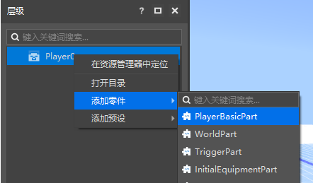
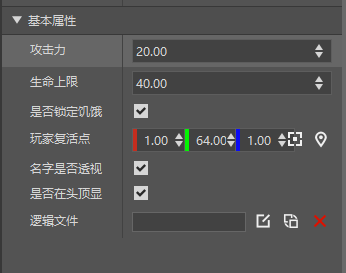
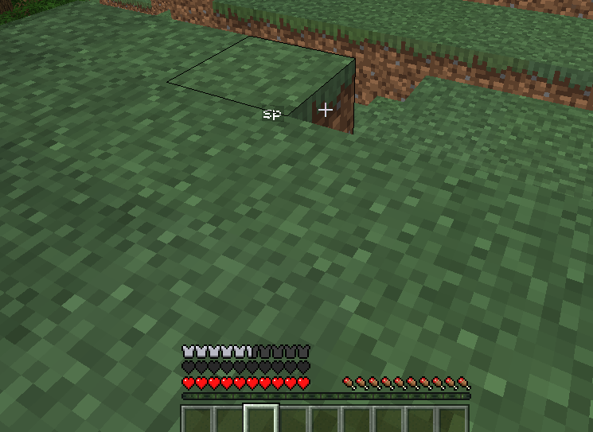

--- 
front: https://nie.res.netease.com/r/pic/20210727/76bfa7be-0be4-4e27-91a3-b5268695f359.png 
hard: Getting Started 
time: 20 minutes 
--- 
# Player Basic Attributes 

PlayerBasicPart (Player Basic Attribute Part) is a built-in part that can only be attached to the player preset. 

 

By attaching the Player Basic Attribute Part, we can modify the basic attributes of all players accordingly. 

 

Click Run to enter the game. We can see that our health limit is 40 and we can see the names of other players. 

 

>If you need to use a script to call this part in the game, you can refer to <a href="../../../../mcdocs/3-PresetAPI/Preset Object/Parts/Player Basic Attribute Parts PlayerBasicPart.html" rel="noopenner"> Player Basic Attribute Parts API Interface Document </a>