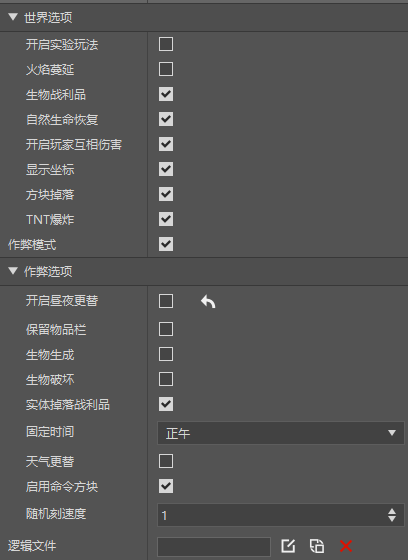

--- 
front: https://nie.res.netease.com/r/pic/20210727/76bfa7be-0be4-4e27-91a3-b5268695f359.png 
hard: Getting Started 
time: 20 minutes 
--- 
# World Attribute Parts 

When using, just hang it under an empty preset. And try to ensure that this preset has only one instance in the scene. 

 

The world options are the same as the world attribute components of the old level editor. 

 

>If you need to use scripts to call this part in the game, you can refer to <a href="../../../../mcdocs/3-PresetAPI/Preset Object/Part/World Attribute Part WorldPart.html" rel="noopenner"> World Attribute Part API Interface Document </a>