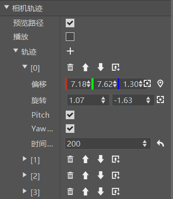
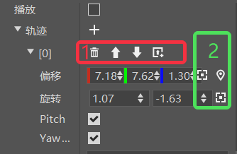
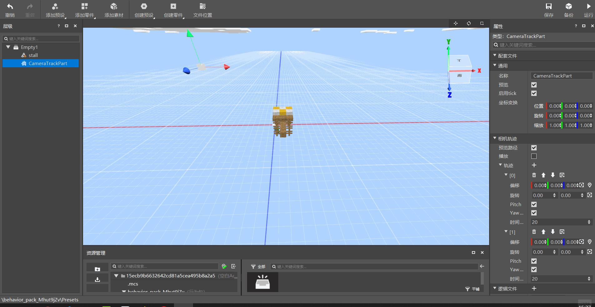

--- 
front: https://nie.res.netease.com/r/pic/20210727/76bfa7be-0be4-4e27-91a3-b5268695f359.png 
hard: Getting Started 
time: 20 minutes 
--- 
# Camera Track Part 

Camera Track Part CameraTrackPart is a part used to create camera movement and rotation track animation. 

In order to facilitate viewing the effect, here we add a stall material as a reference, as shown in the figure below. 

 

Click on the camera track part, and we can see its following properties in the property panel: 

 

Here we will focus on explaining the properties of the camera track: 

1. Preview path: used to control whether to enable the preview path. The preview path is to use lines and arrows to display the trajectory route of the camera animation in the preset scene, which is the part in the diagram above. 

2. Play: Check to play the current camera track animation in the preset scene. 

3. Track: The information of each track point in the camera track animation can be understood as a certain frame in the keyframe animation, which means that the camera must transform its position rotation and other information to the state represented by this track point at a certain point in time. The function of the camera track part is to allow players to freely edit the camera's track point information to form a camera animation. You can add track points through the "+" button on the right side of the track. The properties of each track point are as follows: 

>Offset: The position offset of the track point relative to the entire camera track part 
> 
>Rotation: The rotation arc of the camera at this track point relative to the true north direction (up and down arc, left and right arc) 
> 
>Pitch (pitch angle) forward: Control the forward and reverse direction of the up and down direction 
> 
>Yaw (yaw angle) forward: Control the forward and reverse direction of the left and right direction 
> 
>Time: The time required from the previous track point to the current track point. The longer it is, the slower the camera changes. 

4. Track point operation method: 

 

1. The top button of the track point can quickly perform four operations: delete the track point, move the track point up, move the track point down, and create a new track point above. 
2. A quick operation button for recording the current camera information and positioning is provided on the right side of the offset and rotation properties of the track point 

>Record current camera information: record the camera information of the preset scene interface at the current track point. Currently, it supports recording both position and rotation information. 
> 
>Positioning: Display the coordinates of the track point in the preset scene, and provide coordinate axes for players to perform visual operations to adjust the position information of the track point. 

After being fully familiar with the above operation methods, we can create camera track animations more quickly and conveniently, and preview and play the path at any time, as shown in the figure below 

>If you need to use scripts to call this part in the game, you can refer to <a href="../../../../mcdocs/3-PresetAPI/PresetObject/Part/CameraTrackCameraTrackPart.html" rel="noopenner"> Camera Track Part API Interface Documentation </a>