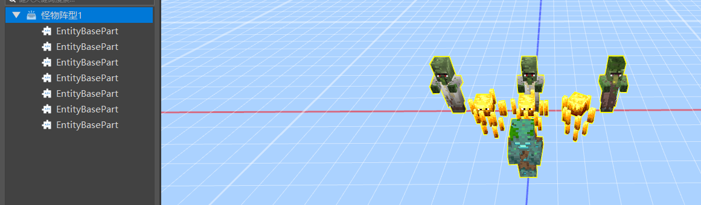

--- 
front: https://nie.res.netease.com/r/pic/20210727/76bfa7be-0be4-4e27-91a3-b5268695f359.png 
hard: Getting Started 
time: 20 minutes 
--- 
# Entity Parts 
## Entity Combination 
Entity Parts EntiyBasePart is used to manage multiple entity presets under a preset. 

In [Mounting Rules for Preset Assembly](../../14-Preset Gameplay Programming/1-In-depth Understanding of Presets/1-Assembly Presets.md), we know that entity presets cannot be mounted under an empty preset. In order to make it easier for developers to manage multiple entities, we provide entity parts. When using it, just mount this part under an empty preset, and then select the corresponding entity type from the property panel to indirectly achieve the goal of mounting the entity under the preset. The properties of entity parts are shown in the figure below: 

 

- Automatic creation: whether to automatically create the associated entity ID when the part is initialized. If it is not checked, you need to manually call the part API to create the associated entity ID. You can refer to <a href="../../../../mcdocs/3-PresetAPI/Preset Object/Part/Entity Part EntityBasePart.html" rel="noopenner"> Entity Part API Interface Document </a>. 

- Entity type: The entity type bound to the entity part. The original entity and unbound preset entity configuration are supported here. 
>Note: Entity type does not support entity presets 

Here is a practical example. For gameplay with monster spawning events, developers can make each wave of monsters into a monster formation, so as to manage each wave of monsters in a unified manner. Here, entity parts are needed. 
By copying or creating a new one, you can create multiple parts under the preset to build a monster formation, as shown in the figure below: 

 

## Notes 

- Entity parts can only be attached to empty presets 

- Entity type attributes, you cannot select a type that already has a corresponding entity preset, otherwise the created entity preset will not be managed by entity parts 

- Entities created by entity parts will not be saved to the map. When the preset is uninstalled, saved and exited, the relevant entities will be automatically cleared and recreated when the preset is loaded next time 

- Be careful to avoid combining a large number of entity parts to build a monster formation, which may cause lag during loading, especially on low-end mobile phones 
- When the entity part is scaled, it is **xyz axis synchronous scaling**, but its parent node can set the xyz axis to different scalings, and the **final scaling of the x axis** shall prevail, so as to avoid inconsistent scaling of the parent node of the entity part. 
- When the entity part is rotated, **only xy axis rotation is supported**, and it is only valid when the entity is generated, and then controlled by the monster AI. If the scaling of the parent node is set to inconsistent before, rotating the entity may cause the scaling factor of the x axis to change, resulting in a sudden change in the entity scaling. 

>If you need to use scripts to call this part in the game, you can refer to <a href="../../../../mcdocs/3-PresetAPI/Preset Object/Parts/Entity Parts EntityBasePart.html" rel="noopenner"> Entity Part API Interface Document </a>